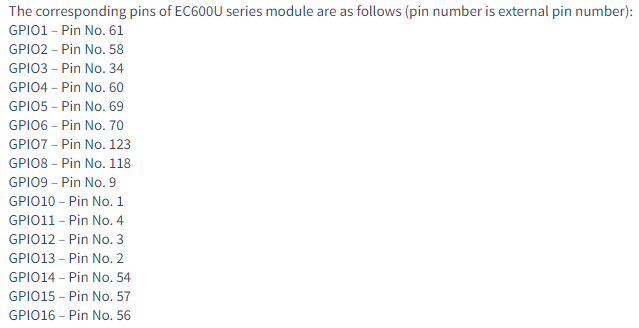

## External interrupt

### Revision history

| Version | Date       | Author  | Description                                      |
| ------- | ---------- | ------- | ------------------------------------------------ |
| 1.0     | 2021-09-22 | Grey.Tu | Modified the initial version                     |
| 1.1     | 2021-10-09 | Rivern  | Added the advanced application of Helios Service |
| 1.2     | 2021-02-11 | Grey.Tu | correct errors in printing                       |

In this article, it mainly introduces how to detect external interrupt via ExtInt from views of HW and SW designs. 

About Specific info of API, please refer to [QuecPython-machine - ExtInt](https://python.quectel.com/wiki/#/en-us/api/QuecPythonClasslib?id=extint).

### HW design

The principle pf ExtInt is to detect the level conversion of external pin, that it to say there exists signal of edge up and edge down on pin. 


The schematic diagram is similar with the key schematic diagram.


### SW design

First of all, we should confirm which PIN is used to control HW, then find out the relevant GPIO No. via the API class library on official website. For more details, please refer to  [QuecPython-machine - ExtInt](https://python.quectel.com/wiki/#/en-us/api/QuecPythonClasslib?id=extint).



Take the EC600U as an example, the PIN 60 is the GPIO 4. 

Start to compile code, select related GPIO to initialize ExtInt. 

```python
from machine import ExtInt


def callback(args):
    print('interrupt: {}'.format(args))


extint = ExtInt(ExtInt.GPIO4, ExtInt.IRQ_RISING_FALLING, ExtInt.PULL_PU, callback)  # Create object
extint.enable()  # Enable interrupt
print('Start GPIO: {}Interrupt. \r\n'.format(extint.line()))

# extint.disable()  # Disable interrupt 
```


> Note: The running result of code displayed on screen-shot is based on EC600U_EVB 1.3 with GPIO 4corresponding to Pin 60 separately, which refers to the KEY 1 on EVB.

### The matched code

<!-- * [Download code](code/code_ExtInt.py) -->
 <a href="code/code_ExtInt.py" target="_blank">Download code</a> 

### Advanced application of Helios Service 

Before that, we should learn about the [Helios Service](../HeliosService/HeliosService_1.md)

The needed code are Helios service structure code (Refer to [https://gitee.com/quecpython/helios-service](https://gitee.com/quecpython/helios-service) ) and **quec_key.py**. 

The codes are as described below: 

```python
#Kindly reminder: following codes are based on the helios service structure 
#How to get codes：https://gitee.com/quecpython/helios-service
from machine import Pin, ExtInt
from usr.bin.third_party.ql_interrupter import BusExIntInterrupter
from usr.bin.third_party.ql_interrupter import TimerInterrupter
import sys_bus

#Press corresponding edge 
KEY_PR = 1
KEY_RES = 0

#Press related status
KEY_PRESS = 0   #Long press
KEY_DOWN = 1    #Press down
KEY_UP = 2      #Press up


class KeyProcess(object):
    def __init__(self, gpio_num, gpio_timeout, gpio_callback):
        self.__name = "KEY_" + str(gpio_num)

        if(self.__name in sys_bus.sub_table()):
            print(self.__name,'in sub_table')
            sys_bus.unsubscribe(self.__name)

        self.__key = BusExIntInterrupter(self.__name, gpio_num, trige_mode=ExtInt.IRQ_RISING_FALLING, pull_mode=ExtInt.PULL_PU)
        self.__timer = TimerInterrupter(gpio_timeout, self.fun_cb, 0)
        self.__gpio = gpio_num
        self.__callback = gpio_callback
        sys_bus.subscribe(self.__name, self.extint_cb)

    def process(self, state):
        key_put = [self.__gpio, state]
        #print('key_put==={}'.format(key_put))
        self.__callback(key_put)

    def __del__(self):
        print("del gpio:",self.__name)
        sys_bus.unsubscribe(self.__name)
        self.__timer.stop()

    def fun_cb(self, *args, **kwargs):
        self.process(KEY_PRESS)

    def extint_cb(self,topic,msg):
        #print(topic,msg)
        if(msg['pressure'] == KEY_PR):
            self.__timer.start()
            self.process(KEY_DOWN)
        else:
            self.__timer.stop()
            self.process(KEY_UP)


"""
Applications:
from usr.quec_key import KeyProcess
from machine import Pin

def fun(para):
    print(para) #para[0] Pin name  para[1]: 0 Long press， 1 Press down， 2 Press up


aa = KeyProcess(Pin.GPIO4, 1000, fun)  #gpio13, 1000ms = long press, callback= fun
"""
```


