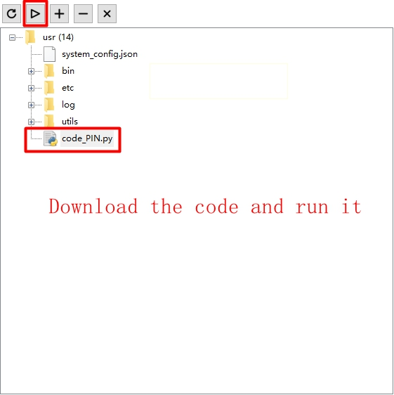

# LED test

## Revision history

| Version | Date       | Author  | Description     |
| ------- | ---------- | ------- | --------------- |
| 1.0     | 2022-02-14 | Grey.Tu | Initial Version |

In this article, we mainly focus on how to manipulate external components via GPIO from views of HW and SW designs. By reading it, you will learn about checking HW connection relationship, compiling codes and verify test theory. 

As for specific API info, please refer to  [QuecPython-machine - PIN](https://python.quectel.com/wiki/#/en-us/api/QuecPythonClasslib?id=pin)

## HW description 

As one of the most commonly used peripherals, the GPIO can be used to output high and low level to control the peripheral components. 


## SW design

First of all, we should confirm which PIN is used to control HW, then find out the relevant GPIO No. via the API class library on official website. For more info, please refer to [QuecPython-machine - PIN](https://python.quectel.com/wiki/#/en-us/api/QuecPythonClasslib?id=pin).

Start to compile codes. Add following codes on **.py** file to read/write GPIO. 

```python
IOdictRead = {}  #  Record the initialized GPIO port
IOdictWrite = {}  # Record the initialized GPIO port
def GPIO_Read(gpioX, Pull=Pin.PULL_DISABLE, level=1):
	if IOdictWrite.get(gpioX, None):
    	del IOdictWrite[gpioX]
    gpioIO = IOdictRead.get(gpioX, None) 
    if gpioIO:
    	return gpioIO.read()
    else:
        IOdictRead[gpioX] = (Pin(gpioX, Pin.IN, Pull, level)) 
        gpioIO = IOdictRead.get(gpioX, None)
		return gpioIO.read()
def GPIO_Write(gpioX, level, Pull=Pin.PULL_DISABLE):
    if IOdictRead.get(gpioX, None):
    	del IOdictRead[gpioX]
    gpioIO = IOdictWrite.get(gpioX, None) 
    if gpioIO:
    	gpioIO.write(level)
    else:
        IOdictWrite[gpioX] = (Pin(gpioX, Pin.OUT, Pull, level)) 
        gpioIO = IOdictWrite.get(gpioX, None)
		gpioIO.write(level)
```

Define another name of GPIO that to be controlled

```python
from machine import Pin

LED1 = Pin.GPIO1  # Define LED pin
LED2 = Pin.GPIO2  # Define LED pin
LED3 = Pin.GPIO3  # Define LED pin
LED4 = Pin.GPIO4  # Define LED pin
LED5 = Pin.GPIO5  # Define LED pin
```

Control one certain pin: 

```python
def IO_On(gpioX):	# Set the pin as 0
	GPIO_Write(gpioX, 0)	# Call write function
def IO_Off(gpioX):	# Set the pin as 1
	GPIO_Write(gpioX, 1)	# Call write function

```

Control all pins: 

```python
def IO_All_Off():	#  Set all pins as 1
    IO_Off(LED1)
    IO_Off(LED2)
    IO_Off(LED3)
    IO_Off(LED4)
    IO_Off(LED5)

```

After finishing above codes, we can compile the main program.

For main(), the main thought is to carry out regular step with the sequence of "on-off-on-off ". When turning on LED 1, there will be 200 ms latency and the LED 1 will be on, and later off. If turning on LED 2, there will be 200 ms latency and the LED 2 will be off. Correspondingly, it is similar to LED 3. Finally, we can see that the LED will be on by turns. 

```python
import utime

def main():
    while True:
        IO_All_Off()	# Off 
        IO_On(LED1)	# On
        utime.sleep_ms(200)	# Latency
        IO_All_Off()	# Off 
        IO_On(LED2)	# On
        utime.sleep_ms(200)	# Latency
        IO_All_Off()	# Off 
        IO_On(LED3)	# On
        utime.sleep_ms(200)	# Latency
        IO_All_Off()	# Off 
        IO_On(LED4)	# On
        utime.sleep_ms(200)	# Latency
        IO_All_Off()	# Off 
        IO_On(LED5)	# On
        utime.sleep_ms(200)	# Latency
```

Following that, you can download and verify. There is no need to compile python codes, you can download and run **.py** file on module via QPYcom. 

## Download and verify

Download and run **.py** file on module.



.png)

After that, the LED will be lighted one by one.


## The matched code

<!--* [Download code](code/code_LED.py) -->
<a href="code/code_LED.py" target="_blank">Download code</a>