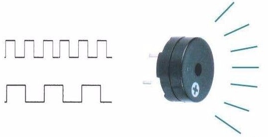

# Buzzer test

## Revision history

| Version | Date | Author | Description                              |
|------|------|------|------|
| 1.0 | 2021-03-20 | gary.zhou | Initial version |
| 1.1 | 2021-09-15 | Grey.Tu | Modified active buzzer as passive buzzer |
| 1.2 | 2021-11-29 | Grey.Tu | correct errors in printing |

In this document, it mainly introduces how to control passive buzzer via PWM and make it sound from HW design and SW design. After reading through this article, you will acquire how to use PWM. 

About API details, please refer to [QuecPython-misc - PWM](https://python.quectel.com/wiki/#/en-us/api/QuecPythonClasslib?id=pwm)

## HW introduction 

The buzzer can be categorized as active buzzer and passive buzzer. As for  active buzzer, it can make sound by power supply directly. Similar to LED, you can control the pin to output high/low level. what's more, it is also similar to LED circuit when encountering HW circuit. About related driver, take the LED manipulation as a reference.  In this article, it illustrates the driver of passive buzzer  and the method to control it via PWM. 

The main difference between passive and active buzzers.

The "source" in active buzzer and passive buzzer does refer to vibration instead of power supply. That is to say, the buzzer will make sound once the vibration inside the active one is powered on. While there is no vibration in passive  buzzer. Therefore, it is invalid to make sound via DC signal and the squarewave with a range of 2K to 5K is needed. Normally, the active buzzer is more expensive than the passive one owing to the vibration. 

From the surface of a and b, it seems that both buzzers are similar. however, they vary in height. The Figure a shows the active buzzer with 9mm while the figure b is the passive buzzer with 8mm.  The difference lies in that the passive buzzer is embedded with green EVB, while the active buzzer is sealed by chip-on-board without EVB.  


 It is to purchase one passive buzzer.



The passive buzzer can be drove by PWM Switch transistor. what we should provide is that: power supply and PWM squarewave with a range of 2KHz to 5KHz. 


## SW design

#### Query the Corresponding IO port on EVB. 

First of all, we should confirm which PIN is used to control HW, then find out the relevant PWM No. via the API class library on official website. 

More details, please refer to [QuecPython-misc - PWM](https://python.quectel.com/wiki/#/en-us/api/QuecPythonClasslib?id=pwm) .

E. g.

| Module type     | Corresponding pin |
| --------------- | ----------------- |
| EC600U ==> PWM0 | PIN 70            |


### **Codes for test** 

```python
from misc import PWM
import utime as time
import urandom as random
import log


# Creating log object
buzzer_log = log.getLogger("buzzer_test")

# Duration: ms
def outputpwm(HZ, duty_cycle, Duration):
    cycleTime = int((10000000/HZ)/10)
    highTime = int(cycleTime * duty_cycle)
    buzzer_log.debug(
	    """out put pin70 cycleTime {0} * 10us,
	    highTime {1} * 10us, Duration of {2}"""
	    .format(cycleTime, highTime, Duration))
    pwm1 = PWM(PWM.PWM0, PWM.ABOVE_10US, highTime, cycleTime)       
    pwm1.open()
    time.sleep_ms(Duration)
    pwm1.close()
    pass


def test_Buzzer():
	# Set the log output level
	log.basicConfig(level=log.DEBUG)
	# Loop 10 times
	for i in range(10):
		# Random generation of floating point numbers in the start to end range, optionally， 0~1
		duty_cycle = random.uniform(0.1, 0.8)
		# Suggested that the output2000~5000HZ_PWM waveform
		# Generate a random start ~ end Integer between
		HZ = random.randint(2000, 5000)
		outputpwm(HZ, duty_cycle, 500)
		time.sleep_ms(1500)
	pass


if __name__ == "__main__":
	test_Buzzer()
```

## The matched codes

* [Download codes](code/code_buzzer.py)
 <!-- <a href="code\code_buzzer.py" target="_blank">Download code</ -->

