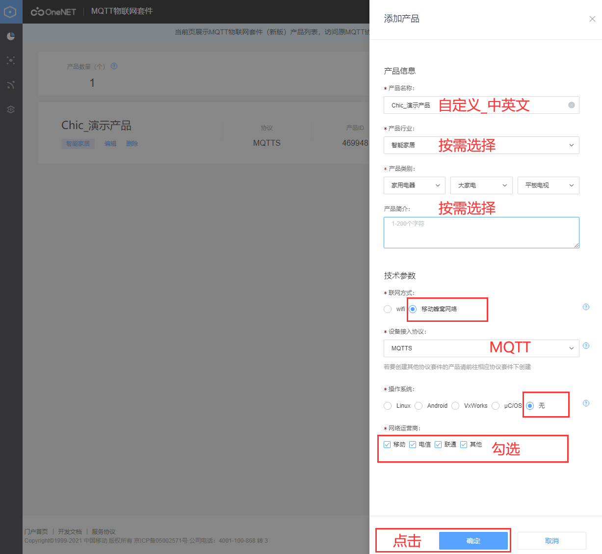
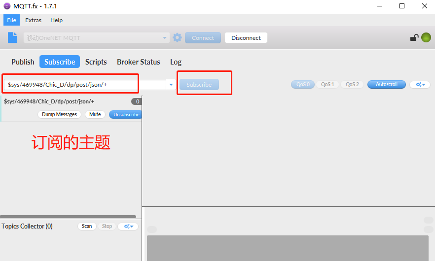

## About history

**Revision history**

| **Version** | **Date**   | **Author** | **Description** |
| ----------- | ---------- | ---------- | --------------- |
| 1.0         | 2021-11-16 | Chic       | Initial version |

# Get access to OneNET_MQTT via QuecPython

In this document, it tells how to use "MQTT IoT kit". As basic service Kit for OneNET,  providing developers with device access services and application development capabilities based on MQTT protocol, is featured with massive access, data storage, device management, device direct command, device status synchronization and message distribution. Meanwhile, it supports getting access to OneNET Value-added Service as well to expand the service range flexibly. 

## Cloud setting

OneNET Cloud address-- [https://open.iot.10086.cn](https://open.iot.10086.cn/)

### Login platform

Click [Product service] ---[MQTT IoT Kit]


### Add product





### Add device

Click “Chic_Perform product" to enter the product summary


Click [Device list] on the left, then click the button of "add device" on the right.


Set device name


All devices will be listed.


### Get device info

"device name", "access_key" and "product ID" are used to generate the connection password on the next step.

Click"specification" of the device on the list.


Clear to view "device name" and "access_key"


Click ”Specification“ on the device displayed on"product".

It is obvious to see"product ID" via clicking [product summary] on the left.


### Generate Password

Token algorithm in Python language provide official to generate Password directly.

[https://open.iot.10086.cn/doc/mqtt/book/manual/auth/python.html](http://docs-aliyun.cn-hangzhou.oss.aliyun-inc.com/assets/attach/189223/cn_zh/1605168543507/MQTT_Password.7z?spm=a2c4g.11186623.2.19.373573a8XfigN5&file=MQTT_Password.7z)

Two categories in token: one key to one type, one key to one device.

```python
import base64
import hmac
import time
from urllib.parse import quote

# Scenario	res parameter format	case	illustration
# API access	products/{pid}	products/123123
# Device access	products/{pid}/devices/{device_name}	products/123123/devices/mydev	Private key with a device level should be used
product = 0
device = 1
TYPE = device
# The TYPE is used to select "one key to one type" or "one key to one device"

def token(id, access_key, deviceName=None):
    global product
    global device
    global TYPE

    version = '2018-10-31'

    if TYPE == product:
        res = 'products/%s' % id  # Access to product API via product ID
    elif TYPE == device:
        res = ('products/%s/devices/%s' % (id, deviceName))

    # The OT of token assigned by user
    et = str(int(time.time()) + 36000000)

    # Sign method, which supports md5,sha1 and sha256
    method = 'sha1'

    # Decode access_key
    key = base64.b64decode(access_key)

    # Calculate sign
    org = et + '\n' + method + '\n' + res + '\n' + version
    sign_b = hmac.new(key=key, msg=org.encode(), digestmod=method)
    sign = base64.b64encode(sign_b.digest()).decode()

    # Code url to certain value, As for value of method/res/version, there is no need to code owing to simplicity. 
    sign = quote(sign, safe='')
    res = quote(res, safe='')

    # Token parameter integration
    token = 'version=%s&res=%s&et=%s&method=%s&sign=%s' % (
        version, res, et, method, sign)

    return token


if __name__ == '__main__':
    # MQTT
    id = '469948'  # Product ID
    if TYPE == product:
        access_key = 'kKsubaG7FzMgzR6N3eUD53319Qu+K4MCvw6KzOYc5eI='  # Product access_key 
    elif TYPE == device:
        access_key = 'rs2FaE5BuygJZkWKDA5okKt1RFpwOx53hbu6hwyCS4U='  # Device access_key 
    deviceName = 'Chic_D'
    print(token(id, access_key, deviceName))
```

### mqttfx access platform

[Development guidance_development manual_OneNET (10086.cn)](https://open.iot.10086.cn/doc/mqtt/book/device-develop/manual.html)

Get IP address and port of server on platform


Successful access


### Report and distribute data

[Upload datapoints_Developer manual_OneNET (10086.cn)](https://open.iot.10086.cn/doc/mqtt/book/example/datapoints.html)

**The name principle of topic**

$sys/{pid}/{device-name}/dp/post/json/+

**In this case, The name of the subscribed topic**

`$sys/469948/Chic_D/dp/post/json/+`

Click ”subscribe“ to finish it.



**The name principle of topic**

$sys/{pid}/{device-name}/dp/post/json

**In this case, The name if the published topic**

`$sys/469948/Chic_D/dp/post/json`

Here shows the case of **payload**.

```json
{
    "id": 123,        
    "dp": {             
        "temperatrue": [{     
            "v": 30,
        }],
        "power": [{     
            "v": 4.5,        
        }]
    }
}
```


Click “Publish”  to release message, the subscribed device will receive message immediately. 


## SW design

Case code

```python
from umqtt import MQTTClient

# Connection protocol	Certificate	        Address	            Port   Illustration
# MQTT	             Download certificate mqttstls.heclouds.com 8883   Encrypted port
# MQTT	  -	        mqtts.heclouds.com	    1883	Non-encrypted port

# Parameter Compulsory	Parameter illustration
# clientId	Y	        Device name
# username	Y	        Allocated product ID on platform
# password	Y	        Fill in the token calculated by key

SERVER = b'mqtts.heclouds.com'
PORT = 1883
CLIENT_ID = b'Chic_D'
USER = b'469948'
PASSWORD = b'version=2018-10-31&res=products%2F469948%2Fdevices%2FChic_D&et=1673053248&method=sha1&sign=prIMDQ23WFI6PMj2IWpaRJJL4eE%3D'

IMEI = None  # modem.getDevImei()
SUB_TOPIC = '$sys/469948/Chic_D/dp/post/json/+'
PUB_TOPIC = '$sys/469948/Chic_D/dp/post/json'

def GetDevImei():
    global IMEI
    # IMEI = modem.getDevImei()
    IMEI = '001'
    print(IMEI)

state = 0

def sub_cb(topic, msg):
    global state
    print(
        "Subscribe Recv: Topic={},Msg={}".format(
            topic.decode(),
            msg.decode()))
    state = 1


def MQTT_Init():
    # Create one real mqtt
    c = MQTTClient(
        client_id=CLIENT_ID,
        server=SERVER,
        port=PORT,
        user=USER,
        password=PASSWORD,
        keepalive=30)  # It is a must to make keepalive=30; otherwise, the connnection will be  a failure.
    # Set message callback
    c.set_callback(sub_cb)
    # Create connection
    try:
        c.connect()  # c.connect(clean_session=True)
    except Exception as e:
        print('!!!,e=%s' % e)
        return
    print('connected')

    # Subscribe tpoic
    c.subscribe(SUB_TOPIC.format(IMEI))
    # Publish message
    Payload = '''
    {
        "id": 123,
        "dp": {
            "temperatrue": [{
                "v": 30,
            }],
            "power": [{
                "v": 4.5,
            }]
        }
    }'''
    c.publish(PUB_TOPIC.format(IMEI), Payload)

    while True:
        c.wait_msg()
        if state == 1:
            break

    # Disconnect
    c.disconnect()


def main():
    # GetDevImei()
    MQTT_Init()


if __name__ == "__main__":
    main()
```

The next step is to download and verify. You can download and run **.py** file on module via QPYcom since there is no need to compile python code.

## Download and verify

Download and run **.py** file on module.


After downloading, run the script manually.


## The matched code
