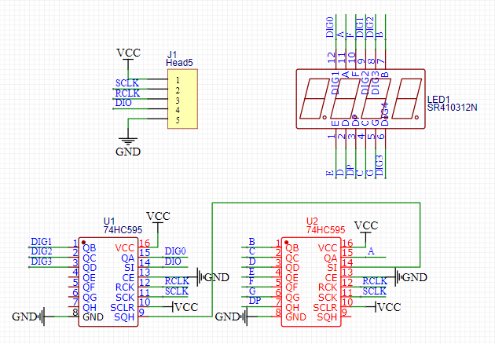

## Revision history

|Version | date | author | change statement|
| ---- | ---------- | ------ | -------- |
|1.0 | 2021-09-23 | Kayden | initial version|
|1.1 | 2022-03-25 | Kayden | Documentation and code optimization |


## Nixie tube development experiment

This article is based on ec600x_ QuecPython_ EVB_ V1.3 development board carries out nixie tube development experiment, and the directly applicable modules are ec600s, ec600n and ec600u.Other modules and development boards need less modification to apply, please contact us if you have any questions.

## Hardware resources

The hardware resource of the module used in this experiment is only GPIO. Because the nixie tube module is used, only three gpios are required for this experiment. The introduction and wiring of nixie tube module are described in detail below.

Schematic diagram of four digit nixie tube module with anode:

On the Common Anodedigital tube and 74HC595 driver chip related information can be searched in the Internet, the information is relatively rich.



In this experiment, in order to achieve the universality of wiring between development boards equipped with different modules, the wiring is connected to the fixed pin pin. The specific connection and the corresponding software GPIO number of the pin are shown in the table below.You can also obtain this information using schematics and [GPIO related API](https://python.quectel.com/wiki/#/en-us/api/QuecPythonClasslib?id=pin).

|Nixie tube module pin name | v1.3 development board pin name and module pin number | ec600s / ec600n GPIO | ec600u GPIO|
| ------------------ | ------------------------------ | ------------------ | ----------- |
| VCC                | 3V3                            | -                  | -           |
| SCLK               | P61                            | GPIO14             | GPIO1       |
| RCLK               | SDA(P58)                       | GPIO28             | GPIO16      |
| DIO                | P60                            | GPIO13             | GPIO4       |
| GND                | GND                            | -                  | -           |

## Experimental code

 <a href = "code / digital_tube. Py" target = "_blank" > download the code</a>

```python
"""
@Author: Kayden
@Date: 2021-09-23
@Description: Digital tube experiment
@FilePath: Digital_tube.py
"""
from machine import Pin
import utime

'''
The pin arrangement connection mode of nixie tube module and v1.3 development board is:
Dio is connected to the row pin corresponding to P60 on the development board
RCLK is connected to the row pin corresponding to P58 on the development board
SCLK is connected to the row pin corresponding to p61 on the development board
P60 corresponds to gpio13 of ec600s / ec600n module and gpio4 of ec600u module
P56 corresponds to gpio28 of ec600s / ec600n module and gpio16 of ec600u module
P61 corresponds to gpio14 of ec600s / ec600n module and gpio1 of ec600u module
'''
# When the module used is ec600s / ec600n
# DIO = Pin(Pin.GPIO13, Pin.OUT, Pin.PULL_PU, 0)
# RCLK = Pin(Pin.GPIO28, Pin.OUT, Pin.PULL_PU, 0)
# SCLK = Pin(Pin.GPIO14, Pin.OUT, Pin.PULL_PU, 0)

# When the module used is ec600u
DIO = Pin(Pin.GPIO4, Pin.OUT, Pin.PULL_PU, 0)
RCLK = Pin(Pin.GPIO16, Pin.OUT, Pin.PULL_PU, 0)
SCLK = Pin(Pin.GPIO1, Pin.OUT, Pin.PULL_PU, 0)

# Font tuple 0 	    1	   2     3     4    5       6    7     8     9     A 	 b 	   C    d 	   E     F     -
LED_fonts = (0xC0, 0xF9, 0xA4, 0xB0, 0x99, 0x92, 0x82, 0xF8, 0x80, 0x90, 0x88, 0x83, 0xC6, 0xA1, 0x86, 0x8E, 0xBF)


# Function to write data to 74HC595
def LED_OUT(data):
    for i in range(8):
        if data & 0X80:
            DIO.write(1)
        else:
            DIO.write(0)
        data <<= 1
        SCLK.write(0)
        SCLK.write(1)


# The nixie tube displays 17 font functions in turn
def LED_Display():
    for j in range(17):
        LED_OUT(LED_fonts[j])
        LED_OUT(0x0f)
        RCLK.write(0)
        RCLK.write(1)
        utime.sleep(1)


if __name__ == "__main__":
    while True:
        LED_Display()

```

## Experimental operation

1. Use DuPont line for hardware connection;

2. Download the sample code into the module for operation;

3. Check the results displayed on the nixie tube.

Finally, we can see that four nixie tubes cycle to display 17 font patterns. Some phenomena can be seen in the figure below:


More information on how to use nixie tubes can be found on the Internet.

