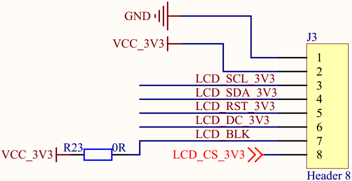
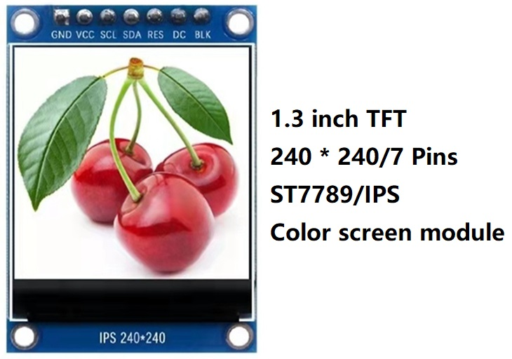
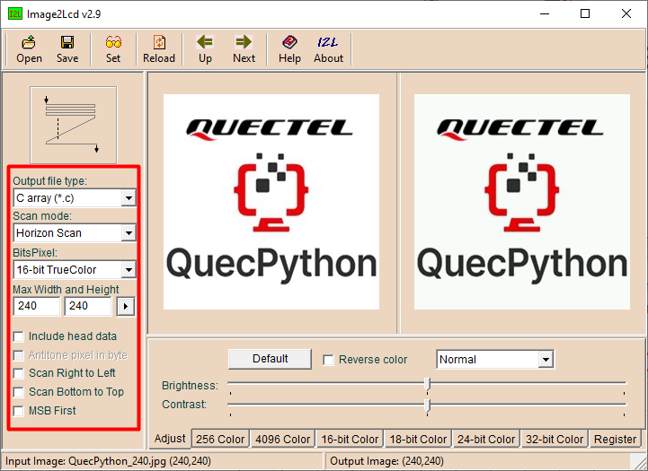
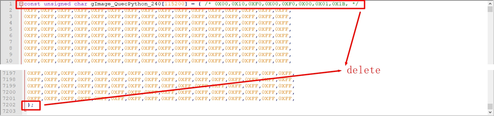
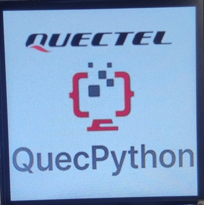
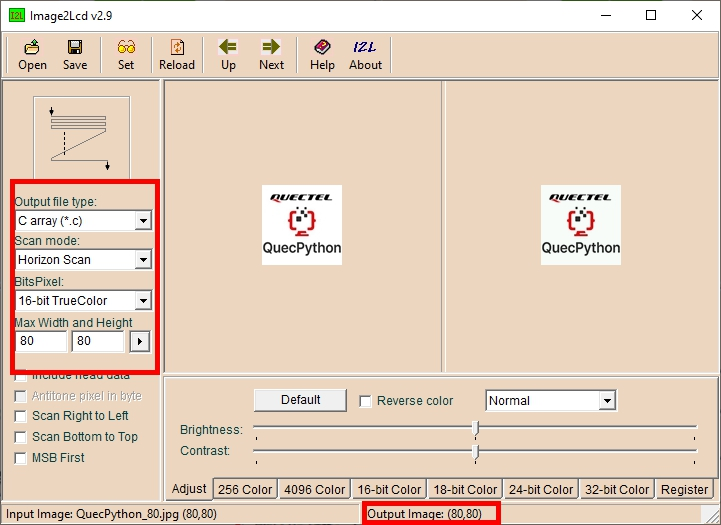

# LCD display experiment

## Revision history

|Version | date | author | change statement|
| ---- | ---------- | ------- | -------- |
|1.0 | 2021-10-06 | Grey. Tu | First Edition|
|1.1 | 2022-01-14 | Grey.Tu | Fixed an issue where routine code could not be downloaded |

This article mainly introduces LCD display based on ec600x and does a small experiment of LCD display.


## Hardware introduction

### LCD interface description of development board



|Serial number | LCD pin of development board | pin definition | backup|
| ---- | ------------- | ------------------------------ | ---- |
|1 | GND | power supply ground ||
| 2    | VCC_ 3v3 | power supply 3.3V ||
| 3    | LCD_ SCL_ 3v3 | SPI bus clock signal ||
| 4    | LCD_ SDA_ 3v3 | SPI bus write data signal ||
| 5    | LCD_ RST_ 3v3 | LCD reset control signal, low level reset ||
| 6    | LCD_ DC_ 3v3 | write register / write data control signal ||
| 7    | LCD_ BLK | LCD backlight control signal ||
| 8    | LCD_ CS_ 3v3 | LCD chip selection pin ||

### St7789v LCD interface description

The st7789v LCD screen used in this experiment. The definition of display pin is completely matched with the LCD interface of the development board, and can be directly inserted into the LCD interface of the development board.



|Serial number | LCD pin | pin definition | backup|
| ---- | ------- | ------------------------------ | ---- |
|1 | GND | power supply ground ||
|2 | VCC | power supply 3.3V ||
|3 | SCL | SPI bus clock signal ||
|4 | SDA | SPI bus write data signal ||
|5 | res | LCD reset control signal, low level reset ||
|6 | DC | write register / write data control signal ||
|7 | BLK | LCD backlight control signal ||

### Wiring mode

The following are st7789v display module and ec600x_ Wiring correspondence of quecpthon development board.

|Serial number | st7789v display | ec600x_ QuecPython development board | backup|
| ---- | ------------- | ----------------------- | -------- |
| 1    | GND           | GND                     |          |
| 2    | VCC           | VCC_3V3                 |          |
| 3    | SCL           | LCD_SCL_3V3             |          |
| 4    | SDA           | LCD_SDA_3V3             |          |
| 5    | RES           | LCD_RST_3V3             |          |
| 6    | DC            | LCD_DC_3V3              |          |
| 7    | BLK           | LCD_BLK                 |          |
| 8    |               | LCD_ CS_ 3v3 | no connection required|


## Software design

The interface in this example is implemented based on quecpthon's machine. LCD library. Due to the relatively large amount of code, this chapter is divided into file management code. For details, you can read the source code of the sample program.

### Document description

|Serial number | file | description | backup|
| ---- | ------------------ | ------------------------------------------------------------ | ---- |
|1 | st7789v.py | contains LCD driver with st7789v driver IC and interfaces for displaying characters and pictures|
|2 | fonts.py | font library used in the sample program|
|3 | image.py | small picture display data used in the sample program ||
|4 | image.txt | large picture display data used in the sample program ||
| 5    | example_ Display.py | display the main program and call the methods and data in several other files|

### LCD initialization function

This chapter encapsulates some API functions. Before introducing these APIs, let's take a look at the function interfaces provided in the firmware. Here we mainly introduce the LCD initialization function. Other functions are relatively simple. Please refer to: [quecpthon machine - LCD](https://python.quectel.com/wiki/#/en-us/api/QuecPythonClasslib?id=lcd) . 

```python
# lcd.lcd_ Init function parameter description
# lcd_ init_ Data: incoming LCD configuration command
# lcd_ Width: the width of the LCD screen. Width not exceeding 500
# lcd_ High: the height of the LCD screen. Height not exceeding 500
# lcd_ CLK: LCD SPI clock. SPI clock is 6.5k/13k/26k/52k
# data_ Line: number of data lines. The parameter values are 1 and 2.
# line_ Num: number of lines. The parameter values are 3 and 4.
# lcd_ Type: screen type. 0：rgb； 1：fstn。
# lcd_ Invalid: pass in the configuration command of LCD locale
# lcd_ display_ On: pass in the configuration command of LCD screen
# lcd_ display_ Off: pass in the configuration command of LCD screen off
# lcd_ set_ Brightness: pass in the configuration command of LCD screen brightness. Set to none to indicate by LCD_ BL_ K controls the brightness (some screens are controlled by registers, and some are controlled by lcd_bl_k)
lcd.lcd_init(lcd_init_data, lcd_width, lcd_hight, lcd_clk, data_line, line_num, lcd_type, lcd_invalid, lcd_display_on, lcd_display_off, lcd_set_brightness)
```

Next, the parameters of LCD initialization function are introduced through the actual code.

```python
from machine import LCD                 # Screen display module

# Common color definitions
red = 0xF800            # gules
green = 0x07E0          # green
blue = 0x001F           # blue
white = 0xFFFF          # white
black = 0x0000          # black
purple = 0xF81F         # purple
colour = white          # Default background color

# Screen parameters
screen_high = 240       # Screen height
screen_wide = 240       # Screen height
XSTART_H = 0xf0  		# Start point X coordinate high byte register
XSTART_L = 0xf1  		# Start point X coordinate low byte register
XEND_H = 0xE0  			# End point X coordinate high byte register
XEND_L = 0xE1  			# End point X coordinate low byte register
YSTART_H = 0xf2  		# Start point y coordinate high byte register
YSTART_L = 0xf3  		# Start point y coordinate low byte register
YEND_H = 0xE2  			# End point y coordinate high byte register
YEND_L = 0xE3  			# End point y coordinate low byte register

# Screen initialization parameters
# Three elements in a tuple form a group, and each element in a single group is defined as follows:
# 1: Type, 0 indicates command; 1 represents data; 2 indicates delay
# 2: Length. If the type is 0, the length represents the amount of data after the command; If the type is 1, the length represents the length of the data
# 3: Parameter value
init_data = (
    0, 0, 0x11,
    0, 1, 0x36,
    1, 1, 0x00,
    0, 1, 0x3A,
    1, 1, 0x05,
    0, 0, 0x21,
    0, 5, 0xB2,
    1, 1, 0x05,
    1, 1, 0x05,
    1, 1, 0x00,
    1, 1, 0x33,
    1, 1, 0x33,
    0, 1, 0xB7,
    1, 1, 0x23,
    0, 1, 0xBB,
    1, 1, 0x22,
    0, 1, 0xC0,
    1, 1, 0x2C,
    0, 1, 0xC2,
    1, 1, 0x01,
    0, 1, 0xC3,
    1, 1, 0x13,
    0, 1, 0xC4,
    1, 1, 0x20,
    0, 1, 0xC6,
    1, 1, 0x0F,
    0, 2, 0xD0,
    1, 1, 0xA4,
    1, 1, 0xA1,
    0, 1, 0xD6,
    1, 1, 0xA1,
    0, 14, 0xE0,
    1, 1, 0x70,
    1, 1, 0x06,
    1, 1, 0x0C,
    1, 1, 0x08,
    1, 1, 0x09,
    1, 1, 0x27,
    1, 1, 0x2E,
    1, 1, 0x34,
    1, 1, 0x46,
    1, 1, 0x37,
    1, 1, 0x13,
    1, 1, 0x13,
    1, 1, 0x25,
    1, 1, 0x2A,
    0, 14, 0xE1,
    1, 1, 0x70,
    1, 1, 0x04,
    1, 1, 0x08,
    1, 1, 0x09,
    1, 1, 0x07,
    1, 1, 0x03,
    1, 1, 0x2C,
    1, 1, 0x42,
    1, 1, 0x42,
    1, 1, 0x38,
    1, 1, 0x14,
    1, 1, 0x14,
    1, 1, 0x27,
    1, 1, 0x2C,
    0, 0, 0x29,
    0, 1, 0x36,
    1, 1, 0x00,
    0, 4, 0x2a,
    1, 1, 0x00,
    1, 1, 0x00,
    1, 1, 0x00,
    1, 1, 0xef,
    0, 4, 0x2b,
    1, 1, 0x00,
    1, 1, 0x00,
    1, 1, 0x00,
    1, 1, 0xef,
    0, 0, 0x2c,
)

# Screen area display parameters
# Three elements in a tuple form a group, and each element in a single group is defined as follows:
# 1: Type, 0 indicates command; 1 represents data; 2 indicates delay
# 2: Length. If the type is 0, the length represents the amount of data after the command; If the type is 1, the length represents the length of the data
# 3: Parameter value
lcd_set_display_area = (
    0, 4, 0x2a,
    1, 1, XSTART_H,
    1, 1, XSTART_L,
    1, 1, XEND_H,
    1, 1, XEND_L,
    0, 4, 0x2b,
    1, 1, YSTART_H,
    1, 1, YSTART_L,
    1, 1, YEND_H,
    1, 1, YEND_L,
    0, 0, 0x2c,
    )

lcd = LCD()  														# create object
lcd_init_data = bytearray(init_data)  								# Conversion initialization parameter array
lcd_invalid = bytearray(lcd_set_display_area)  						# Conversion area setting parameter array
self.lcd.lcd_init(lcd_init_data, screen_high, screen_wide,
                  6500, 1, 4, 0, lcd_invalid, None, None, None)  	# Initialize LCD screen
```

### Encapsulating API functions

#### Create st7789v object

> **from usr import st7789v**
>
> **lcd_st7789v = st7789v.ST7789V(width, hight)** 

*Function:

  Create an LCD object for LCD initialization.

*Parameters:

|Parameter | type | description|
| ----- | ---- | ---------- |
|Width | width of integer | display screen|
|High | integer | high of display screen|

*Return value:

  Returns an LCD object.

*Example:

```python
from usr import st7789v
lcd_st7789v = st7789v.ST7789V(240, 240)
```


#### Show single character

> **lcd_st7789v.lcd_show_char(x, y, xsize, ysize, ch_buf, fc, bc)**

*Function:

  Single character display, which can display Chinese characters and ASCII characters.

*Parameters:

| Parameter | type               | description                                            |
| --------- | ------------------ | ------------------------------------------------------ |
| X         | integer            | X axis starting point coordinate                       |
| Y         | integer            | Y axis starting point coordinate                       |
| Xsize     | integer            | width of characters to be displayed                    |
| Ysize     | integer            | height of the character to be displayed                |
| ch_ Buf   | tuple or list      | stores the font data of the characters to be displayed |
| FC        | 16 bit hex         | font color, such as 0x0000 indicates black             |
| BC        | 16 bit hexadecimal | background color, such as 0xFFFF indicates white       |

*Return value:

  nothing


#### Single ASCII character display

> **lcd_st7789v.lcd_show_ascii(x, y, xsize, ysize, ch, fc, bc)**

*Function:

  ASCII character display currently supports font sizes of 8x16 and 16X24. If other font sizes are required, you need to increase the font data of the corresponding size, and add the dictionary of the corresponding font in this function.

*Parameters:

|Parameter | type | description|
| ----- | ------------ | ----------------------------- |
|X | integer | X axis starting point coordinate|
|Y | integer | Y axis starting point coordinate|
|Xsize | integer | width of characters to be displayed|
|Ysize | integer | height of the character to be displayed|
|Ch | character | ASCII character to be displayed|
|FC | 16 bit hex | font color, such as 0x0000 indicates black|
|BC | 16 bit hexadecimal | background color, such as 0xFFFF indicates white|

*Return value:

  nothing


#### Ascii string display

> **lcd_st7789v.lcd_show_ascii_str(x, y, xsize, ysize, str, fc, bc)**

*Function:

  Ascii string display, display order, starting from left to right with the set starting coordinates. In the example, only ASCII characters of 8x16 size are provided. If users need characters of other sizes, they need to remake the font library and display them on the ` LCD_ st7789v.lcd_ show_ ASCII (x, y, xsize, ysize, CH, FC, BC) ` interface adds support for new font libraries.

  Note: make sure that the incoming string can be displayed on the current line, that is, the value of the total length of the incoming string multiplied by the width of a single character plus the starting coordinate X cannot exceed the screen width, otherwise the program will directly report an error and prompt that it exceeds the display range.

Parameters:

|Parameter | type | description|
| ----- | ------------ | ----------------------------- |
|X | integer | X axis starting point coordinate|
|Y | integer | Y axis starting point coordinate|
|Xsize | integer | width of characters to be displayed|
|Ysize | integer | height of the character to be displayed|
|STR | string | ASCII character to be displayed|
|FC | 16 bit hex | font color, such as 0x0000 indicates black|
|BC | 16 bit hexadecimal | background color, such as 0xFFFF indicates white|

*Return value:

  None.


#### Show small size pictures

> **lcd_st7789v.lcd_show_image(image_data, x, y, width, heigth)**

*Function:

  This method is suitable for displaying pictures with small size. If the picture resolution (width and height) is less than 80x80, the picture data can be directly written into the display at one time.

*Parameters:

|Parameter | type | description|
| ---------- | ---------- | ----------------------- |
| image_ Data | tuple or list | store the RGB data of the picture to be displayed|
|X | integer | X axis starting point coordinate|
|Y | integer | Y axis starting point coordinate|
|Width | integer | width of the picture to be displayed|
|Height | character | height of the picture to be displayed|

*Return value:

  nothing


#### Show large picture

> **lcd_st7789v.lcd_show_image_file(path, x, y, width, heigth, h)**

*Function:

  This method is suitable for displaying pictures with large size. If the picture resolution (width and height) is greater than 80x80, this method needs to be used for display. This method reads the picture data from the file and writes it in segments. The principle of segmented writing is as follows:

  If the resolution (width height) of the picture to be displayed is width * height, the picture to be displayed is divided into several pictures with width * h. If the height of the last piece is less than h, it is calculated according to the actual height. H is the height of each picture after segmentation, which can be specified by the user through the parameter h. The value of H should meet the relationship: ` width * h * 2 < 4096`

Parameters:

|Parameter | type | description|
| ------ | ------ | --------------------------------------------------------- |
|Path | string | TXT file path for storing image data, including file name, such as' usr / image. TXT '|
|The X | int | X axis shows the starting point|
|The Y | int | Y axis shows the starting point|
|Width | int | picture width|
|Height | int | picture height|
|H | int | height of each picture after segmentation|

*Return value:

  nothing

Example:

If you want to display a 240x240 picture, the picture is as follows:


(1) Use image2lcd software to obtain picture color data



(2) Get the data as shown in the figure below, delete the redundant parts at the head and tail of the. C file, and only keep the middle data part to ensure that the first line of processed data is data, and there are no more lines at last, and there are no redundant characters such as spaces in front of each line



(3) Save the processed picture data file as a TXT format file, assuming it is named image.txt

(4) Upload the image.txt file to the development board module [note that there is no image.py file at this time, and there is no need to import image from usr]

(5) In the main program example_ display_ In image.py, use the following code to display the picture

```python
# -*- coding: UTF-8 -*-


import utime
'''
If there is no checknet Library in the firmware version used by the user, please upload the checknet.mpy file to the usr directory of the module,
And change import checknet to from usr import checknet
'''
import checkNet
from usr import st7789v
# from usr import image

'''
The following two global variables are required. Users can modify the values of the following two global variables according to their actual projects,
The values of these two variables are printed before executing the user code.
'''
PROJECT_NAME = "QuecPython_ST7789V_LCD_Example"
PROJECT_VERSION = "1.0.0"

checknet = checkNet.CheckNetwork(PROJECT_NAME, PROJECT_VERSION)
lcd_st7789v = st7789v.ST7789V(240, 240)


if __name__ == '__main__':
    '''
When running this routine manually, you can remove the delay. If you change the routine file name to main.py, you need to add the delay when you want to start up and run automatically,
Otherwise, the following poweron cannot be seen from the CDC port_ print_ Information printed in once()
    '''
    # utime.sleep(5)
    checknet.poweron_print_once()

    '''
If the user program contains network related code, wait must be executed_ network_ Connected() wait for the network to be ready (dialing succeeded);
If it is a network independent code, you can mask the wait_ network_ connected()
    '''
    # checknet.wait_network_connected()

    # user designation codes
    '''######################【User code star】#####################################'''
  
    # Display a 240 * 240 size picture
    lcd_st7789v.lcd_show_image_file("usr/image.txt", 0, 0, 240, 240, 8)

    '''######################【User code end 】#####################################'''

```

Display results:





### Experimental operation

In the directory of experimental routines, find the [display picture] directory, enter the directory, and there are the following source files:

|Serial number | file | description | backup|
| ---- | ------------------ | ------------------------------------------------------------ | ---- |
|1 | st7789v.py | contains LCD driver with st7789v driver IC and interfaces for displaying characters and pictures|
|2 | fonts.py | font library used in the sample program|
|3 | image.py | small picture display data used in the sample program ||
| 4    | example_ Display.py | display the main program and call the methods and data in several other files|

##### Experimental steps

(1) Connect the 240 * 240 display screen to the module correctly;
(2) Copy the four py files in this directory (st7789v.py, image.py, fonts.py, example_display. Py) to the usr directory of the module;
(3) Enter the command line of the module and execute the following commands to see the picture displayed on the display screen:

```
import example
example.exec('usr/example_display_image.py')
```

##### Experimental results


## Use of character and picture mold tools

### Tool introduction

（1）Image2Lcd

Image2lcd software is used for image modeling, which can extract monochrome and color images.

（2）PCtoLCD2002

Pctolcd2002 is a character modeling software, which can generate font data of Chinese characters, English and punctuation marks.


### How to mold a picture

(1) Open image2lcd software, click [open] button and select the picture to be displayed;



(2) Select [C language array (*. C)] as the output data type, select [horizontal scanning] as the scanning mode, and select [16 bit true color] as the output gray level;

(3) Set the maximum width and height of the picture, and the actual output size shall be subject to the bottom part of [output image: (XX, YY)] in the above figure;

(4) Click the [save] button to get the mold data of the picture and save it in the tuple.


## Matching code

 <a href="code/LCD_file.7z" target="_blank">Download experimental materials</a>
