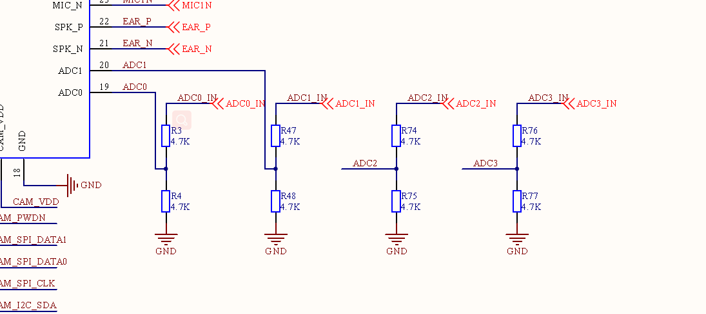

## Revision history

|Version | date | author | change statement|
| ---- | ---------- | ------ | ------------ |
|1.0 | 2021-09-15 | Kayden | initial version revision|
|1.1 | 2022-03-21 | Kayden | Document optimization and adjustment |


## Photosensitive sensor experiment

This article mainly introduces EC600U ADC hardware resources (similar to other modules) and [QuecPython ADC API](https://python.quectel.com/wiki/#/en-us/api/QuecPythonClasslib?id=adc)，and uses the ADC to detect the resistance of the current photosensitive resistor.

### Hardware resources

EC600U leads out four ADC interfaces. Refer to EC600X_QuecPython_EVB_V2.0_SCH.pdf document.

Other development boards refer to the corresponding schematic documents, which can be downloaded from the  [download center.](https://python.quectel.com/download)



| Peripheral | Pin  |
| ---------- | ---- |
| ADC0       | 19   |
| ADC1       | 20   |
| ADC2       | 113  |
| ADC3       | 114  |

**Note: the specific correspondence of each module is described in detail in the API introduction,combine the pin numbers in the schematic or hardware design manual**

The ADC0 is connected to a photoresistor as shown below:


### Photosensitive resistance experiment

#### Experimental design

Design an experiment to print the resistance of the current photoresist in real time according to the current light intensity. The following figure is the schematic diagram of photoresist.


ADC0 is the voltage point we can test with ADC peripherals.


Finally, the R22 resistance can be calculated according to the following formula.


#### Experimental code

 <a href = "code / photoresistor. Py" target = "_blank" > download the code</a>

```python
'''
File: Photoresistor.py
Project: adc
File Created: Thursday, 24th December 2020 5:44:08 pm
Author: chengzhu.zhou
-----
Last Modified: Wednesday, 30th December 2020 10:10:33 am
Modified By: chengzhu.zhou
-----
Copyright 2020 - 2020 quectel
'''

from misc import ADC
import utime as time
import _thread


# unit as Ω
def Voltage_to_Resistance(Volt):
    #
    Va = 2 * Volt
    resistance = (2 * 4700 * 40200 * Va) / (2 * 4700 * (3300 - Va) - (40200 * Va))
    return resistance


def Photoresistor_thread(delay, retryCount):
    # creat a adc device
    AdcDevice = ADC()
    while retryCount:
        retryCount = retryCount - 1
        # get ADC.ADC0 value
        adcvalue = AdcDevice.read(ADC.ADC0)
        print("get ADC.ADC0 Voltage value as {0}mv".format(adcvalue))
        # Converted to resistance
        resistance = Voltage_to_Resistance(adcvalue)
        print("Photoresistor  resistance as  {0}Ω".format(resistance))
        time.sleep(delay)
    pass


if __name__ == "__main__":
    # creat a thread Convert ADC to Voltage
    _thread.start_new_thread(Photoresistor_thread, (1, 10))
    print("main thread has exit")

```


#### Experimental operation

1. Burn the code into the development board for operation;

2. Block the photoresist with articles and change the light intensity irradiated to the photoresist;

3. Check the resistance change of serial port output.

Finally, we can see in the serial port that the resistance output changes as follows.


#### Introduction to photosensitive resistor principle

definition:

Photosensitive resistor is a special resistor made of semiconductor materials such as vulcanized partition or selenided partition. The surface is also coated with moisture-proof resin, which has photoconductive effect.

characteristic:

Photoresistors are very sensitive to light. The stronger the light, the lower the resistance. With the increase of light intensity, the resistance value decreases rapidly and can be reduced to less than 1K Ω. The following features are included.

-Volt ampere characteristics:

  The relationship between the current * I * of the photosensitive element and the applied voltage * u * of the photosensitive sensor under a certain incident illumination is called the volt ampere characteristic of the photosensitive device.

-Illumination characteristics

  The relationship between the spectral sensitivity of the photosensitive sensor and the incident light intensity is called the illumination characteristic. Sometimes, the relationship between the output voltage or current of the photosensitive sensor and the incident light intensity is also called the illumination characteristic.


### Professional terms

>** ADC: analog-to-digital conversion***

