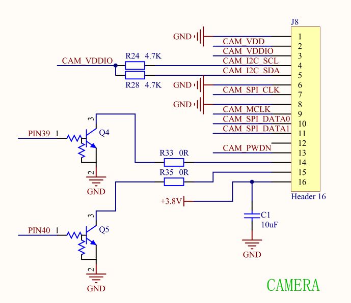

## Revision history

|Version | date | author | change statement|
| ---- | ---------- | ------ | ------------ |
|1.0 | 2021-09-15 | Felix | initial version revision|

## Introduction

Based on quecpthon, this document introduces how to realize camera preview, code scanning and photographing functions through camera module, including interface, configuration process and examples.


At present, quecpython supports two kinds of camera ICs. Subsequent updates will continue

-Bf3901 (8W pixels)
-Gc032a (30W pixels)


The following experiments take gc032a as an example


## Schematic analysis

Firstly, the schematic diagram is analyzed to determine the model and pin configuration of camera



Pins: SCK, SDA (IIC pin is used to configure and read the register of sensor)

MCLK: master clock provided to sensor

SPI_ CLK: SPI clock output from sensor to module

Data0: camera SPI data bit 0

Dara1: camera SPI data bit 1

Pwdn: camera off


## Camera related interfaces

​ 	 The camera interface mainly refers to the wiki ([camera_api library] on the official website(https://python.quectel.com/wiki/#/zh-cn/api/QuecPythonClasslib?id=camera-%e6%91%84%e5%83%8f%e6%89%ab%e7%a0%81)）


## Camera configuration development process

### LCD initialization (not required)

​ 	 If the preview function is required in this part, the LCD needs to be initialized first.

​ 	 For specific implementation, refer to ([LCD instructions](https://python.quectel.com/doc/doc/sbs/zh/sbs/lcd.html)）


### Preview function

​ 	 This part only realizes the preview function of the device.

```
import camera

preview1 = camera.camPreview(0,640,480,240,320,2)

preview1.open()

preview1.close()
```

​		

​	

### Code scanning function

This part realizes preview and code scanning functions.

```
def sacn_call(para):
  print(para)

import camera
Scan = camera.camscandecode (0,1640480,2240320) # requires preview function and LCD
# Scan = camera.camscandecode (0,1640480,0) # no preview function is required, i.e. no LCD

scan.open()
scan.start()
scan.callback(sacn_call)
```


### Photographing function

This part of the function realizes the preview and photographing functions.

```
def cap_call(para):
  print(para)

import camera
cap = camera.camCaputre(0,640,480,0,240,320)

cap.open()
cap.callback(cap_call)

cap.start(240,320,'1')
```


## Appendix a abbreviations of terms

Table 2: Abbreviations of terms

```
abbreviation 		 Full English name 						 Full Chinese name

LCD  	 Liquid Crystal Display  			 Liquid crystal display

SPI  	 Serial Peripheral Interface  	 Serial peripheral interface
```

