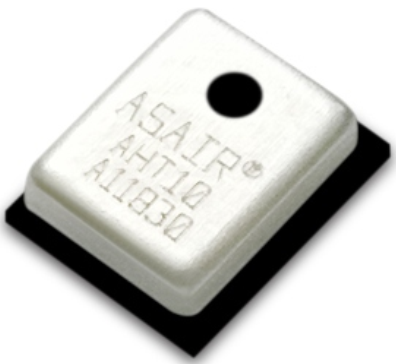
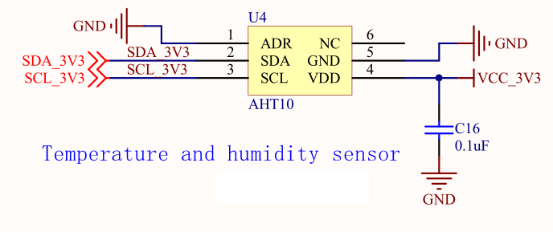

# Internal temperature and humidity sensor experiment

## Revision history

|Version | date | author | change statement|
| ---- | ---------- | ------- | -------- |
|1.0 | 2021-09-28 | grey. Tu | First Edition|

This article is mainly based on ec600x onboard temperature and humidity sensor aht10 to do a small experiment of temperature and humidity detection.


## Hardware introduction



Aht10 is a high-precision, fully calibrated, chip encapsulated temperature and humidity sensor. The MEMS manufacturing process ensures that the product has high reliability and excellent long-term stability. The sensor consists of a capacitive humidity sensing element connected to a high-performance CMOS microprocessor. The product has the advantages of excellent quality, ultra fast response, strong anti-interference ability and high cost performance. For details. 

Aht10 communicates through I2C interface. According to the introduction of the manual. Just send the data in the following way to get the data.

1. Power on and wait for calibration data. Send 0xe1 0x08 0x00. (only need to calibrate once)

2. Trigger measurement and send 0xac, 0x33, 0x00.

3. Read the data and wait for 70ms conversion. Just read 6 bytes.



Check the schematic diagram and data manual to determine that the slave address is 0x38.

As it is an onboard module, the schematic diagram refers to the schematic diagram above, and no other external modules are required.

## Software design

1. Initialize aht10 sensor
2. Trigger measurement
3. Delay 70ms
4. Read data
5. Convert temperature and humidity
6. Continue with step 2

```python
import log
from machine import I2C
import utime as time


class aht10class:
    i2c_log = None
    i2c_dev = None
    i2c_addre = None

    # Initialization command
    AHT10_CALIBRATION_CMD = 0xE1
    # Trigger measurement
    AHT10_START_MEASURMENT_CMD = 0xAC
    # reset
    AHT10_RESET_CMD = 0xBA

    def write_data(self, data):
        self.i2c_dev.write(self.i2c_addre,
                           bytearray(0x00), 0,
                           bytearray(data), len(data))
        pass

    def read_data(self, length):
        r_data = [0x00 for _ in range(length)]
        r_data = bytearray(r_data)
        self.i2c_dev.read(self.i2c_addre,
                          bytearray(0x00), 0,
                          r_data, length,
                          0)
        return list(r_data)

    def aht10_init(self, addre=0x38, alise="Ath10"):
        self.i2c_log = log.getLogger(alise)
        self.i2c_dev = I2C(I2C.I2C1, I2C.STANDARD_MODE)  #Return I2C object
        self.i2c_addre = addre
        self.sensor_init()
        pass

    @staticmethod
    def aht10_transformation_temperature(data):
        r_data = data
        #Convert the temperature as described in the data book
        humidity = (r_data[0] << 12) | (
            r_data[1] << 4) | ((r_data[2] & 0xF0) >> 4)
        humidity = (humidity/(1 << 20)) * 100.0
        print("current humidity is {0}%".format(humidity))
        temperature = ((r_data[2] & 0xf) << 16) | (
            r_data[3] << 8) | r_data[4]
        temperature = (temperature * 200.0 / (1 << 20)) - 50
        print("current temperature is {0}°C".format(temperature))

    def sensor_init(self):
        # calibration
        self.write_data([self.AHT10_CALIBRATION_CMD, 0x08, 0x00])
        time.sleep_ms(300)  # at last 300ms
        pass

    def ath10_reset(self):
        self.write_data([self.AHT10_RESET_CMD])
        time.sleep_ms(20)  # at last 20ms

    def trigger_measurement(self):
        # Trigger data conversion
        self.write_data([self.AHT10_START_MEASURMENT_CMD, 0x33, 0x00])
        time.sleep_ms(200)  # at last delay 75ms
        # check has success
        r_data = self.read_data(6)
        # check bit7
        if (r_data[0] >> 7) != 0x0:
            print("Conversion has error")
        else:
            self.aht10_transformation_temperature(r_data[1:6])


def i2c_aht10_test():
    ath_dev = aht10class()
    ath_dev.aht10_init()

    #Test ten times
    for i in range(10):
        ath_dev.trigger_measurement()
        time.sleep(1)


if __name__ == "__main__":
    i2c_aht10_test()
```

## Matching code

<!-- *  [download code](code/code_i2c_aht10.py)-->
< a href = "code / code_i2c_aht10. Py" target = "_blank" > download code</a>
