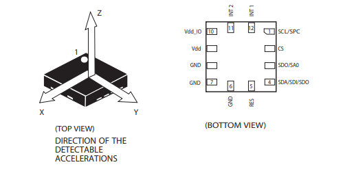
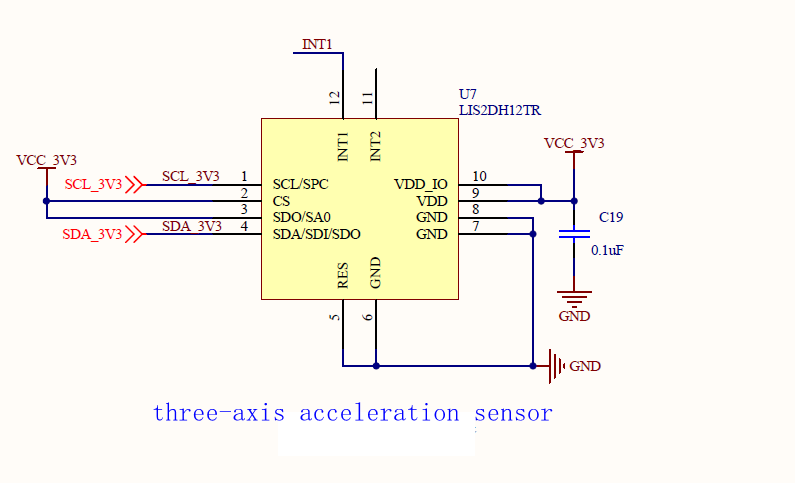
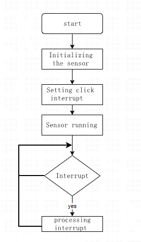

# Acceleration sensor experiment

## Revision history

|Version | date | author | change statement|
| ---- | ---------- | ------- | -------- |
|1.0 | 2021-09-29 | grey. Tu | First Edition|

This article is mainly based on ec600x_ IIC interface introduces the three-axis acceleration sensor lis2dh12tr, and does a small experiment to detect acceleration.


## Hardware introduction

### Lis2dh12 introduction



Lis2dh12 is a 3-Axis linear accelerometer with ultra-low power consumption and high performance belonging to "nano" series, with standard output of digital I2C and SPI serial interface. The device has ultra-low power consumption working mode, which can realize advanced energy-saving, intelligent, sleep wake-up and sleep recovery functions. Lis2dh12 has a dynamic user selectable full scale of ± 2G / ± 4G / ± 8g / ± 16g, and can measure acceleration through an output data rate of 1 Hz to 5 kHz. The device can be configured to generate an interrupt signal through independent inertial wake-up / free fall events and through the position of the device itself. The threshold and timing of the interrupt generator can be dynamically set by the end user. Please refer to[LIS2DH12.pdf](media\LIS2DH12.pdf) 。

### Hardware connection

Pin function introduction:

|Pin number | pin name | description | backup|
| ------ | --------------------- | ------------------------------------------------------------ | ---- |
|1 | SCL<br />SPC | IIC / SPI clock pin||
|2 | CS | SPI enable pin, which controls the chip communication mode<br />1: IIC communication; 2: SPI communication ||
|3 | SDO<br />SA0 | SPI mode is the data output pin<br />IIC mode is the device slave address selection pin, 1:0x19; 0：0x18。 |      |
|4 | SDA <br />SDI<br />SDO | IIC mode is the data pin<br />data input pin in standard SPI mode<br />it can also be used as the data output pin of SPI ||
|5 | res | grounding is enough||
|6 | GND | land ||
|7 | GND | land ||
|8 | GND | land ||
|9 | VDD | power supply ||
| 10     | VDD_ IO | IO reference level pin ||
|11 | INT2 | interrupt pin 2 ||
|12 | INT1 | interrupt pin 1 ||

In this chapter, we use I2C interface for communication. The schematic diagram is as follows.



This time we d0 / SA0 pin high level. Therefore, it can be confirmed that the slave address of the acceleration sensor is 0x19.


## Software design

### Lis2sh12 click interrupt usage steps

Functions supported by lis2dh12:

1. Single click detection

2. Free fall detection

3. Inclination angle measurement

4. Switch horizontal / vertical screen mode

We use the click detection function to map the click event to the INT1 pin. The processing logic is roughly as follows:



### Lis2sh12 initialization

1. Set Ctrl_ Reg2 register, turn on high pass filtering.
2. Set Ctrl_ Reg3 register, which leads the interrupt to the INT1 pin.
3. Set Ctrl_ Reg4 register to configure full scale selection

### Configure click interrupt

1. Configure Click_ CFG register to enable the sensing axis to be detected, x, y, Z
2. Configure Click_ Ths register, setting threshold
3. Configure time_ Limit register to set the window limit
4. Configure time_ Latency register, set delay

### Lis2sh12 enable sensor

1. Configure Ctrl_ Reg1 register, start enabling the sensor.

### Experimental design

1. Use the INT1 pin of lis2dh12 sensor to generate an interrupt.
2. Poll the status of this pin. After the rising edge is detected, it indicates that an interrupt is generated and the interrupt is processed.
3. Read the status of three axes in the interrupt function.

### Experimental code

```python
import log
import utime
import _thread
from machine import I2C
from machine import Pin

# Register address
LIS2DH12_OUT_X_L = 0x28
LIS2DH12_OUT_X_H = 0x29
LIS2DH12_OUT_Y_L = 0x2A
LIS2DH12_OUT_Y_H = 0x2B
LIS2DH12_OUT_Z_L = 0x2C
LIS2DH12_OUT_Z_H = 0x2D
LIS2DH12_FIFO_CTRL_REG = 0x2E

# Control register
LIS2DH12_CTRL_REG1 = 0x20
LIS2DH12_CTRL_REG2 = 0x21
LIS2DH12_CTRL_REG3 = 0x22
LIS2DH12_CTRL_REG4 = 0x23
LIS2DH12_CTRL_REG5 = 0x24
LIS2DH12_CTRL_REG6 = 0x25
LIS2DH12_REFERENCE_REG = 0x26
LIS2DH12_STATUS_REG = 0x27

# Status register
LIS2DH12_STATUS_REG_AUX = 0x7

# Interrupt register
LIS2DH12_INT1_CFG = 0x30
LIS2DH12_INT1_SRC = 0x31
LIS2DH12_INT1_THS = 0x32
LIS2DH12_INT1_DURATION = 0x33

# Identity register
LIS2DH12_WHO_AM_I = 0x0F

# Click the relevant register
LIS2DH12_CLICK_CFG = 0x38
LIS2DH12_CLICK_SRC = 0x39
LIS2DH12_CLICK_THS = 0x3A
LIS2DH12_TIME_LIMIT = 0x3B
LIS2DH12_TIME_LATENCY = 0x3C


# Bind it to the external interrupt pin。
class lis2dh12(object):
    i2c_dev = None
    address = None
    int_pin = None
    dev_log = None

    def init(self, slave_address):
        self.dev_log = log.getLogger("I2C")
        self.address = slave_address
        self.i2c_dev = I2C(I2C.I2C1, I2C.STANDARD_MODE)
        self.int_pin = Pin(Pin.GPIO14, Pin.IN, Pin.PULL_PU, 0)  # Interrupt pin, which changes according to different hardware connections
        self.sensor_init()
        self.single_tap_enable()  # Configure click detection
        self.start_sensor()
        pass

    def read_data(self, regaddr, datalen, debug=True):
        r_data = [0x00 for _ in range(datalen)]
        r_data = bytearray(r_data)
        reg_addres = bytearray([regaddr])
        self.i2c_dev.read(self.address, reg_addres, 1, r_data, datalen, 1)
        ret_data = list(r_data)
        if debug is True:
            self.dev_log.debug(" read 0x{0:02x} from 0x{1:02x}".format(ret_data[0], regaddr))
        return ret_data

    def write_data(self, regaddr, data, debug=True):
        w_data = bytearray([regaddr, data])
        # Temporarily put the address to be transmitted in the data bit
        self.i2c_dev.write(self.address, bytearray(0x00), 0, bytearray(w_data), len(w_data))
        if debug is True:
            self.dev_log.debug(" write 0x{0:02x} to 0x{1:02x}".format(data, regaddr))

    def sensor_reset(self):
        # Reset chip
        self.write_data(LIS2DH12_CTRL_REG5, 0x80)
        utime.sleep_ms(100)
        r_data = self.read_data(LIS2DH12_WHO_AM_I, 1)
        # Confirm that the restart is successful
        while r_data[0] != 0x33:
            r_data = self.read_data(LIS2DH12_WHO_AM_I, 1)
            utime.sleep_ms(5)
        self.dev_log.debug("sensor reset succeeded")
        pass

    def sensor_init(self):
        self.sensor_reset()  # 1. Reset the device; 2. Initialize the sensor
        self.write_data(LIS2DH12_CTRL_REG2, 0x04)  # Enable high resolution
        self.write_data(LIS2DH12_CTRL_REG3, 0x80)  # Lead the interrupt to the INT1 pin. The default high level is valid
        self.write_data(LIS2DH12_CTRL_REG4, 0x08)  # ±2g， High-resolution mode

    def single_tap_enable(self):
        self.write_data(LIS2DH12_CLICK_CFG, 0x15)  # Enable XYZ triaxial click interrupt
        # self.write_data(LIS2DH12_CLICK_CFG, 0x10)  # enables z-axis click interrupt
        self.write_data(LIS2DH12_CLICK_THS, 0x30)  # Set threshold
        self.write_data(LIS2DH12_TIME_LIMIT, 0x18)  # Set time window limit
        self.write_data(LIS2DH12_TIME_LATENCY, 0x02)  # Set delay

    def start_sensor(self):
        self.write_data(LIS2DH12_CTRL_REG1, 0x77)  # Set ODR 400HZ ,enable XYZ
        # self.write_data(LIS2DH12_CTRL_REG1, 0x74)  # Set ODR ,enable Z axis
        utime.sleep_ms(20)  # (7/ODR) = 18ms

    def read_xyz(self):
        data = []
        for i in range(6):
            r_data = self.read_data(LIS2DH12_OUT_X_L + i, 1)
            data.append(r_data[0])
        return data

    def processing_data(self):
        data = self.read_xyz()
        self.dev_log.info("xL:{:0>3d},xH:{:0>3d},yL:{:0>3d},yH:{:0>3d},zL:{:0>3d},zH:{:0>3d}".
                          format(data[0], data[1], data[2], data[3], data[4], data[5]))
        self.dev_log.info("X:{:0>3d}  Y:{:0>3d}  Z:{:0>3d}".
                          format((data[0] & data[1]), (data[2] & data[3]), (data[4] & data[5])))
        pass

    def exti_processing_data(self):
        value = self.int_pin.read()
        if value == 1:  # Interrupt signal detected
            self.processing_data()
            return 1
        else:
            return 0


# Parameter description
# state: whether to enable interrupt reading. 1: enable; 0: not enabled
# delay: delay time (MS). This parameter is invalid in interrupt mode
# retryCount: number of reads
def is2dh12_thread(state, delay, retryCount):
    # | Parameter | parameter type | description               |
    # | --------- | -------------- | ------------------------- |
    # | CRITICAL  | constant       | value of logging level 50 |
    # | ERROR     | constant       | value of logging level 40 |
    # | WARNING   | constant       | value of logging level 30 |
    # | INFO      | constant       | value of logging level 20 |
    # | DEBUG     | constant       | value of logging level 10 |
    # | NOTSET    | constant       | value of logging level 0  |
    log.basicConfig(level=log.INFO)  # Set log output level
    dev = lis2dh12()
    dev.init(0x19)
    while True:
        if state == 1:
            if dev.exti_processing_data() == 1:
                retryCount -= 1
        elif state == 0:
            dev.processing_data()
            utime.sleep_ms(delay)
            retryCount -= 1
        if retryCount == 0:
            break
    print("detection end exit")


if __name__ == "__main__":
    _thread.start_new_thread(is2dh12_thread, (0, 1000, 10))
```


## Matching code

<!-- *  [download code](code/code_i2c_lis2dh12.py) -->
 < a href = "code / code_i2c_lis2dh12. Py" target = "_blank" > download the code</a>
