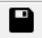

## Application notes on Quectel_QuecPython_QPYcom 

### About document

**Revision history**

| **Version** | **Date**   | **Author**              | **Description**                                              |
| ----------- | ---------- | ----------------------- | ------------------------------------------------------------ |
| 1.0         | 2020-10-31 | Kingka.Wu & Rivern.Yuan | Initial version                                              |
| 1.0         | 2020-11-08 | Kingka.Wu               | 1. Added User guide  2. Added solutions to common issue   3. Added driver installation and EVB introduction    4. Added Quick start |
| 1.1         | 2021-03-01 | Rivern.Yuan             | 1. Added tool bar illustration 2. Added illustration on interaction page |
| 1.2         | 2021-07-13 | Rivern.Yuan             | In V1.6, added the illustration on adjusting download page.  |
| 1.2         | 2021-11-13 | Rivern.Yuan             | In V1.8, adjusted the user guide.                            |

### Quick start

#### Download FW 

（1）Go for QPYcom package in provided tools, unzip and double click to run it. 

（2）Create program name and click "Select FW" to the package. As for the FW package with Python version, it is located in the FW (Firmware) directory of SDK provided. 

（3）Left click the inverted triangle, select "Download FW" and click it to download subsequently. 

#### Download script

1. Go for QPYcom package in provided tools, unzip and double click to run it. 

2. Create program, click "**+**" icon and select the python to be downloaded. 

3. Left click the inverted triangle, select "Download script" and click it to download. 

#### Interaction surface

1. Go for QPYcom package in provided tools, unzip and double click to run it. 

2. Enter interaction surface.

3. In interaction surface, it is available to interact with module manually. Please refer to following figure to get more knowledge. 

### Main surface function 

In this chapter, it mainly introduces the main features of QPYcom. As for User guide, please refer to Chapter 5. 

In provided SDK , enter tools directory, find out QPYCOM.zip and unzip it. After that, go for QPYcom.exe directly. It is valid to download Python script file into module, interact with module based on command line via it. In addition, this script tool is also supportive in downloading FW and detecting upgrade. The user can operate by the related functional modes in accord with actual needs. 

2.  The Python file can be downloaded to run and query via serial port.

3. Download FW and Python script

   

#### About File 

#### Storage

-   In file, there exists log storage. Click "Save" to select the path to save log. For more details, please refer to the following figure. 

About File

-   Click "Save" to select the path to save log, here shows the details. 

Save file 

#### Exit 

-   Select "Exit" to exit the entire application. 

### About Query 

“Interacting with command line, scanning over file, downloading FW/script, setting SW, switching language , checking module log and downloading log” are contained in this column, please check the following figure for more specifications. 

### Interact with command line 

The user can enter the main surface of interaction via clicking "Check" and "Interact with command line" by turns. In interaction surface, it is available to interact with module manually. Please refer to following figure to get more knowledge. 

The following icons show the related functions.

-   
 Start up the interaction with command line on module 

-   
 Pause the interaction with command line on module 

-   
 Stop the interaction with command line on module 

-   
 Delete screen printing 

-   
 Display printing time 

-   
 Display line number 

-   
Topic switch in main surface of interaction (Switch between black and white) 

-   
 Save interaction log 

-   
 Search for key words in interaction log  

-   
Set module log and serial port parameter configuration 

-   
  Tool, it is available to add shortcuts manually (configured in config.ini)

-   
  Button for configuring tool, which can be used to configure the needed commands on your own. 

  **Note:** the maximum quantity of command is 16, the maximum length of command name is 16 characters as well.
  
-   
 Top the button, click the button to pin the tool on the top

- 
   The button for making fota package when upgrade. 

### Scan over file 

Select "Query" and "Scan over file" in turn,  then behaviours such as uploading, querying, adding and deleting python file on local and module can be accomplished correspondingly. 

Besides uploading file via button, it is also available to upload file to module via dragging. Here shows the detailed procedures: 

1) Select the local file on the left firstly, drag it to the folder on the right. 

2) After above step, there will be process bar. 

Note: please keep in mind that the file can only be dragged to the folder. Once failed, corresponding error will be reminded.

As for building new folder on module, you can get it via *uos.mkdir()* and drag the local file into it. 

**Note:** the file can only be dragged into the folder displayed "**+**" and "**-**", as for the module without corresponding symbol, just refresh it. 

### Download FW script 

By selecting "Download” button, the user can upload local Python script files in packet and flash the FW functions on module. Here shows the specific procedure: 

-   Create program in the navigation bar on the left. 
-   Click "Select FW" to get FW locally, whose location is hidden in the FW (firmware) directory of SDK provided. Please note that the FW shall be in a form of zip. 
-   Select the script file to be downloaded via the location illustrated on the figure. Or it is also available to delete it via clicking it. 
-   Switch the function of downloading script and FW via left clicking the inverted triangle on the figure. 
-   After selecting FW and needed script file, the user can generate mass-product file via clicking "Merge". During the process, all widgets will be invalid except the process bar. Please bear in mind that the AT port of USB shall be vacant in the process of downloading. 
-   Please note that as for the download page of V1.6 or later, when downloading script to module, the format is changed into the directory structure. For increasing or deleting files and folders, it is valid to right click instead of original button. Or it is also achievable to drag the file from the local to tool with downloading script into module subsequently. 
-   Please refer to the figure as described below. 

#### Download FW 

-   Enter into download page, click "Create“ to build a new FW to be download. Any question, please refer to the figure as described below. 

-   Select FW as described below: 

-   Left click the drop-down and select "Download FW". 

####  Download script 

-   Upload the local python script file into module in packet. 

Step 1: Create user program in accord with need (Click "Create"  button) 

Step 2: Select the user script to be downloaded to module (Refer to Figure. 2)

Step 3: Click the button as figure shows, switch to the "download script" mode 

Step 4: Click ”Download script“ to fulfill it, during which, there will be process bar. 

### Merge FW script 

Once the user selects the "Download" surface, it is approachable to merge local python script file and FW for sake of generating file of mass product. For specific steps, please refer to following content: 

-   Create program in the navigation bar on the left. 
-   Click "Select FW" to get FW locally. 
-   As the figure shows, you can select the script to be merged. In addition, you can delete via clicking the script file. What's more, it is valid to merge the program with complicated directory structure via importing overall directory structure based on one-key. 
-   Encrypt and backup via corresponding buttons separately. 
-   For specific mass product procedure, please refer to *<Quectel_Scheme for downloading product line on QuecPuthon_V1.0.docx>*. 
-   Refer to following figure.

### SW setting 

By selecting "Query" and "SW setting", the user can get into the SW setting surface. Subsequently, settings such as module log auto-save, size limitation when saving single log, numbers of log storage, serial port parameter configuration(including parity bit, data bit, stop bit and current control) and path for mpy-cross encryption tool are all involved in this viewer. In addition, the perpetual function of setting fonts on interactive page is also added newly. For more details, please check the page as described below. 

###  About Language 

-   Select  "Query" and "Language" in turn, then the language switch on SW will be achieved. Currently, The switch between Chinese and English is supported only. 

### Module log 

-   Select  "Query" and "module log" in turn, you can query module log and select a new path to save module log. 

### Download log 

-   Select  "Query" and "module log" in turn, it is achievable to download log and select a new path to save the downloaded log. 

###  Course 

#### Official website

-   Select  "Course" and "official website" in turn to get access to the official website of we QuecPython:<http://qpy.quectel.com/>

#### Online wiki

-   Select " Course" and "Online wiki" in turn to get access to the wiki course of QuecPython: 

> <http://qpy.quectel.com/wiki/#/>

#### Online course 

-   Select " Course" and "Online course" in turn to get access to the video course of QuecPython: <http://qpy.quectel.com/index.html#video>

####  Online communication

-   Select " Course" and "online communication" in turn to get access to the online community of QuecPython.

#### Download materials 

-   Select " Course" and "Download materials" in turn to get access to the resource center of QuecPython: <http://qpy.quectel.com/down.html>

### Help 

In help viewer, the user can check the version upgrade, scan over the version and get access to the official website of QuecPython and Quectel.  

#### Check the upgrade

Select "Help" and "Check upgrade" in turn, the user can check whether there exists the upgraded version of SW. If none, the latest version will be reminded; if it does, the upgraded contents and version number will be reminded. 

-   Under the circumstance of reminder of compulsory upgrade, if the user selects the upgrade, the system will operate; if the "delete" is selected by user, just exit from this application. 
-   If the neglected upgrade refers to the file can be neglected this time. When selecting "Neglect" by user, it will remind the upgrade when starting up of next time. However, it won't notify this time, subsequently, if the user selects upgrade, the upgrade operation will be carried out. 
-   If the neglected upgrade refers to the file can be neglected perpetually. When selecting "Neglect" by user, it will remind the upgrade when starting up of next time. Subsequently, if the user selects upgrade, the upgrade operation will be carried out. 
-   During the upgrade, the process bar and upgrade log will display, in addition, it is invalid to operate tool. 

Please refer to the figure for more specifications. 

#### Changelog

-   Select  "Help" and "Changelog" in turn, the Changelog will be opened to query the upgraded functions of the tool. The Changelog is located in the root directory of tools. 

#### Application notes 

-   Select  "Help" and "Application notes" in turn, the document will be opened to query the application notes on tools. The original file of the document is hidden in the root directory of tools. 

#### About Quectel 

-   Select  "Help" and "About Quectel" in turn, the official website of Quectel will be accessed.

#### About QuecPython 

-   Select  "Help" and "About QuecPython" in turn, the official website of QuecPython will be accessed. 

#### Version 

-   Select "Help" and "Version" by turns, the current version number will be reminded. 

