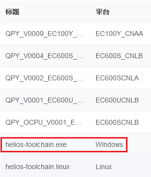
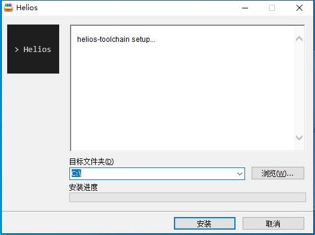
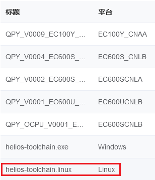
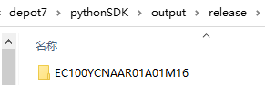
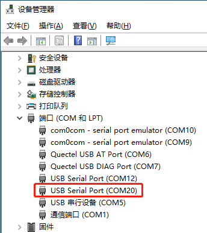
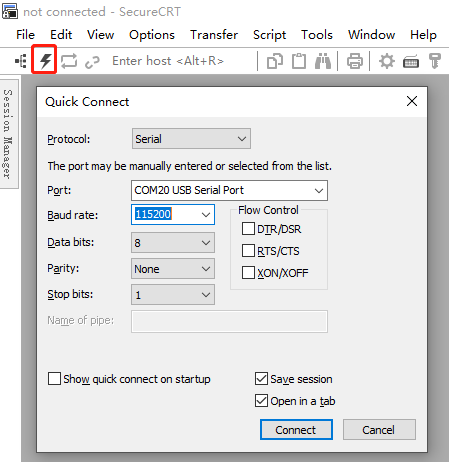
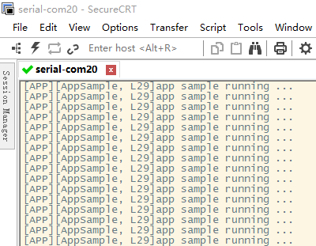



## 文档历史

**修订记录**

| **版本** | **日期**   | **作者** | **变更表述** |
| -------- | ---------- | -------- | ------------ |
| 1.0      | 2021-09-30 | Chic     | 初始版本     |


## SDK概述

Helios SDK（以下简称SDK；Helios，古希腊太阳神）以组件化方式组织，分别包括系统级组件、服务级组件、外设组件及第三方组件。

  * 系统级组件主要包括os、bsp、文件系统、各类网络协议栈、OTA、日志输出等功能。
  * 服务级组件目前包括quecPython功能。
  * 外设组件目前包括camera、NorFlash、LCD等功能。
  * 第三方组件目前包括lvgl、tts等功能。

各组件之间的依赖关系，通过在组件内编译管理的脚本中指定依赖路径即可，下文详述。  
同时各组件功能是否开启，可通过menuconfig进行配置，方便功能裁剪。

## 环境搭建

### Windows 10环境搭建

 **步骤一：下载工具链**

从quecPython官网下载Windows 10环境下的工具链安装包[helios-
toolchain.exe](https://github.com/quecpython/toolchain/releases)，如下图：



 **步骤二：安装工具链**

以管理员身份运行helios-toolchain.exe，如下图，点击安装即可。



> 目标文件夹目前仅限定为`C:\`， **请勿修改** 。

### Ubuntu16.04环境搭建

 **步骤一：下载工具链**

从quecPython官网下载Ubuntu104环境下的工具链安装包[helios-
toolchain.linux](https://github.com/quecpython/toolchain/releases)，如下图：



 **步骤二：安装工具链**

将安装包放置于和预期的目标文件夹相同位置。执行以下命令，即可安装工具链。  
`sudo ./helios-toolchain`

 **步骤三：安装其他工具**

在终端键入以下命令，安装`p7zip-full`、`git`、`make`和`python3`。


```makefile
      sudo apt install p7zip-full git make python3
```


​    

## 代码拉取

在命令行中按照顺序分别执行以下命令，即可拉取完整的SDK代码。


```makefile
   git clone https://gitee.com/quecpython/HeliosSDK.git
   cd HeliosSDK
   git submodule init
   git submodule update
```


​    

## SDK目录结构

下图是SDK目录结构，图中不同颜色分别表示以下含义：

  * 紫色：git仓库相关文件和目录
  * 黄色：SDK固有的文件夹
  * 绿色：SDK中的脚本文件
  * 蓝色：SDK中的源代码文件
  * 粉色：readme.md
  * 灰色：编译生成的文件夹，可被清除
  * 黑色：注释信息


## 应用代码编写

>   * 理论上，可在SDK目录下的任意位置新建应用代码文件。
>   * 实际上， **为了规范起见** ，建议在SDK的根目录下新建应用代码文件夹。
>   * 功能的单元测试代码，建议放置于功能所在目录下的`test`或`demo`文件夹。
>   * SDK建议使用微软的VSCode打开，移远后续将推出针对VSCode的易用插件，敬请期待。

以SDK根目录下的`sample`为例：

 **步骤一：新建应用代码文件夹**

在SDK根目录下新建`sample`文件夹。

 **步骤二：创建应用代码源文件**

进入`sample`文件夹，新建文件`sample.c`。

 **步骤三：编写应用代码**

  * **打开`sample.c`**

  * **包含头文件**   
`sample.c`仅需要包含最基本的头文件，即`helios.h`、`helios_debug.h`、`helios_os.h`。  
`helios.h`目前定义了添加自启动项的接口。  
`helios_debug.h`定义了日志打印的相关接口。  
`helios_os.h`定义了多线程相关接口。

包含头文件的代码如下所示：


```c
  #include "helios.h"
   #include "helios_debug.h"
   #include "helios_os.h"
```


​    

  * **自定义日志打印接口**

> 日志打印接口说明：  
>  `helios_debug.h`提供了如下日志打印相关的接口：  
>  `void Helios_Debug_Enable(void)`：使能日志打印功能。  
>  `void Helios_Debug_Disable(void)`：关闭日志打印功能。  
>  `helios_debug(fmt, ...)`：通用日志输出接口。  
>  `custom_log(tag, fmt, ...)`：可自定义标签的日志输出接口，标签会连同日志一起输出。  
>  默认使能日志打印功能。

在`sample.c`中定义自定义标签的日志输出接口，标签名称为`APP`，代码如下所示：


```c
      #define app_debug(fmt, ...) custom_log(APP, fmt, ##__VA_ARGS__) // custom_log在helios_debug.h中定义
```


​    

  * **实现应用功能**   
    在`sample.c`中实现每一秒钟循环打印一次日志的功能，代码如下所示：


  ```c
      static void AppSample(void *argv)
       {
       	UNUSED(argv); // 在helios.h中定义
       
       	while (1)
       	{
       		app_debug("app sample running ...\r\n"); // 自定义的带标签的日志输出
       		Helios_sleep(1); // 在helios_os.h中定义
       	}
       }
  ```


  * **添加为自启动项**   
    编写完应用功能代码后，调用以下接口，会在系统启动完成后，自动启动应用功能：

    
    ```c
      application_init(AppSample, "AppSample", 2, 0); // 在helios.h中定义
    ```
    
    

> `application_init`接口用法说明  
>  定义：`application_init(entry, name, stack_size_kib, startup_prio)`  
>  参数：`entry` \- 应用代码入口地址  
>  参数：`name` \- 应用名称  
>  参数：`stack_size_kib` \- 应用线程栈大小，以KB（K字节）为单位  
>  参数：`startup_prio` \- 启动优先级，0表示最高优先级

**步骤四：编写编译管控脚本**

  * **新建mk脚本文件**   
在应用代码根目录下（本例为`sample`目录下）新建和应用代码根目录同名的`.mk`文件，本例新建文件为`sample.mk`。

  * **编写mk脚本文件**

> 编译管控脚本的详细写法可参考SDK根目录下的`README.MD`，此处仅针对`sample.c`做阐述。


```makefile
  NAME := SAMPLE # 组件名称，建议和组件根目录名称一致，全部大写
   $(NAME)_SRCS := sample.c # 添加需要编译的源码的相对路径（相对于组件代码根目录，此处相对于sample目录）
   $(NAME)_INCS := . # 仅组件内部可引用的头文件相对路径（相对于组件代码根目录，此处相对于sample目录，其实sample下无头文件，此行可删除） 
   $(NAME)_COMPONENTS := # 当前组件依赖的其他组件相对路径（相对于SDK根目录，置空时可删除此行）
```


​    

至此，应用代码编写完毕。

## 编译和烧录

 **步骤一：查看编译命令用法**

在SDK目录下启动的命令行中，键入`helios`，并回车，查看helios命令的用法。  
输出结果如下：


```makefile
  Usage: helios <action> [<app>] [<at>] [<fw_name>]
     
   These are common commands used in various situations:
      menuconfig                       - Do the project configuration
      make <app> [[<at>] [<fw_name>]]  - Do the compilation work
      private_clean                    - Clean the app private target
      clean                            - Clean the output directory
      help                             - Show this help page
```


​    

> 编译命令的详细用法参考SDK根目录下的`README.MD`。

**步骤二：编译固件**

以EC600SCN_LB模块为例，在命令行中键入以下命令，并回车：


```makefile
  helios make sample @EC600SCN_LB EC600SCNLBR01A01M08
```


​    

  * `helios`：触发编译流程。
  * `make`：表示编译固件。
  * `sample`：应用入口地址（相对于SDK根目录）。
  * `@EC600SCN_LB`：指定目标模块型号，可缺省，缺省值为`@EC200UCN_AA`。
  * `EC600SCNLBR01A01M08`：固件版本号名称，可缺省，以指定的应用代码的根目录名称作为缺省值。

如需清除编译目标，在命令行中键入以下命令，并回车：


```makefile
 helios clean
```


​    

 **步骤三：查看编译目标**

生成的固件包存储于SDK根目录下的`output/release`文件夹中，如下图所示。



 **步骤四：烧录固件**

固件烧录请参考《Quectel_QFlash_用户指导》。

## 功能测试

 **步骤一：连接PC和模块**

用串口线缆将模块的Debug串口和PC连接。

 **步骤二：查看PC端的Debug串口号**

打开PC的设备管理器，如下图，本实验的Debug串口号为COM20。



 **步骤三：打开PC端的串口调试工具**

本文以SecureCRT为例，点击下图的快速连接按钮，弹出`Quick Connect`窗口。  
点击`Port`选项的下拉菜单，选中COM20，其余参数严格遵照图中的配置即可。  
点击右下角`Connect`按钮即可打开串口。



 **步骤四：启动模块程序**

复位模块，启动程序

 **步骤五：查看模块运行日志**

在SecureCRT的串口数据接收区查看运行日志，如下图：



上图可看出，日志输出的格式包含了自定义标签`APP`、输出日志的函数名`AppSample`、输出日志的文件行数`L29`，及日志内容`app sample
running ...`。

