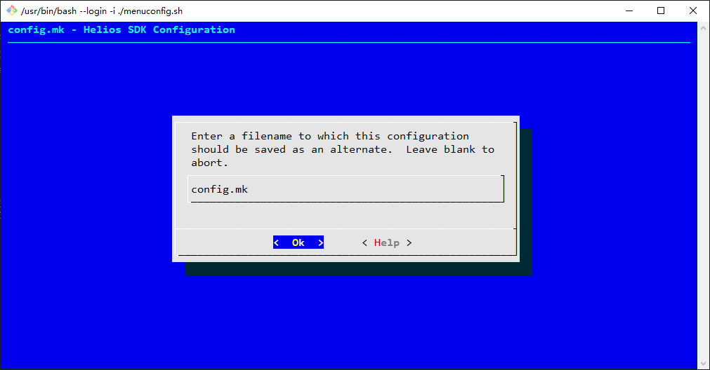

## 文档历史

**修订记录**

| **版本** | **日期**   | **作者** | **变更表述** |
| -------- | ---------- | -------- | ------------ |
| 1.0      | 2021-09-30 | Chic     | 初始版本     |


## menuconfig

menuconfig，顾名思义，具有menu和config的双重含义，即基于菜单式的配置。

### menuconfig操作说明

####  界面说明

在命令行中键入`helios menuconfig`，即可启动配置菜单，如图所示：


图中可见，menuconfig主要由4部分组成，即 **标题** 、 **使用说明** 、 **菜单列表** 和 **操作按键** 。

  * **标题：** 图中最上方深蓝色背景上的一排浅蓝色字样`config.mk - Helios SDK Configuration`。
  * **使用说明：** 图中灰色背景上最上面三排字样，指导用户如何操作menuconfig。
  * **菜单列表：** 图中灰色背景上置于下凹框内的两排字样，即`System Configuration --->`和`quecPython Configuration --->`。
  * **操作按键：** 图中最下方一排，由尖括号括起来的字样，即`<Select> < Exit > < Help > < Save > < Load >`。

#### 操作说明

menuconfig只能使用键盘操作：

  * **上下键：** 用来选中不同的菜单。
  * **左右键：** 用来选中不同的操作按键。
  * **回车键：** 用来进入下级菜单，或触发执行操作按键的功能。
  * **空格键：** 用来打开或关闭选中的菜单功能。
  * **Esc：** 双击该键，用来返回上级菜单，在菜单根目录下执行该操作，将会退出menuconfig。

比如，按下 **回车键** 进入`System Configuration`，可以看到mbedtls功能被打开，如下图所示：


`[*] Enable mbedtls`菜单中，中括号里的`*`表示mbedtls功能被打开；按下 **空格键**，星号消失，表示mbedtls功能被关闭。

####  保存配置

修改完配置后，可通过以下三种方式保存配置。

  * i. 在配置菜单界面，通过`左右键`选中界面下方的`<Save>`，按下`回车键`，弹出下图所示的界面后，选中`<OK>`后，即可保存配置。   

> 配置文件的名称 **禁止修改** ，因为其他的脚本文件会按照此名称寻找配置。否则，会找不到配置文件。




  * ii. 在配置菜单界面，通过多次双击`Esc`按键，直到退出menuconfig。退出时，如果检测到有未保存的配置项，依然会弹出上图的保存界面，遵照第i点的操作即可。

  * iii. 在配置菜单界面，通过不断选中并执行`<Exit>`功能，直到退出menuconfig。退出时，如果检测到有未保存的配置项，依然会弹出上图的保存界面，遵照第i点的操作即可。

#### 取消保存配置

在进入到本章1.1.3节所示的保存配置界面后，如果需要取消保存配置，双击`Esc`按键即可。

####  配置文件

配置文件会保存在SDK根目录下的config文件夹，保存的文件名为`autoconf.h`和`config.mk`。

  * `autoconf.h`用来被C语言调用；开发者直接在代码中引用该文件中的宏定义即可，无需include该头文件，编译脚本会自动将该文件include到被编译的C文件中。

  * `config.mk`用来被编译脚本调用。

  * SDK已经默认打开了mbedtls的功能。

对应的`autoconf.h`的内容如下：


```c
   /*
    *
    * Automatically generated file; DO NOT EDIT.
    * Helios SDK Configuration
    *
    */
   #define CONFIG_MBEDTLS 1
```


对应的`config.mk`的内容如下：


```makefile
   #
   # Automatically generated file; DO NOT EDIT.
   # Helios SDK Configuration
   #
   #
   # System Configuration
   #
   CONFIG_MBEDTLS=y

   #
   # quecPython Configuration
   #
   # CONFIG_LVGL is not set
   # CONFIG_QRCODE is not set
   # CONFIG_POC is not set
   # CONFIG_CAMERA is not set
```


### system配置

本章第1节也已提及，system配置项当前仅包含mbedtls。

当应用中需要用到加密算法或加密网络通信功能时，须开启该功能。

quecPython中使用mbedtls的功能，因此编译quecPython功能的固件时，必须开启该功能。


### quecPython配置

quecPython配置菜单如下图所示：


此4类功能菜单，用以配置quecPython固件是否包含lvgl界面、二维码扫码、对讲机、摄像头等功能。

## quecPython固件编译

用户根据实际需求，使用menuconfig对quecPython支持的功能进行配置。

本例使用menuconfig默认配置，以EC600SCN_LB模块为例，在命令行中键入以下命令，并回车：


```makefile
helios make services\microPython @EC600SCN_LB EC600SCNLBR01A01M08
```


>   * 应用入口地址`services\microPython`的路径分隔符，遵照主机系统的要求，win32平台为`\`，linux平台为`/`。
>   * 编译命令的用法参考《Helios SDK指南(1)--入门》。
>   * 固件烧录请参考《Quectel_QFlash_用户指导》。
>

## quecPython交互体验

 **步骤一：连接PC和开发板**

将quecPython开发板通过Type-C USB接口连接至PC。

 **步骤二：模块开机**

如下图所示，长按开发板背面左下角的`PWK`按钮，执行开机动作，启动开发板中的程序。 

开机成功后，开发板背面右上角的网络灯闪烁，表示开机成功。


> 开发板按键说明： 
>
> `PWK`：开机按键，长按开机
>
> `RST`：复位按键，按下后重启模块 
>
> `BOOT`：按下后进入固件烧录模式 
>
> `KEY1`、`KEY2`：提供给用户开发的按键

**步骤三：打开USB串行设备端口**

打开设备管理器，展开`端口`一栏，找到`USB串行设备`，记住其串口号。本例为COM5，如下图所示：


参考《Helios SDK指南(1)--入门》第7节步骤三，打开COM5。

 **步骤四：quecPython命令交互**

在SecureCRT的数据接收区敲下回车键，界面上回显出Python特有的命令交互提示符`>>>`。

此时，我们使用Python的`print`函数做个打印操作，在SecureCRT中键入以下代码：


```python
print ('Hello, QuecPython!')
```


执行结果如下图所示：


此时，我们已经使用quecPython做了第一个最简单的应用开发。

quecPython更多的功能探索和接口使用，请访问[官方Wiki](https://python.quectel.com/wiki/#/)。

