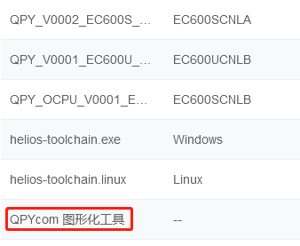
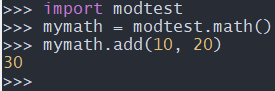

## 文档历史

**修订记录**

| **版本** | **日期**   | **作者** | **变更表述** |
| -------- | ---------- | -------- | ------------ |
| 1.0      | 2021-09-30 | Chic     | 初始版本     |


## 从QuecPython文件系统执行脚本文件

本节向大家展示如何将自己编写的Python脚本文件导入模块中运行。

### 安装QPYcom工具

进入[官方下载页面](https://python.quectel.com/download)，下载`QPYcom图像化工具`，如下图所示：



下载完成后解压即可使用。

> 详细的使用说明，参考工具根目录下的`docs\Quectel QuecPython_QPYcom工具使用说明.docx`。

### 编写Python脚本文件

在PC中编写名为`QuecPython_demo.py`的脚本文件，内容如下：


```python
   import uos
     
   print ('Hello, QuecPython!')
     
   root_list = uos.listdir('') # show file list under root dir
   print ('root_list:', root_list)
     
   usr_list = uos.listdir('usr') # show file list under /usr
   print ('usr_list:', usr_list)
```


### 将Python脚本文件导入QuecPython文件系统

 **步骤一：打开QPYcom工具**

双击工具根目录下的`QPYcom.exe`打开工具。

 **步骤二：打开USB串行设备端口**

根据《Helios SDK指南(2)--进阶》第3节步骤三，在QPYcom工具的`选择串口`下拉菜单中，选中对应的端口，本例为COM5。 
点击`打开串口`即可，默认进入命令交互界面。 
效果如下图所示：


 **步骤三：进入文件传输界面**

点击`文件`标签，进入文件传输界面，如下图所示：


上图可见，界面的左侧是PC本地的文件列表，右侧是模块端文件列表。 
模块端QuecPython启动后，会自动生成一个名为`system_config.json`的文件，用户可暂时先不了解该文件的作用。

 **步骤四：导入Python脚本文件**

点击模块端文件列表上方的`+`按钮，向模块传输文件。

如下图所示，按照1、2、3的顺序，即可向文件系统导入`QuecPython_demo.py`文件。


导入完成后，可见模块端文件列表中新增了`QuecPython_demo.py`文件，如下图所示：


### 执行导入的脚本文件

点击`交互`标签，进入之前的命令交互界面。

在命令交互界面先后键入以下两行命令：


```python
   import example
   example.exec('/usr/QuecPython_demo.py')
```


命令执行完成后，可在界面上看到以下输出内容：


至此，`QuecPython_demo.py`被成功执行，`usr_list`中也显示了新导入的脚本文件。

### 从main.py自动启动应用脚本

通过上面的学习，已经知道如何向QuecPython文件系统导入脚本文件，并且通过命令触发脚本的执行。  
但是QuecPython可以通过在开机后自动执行`main.py`的方式，自动启动应用脚本。

 **步骤一：编写main.py文件**

在PC中编写一个名为`main.py`的脚本文件，内容如下：


```python
   import utime
     
   if __name__ == '__main__':
       while True:
           print('Hello, QuecPython!')
           utime.sleep(1)
```


 **步骤二：导入main.py文件至模块文件系统**

使用本章1.3节的方法，将`main.py`文件导入至模块文件系统。

 **步骤三：重启模块**

重新模块，以期在启动后能够自动执行`main.py`。

 **步骤四：重新连接USB串行设备端口**

由于模块重启后，原先使用QPYcom打开的USB串行设备端口会和PC断开连接。  
参照本章1.3节步骤二，重新连接该口。

 **步骤五：观察执行结果**

重新连接USB串行设备端口后，命令交互界面会每间隔1s钟，周期性打印`Hello, QuecPython!`。  
说明main.py脚本已经成功自启动。


##  基于Python语言编写py模块

QuecPython基于Python语言编写的模块统一存放于`services\microPython\ports\quectel\core`路径下。

下面以编写一个名为`hello.py`的模块为例演示如何在QuecPython中基于Python语言编写py模块。

 **步骤一：新建hello.py文件**

在`services\microPython\ports\quectel\core`目录下新建`hello.py`文件。

 **步骤二：编写文件内容**

在新建的`hello.py`文件中，编写以下内容：


```python
   def say_hello(name):
       print ('Hello,', name)
```


 **步骤三：修改编译脚本**

打开`services\microPython\ports\quectel\core\Makefile`，分别在`$(BUILD)/_frozen_mpy.c`的依赖文件和执行命令中添加`$(BUILD)/hello.mpy
\`，如下图所示：


> 注意`$(BUILD)/hello.mpy \`最后的反斜杠`\`。 
>  在Makefile中，将一条命令拆分为多行时，需要在最后加上反斜杠`\`，并且`\`后不能有任何字符，包括空格。

**步骤四：编译QuecPython固件**

因为`services\microPython\ports\quectel\core`下的脚本文件是以二进制的形式被编译到固件包，作为内建库存在的，因此需要执行编译命令，编译新的固件包。

编译命令参考《Helios SDK指南(2)--进阶》第2节。

 **步骤五：烧录固件并验证功能**

将固件烧录至模块并重启后，打开QPYcom。
在交互串口输入以下两条命令：


```python
   import hello
   hello.say_hello('QuecPython')
```


执行结果如下图所示：


由图可见，我们已经拥有了自己编写的`hello`模块，`hello.say_hello(name)`方法也成功执行。

## 基于C语言编写py模块

有些需求可能无法通过使用Python语言编写py模块来实现，比如对执行速度有要求的一些算法，亦或是自己扩展的一些外设驱动等。

本节我们来演示如何基于C语言编写py模块。

### 模块接口层级分类


从上图可以看出，QuecPython模块接口层级可以分为三大类：`module`、`type`和`function`。

三者之间的层级关系也显而易见：

  * QuecPython下可以有多个module。
  * 每个module下可以有多个type或function。
  * 每个type下可以有多个function。

以`machine`模块为例，`machine.Pin`和`machine.UART`都属于type类型。  
type类下就是具体的函数了，比如`Pin.value()`用来设定GPIO的高低电平。

我们可以在QPYcom的交互窗口中，依次输入以下命令，查看各自的类型：


```python
   import machine
   type(machine)
   type(machine.Pin)
   type(machine.Pin.value)
```


输出结果如下图所示，验证了上面的论述。


有了以上的层级分类的概念后，套用microPython提供的各类接口定义的模板即可进行C语言的py模块编写。

### 添加module

 **步骤一：新建modtest.c文件**

进入`services\microPython\ports\quectel\core\source`目录，新建`modtest.c`文件。

> `services\microPython\ports\quectel\core\source`目录存放了所有quectel添加的C语言实现的py模块。

```python
   #include <stdint.h>
   #include <stdio.h>
     
   #include "obj.h"
   #include "runtime.h"
     
   /* 定义的modtest全局字典，之后我们添加type和function就要添加在这里 */
   STATIC const mp_rom_map_elem_t modtest_globals_table[] = {
       {MP_OBJ_NEW_QSTR(MP_QSTR___name__), MP_ROM_QSTR(MP_QSTR_modtest)},   //这个对应python层面的__name__ 属性
   };
     
   /* 把modtest_globals_table注册到 mp_module_modtest_globals里面去 */
   STATIC MP_DEFINE_CONST_DICT(mp_module_modtest_globals, modtest_globals_table);   
     
   /* 定义一个module类型 */
   const mp_obj_module_t mp_module_modtest = {
       .base = {&mp_type_module},    
       .globals = (mp_obj_dict_t *)&mp_module_modtest_globals,
   };
```


以上代码可以看出，`modtest.c`主要由三个部分组成，此三部分是添加一个module的必选项：

  * `mp_rom_map_elem_t modtest_globals_table[ ]`
  * `MP_DEFINE_CONST_DICT(mp_module_modtest_globals, modtest_globals_table)`
  * `mp_obj_module_t mp_module_modtest`

**步骤二：将modtest模块注册到QuecPython中**

打开`services\microPython\ports\quectel\core\source\mpconfigport.h`。

找到`MICROPY_PORT_BUILTIN_MODULES`定义的地方，在它的前面对`mp_module_modtest`做外部引用声明。

参考`MICROPY_PORT_BUILTIN_MODULES`定义的格式，注册`modtest`模块。

完成后的代码如下：


```python
  extern const struct _mp_obj_module_t mp_module_wifiscan;
    
  extern const struct _mp_obj_module_t mp_module_modtest; //对`mp_module_modtest`做外部引用声明
    
  #define MICROPY_PORT_BUILTIN_MODULES \
          { MP_OBJ_NEW_QSTR(MP_QSTR_uos), (mp_obj_t)&uos_module }, \
          { MP_OBJ_NEW_QSTR(MP_QSTR_machine), (mp_obj_t)&mp_module_machine }, \
          { MP_OBJ_NEW_QSTR(MP_QSTR_usocket), (mp_obj_t)&mp_module_usocket }, \
          { MP_OBJ_NEW_QSTR(MP_QSTR_misc), (mp_obj_t)&mp_module_misc}, \
           { MP_OBJ_NEW_QSTR(MP_QSTR_osTimer), (mp_obj_t)&mp_ostimer_type}, \
           { MP_OBJ_NEW_QSTR(MP_QSTR_example), (mp_obj_t)&example_module }, \
           { MP_OBJ_NEW_QSTR(MP_QSTR_dial), (mp_obj_t)&mp_module_dial}, \
           { MP_OBJ_NEW_QSTR(MP_QSTR_modem), (mp_obj_t)&mp_module_modem}, \
           { MP_OBJ_NEW_QSTR(MP_QSTR_utime), (mp_obj_t)&utime_module }, \
           { MP_OBJ_NEW_QSTR(MP_QSTR_utils), (mp_obj_t)&mp_module_utils},\
           { MP_OBJ_NEW_QSTR(MP_QSTR_hmacSha1), (mp_obj_t)&mp_module_hmacSha1}, \
           { MP_OBJ_NEW_QSTR(MP_QSTR_sms), (mp_obj_t)&mp_module_sms}, \
           { MP_OBJ_NEW_QSTR(MP_QSTR_sim), (mp_obj_t)&mp_module_sim}, \
           { MP_OBJ_NEW_QSTR(MP_QSTR_pm), (mp_obj_t)&mp_module_pm}, \
           { MP_OBJ_NEW_QSTR(MP_QSTR_net), (mp_obj_t)&mp_module_net}, \
           { MP_OBJ_NEW_QSTR(MP_QSTR_cellLocator), (mp_obj_t)&mp_module_celllocator}, \
           { MP_OBJ_NEW_QSTR(MP_QSTR_wifiScan), (mp_obj_t)&mp_module_wifiscan},\
           { MP_OBJ_NEW_QSTR(MP_QSTR_modtest), (mp_obj_t)&mp_module_modtest }, /* 注册`modtest`模块 */ \
           MICROPY_PORT_BUILTIN_MODULES_FOTA \
           MICROPY_PORT_BUILTIN_MODULES_LVGL 
```


上述代码带注释的行，即为我们新增部分。

>   *
> C语言宏定义`MICROPY_PORT_BUILTIN_MODULES`，由于定义内容篇幅较长，使用反斜杠`\`进行换行，`\`后不能有任何字符，包括空格，该点和前面所述的Makefile的换行方法是一致的；如需注释，注释内容使用`/*
> */`括起来，并且放在`\`前。
>   *
> `MICROPY_PORT_BUILTIN_MODULES`宏定义的最后两行的格式和前面不同，这是使用宏定义的方式，方便对相关功能进行裁剪。感兴趣的小伙伴可以深入研究下。
>

**步骤三：将`modtest.c`文件添加到编译脚本**

打开`services\microPython\ports\quectel\core\Makefile`文件，参照以下代码的第7行，添加`modtest.c`文件：


```
   SRC_QSTR += source/moduos.c \
               source/QuecPython.c \
               source/utf8togbk.c \
               ... \
               source/modlvgl.c \
               source/modwifiscan.c \
               source/modtest.c # 添加modtest.c文件
     
   ifeq ($(strip $(PLAT)),ASR)
   SRC_QSTR += source/modfota.c
   endif
```


> 如果Makefile的当前行存在换行符`\`，并且下一行不是空行，在当前行的`\`的前 **禁止**
> 添加注释。否则，make系统会将以下跟换行符`\`连接的各行当成注释。 
>  上述代码，由于注释在换行的最后一行，因此可以添加注释。

打开`services\microPython\microPython.mk`文件，为`$(NAME)_SRCS`变量增加值`ports/quectel/core/source/modtest.c`，即下面代码的第7行。


```
   $(NAME)_SRCS = \
       extmod/modubinascii.c \
       extmod/moducryptolib.c \
       extmod/moductypes.c \
       ... \
       ports/quectel/core/source/modwifiscan.c \
       ports/quectel/core/source/modtest.c \
       ports/quectel/core/build/_frozen_mpy.c \
       ...
```


 **步骤四：编译固件**

参考《Helios SDK指南(2)--进阶》第2节，编译出新的QuecPython固件。

 **步骤五：烧录固件并验证功能**

参考《Quectel_QFlash_用户指导》，烧录固件。

烧录完成后，重启模块，打开QPYcom，依次输入以下命令：


```python
   import modtest
   type(modtest)
   dir(modtest)
```


QPYcom上会得到如图所示的输出：


由图可见，`modtest`模块已经成功添加，但是没有添加任何type和function。

### 给module添加function

函数分为无参数和有参数两类，接下来会为`modtest`分别添加一个无参数、一个有参数的函数。 
在Python中对应两个方法，即`modtest.func_noargs()`和`modtest.func_withargs(argv)`

#### 无参数的function

此处我们增加一个C函数实现的方法`mp_obj_t modtest_func_noargs(void)`。 
功能：在命令交互口输入`modtest.func_noargs()`，输出字符串`here we go`。

 **步骤一：修改代码**

打开`services\microPython\ports\quectel\core\source\modtest.c`文件，对代码做修改。

完整的代码如下：


```
  #include <stdint.h>
  #include <stdio.h>
  #include <string.h>
    
  #include "obj.h"
  #include "runtime.h"
    
  #include "mphal.h"
    
   /* modtest module下不带参数的函数定义 */
   STATIC mp_obj_t modtest_func_noargs(void)
   {
       mp_hal_stdout_tx_strn("here we go\n", strlen("here we go\n"));
       return mp_const_none; //python函数中不需要返回数据，就返回mp_const_none
   }
     
   /* 注册function对象modtest_obj_func_noargs */
   STATIC const MP_DEFINE_CONST_FUN_OBJ_0(modtest_obj_func_noargs, modtest_func_noargs);
     
   /* 定义的modtest全局字典，之后我们添加type和function就要添加在这里 */
   STATIC const mp_rom_map_elem_t modtest_globals_table[] = {
       {MP_OBJ_NEW_QSTR(MP_QSTR___name__), MP_ROM_QSTR(MP_QSTR_modtest)}, //这个对应python层面的__name__ 属性
       {MP_OBJ_NEW_QSTR(MP_QSTR_func_noargs), MP_ROM_PTR(&modtest_obj_func_noargs)}, //新增的modtest_obj_func_noargs对象注册到modtest中
   };
     
   /* 把modtest_globals_table注册到 mp_module_modtest_globals里面去 */
   STATIC MP_DEFINE_CONST_DICT(mp_module_modtest_globals, modtest_globals_table);
     
   /* 定义一个module类型 */
   const mp_obj_module_t mp_module_modtest = {
       .base = {&mp_type_module},    
       .globals = (mp_obj_dict_t *)&mp_module_modtest_globals,
   };
```


下图的差异比较，可以看出该段代码和本章3.2节代码的差异（右侧为当前代码，红色是差异部分）：

  * 新增了Python模块`modtest`的方法`modtest.func_noargs()`对应的C语言功能函数`modtest_func_noargs`。凡是Python对应的C语言功能函数，一律返回`mp_obj_t`类型。该示例中，`modtest.func_noargs()`方法无返回值，故对应的C函数中需返回`mp_const_none`，以此告知Python该方法无返回值。
  * 使用宏`MP_DEFINE_CONST_FUN_OBJ_0`将增加一个function对象`modtest_obj_func_noargs`，即第18行代码。
  * 将新增的`modtest_obj_func_noargs`对象注册到modtest中，即第23行代码。


**步骤二：验证功能**

步骤一完成后，可直接编译和烧录，无需再修改脚本文件。

烧录完成后，重启模块，打开QPYcom，输入以下命令：


```python
   import modtest
   dir(modtest)
   modtest.func_noargs()
```


执行结果如下图所示：


由图可见，`dir(modtest)`的执行结果，已经列出了`func_noargs`方法。
执行`modtest.func_noargs()`，输出了预期的`here we go`字符串。

#### 有参数的function

此处我们增加一个C函数实现的方法`mp_obj_t modtest_func_withargs(mp_obj_t argv)`。
功能：在命令交互口输入`modtest.func_withargs('Bingo')`，输出字符串`Bingo, here we go`。

 **步骤一：修改代码**

打开`services\microPython\ports\quectel\core\source\modtest.c`文件，对代码做修改。

完整的代码如下：


```
  #include <stdint.h>
  #include <stdio.h>
  #include <string.h>
    
  #include "obj.h"
  #include "runtime.h"
    
  #include "mphal.h"
    
   /* modtest module下不带参数的函数定义 */
   STATIC mp_obj_t modtest_func_noargs(void)
   {
       mp_hal_stdout_tx_strn("here we go\n", strlen("here we go\n"));
       return mp_const_none; //python函数中不需要返回数据，就返回mp_const_none
   }
     
   /* 注册function对象modtest_obj_func_noargs */
   STATIC const MP_DEFINE_CONST_FUN_OBJ_0(modtest_obj_func_noargs, modtest_func_noargs);
     
   /* modtest module下带参数的函数定义 */
   STATIC mp_obj_t modtest_func_withargs(mp_obj_t str)
   {
       char reply_str[64] = {0};
     
       /*
        * 此处调用`mp_obj_str_get_str(str)`从参数`str`中提取出用户从Python层输入的字符串参数
        * 如果用户期望Python传递进来的参数是整数，则调用mp_obj_get_int(data)来提取出来整数
        */
       snprintf(reply_str, sizeof(reply_str), "%s, here we go\n", mp_obj_str_get_str(str));
       mp_hal_stdout_tx_strn(reply_str, strlen(reply_str));
       return mp_const_none;  //同样没有返回值
   }
     
   /*
    * 这里使用的宏定义和前面的名称不一样，后缀是1，不是0
    * 后缀是几，表示该方法携带几个参数
    */
   STATIC const MP_DEFINE_CONST_FUN_OBJ_1(modtest_obj_func_withargs, modtest_func_withargs);
     
   /* 定义的modtest全局字典，之后我们添加type和function就要添加在这里 */
   STATIC const mp_rom_map_elem_t modtest_globals_table[] = {
       {MP_OBJ_NEW_QSTR(MP_QSTR___name__), MP_ROM_QSTR(MP_QSTR_modtest)}, //这个对应python层面的__name__ 属性
       {MP_OBJ_NEW_QSTR(MP_QSTR_func_noargs), MP_ROM_PTR(&modtest_obj_func_noargs)}, //新增的modtest_obj_func_noargs对象注册到modtest中
       {MP_OBJ_NEW_QSTR(MP_QSTR_func_withargs), MP_ROM_PTR(&modtest_obj_func_withargs)}, //新增的modtest_obj_func_withargs对象注册到modtest中
   };
     
   /* 把modtest_globals_table注册到 mp_module_modtest_globals里面去 */
   STATIC MP_DEFINE_CONST_DICT(mp_module_modtest_globals, modtest_globals_table);
     
   /* 定义一个module类型 */
   const mp_obj_module_t mp_module_modtest = {
       .base = {&mp_type_module},    
       .globals = (mp_obj_dict_t *)&mp_module_modtest_globals,
   };
```


下图的差异比较，可以看出该段代码和本章3.3.1节代码的差异（右侧为当前代码，红色是差异部分）：

  * 新增了Python模块`modtest`的方法`modtest.func_withargs(str)`对应的C语言功能函数`modtest_func_withargs`。该示例中，使用`mp_obj_str_get_str(str)`获取用户从Python层输入的字符串参数。
  * 使用宏`MP_DEFINE_CONST_FUN_OBJ_1`将增加一个function对象`modtest_obj_func_withargs`，即第38行代码。
  * 将新增的`modtest_obj_func_withargs`对象注册到modtest中，即第44行代码。


**步骤二：验证功能**

步骤一完成后，可直接编译和烧录，无需再修改脚本文件。

烧录完成后，重启模块，打开QPYcom，输入以下命令：


```python
   import modtest
   dir(modtest)
   modtest.func_withargs('Bingo') # with argv: 'Bingo'
```


执行结果如下图所示：


由图可见，`dir(modtest)`的执行结果，已经列出了`func_withargs`方法。 
执行`modtest.func_withargs('Bingo')`，输出了预期的`Bingo, here we go`字符串。

### 给module添加type

本节我们为`modtest`添加一个名为`math`的type。

 **步骤一：新建modtest_math.c文件**

进入`services\microPython\ports\quectel\core\source`目录，新建`modtest_math.c`文件。


```python
   #include <stdint.h>
   #include <stdio.h>
     
   #include "obj.h"
   #include "runtime.h"
     
   /* 定义type的本地字典 */
   STATIC const mp_rom_map_elem_t math_locals_dict_table[] = {
   };
     
   /* 把math_locals_dict_table注册到math_locals_dict里面去 */
   STATIC MP_DEFINE_CONST_DICT(math_locals_dict, math_locals_dict_table);
     
   /* 定义mp_obj_type_t类型的结构体；注意这里和定义module使用的类型是不一样的 */
   const mp_obj_type_t modtest_math_type = {
       .base={ &mp_type_type }, 
       .name = MP_QSTR_math, //type类的name属性是放在这里定义，而不是放在DICT中
       .locals_dict = (mp_obj_dict_t*)&math_locals_dict, //注册math_locals_dict
   };
```


以上代码可以看出，`modtest_math.c`主要由三个部分组成，此三部分是添加一个type的必选项：

  * `mp_rom_map_elem_t math_locals_dict_table[ ]`
  * `MP_DEFINE_CONST_DICT(math_locals_dict, math_locals_dict_table)`
  * `mp_obj_type_t modtest_math_type`

和添加module的代码比较发现：

  * 二者都是由三部分组成。
  * 定义字典和注册字典的方式完全相同，区别只是变量名不同。
  * 定义module用的是结构体`mp_obj_module_t`，定义type用的是结构体`mp_obj_type_t`。

**步骤二：将`modtest_math.c`文件添加到编译脚本**

该步和本章3.2节步骤三完全相同。

打开`services\microPython\ports\quectel\core\Makefile`文件，参照以下代码的第7、8两行，添加`modtest_math.c`文件：


```
   SRC_QSTR += source/moduos.c \
               source/QuecPython.c \
               source/utf8togbk.c \
               ... \
               source/modlvgl.c \
               source/modwifiscan.c \
               source/modtest.c \
               source/modtest_math.c # 添加modtest_math.c文件
     
   ifeq ($(strip $(PLAT)),ASR)
   SRC_QSTR += source/modfota.c
   endif
```


> 注意：在该脚本中增加`source/modtest_math.c`时，需要把前一行`source/modtest.c`后的注释删除掉，加上反斜杠`\`。

打开`services\microPython\microPython.mk`文件，为`$(NAME)_SRCS`变量增加值`ports/quectel/core/source/modtest.c`，即下面代码的第8行。


```
   $(NAME)_SRCS = \
       extmod/modubinascii.c \
       extmod/moducryptolib.c \
       extmod/moductypes.c \
       ... \
       ports/quectel/core/source/modwifiscan.c \
       ports/quectel/core/source/modtest.c \
       ports/quectel/core/source/modtest_math.c \
       ports/quectel/core/build/_frozen_mpy.c \
       ...
```


 **步骤三：为modtest注册modtest_math_type**

打开`services\microPython\ports\quectel\core\source\modtest.c`文件。

在`mp_rom_map_elem_t modtest_globals_table[ ]`前加入`modtest_math_type`的引用声明。

在`mp_rom_map_elem_t modtest_globals_table[ ]`内注册`modtest_math_type`。

修改后的代码如下：


```
   /* 定义的modtest全局字典，之后我们添加type和function就要添加在这里 */
   extern const mp_obj_type_t modtest_math_type;
   STATIC const mp_rom_map_elem_t modtest_globals_table[] = {
       {MP_OBJ_NEW_QSTR(MP_QSTR___name__), MP_ROM_QSTR(MP_QSTR_modtest)}, //这个对应python层面的__name__ 属性
       {MP_OBJ_NEW_QSTR(MP_QSTR_func_noargs), MP_ROM_PTR(&modtest_obj_func_noargs)}, //新增的modtest_obj_func_noargs对象注册到modtest中
       {MP_OBJ_NEW_QSTR(MP_QSTR_func_withargs), MP_ROM_PTR(&modtest_obj_func_withargs)}, //新增的modtest_obj_func_withargs对象注册到modtest中
       {MP_OBJ_NEW_QSTR(MP_QSTR_math), MP_ROM_PTR(&modtest_math_type)}, //注册modtest_math_type
   };
```


和修改之前相比，仅增加了上述代码的第2行和第7行。

 **步骤四：验证功能**

步骤三完成后，可直接编译和烧录。

烧录完成后，重启模块，打开QPYcom，输入以下命令：


```python
   import modtest
   dir(modtest)
   type(modtest.math)
```


执行结果如下图所示：


由图可见，我们成功添加了一个名为`math`的type。

### 给type添加function

本节演示如何给type添加function。
和给module添加的function一样，也分为无参数和有参数两种。

#### 无参数的function

此处我们增加一个C函数实现的方法`mp_obj_t math_nothing(void)`。
功能：在命令交互口输入`modtest.math.nothing()`，输出字符串`do nothing in this function`。

 **步骤一：修改代码**

打开`services\microPython\ports\quectel\core\source\modtest_math.c`文件，对代码做修改。

完整的代码如下：


```python
  #include <stdint.h>
  #include <stdio.h>
  #include <string.h>
    
  #include "obj.h"
  #include "runtime.h"
    
  #include "mphal.h"
    
   /* modtest_math_type下不带参数的函数定义 */
   STATIC mp_obj_t math_nothing(void)
   {
       mp_hal_stdout_tx_strn("do nothing in this function\n", strlen("do nothing in this function\n"));
       return mp_const_none; //python函数中不需要返回数据，就返回mp_const_none
   }
     
   /* 注册function对象math_nothing_obj */
   STATIC MP_DEFINE_CONST_FUN_OBJ_0(math_nothing_obj, math_nothing);
     
   /* 定义type的本地字典 */
   STATIC const mp_rom_map_elem_t math_locals_dict_table[] = {
       { MP_ROM_QSTR(MP_QSTR_nothing), MP_ROM_PTR(&math_nothing_obj) }, //新增的math_nothing_obj对象注册到modtest_math_type中
   };
     
   /* 把math_locals_dict_table注册到math_locals_dict里面去 */
   STATIC MP_DEFINE_CONST_DICT(math_locals_dict, math_locals_dict_table);
     
   /* 定义mp_obj_type_t类型的结构体；注意这里和定义module使用的类型是不一样的 */
   const mp_obj_type_t modtest_math_type = {
       .base={ &mp_type_type }, 
       .name = MP_QSTR_math, //type类的name属性是放在这里定义，而不是放在DICT中
       .locals_dict = (mp_obj_dict_t*)&math_locals_dict, //注册math_locals_dict
   };
```


下图的差异比较，可以看出该段代码和修改之前的差异（右侧为当前代码，红色是差异部分）：


可以看到，type中添加无参数function的方法和在module中是一样的，不做过多解释。

 **步骤二：验证功能**

步骤一完成后，可直接编译和烧录，无需再修改脚本文件。

烧录完成后，重启模块，打开QPYcom，输入以下命令：


```python
   import modtest
   dir(modtest.math)
   modtest.math.nothing()
```


执行结果如下图所示：


由图可见，执行`modtest.math.nothing()`，输出了预期的`do nothing in this function`字符串。

#### 有参数的function

type中添加一个带参数的function，和在module中大不相同。

type类型在Python中是类，而要操作带参数的函数就需要实例化一个对象出来：比如`mymath=modtest.math()`，那么对应到C语言必须要有对应的分配空间、创建对象的函数和表示对象的结构体。

此处，我们实现的功能为：通过`modtest.math()`在Python层创建一个对象`mymath`，执行其加法运算的方法`mymath.add(10,
20)`，期望输出结果`30`。

 **步骤一：定义`math_obj_t` 结构体**

在`services\microPython\ports\quectel\core\source\modtest_math.c`中添加`math_obj_t`
结构体，用来表示math对象的结构：


```
   /* 定义math_obj_t结构体 */
   typedef struct _math_obj_t
   {
       mp_obj_base_t base;   //定义的对象结构体要包含该成员
       uint16_t value1;      //下面的成员，根据需要自己添加
       uint16_t value2;
   }math_obj_t;
```


 **步骤二：为`modtest_math_type`添加`.make_new`属性，及对应的函数**

代码如下：


```
  /* make new 创建一个实例对象的函数，对应Python中的mymath = modtest.math()，创建mymath对象 */
  const mp_obj_type_t modtest_math_type;
  STATIC mp_obj_t modtest_math_make_new(const mp_obj_type_t *type, size_t n_args, size_t n_kw, const mp_obj_t *args)
  {
      mp_arg_check_num(n_args, n_kw, 0, 0, true);   //检查参数个数
      math_obj_t *self = m_new_obj(math_obj_t);     //创建对象，分配空间
      self->base.type = &modtest_math_type;         //定义对象的类型
      return MP_OBJ_FROM_PTR(self);                 //返回对象的指针
  }
     
   /* 定义mp_obj_type_t类型的结构体；注意这里和定义module使用的类型是不一样的 */
   const mp_obj_type_t modtest_math_type = {
       .base={ &mp_type_type }, 
       .name = MP_QSTR_math, //type类的name属性是放在这里定义，而不是放在DICT中
       .make_new=modtest_math_make_new, //添加的make new属性
       .locals_dict = (mp_obj_dict_t*)&math_locals_dict, //注册math_locals_dict
   };
```


 **步骤三：为`modtest_math_type`添加`math_add`方法**

代码如下：


```
  /* 定义math_add函数 */
  mp_obj_t math_add(mp_obj_t self_in, mp_obj_t val1, mp_obj_t val2) {
      math_obj_t *self=MP_OBJ_TO_PTR(self_in); //从第一个参数里面取出对象的指针
      self->value1 = mp_obj_get_int(val1);  //从第二个参数里面取出加法运算的第一个参数
      self->value2 = mp_obj_get_int(val2);  //从第三个参数里面取出加法运算的第二个参数
      return mp_obj_new_int(self->value1+self->value2);  //返回计算的结果
  }
    
  /* 注意：此处使用的是OBJ_3，因为math_add()函数有三个参数 */
   STATIC MP_DEFINE_CONST_FUN_OBJ_3(math_add_obj, math_add);
     
   /* 定义type的本地字典 */
   STATIC const mp_rom_map_elem_t math_locals_dict_table[] = {
       { MP_ROM_QSTR(MP_QSTR_nothing), MP_ROM_PTR(&math_nothing_obj) }, //新增的math_nothing_obj对象注册到modtest_math_type中
       { MP_ROM_QSTR(MP_QSTR_add), MP_ROM_PTR(&math_add_obj) },  //新增的math_add_obj对象注册到modtest_math_type中
   };
```


以上三步完成后，我们看下本节代码和修改之前的差异。 
下图的红色部分，即为我们新增的所有代码。


 **步骤四：验证功能**

前三步完成后，可直接编译和烧录，无需再修改脚本文件。

烧录完成后，重启模块，打开QPYcom，输入以下命令：


```python
   import modtest
   mymath = modtest.math() # 创建mymath对象
   mymath.add(10, 20) # 执行加法运算
```


执行结果如下图所示：



上图可见，`mymath.add()`方法成功执行。

## 结束语

到此为止，《Helios SDK指南》告一段落，相信大家已经能够顺利踏入QuecPython的大门了。 
期望大家能够基于QuecPython实现强大的功能。

