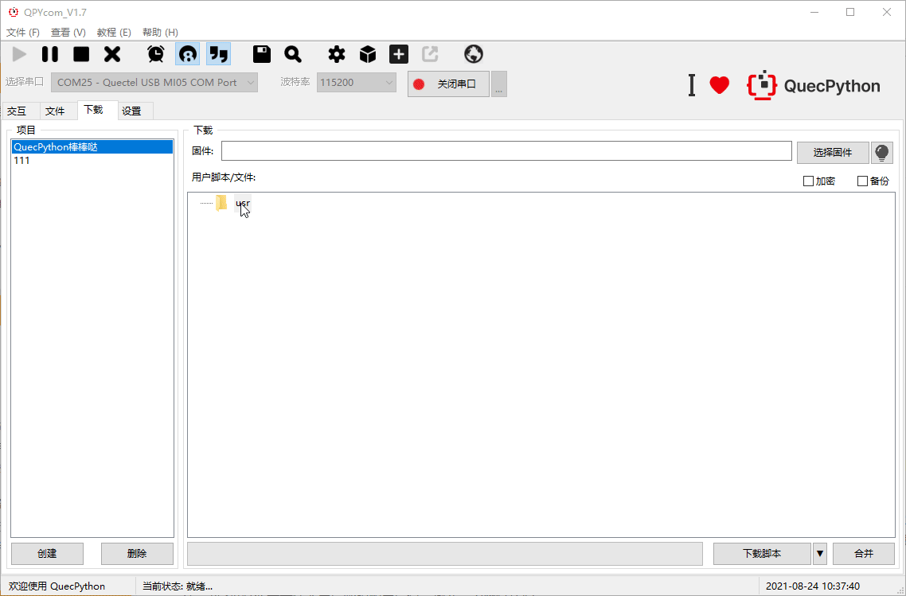
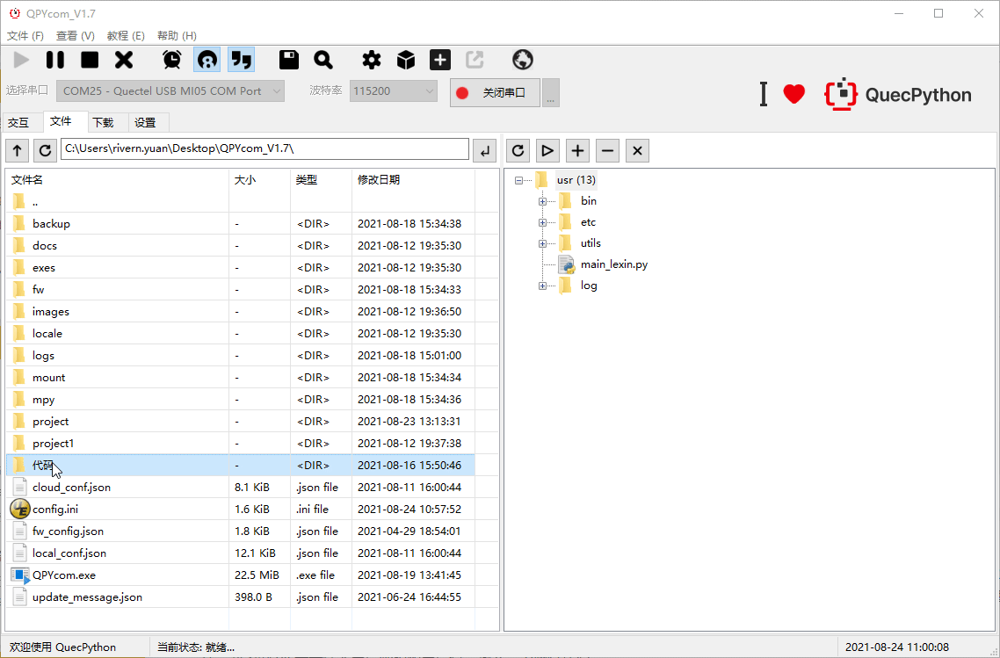

## 文档历史

**修订记录**

| **版本** | **日期**   | **作者** | **变更表述** |
| -------- | ---------- | -------- | ------------ |
| 1.0      | 2021-09-17 | Chic     | 初始版本     |


## Helios Services概述

1.背景

2.新框架解决那些问题/特性/优势

3.能帮助客户解决那些问题 可举例

4.简单说明框架如何使用，目录结构解析，使用教程

5.一个简单的例子 举例论证新框架的易用性和为什么要用新框架

​	用新框架连阿里云，设备端喂狗、拉GPIO、组包发数据

描述一下开发过程中的痛点  ---> 为解决这些痛点开发了新框架来解决这些问题-->如何解决问题/解决了那些问题

（比如支持日志服务、解决线程通信问题、支持看门狗组件、支持腾讯云组件、阿里云组件）

以下是正文（待补充）

## 背景

QuecPython目前一直没有一个应用层框架来实现统筹的消息注册,消息监听,事件管理, 组件通信,会话等功能, 解决一直存在的重复工作量和安全稳定性问题，为了迎合QuecPython的发展, 简化用户对底层网络, 日志, 移远云服务, 定位, 媒体等复杂的数据处理和数据保护等操作,特此我们专门开发了一套应用编程框架来简化复杂的创建、维护的等操作。

我们想通过数据驱动来改善我们目前复杂的编码过程, 顺着这个出发点QuecPython应用编程框架--HeliosService 正式面世！

## 优势

尽管python开发已经相当便捷且功能强大，而QuecPython又在python的基础上极大的拉低了嵌入式开发的门槛，但是仍然会有很多新手开发者在想要开发自己的项目时不知从何入手亦或是在搭建项目框架、编写项目代码时遇到形形色色的问题（以上种种俗称踩坑），为了避免开发者重复踩坑，提升开发者开发效率，于是集结了众多前人的踩坑经验以及官方开发者的满腔心血而开发出的HeliosService顺应天时而生。

那么HeliosService新框架给QuecPython带来了哪些变革呢？

HeliosService将常用的功能整合成服务，并提供统一的API来供客户调用，用户在实现网络、日志、异常、线程通信、队列等功能时更加便捷，另外提供了丰富的第三方组件，例如中断拦截器、GPIO读写拦截器、定时拦截器、看门狗拦截器，极大的减轻了用户的开发难度。

**设计的初衷**

- 将用户和操作一些主动行为变为被动行为的
- 业务之间的解耦, 所以我们特此讲系统的一些组件设计成发布订阅的模式
- 开发者订阅相关只需要关注的服务, 即可获取相关的状态
- 提供消息队列,客户可以通过消息队列来定制自己的组件
- 提供会话中心, 脱离系统服务外支持客户自定义TOPIC发布订阅的服务
- 容器化, 我们提供启动器, 所有的服务和组件获取都通过容器来获取,而不再逐个依赖进行加载
- 简化客户的操作, 和解耦业务之间的依赖使我们的和兴目标

而新框架又解决了哪些问题呢？让我们走进下一章。

## 解决的问题

**携带发布订阅BUS总线**

  - 支持消息和处理的绑定
  - 异步的消息处理机制
  - 用户不需关心对应的处理函数,只管向对应的topic发消息即可

**携带消息队列广播机制**

  - 可自定义消息类型,执行异步和同步模式,支持事件派发和事件管理, 支持标准队列和观察者模式)
  - 解决了两个线程之间传递消息,以及多个事件广播的问题
  - 给模块进行了标准化的解耦过程, 提供了统一稳定的事件管理中心来保证通信的质量

**NET(网络)**

  - 提供网络服务(解决了客户网络的依赖, 客户只需要注册回调接口, 就可以发现注网的状态, 也支持主动查询, 设置APN等操作)
  - 支持断网通知, 断网重连通知等,支持订阅消息
  - 支持网络主动查询

**LOG(日志)**

  - 提供标准化的日志系统(解决日志标准化的问题, 提供日志标准化的输出并携带时间,同样支持异步和同步的配置, 支持云端发送, 落盘等行为)
  - 支持不同uart口输出, 落盘输出等
  - 支持订阅消息发布消息

**CLOUD(移远云服务)**

  - 提供基于移远云的OTA升级和日志发送接口(临终遗言日志上报, OTA的升级, OTA组件等
  - 同样支持异步和同步模式)
  - 支持自动化固件升级
  - 支持自动化文件升级
  - 支持提交云端日志可配合我们日志系统使用

**MEDIA(媒体服务)**

  - 提供媒体功能(支持发布异步的媒体消息, 统一媒体消息管理等等)
  - 支持异步tts, audio播报
  - 支持tts,audio消息发布,消息广播,消息订阅
  - 支持tts, audio播报的自动管理,保证消息播报的可靠性

**EXCEPTION(异常服务)**

  - 提供异常服务支持
  - 支持同步异步消息
  - 支持异常消息订阅, 异常消息发送

**PM(低功耗服务)**

  - 可选的功耗管理
  - 默认低功耗模式
  - 支持高刷唤醒

**SYS_BUS(发布订阅总线)**

  - 支持自定义topic实现发布订阅
  - 支持发布订阅, 通过自动化的线程渠道去分配线程处理业务
  - 支持高并发的处理

**Queue(标准队列)**

  - 支持不同线程中消息的传递
  - 阻塞实现, 支持多线程的put ,get 原子操作

## 使用说明

**代码目录结构**

```python
usr																		    # 用户分区
├─main.py 																	# 用户代码（程序入口）
├─bin																		# 脚本和启动器（下面放着一些共有服务和一些公有的组件）
│  ├─cloud_service.py														  # 云服务组件
│  ├─exception_service.py       											   # 异常服务组件
│  ├─guard.py                   									            # 全局监控和配置文件的启动容器
│  ├─log_service.py             								       		    # 日志服务组件
│  ├─media_service.py           							  				    # 媒体服务组件
│  ├─net_service.py             								 			    # 网络服务组件
│  ├─pm_service.py              	    										# 低功耗服务组件
│  └─components                 								 				# 该目录下存放一些公共组件
│  │   ├─abstract_service.py   							  						# 服务抽象类
│  │   ├─blinker_min.py        								 					
│  │   ├─monitor.py            													
│  │   ├─OTA.py                													# OTA升级组件
│  │   └─service_models.py     							 						# 服务模型基类
│  └─third_party                											
│       ├─ql_interrupter.py   								   					# 第三方服务组件,外部中断/看门狗等
│       └─ ...
├─etc                            												# 配置文件目录（非必须存在）
│   ├─app_config                												# app业务服务配置文件目录
│   └─system_config             												# 系统服务配置文件目录
├─log                            												# 日志存储服务（非必须存在，选择日志存储为本地时自动创建）
└─utils                            												# 通用工具目录
   ├─JsonParserUtils.py          												# josn处理utils
   ├─resolver.py                												# 时间格式化处理器
   └─service_utils.py             												# 单例模式类实现
```

> 
>
> 第三方的组件会持续更新增加新内容

### 搭配工具使用说明

> 新框架需要搭配QPYcom_V1.7版本使用

以上所有目录和文件可通过QPYcom下载到模块中，用户编辑好自己的代码之后下载到模块中即可进行调试，下载方式参考下图

第一种方式，下载页面配置项目，优势是一键导入目录结构之后再次下载调试点击下载脚本按钮即可，方便后续调试



第二种方式，文件页面从左侧本地文件树拖拽到右侧模块文件树，等待下载完成即可，优势是直接拖拽操作简单便捷



> 上述两种方案均可下载框架代码至模块中

### api使用说明

参见api说明文档

## 举个栗子

### 读取配置文件示例

```python
# 初始化全局的guard环境
from usr.bin.guard import GuardContext
guard_context = GuardContext()
# 刷新容器并启动的所有服务
guard_context.refresh()
# 读取配置文件示例
config = guard_context.service_config["cloud"] # 读取/usr/etc/app_config/cloud/config.json 配置文件内容返回的字典对象
```

网络服务和日志服务示例

```python
from usr.bin.guard import GuardContext

def net(*args, **kwargs):
	"""网络回调函数"""
	app_log.debug("net_callback,args:{},kwargs:{}".format(args, kwargs))
			
if __name__ == '__main__':
    # 初始化全局容器
    guard_context = GuardContext()
    guard_context.refresh()
    # 获取网络服务&日志服务
    net_service = guard_context.get_server('net')
    log_service = guard_context.get_server('log')
	# 订阅网络服务
    net_service.subscribe(net)

    # 获取app_log
    app_log = guard_context.get_logger("app_log")
    app_log.debug("net status: {}".format(net_service.get_net_status()))
```

### 第三方组件示例

GPIO读写拦截器

```python
from usr.bin.third_party.ql_interrupter import PinInterrupter 
from machine import Pin, ExtInt
pin_inter = PinInterrupter(Pin.GPIO1, trige_mode=Pin.OUT, pull_mode=Pin.PULL_DISABLE, mode=0) # 初始化
pin_inter.write(1) # 设置PIN脚电平输出为高
```

看门狗示例

```python
from usr.bin.third_party.ql_interrupter import WatchDog
from machine import Pin, ExtInt
import sys_bus
# 初始化watch dog
wd = WatchDog(Pin.GPIO15, 1, 10000)
wd.start()
def topic1_cb(topic, msg):
	pass
def topic2_cb(topic, msg):
	pass
# 订阅喂狗后，硬件狗拉GPIO 告知模块喂狗成功
sys_bus.subscribe("WDT_KICK_TOPIC", topic1_cb)
# 订阅喂狗后的回调
sys_bus.subscribe("WDT_KICK_TOPIC_FEED", topic2_cb)
```

> 更多示例代码和演示参考API说明

