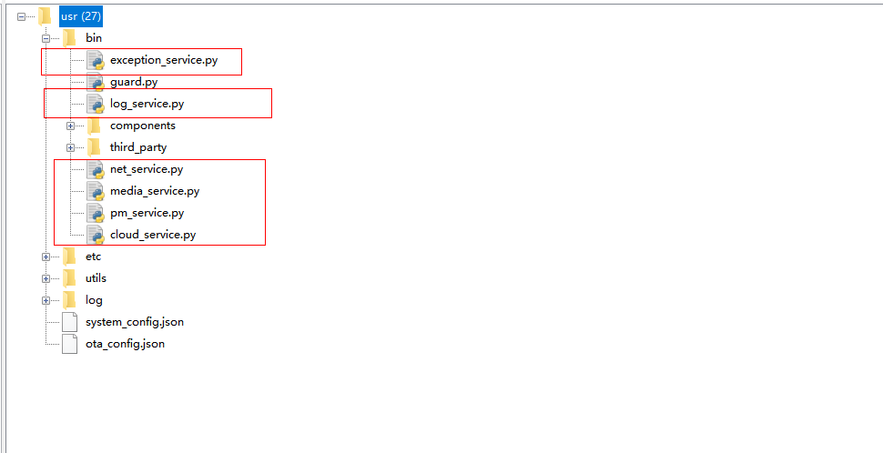

## 文档历史

**修订记录**

| **版本** | **日期**   | **作者** | **变更表述** |
| -------- | ---------- | -------- | ------------ |
| 1.0      | 2021-09-17 | Chic     | 初始版本     |


## Helios Services进阶概述

进阶篇,我们主要描述各个功能是如何使用的, 从入门篇我们已经帮环境搭好了, 从现在起, 我们将正式开始和使用上述功能, 并展示使用成果

## Helio Services使用文档

### 容器

主要是包裹和集成所有服务和配置的集中化管理的东西, 下面演示起核心使用, 其他功能请查看API文档

#### 启动容器

- [OK] 为启动成功
- [FAILED]为服务启动失败
- sys 和 app 代表服务所属的分区,sys是系统级别的, app是用户级别的
- 启动成功的服务我们就可以调用了, 我们也可以查看所有启动成功的服务

 

#### 网络服务

##### 应用场景

- 当拨号状态异常或者从异常中恢复时, 会触发网络服务的主动通知
- 当空口状态异常或从异常中恢复时, 会触发网络通知
##### 基本使用

- 我们可以获取到sim, net, dataCall对象无需导入
- 我们可以订阅网络状态


##### 输出订阅者的数据

当我们订阅网络服务的时候, 网络的波动我们会收到相关通知, 通知为我们订阅的函数

```python
from usr.bin.guard import GuardContext

guard_context = GuardContext()

guard_context.refresh()

net_ser = guard_context.get_server('net')

# 触发事件为用户网络异常, 网络重新上线, 服务异常

def func(*args, **kwargs)
	"""
	 args: ('anonymous',)无需关注
	 kwargs:
		{
			'message': {
				'message_id': 2, 															# 消息id
				'sender': 'anonymous', 														# 发送人
				'message': {
                    'IPv6_DNS1': '::', 											            # IPV6的DNS1
                    'IPv6_DNS2': '::', 													    # IPV6的DNS2
                    'ip_type': 0,                                                           # 只需关注0是ipv4                                *
                    'sim_status': 1,                                                        # sim卡状态1是存在0是sim卡不存在                  *
                    'net_status': 0,                                                        # 空口网络状态, 良好 1 网络不成功失败0			    *
                    'datacall_status': 0,                                                   # 拨号状态,                                      *
                    'profile_id': 1,                                                        # PDP INDEX
                    'IPv4': '0.0.0.0', 														# IPV4地址
                    'IPv4_DNS1': '0.0.0.0', 											    # IPV4dns1
                    'IPv4_DNS2': '0.0.0.0',                                                 # IPV4dns2
                    'IPv6': '7f0:e6b8:8948:4069:7047:8849:20:4861'                          # IPV6地址
				}, 
				'from_event': 'NET',                                                       # 从哪个事件来的
				'msg_type': 1                                                              # 消息类型
				}
		}
		加*号的需要用户去关注
	"""

    print("args = {} kwargs = {}".format(args, kwargs))
# 订阅网络服务
net_ser.subscribe(func)
```
##### 检测联网

- 开启后可检查网络状态, 返回值请参考`HeliosService API文档`


##### 其他功能

请参考AP文档进行调用

#### 日志服务

##### 基本使用

- 获取一个带命名的日志客户端
- 输出日志
- 设置日志输出级别


- 订阅日志

 

##### 输出订阅者的数据

当我们订阅日志服务的时候我们, 当我们打印日志的时候会通知为我们订阅的函数

```python
from usr.bin.guard import GuardContext

guard_context = GuardContext()

guard_context.refresh()

log_ser = guard_context.get_server('log')

def func(*args, **kwargs)
	"""
	 args: ('anonymous',)无需关注
	 kwargs:
	 	{
	 	 'message': {
	 	      'message_id': 4,                                                  # 消息id
	 	      'sender': 'anonymous', 							                # 消息发送人
	 	      'message': <LogFormatUtil object at 7e7142c0>,                    # LogFormatUtil对象
	 	      'from_event': 'LOG', 												# LOG模块来的事件
	 	      'msg_type': 255                                                   # 消息类型
	 	      }
	 	}
	"""
    """
  	 	## LogFormatUtil拥有以下属性, 
	 	获取日志信息
	 	log_data = kwargs['message']['message']                                # 查看log message数据
	 	log_data.time                                                          # 查看log time时间
	 	log_data.tag												           # 查看日志标签例如 NET...
	 	log_data.level													       # 查看日志输出等级
	 	log_data.content                                                       # 查看日志的内容
	 	log_data.log_format                                                    # 获取我们的标准输出
    """
    print("args = {} kwargs = {}".format(args, kwargs))
    
    

# 订阅日志服务
log_ser.subscribe(func)
    
logger = guard_context.get_logger("test")

logger.debug("this is a test msg")

```
##### 其他功能

请参考API文档进行调用


#### 媒体服务

##### 基本使用

- 获取原生tts,audio
- 订阅消息
- 设置模式
- 设置pa `参考API文档`

 
##### 发布tts消息

tts播放媒体格式

>  **media_ser.tts_play(priority=4, breakin=0, mode=2, play_data="")**

- 参数

| 参数      | 参数类型 | 参数说明                                                     |
| --------- | -------- | ------------------------------------------------------------ |
| priority  | int      | 播放优先级，支持优先级0~4，数值越大优先级越高                |
| breakin   | int      | 打断模式，0表示不允许被打断，1表示允许被打断                 |
| mode      | int      | 编码模式，1 - UNICODE16(Size end conversion)，2 - UTF-8，3 - UNICODE16(Don't convert) |
| play_data | string   | 待播放字符串                                                 |

- 返回值
  - 无


##### 发布audio消息

音频文件播放，支持mp3、amr和wav格式文件播放。支持优先级0~4，数字越大优先级越高，每个优先级组可同时最多加入10个播放任务，与TTS播放共用同一个播放队列, 

会默认播报, 

订阅的消息也会同时收到,播报的事件和数据

>  **media_ser.audio_play(priority=4, breakin=0,  play_data="")**

- 参数

| 参数      | 参数类型 | 参数说明                                      |
| --------- | -------- | --------------------------------------------- |
| priority  | int      | 播放优先级，支持优先级0~4，数值越大优先级越高 |
| breakin   | int      | 打断模式，0表示不允许被打断，1表示允许被打断  |
| play_data | string   | 待播放的文件名称，包含文件存放路径            |

返回值

- 无


##### 输出订阅者的数据

当订阅者想拿到发布的tts数据时,可以通过订阅媒体服务,会拿到以下相关参数, 当然我们系统已经有默认播放的动作了

```python
from usr.bin.guard import GuardContext

guard_context = GuardContext()

guard_context.refresh()

media = guard_context.get_server('media')

def func(*args, **kwargs):
	"""
	 args: ('anonymous',)无需关注
	 kwargs:
	 	{
	 	 'message': {
		 	 'message_id': 2,                                                     # message_id消息id
		 	 'sender': 'anonymous',                                               # 发送人
		 	 'message': {
		 	 	'play_data': 'test',                                              # 数据内容		 	
		 	 	'breakin': 0,                                                     # 是否可以被打断[注意audio播放无此属性, 只有tts播放时候才会有此属性]
		 	 	'mode': 2, 														  # 播放模式
		 	 	'priority': 4                                                     # 优先级别
		 	 	}, 
		 	 'from_event': 'MEDIA',                                               # 事件类型
		 	 'msg_type': 1                                                        # 消息类型 1为tts消息 0为audio消息
		 	 }
	 	}
	"""
    print("args {} kwargs {}".format(args, kwargs))
media.subscribe(func)   
# 发布tts消息  media订阅者将收到此消息
media.tts_play(play_data="test")
```

##### 其他功能

- 请查看API文档

#### 低功耗服务

##### 基本使用

- 默认是开启低功耗模式
- 存在投票机制
- 查看投票不为0即无法进入休眠
- 可以取消投票, 每一张投票都需要一次取消

 

##### 其他功能

请查看API相关文档

#### 移远云服务

##### 基本使用

- 提供日志上传至移远云
- OTA单文件升级

 

创建cloud服务的config.json cloud服务是在app_config下面的

 

cloud服务config.json的内容

 

由于当时设置的level是3即使这里创建成功也是不能使用的, 所以我们需要, reload服务才会开启自动升级服务, 设计的初衷是让一些服务的启动等级变低, 客户去控制器启动顺序

 

 

- 提交日志

 

##### 其他功能

请查看API文档


#### 异常服务

##### 基本使用

- 订阅异常服务
- 发布异常

 

##### 输出订阅者的数据

当我们订阅了异常服务, 输出给订阅者的数据

```python
from usr.bin.guard import GuardContext

guard_context = GuardContext()

guard_context.refresh()

ex= guard_context.get_server('exception')

def func(*args, **kwargs):
	"""
	 args: ('anonymous',)无需关注
	 kwargs:
	 	{
	 	 'message': {
		 	 'message_id': 2,                                                     # message_id消息id
		 	 'sender': 'anonymous',                                               # 发送人
		 	 'message': 'this is a error msg',                                    # 异常的消息
		 	 'from_event': 'EXCEPTION',                                           # 事件类型
		 	 'msg_type': 255                                                      # 消息类型无需关心
		 	 }
	 	}
	"""
    print("args {} kwargs {}".format(args, kwargs))

ex.subscribe(func)
# 发送异常信息
ex.publish("this is a error msg")
```
### 三方组件

主要有gpio, 中断, 定时器, 看门狗的封装, 还有安全组件,  断点续传的组件(网络挂掉的时候暂存到本地，恢复之后重新发)等


请查看相关API文档


### sys_bus使用

- 订阅topic的函数
- 发布数据

 

### 裁剪说明

- 圈出来的, 带_service下坠的都是可以裁剪的, 如果不想用此服务, 删除即可

 
