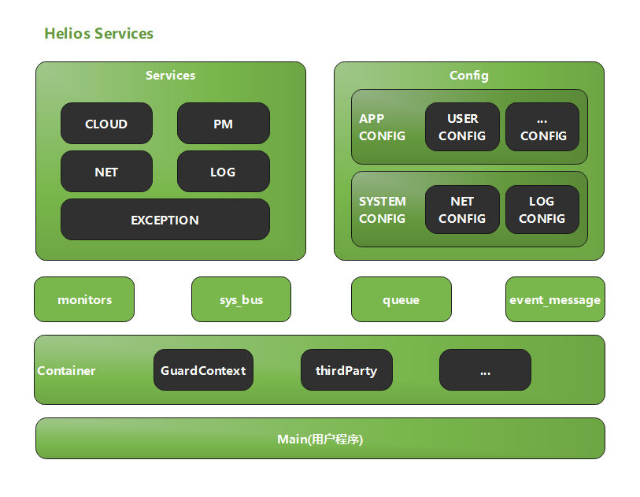
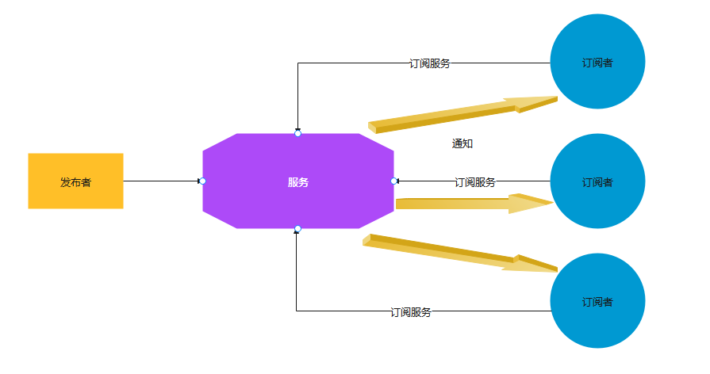
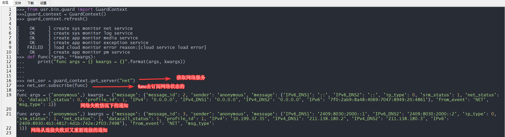
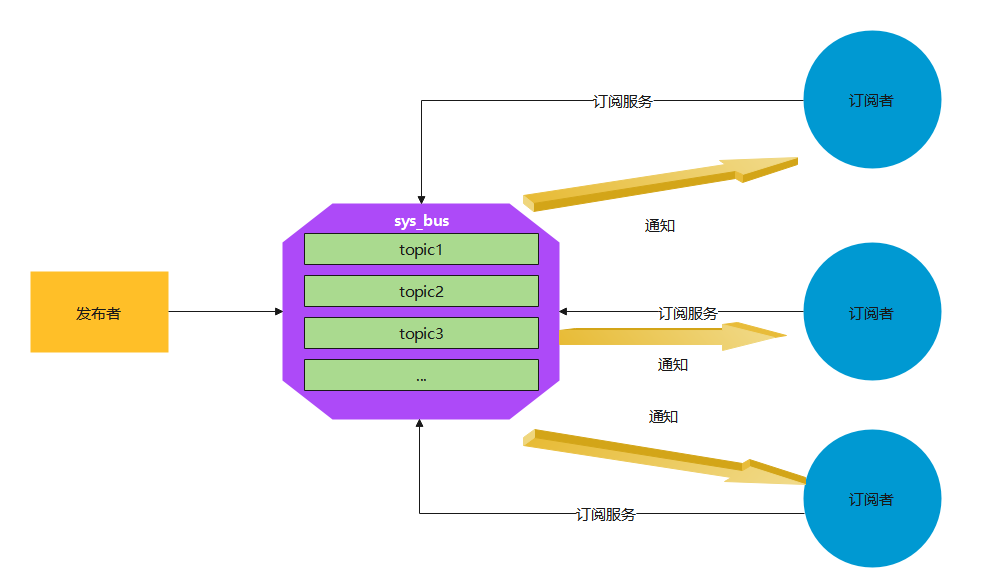
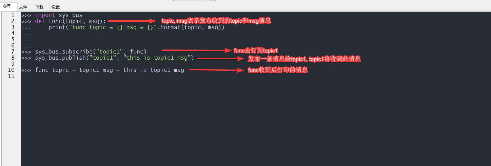
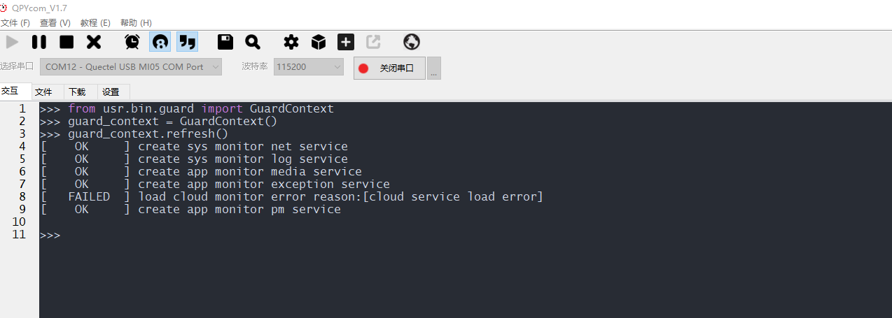
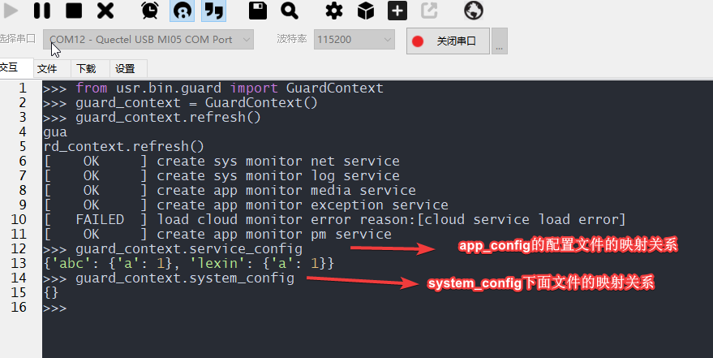
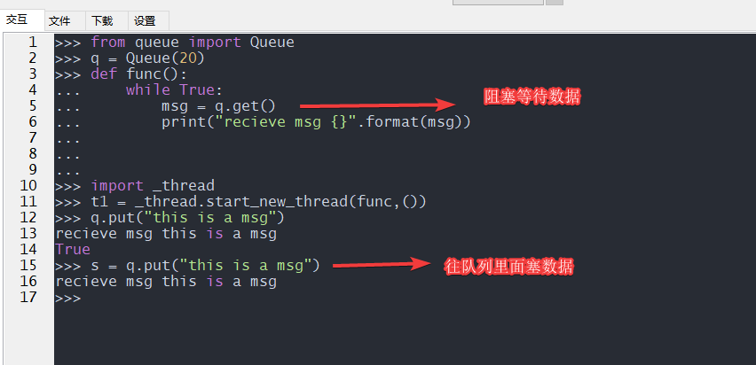

## 文档历史

**修订记录**

| **版本** | **日期**   | **作者** | **变更表述** |
| -------- | ---------- | -------- | ------------ |
| 1.0      | 2021-09-17 | Chic     | 初始版本     |

## Helios Services高级概述

此篇主要说的是, helios services的软件设计的思考, 和后续将要支持的功能, 以及通过我们软件设计知道内部的通信原理, 了解和理解内部的机制等等...

## Helios Services软件架构设计

### 架构设计

 

名词解释:

- `Services`: 服务组件
- `Config`: 配置存储
  - `app_config`: 存储用户配置文件的目录
  - `system_config`: 系统配置文件的目录
- `monitos`: 监控器,监控各个服务的状态
- `sys_bus`: 会话的处理总线主要处理, 生产者和消费者模型, 目前支持异步模式
- `queue:` 普通队列, 用于线程间通信
- `event_message`: 异步的带有命名空间的高级消息队列 

- `GuardContext`: 上下文容器, 统一管理所有的服务和配置, 还有监控等组件, 提供服务, 配置, 监控等获取的接口
- `third_party`: 三方组件目录, 拥有我们提供和封装的一些组件以便客户敏捷开发和二次开发

### 设计原理

#### 服务设计原理

 

1. 我们将写好的一些针对系统级别的提供了一些服务, 这些服务的发布者可能来自可以接受系统底层的回调, 和用户主动发布给不同的订阅者获取等
2. 例如用户只需要订阅网络服务, 当网络信号异常或者网络信号不好时或者网络断开重连时, 网络服务会发起自动重连, 并且通知所有订阅了网络服务函数,  通知当前网络的状态相关信息, 订阅者即可收到相关信息进行处理
3. 例如日志服务等是需要用户自己承当发布者的作用的
4. 发布者和订阅者是毫无关系的, 发布者无需关注订阅者, 只用把发布的数据给用户即可
5. 发布者发布到服务是, 服务再到订阅者是异步的, 我们同时也提供了同步的配置和支持
6. 服务的中间本质实现是一个, `带命名空间的高级的消息队列`+其他一些组件来组成的

优点:

- 我们替客户实现好了一些系统级别的服务, 并支持后续迭代, 解决了客户客户还需要维护系统接别的代码问题, 只提供对外的API供客户调用
- 降低了业务之间的耦合, 订阅者和发布者之间的解耦
- 订阅者,只需要订阅服务, 或者使用服务, 既能使用我们维护并提供的功能

缺点:

- 我们限定死了服务的类型, 客户无法的到定制, 比如我现在有个需求是, 想自己业务上有两个或者多个业务解耦, 客户无法实现自己的服务, 这些服务都是我们写好的, 解决方案`sys_bus`
- 首先我们是由一个高级消息队列组成, 所以有可能存在服务还在, 但是消息队列崩溃的现象, 所以我们在服务崩溃的时候给他拉起来, 解决方案`monitor`

**示例:**

订阅服务

 

#### sys_bus实现原理

上面服务是我们通过服务的形式来给用户体现的, 缺点中我们也明确了,  用户无法定制服务, 反之sys_bus即可实现用户定制服务的需求

- 异步的模式, 用户可以订阅和发布,还有解绑服务
- 将发布和订阅分离, 模块化分离, 支持多个发布者, 和服务的区别是,这里发布者和订阅者都是用户去维护的
- 用户只需要关注topic而不用关注sys_bus等本身和订阅者本身
- 优点:
  - 客户可以自己定制和发布相关的数据等
  - 我们帮客户维护了sys_bus的稳定性
- 缺点:
  - 过于灵活可能会导致, 用户的一些订阅代码需要用户自己去维护

示例:

 

#### monitor设计原理

- 负责监控每个服务在每隔15秒给服务一个心跳, 如果, 服务, 收到这个心跳包, 会将这个发给的指定的接收人的, monitor接收到心跳包, 即认为, 服务运行正常
- 可以设置, 当服务几次运行失败后执行什么样的行为, 例如:设置当服务心跳连续多次失败后, 重启设备或者停止该服务等行为, [目前默认底层做了处理, 用户无需设置]

**示例**

 

#### config设计原理

为了方便配置文件的读取和设置等, 将配置文件路径统一放到了config下面设置按照下列规则的config.json文件

- app_config [用户配置文件夹]
  - 下面对应的是用户配置的配置文件, 如上图所示, app_config下面存在
    - 例如:cloud文件夹, cloud文件夹下面存在一个config.json, 我们将映射文件自动读取文件给cloud服务装载它config.json中的内容, 当cloud服务不存在, 我们将自动保存配置文件和服务的映射关系, 通过`guard_context.service_config`获取服务和映射的config.json的内容
- system_config [系统配置文件夹]
  - 配置系统级别的服务, 我们会按照系统级别的配置文件作为提供对外, 我们会读取系统服务的配置文件, 当服务存在时, 我们可以自动装配, 服务不存在是我们会保存相关映射关系, 用户可以通过`guard_context.system_config`获取映射内容

**示例:**

 

- 我们可以看出上面app_config下面存在
  - lexin
    - config.json
  - abc
    - config.json
  - 我们可以看到读取的service_config下面
    - {'abc': {'a': 1}, 'lexin': {'a': 1}}
    - abc和lexin就是我们的文件夹名字, 对应的value就是我们config.json中的内容
- system_config也是通app_config的对应关系一致
- 注意: 如若想读取必须按照此类调教key是文件夹名,value读取的是config.json中的内容书写

#### queue设计原理

普通队列用作消息通信, 创建队列后获取数据的时候会阻塞, 当有数据信号的时候将会被唤醒

 

### 三方组件和容器设计

#### GuardContext设计原理

上面说了那么多组件设计后, 我们说下, 我们说下容器设计

- 因为目前存在很多服务, 很多配置, 为了方便客户不用这导入一下那导入一下, 并且做统一化管理, 特此容器化了所有组件

- 用户只需要关注容器设计即

#### ThirdParty设计

请查看第三方组件API文档

