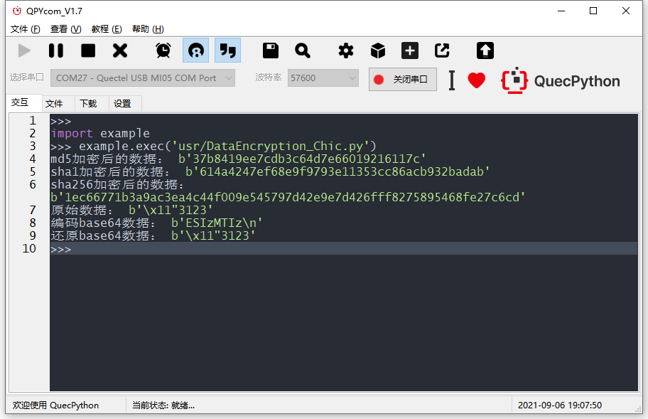

## 文档历史

**修订记录**

| **版本** | **日期**   | **作者** | **变更表述** |
| -------- | ---------- | -------- | ------------ |
| 1.0      | 2021-04-07 | Chic     | 初始版本     |
| 1.1      | 2021-09-06 | Chic     | 初始版本     |


## 加密方式介绍

MD5、SHA1和SHA256是非常常用的两种单向散列函数，现在比较常用的是SHA256算法。

三大特性：
1. 将任意长度的数据转换成固定长度的数据
（无论输入的是一个比特还是一亿个比特，输出的结果长度固定，具体长度根据不同算法决定，比如MD5输出的长度就是128位）
2. 很强的抗碰撞性
（输出的结果唯一，也就是很难找到H(x1)=H(x2)）
3. 不可逆
（目前没有任何方法可以通过散列值找到对应的输入值,也就是不能通过H(X)的值找到对应的X）

QuecPython模组支持的功能: 实现二进制数据散列算法,目前支持MD5 , SHA1, SHA256；

以一个60M的文件为测试样本，经过1000次的测试平均值，三种算法的表现为：

- MD5      算法运行1000次的平均时间为：226ms

- SHA1     算法运行1000次的平均时间为：308ms

- SHA256 算法运行1000次的平均时间为：473ms

  安全性方面，SHA256（又称SHA2）的安全性最高，建议使用SHA256。


## 常见应用场景：

1、数据库中保存用户密码
比如前段时间频频爆出一些公司的数据库被爆，用户的账户密码以明文存在，大量资料流出这样的做法是极其不负责和危险的。
最好的方法就是将用户的密码通过单向散列函数输出到数据库，每次登录时对比散列值即可。由于单向散列函数的不可逆性，就算数据库被盗取，也没有办法得到用户的信息。
（某些自称破解单向散列函数的网站使用的方法其实是低级的穷举法，保存大量常用明文的散列值，这样做是很愚蠢的。有很多方法可以应对，比如一种叫做“加盐”的常用方法，将用户的信息后面统一加上诸如$%*^&这样的字符，然后计算散列值存入数据库中，或者可以计算散列值的散列值，这样可以保证绝对的安全性。）

2、防止文件篡改
目前大部分提供下载服务的网站都有提供文件的SHA256值，这是因为单向散列函数具备防篡改的效果，若是下载的文件的SHA256和网站提供的值不符，则可能此文件已经遭到了修改，可能含有病毒或者是盗版等等。。。接下来的代码中我们也会来实现计算文件的SHA256值。

3、 数字签名（阿里云、腾讯云等）
在进行数字签名时也会使用单向散列函数。
数字签名是现实社会中的签名和盖章这样行为在数字世界中的实现。数字签名的处理过程非常耗时，因此一般不会对整个消息内容直接使用数字签名，而是先通过单向散列函数计算出消息的散列值，然后再对这个散列值使用私钥加密，得到的就是数字签名。

4、伪随机数生成器
使用单向散列函数可以构造伪随机数生成器。
密码技术中所使用的随机数需要具备“事实上不可能根据过去的随机数列预测未来的随机数列”这样的性质。为了保证不可预测性，可以利用单向散列函数的单向性。

5、秒传
很多诸如某云盘，某网盘这样的公司利用单向散列函数的特性实现秒传的效果。
单向散列函数就像文件的指纹一样，当用户上传文件时，首先计算一下此文件的单向散列值，将此值在数据库中进行查找，若存在相同值，证明此用户上传的文件已经存在相同的，所以无需上传，共享即可。如此可大幅降低服务器负载，大幅缩减存储空间，实现去重的效果。

 

## 二进制数据加密

示例代码：

```python
import uhashlib
import ubinascii
# 目前支持 md5，sha1, sha256

data = b"QuecPython"  # 待加密数据
data2 = b"QuecPython"  # 待加密数据

hash_obj = uhashlib.md5()
hash_obj.update(data)
# hash_obj.update(data2)
res = hash_obj.digest()
hex_msg = ubinascii.hexlify(res)
print("md5加密后的数据：", hex_msg)
# b'37b8419ee7cdb3c64d7e66019216117c'

hash_obj = uhashlib.sha1()
hash_obj.update(data)
# hash_obj.update(data2)
res = hash_obj.digest()
hex_msg = ubinascii.hexlify(res)
print("sha1加密后的数据：", hex_msg)
# b'614a4247ef68e9f9793e11353cc86acb932badab'

hash_obj = uhashlib.sha256()
hash_obj.update(data)
# hash_obj.update(data2)
res = hash_obj.digest()
hex_msg = ubinascii.hexlify(res)
print("sha256加密后的数据：", hex_msg)
# b'1ec66771b3a9ac3ea4c44f009e545797d42e9e7d426fff8275895468fe27c6cd'

res = b'\x11\x22\x33123'
print("原始数据：", res)
res = ubinascii.b2a_base64(res)
print("编码base64数据：", res)
res = ubinascii.a2b_base64(res)
print("还原base64数据：", res)

```

执行结果如下图：




## 更多内容

想要了解其他功能吗？请浏览官方网站：

https://python.quectel.com/wiki/#/zh-cn/api/?id=pin

官方网站：

https://python.quectel.com/

相关工具、例程、驱动、文档下载：

https://python.quectel.com/download

 

了解更多，请关注QuecPython公众号

 

 