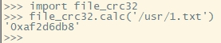

## 文档历史

**修订记录**

| **版本** | **日期**   | **作者** | **变更表述** |
| -------- | ---------- | -------- | ------------ |
| 1.0      | 2021-04-07 | Chic     | 初始版本     |
| 1.1      | 2021-09-06 | Chic     | 初始版本     |


## 概述	

QuecPython具备文件备份还原功能，当用户的代码误删除或意外被修改，可以从备份区还原丢失或错误的文件。

先了解QuecPython的文件系统，为了保障产品在市场上稳定运作，我们推出双文件系统备份机制，分别称为“**用户文件系统**”和“**备份文件系统**”。


备份还原功能指的是“**用户文件系统分区**”需要备份的文件（包括脚本文件及其它任何格式的文件），在开机阶段检测到被损坏时，从“**备份文件系统分区**”将出厂烧录的文件还原至“**用户文件系统分区**"的功能。


## 为何需要备份还原功能

当应用或系统的关键参数或脚本不允许丢失或出现异常时，往往需要备份和还原功能。


## 哪些文件需要备份还原

系统级可能需要备份的文件包括apn_cfg.json（拨号配置文件）、system_config.json（系统配置文件）。
用户级可能需要备份还原的文件依据应用场景而定。

例如：要备份音量值、原始密码、服务器IP地址、阿里云、腾讯云产品及设备信息等。


## 备份还原实现机制

开始之前，先了解下备份还原功能的基本原理，以帮助理解下文。

1. 用户通过使用QPYcom工具合并生产固件时，勾选【备份】，文件将自动导入“**备份文件系统分区**”，会在“**备份文件系统分区**”生成两个名称分别为checksum.json和backup_restore.json的文件。checksum.json记录了备份区文件的hash表。backup_restore.json表明是否开启备份还原功能。
2. checksum.json：开机过程检测到开启了备份还原功能，系统会检测“**用户文件系统分区**”是否存在checksum.json。若不存在，则将”**备份文件系统分区**“的checksum.json拷贝到“**用户文件系统分区**”。
3. 开机检测"**用户文件系统分区**"的checksum.json中的hash值，校验“**用户文件系统分区**”的用户文件。如果文件不存在或者校验不通过，则将“**备份文件系统分区**”对应的文件拷贝到“**用户文件系统分区**”相应的位置，并重新计算hash值，更新在“**用户文件系统分区**”的checksum.json中。
4. 当参与备份还原的用户文件需要FOTA升级时，在升级过程的最后一步，会将更新后的用户文件的hash值写入“**用户文件系统分区**”的checksum.json。

**注意：**
1.本文所指的备份功能，是备份出厂烧录的文件；同样，还原也是出厂烧录的文件。
2.备份文件系统分区为只读属性，用户不可配置其读写属性。


## 触发条件

了解到QuecPython的备份还原的原理以后，可以知道，触发备份还原功能有以下几种可能：

1. 用户文件系统分区的checksum.json文件被用户意外删除。
2. 当设备短路断电等导致文件系统发生意外错误，致使被标记为备份的用户文件系统分区中文件的数据发生变化，或者文件丢失。
3. 用户在应用过程中，手动改写了标记为备份的用户文件系统分区的文件数据，却没有更新checksum.json。


## 防止误触发

为了稳定运行，我们可以有针对性的防止备份还原的误触发：

1. 用户应用程序上做好把关，避免误删除用户文件系统分区的checksum.json文件。

2. 在访问文件系统时尽量避免暴力开关机，或者必要时，在硬件设计上增加掉电检测和后备电源功能，给文件系统足够的时间更新物理数据。

3. 手动改写了标记为备份的用户文件系统分区的文件数据后，通过以下代码段来更新用户文件系统分区的checksum.sjon文件。更新成功后，会返回当前文件的hash值。

```python
import file_crc32

file_crc32.calc('/usr/1.txt')
```

执行输出结果如图1所示：



更新到参与备份文件的hash值。

 

## 开启备份还原功能

开启QuecPython的备份还原功能，在QPYcom工具上操作即可。

- 登录官方网站“[资源下载](https://python.quectel.com/download)”，在一级分类“资源”，二级分类“工具”栏中找到【QPYcom 图形化工具】，具体位置如下图：


- 打开QPYcom工具后，在**“下载”**选项卡勾选【备份】，合并即可生成带备份的生产固件。


## 更多内容

想要了解其他功能吗？请浏览官方网站：

https://python.quectel.com/wiki/#/zh-cn/api/?id=pin

官方网站：

https://python.quectel.com/

相关工具、例程、驱动、文档下载：

https://python.quectel.com/download

 

了解更多，请关注QuecPython公众号

 

 