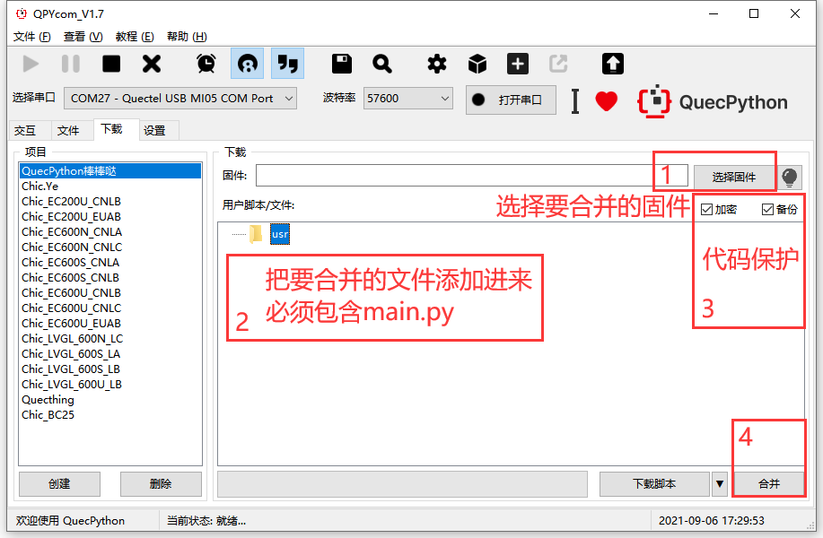
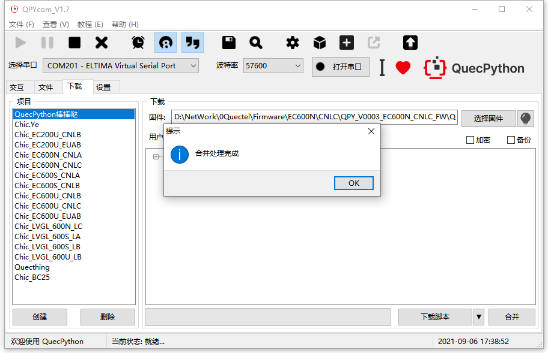
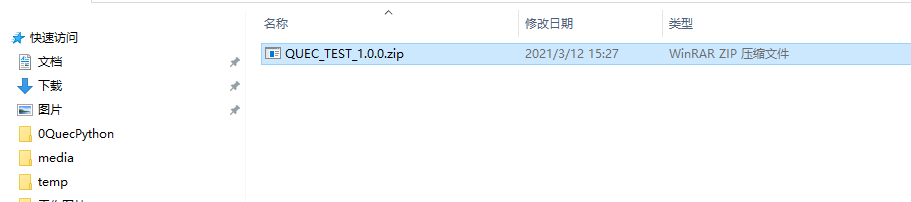
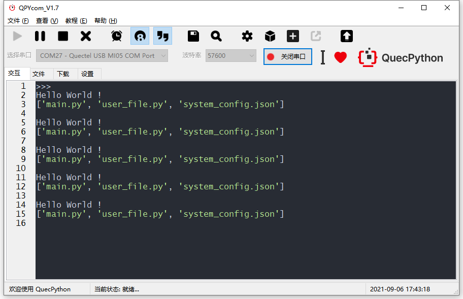
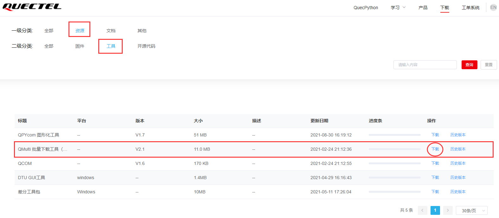
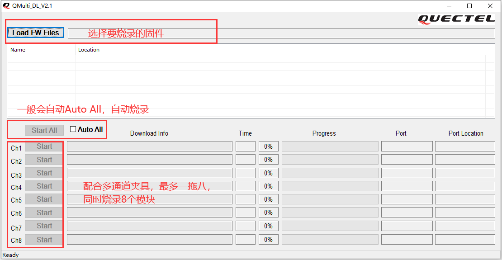

## 文档历史

**修订记录**

| **版本** | **日期**   | **作者** | **变更表述** |
| -------- | ---------- | -------- | ------------ |
| 1.0      | 2021-04-07 | Chic     | 初始版本     |
| 1.1      | 2021-09-06 | Chic     | 更新部分图片 |


## 代码保护

- 登录官方网站“[资源下载](https://python.quectel.com/download)”，在一级分类“资源”，二级分类“工具”栏中找到【QPYcom 图形化工具】，具体位置如下图：


- 打开QPYcom工具后，在**“下载”**选项卡中有【加密】【备份】的选项。
- 加密功能用于保护用户的APP代码，加密后使源代码被掩盖；
- 备份功能用于投入市场后，若usr区备份文件意外丢失、篡改等，自动从bak区恢复。


## 使用QPYcom生成量产固件包

合并源码后，只需烧录一次固件即可完成生产，在合并时已经将usr区的文件嵌入到固件中，因此烧录合并后的固件已经包含usr区的文件。

### 合并条件

- 合并的*.py*文件中必须包含*main.py*代码。

- *main.py*代码中必须包含以下两行语句：

  ​		PROJECT_NAME = 'QUEC_TEST'  # 必须要有这行代码才能合并

  ​		PROJECT_VERSION = '1.0.0'  # 必须要有这行代码才能合并

**注意：**

在合并的所有*.py*文件中，*main.py*作为程序入口文件，工具自动不对其加密，故写代码时，从*main.py*调用其他文件的接口更加安全。

### 示例工程

*main.py*文件：

```python
from usr import user_file  # 用户的.py文件放在usr路径下，要用 from usr 导入APP
import utime

PROJECT_NAME = 'QUEC_TEST'  # 必须要有这行代码才能合并
PROJECT_VERSION = '1.0.0'  # 必须要有这行代码才能合并

if __name__ == "__main__":  # 标准写法，从main.py开始执行
    while True:
        user_file.Qprint()
        user_file.Qlistdir()
        utime.sleep_ms(300)
        
```

*user_file.py*文件：

```python
import uos

def Qprint():
    print('Hello World !')

def Qlistdir():
    print(uos.listdir('/usr'))
    
```

将以上*main.py* 和*user_file.py*两个文件添加到usr区中。固件建议使用官网发布的最新版本：[资源下载专区](https://python.quectel.com/download) 中找到于模组型号对应的固件 。

合并后的固件存放在用户指定的路径下，如《QUEC_TEST_1.0.0.zip》固件包，固件包名由*main.py*中的变量**PROJECT_NAME**、**PROJECT_VERSION**组合而成。



仅需几秒钟，即可完成合并：



合并完成后的文件名是由*main.py*中的变量**PROJECT_NAME**、**PROJECT_VERSION**组合而成



烧录合并后的固件，开机自动运行*main.py*：



## 量产工具

- 登录官方网站“[资源下载](https://python.quectel.com/download)”，在一级分类“资源”，二级分类“工具”栏中找到【QMulti_DL 批量下载工具】，具体位置如下图：



- 打开软件后，在**“Load FW Files”**中选择上面合并后的固件，点击**“Auto ALL”**后，即自动检测8个通道直至烧录完毕：

  ​	首先，夹具通过USB先接入电脑；

  ​	其次，在电脑打开QMulti_DL批量下载工具，并选择要烧录的固件，随后软件会自动检测烧录。




**提醒：**

只要夹具中的任意一个通信有模块接通电源，就会自动烧录。

烧录失败，意外终止时，只需要模块重新上电即可继续烧录。

## 下载配套代码

 <a href="code/main.zip" target="_blank">下载配套代码模板</a>

 <a href="code/fota.zip" target="_blank">下载差分包生成教程和工具</a>


## 附录A参考文档及术语缩写

表1：参考文档

| **序号** | **文档名称**                       | **备注**              | 文档位置                |
| -------- | ---------------------------------- | --------------------- | ----------------------- |
| [1]      | Quectel QuecPython_QPYcom_用户指导 | QPYcom工具使用说明    | QPYcom工具压缩包自带    |
| [2]      | Quectel_QMulti_DL_用户指导         | QMulti_DL工具使用说明 | QMulti_DL工具压缩包自带 |

表2：术语缩写

| **术语** | **英文全称**         | **中文全称** |
| -------- | -------------------- | ------------ |
| USB      | Universal Serial Bus | 通用串行总线 |
