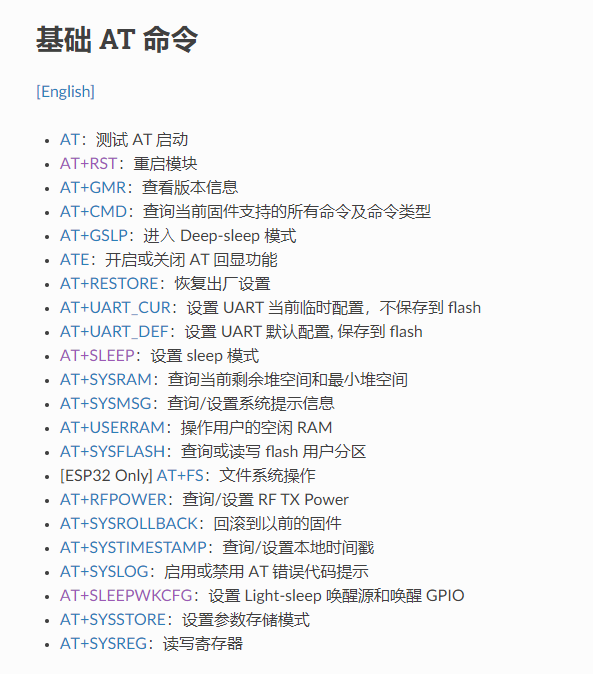
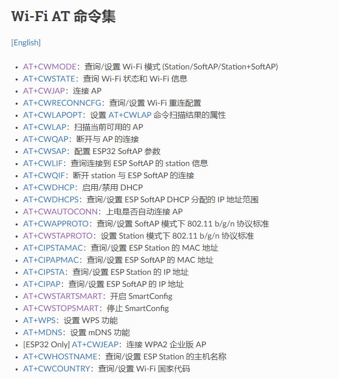
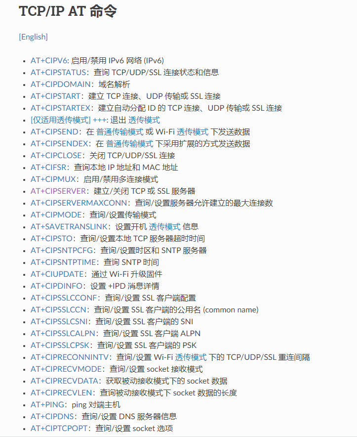

# 文档历史

**修订记录**

| **版本** | **日期** | **作者** | **变更表述** |
| --- | --- | --- | --- |
| 1.0.0 | 2021-07-23 | Xjin.gao | 文档创建 ESP8266 wifi芯片调试 |

## 引言

本文档基于QuecPython架构，主要介绍了基于python ES00N模块集成ESP8266 wifi芯片，通过串口uart 实现AT通讯，并且能够连接阿里云，处理业务。


## 详细介绍

### 开发流程介绍：

具体开发前，需要先确认环境，包括:

1. 选用的EC600N 模块是否具备uart功能，并进行实际测试.
2. ESP8266 模块在收到AT指令后，是否可以正常回复相关信息。

#### 模块uart测试

可以参考python官网API介绍：QuecPython API说明QuecPython 类库machine 硬件相关功能uart&amp;Pin

//参考链接：[https://python.quectel.com/wiki/#/zh-cn/api/QuecPythonClasslib?id=uart](https://python.quectel.com/wiki/#/zh-cn/api/QuecPythonClasslib?id=uart)

[https://python.quectel.com/wiki/#/zh-cn/api/QuecPythonClasslib?id=pin](https://python.quectel.com/wiki/#/zh-cn/api/QuecPythonClasslib?id=pin)

#### ESP8266 AT验证 

说明：本次调试，未关注esp8266相关的具体硬件&amp;软件设计。由客户设计硬件电路和8266软件版本。调试前，仅需确认wifi芯片是否可以正常工作（正常接收&amp;回复AT指令）。

#### 验证步骤

先设置gpio ,使能8266 wifi芯片：

```python
gpio_en = Pin(Pin.GPIO28, Pin.OUT, Pin.PULL_DISABLE, 0)

gpio_bat = Pin(Pin.GPIO14, Pin.OUT, Pin.PULL_DISABLE, 0)

gpio_bat.write(1)

gpio_en.write(0)
```

创建UART2 – MAIN PORT 对象：

```python
serial = UART(UART.UART2, 115200, 8, 0, 1, 0)
```

通过serial 写AT指令：

```python
 serial.write('AT\r\n') #标准AT指令必须带\r\n
```

通过serial 读取是否有回复：

```python
serial.read(serial.any())
```

若正常读取 OK\r\n 表示模块uart 功能OK，8266 芯片工作正常。

### AT 指令开发x

AT指令开发可先参考乐鑫科技官方AT文档：

参考链接：

[https://docs.espressif.com/projects/esp-at/zh_CN/latest/AT_Command_Set/Basic_AT_Commands.html](https://docs.espressif.com/projects/esp-at/zh_CN/latest/AT_Command_Set/Basic_AT_Commands.html)

主要实现：

html <div align=center>  </div>

html <div align=center>  </div>

html <div align=center>  </div>

> 目前未全部实现，仅实现和阿里云连接业务相关的at。

**实现AT时，主要有2种方法**

 **1.普通的设置AT：（特点，返回比较固定和统一）**

对于此类AT命令，我们通过函数at_command 统一处理，在接收到b&#39;OK&#39;,字符串后，return 0，表示执行ok。

def at_command(self, cmd=&quot;AT&quot;, TIMEOUT=30, CNT_WHITES_LIMIT=10):

直接输入对应AT cmd立可。


**2.针对一些特殊AT需要单独判断返回：**

client_getaddrinfo //dns解析域名，在返回ok同时，直接返回对应IP地址

client_connect // 连接服务器，需要加一定的延时等待连接成功。

client_recv //接收服务器返回数据，目前仅识别数据格式为+IPD:--size--,--msg—

其他返回数据格式，需单独处理。

client_send //模块发送数据，send需分开发送，先发送size，AT+CIPSEND=\&lt;length\&gt;

等待响应ok 和 &quot;\&gt;&quot;后，输入具体内容。

目前：API仅要求输入数据，len内部处理。

所有AT命令的开发，必须严格按照官方文档的输入&amp;响应做处理，另外，需要在esp8266实际多场景测试返回值才能确认返回。因为有部分AT需要延时才能有结果。

主要原因：我们处理一条AT命令时，必须完整的等待此AT执行完成后，才能返回执行结果。否则会导致下一条AT 执行busy或者响应处理判断条件不成立，导致报错。

### 阿里云 MQTT API开发

完成AT命令后，利用基础AT，完成mqtt相关功能，并能够连接阿里云服务器，并完成对应的业务。

目前提供的相关API为：

aliyun_wifi_connect //连接wifi，测试使用。正式使用时，需要使用Airkiss配网。

aliyun_set_wifi_mode &amp; aliyun_get_wifi_mode 设置/获取 wifi模式。

aliyun_connect //连接阿里云服务器，需要传入相关参数。

aliyun_setCallback //设置回调，用来显示服务器发送的信息。

aliyun_subscribe //订阅topic

aliyun_publish //发布消息到对应服务器

aliyun_disconnect //断开连接

aliyun_start //接收服务器信息，当前默认一次recv data，未接收数据，超时退出。（需一直while）

/另：因为是发送AT，每一比数据包，需要完整，不可以分包。所以micropython umqtt不适用于此方案，mqtt数据包需要全部重新开发。

注意：目前连接正常，不确认当数据size超过一定时，数据包解析是否正常。需要实测确认。

### Airkiss配网

在实际产品中，不支持手动输入wifi名称&amp;密码，所以需要使用配网需要 Airkiss，通过手机主动发送wifi连接参数到设备。

Airkiss配网可参考：[https://docs.espressif.com/projects/esp-at/zh_CN/latest/AT_Command_Set/Wi-Fi_AT_Commands.html#cmd-starts](https://docs.espressif.com/projects/esp-at/zh_CN/latest/AT_Command_Set/Wi-Fi_AT_Commands.html#cmd-starts)

```python
print('!******* set_wifi_mode =%s' % c.set_wifi_def_mode(1))#设置mode为单STA模式，并把配置保存在flash
print('!******* get_wifi_mode =%s' % c.get_wifi_mode())#
print('!******* set_wifi_auto_conn  1 =%s' % c.set_wifi_auto_conn(1))#使能上电自动连接AP

print('!******* set_wifi_start_smart 3 =%s' % c.set_wifi_start_smart(3)) # 支持ESP-Touch和Airkiss智能配网
#在获取wifi ssid&password后，会自动连接WIFI
utime.sleep(6)
print('!******* set_wifi_stop_smart  =%s' % c.set_wifi_stop_smart())#无论配网是否成功，都需要释放快连所占的内存
print('!******* get_wifi_status  =%s' % c.get_AP_connected_info())#获取当前连接的wifi信息

```

需要Airkiss配网时，wifi模块必须设置为单STA模式。执行set_wifi_start_smart后，必须stop smart，释放资源。

可以设置为自动连接，也可以通过解析smart接收的wifi参数调用aliyun_wifi_connect连接wifi。

配置时，需要模块先进入smart接收，再打开手机匹配，另，smart需要一定的接收时间。

