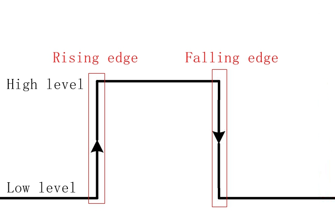

# 外部中断实验

## 修订历史

| 版本 | 日期       | 作者    | 变更表述 |
| ---- | ---------- | ------- | -------- |
| 1.0  | 2021-09-22 | Grey.Tu | 初版     |

文档主要介绍如何实现 ExtInt 检测外部中断，从硬件设计和软件设计两方面讲解，通过阅读本文，您将学会 ExtInt 外部中断功能使用。

有关API详解请参考 [QuecPython-machine - ExtInt](https://python.quectel.com/wiki/#/zh-cn/api/QuecPythonClasslib?id=extint)


## 硬件设计

ExtInt 外部中断原理为检测 PIN 脚外部电平转变，既 PIN 脚上有上升沿或下降沿信号。



原理图与按键原理图类似：


## 软件设计

首先确定要控制硬件的哪个引脚，然后通过官网的 API 类库找到对应的 GPIO 编号 。详解请参考  [QuecPython-machine - ExtInt](https://python.quectel.com/wiki/#/zh-cn/api/QuecPythonClasslib?id=extint)

例： EC600U的引脚60为GPIO4。

开始编写代码，选择对应的 GPIO 进行 ExtInt 外部中断初始化：

```python
from machine import ExtInt


def callback(args):
    print('interrupt: {}'.format(args))


extint = ExtInt(ExtInt.GPIO4, ExtInt.IRQ_RISING_FALLING, ExtInt.PULL_PU, callback)  # Create object
extint.enable()  # Enable interrupt
print('Start GPIO: {}Interrupt. \r\n'.format(extint.line()))

# extint.disable()  # Disable interrupt 
```


> 注:屏幕截图显示的代码运行结果基于EC600U_EVB 1.3, GPIO 4分别对应pin60, 即EVB上的KEY 1. 

## 配套代码

<!-- * [下载代码](code/code_ExtInt.py) -->
 <a href="code/code_ExtInt.py" target="_blank">下载代码</a>

