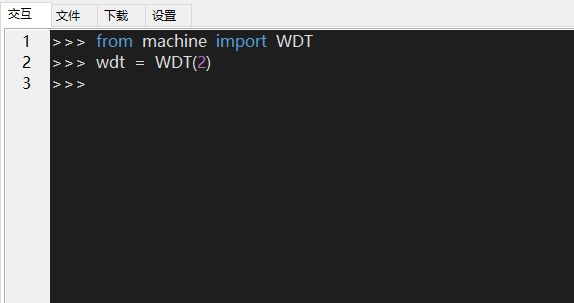

## 修订历史

| 版本 | 日期       | 作者   | 变更表述     |
| ---- | ---------- | ------ | ------------ |
| 1.0  | 2021-09-15 | Kayden | 初始版本修订 |


## Watchdog开发使用说明

文档主要基于EC600S介绍如何使用QuecPython_Watchdog（**适用于其他模组**），Watchdog通常用于防止设备死机不再运作的情况，加入了Watchdog后，在意外死机后系统将会自动重启，从而使设备继续工作，Watchdog以下简称WDT。通过本文你将了解到WDT的所有设置参数及使用方法。

##  硬件描述

WDT模块功能：APP应用程序发生异常不执行时进行系统重启操作，该功能系统完全内置，不需要接任何外围电路。

##  软件设计

看门狗API详细介绍参见链接：[看门狗API](https://python.quectel.com/wiki/#/zh-cn/api/QuecPythonClasslib?id=wdt)

1.  函数原型 WDT(period)，返回一个wdt 对象，用于设置WDT的喂狗、开启、关闭功能。

创建WDT对象并立即启动：

>   wdt = WDT(period)

| 参数   | 类型 | 说明                       |
|--------|------|----------------------------|
| period | int  | 设置软狗检测时间，单位(s） |

1.  函数原型feed()，无返回值。

喂狗：

>   wdt.feed()

1.  函数原型**stop**()，无返回值。

关闭软狗功能：

>   wdt.stop()

## 交互操作

1.  使用QPYcom工具和模组进行交互，示例如下：



注意：

1.  from machine import WDT即为让WDT模块在当前空间可见。

2.  只有from machine import WDT模块，才能使用WDT内的函数和变量。

说明：没有喂狗动作，可见两秒后，系统自动复位。

## 下载验证

下载.py文件到模组运行，代码如下：

 <a href="code/Watchdog.py" target="_blank">下载代码</a>

```python
from machine import WDT
from machine import Timer

count = 0
def feed(t):
    global count
    count += 1
    if count >= 5:
        print('停止喂狗')
        timer1.stop()
    print('喂狗')
    wdt.feed()


timer1 = Timer(Timer.Timer1)
wdt = WDT(2)  # 启动看门狗，间隔时长 单位 秒
timer1.start(period=1000, mode=timer1.PERIODIC, callback=feed)  # 使用定时器喂狗

```


## 专业名词解释

>   **看门狗**：定时计数定时计数增加到设定值就认为程序没有正常工作,强制整个系统复位

>   **喂狗**：复位计数值

