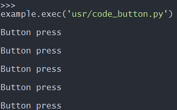

# 按键输入实验

## 修订历史

| 版本 | 日期       | 作者 | 变更表述 |
| ---- | ---------- | ---- | -------- |
| 1.0  | 2021-09-17 | Grey | 初版     |

文档主要介绍如何实现检测 GPIO 电平，从硬件设计和软件设计两方面讲解，通过阅读本文，您将学会查看硬件连接关系、代码编写思路和验证实验理论。

有关API详解请参考 [QuecPython-machine - PIN](https://python.quectel.com/wiki/#/zh-cn/api/QuecPythonClasslib?id=pin)


## 硬件资源 

EC600x 开发板引出了两个 PIN 脚供客户实验按键输入实验。

我们配置对应 GPIO 为上拉输入模式便可以通过按而不按按键改变 GPIO的电平。


## 软件设计

首先确定要检测的硬件引脚是那一个 GPIO ，我们通过官网的 API 类库找到对应的 GPIO编号 。详解请参考 [QuecPython-machine - PIN](https://python.quectel.com/wiki/#/zh-cn/api/QuecPythonClasslib?id=pin)

例： EC600U的引脚60为GPIO6。

而我们 EC600x 开发板两个按键 PIN59/PIN60，对应EC600S/N为：PIN59 => GPIO12；PIN60 => GPIO13。对应EC600U为：PIN60 => GPIO4；PIN59 无对应 GPIO，不能进行按键输入检测。这边我们实现一个按键的按键检测功能。

### 代码实现 

```python
import utime
from machine import Pin


if __name__ == '__main__':
    # gpio13 = Pin(Pin.GPIO13, Pin.IN, Pin.PULL_PU, 1)  # EC600S/N
    gpio13 = Pin(Pin.GPIO4, Pin.IN, Pin.PULL_PU, 1)  # EC600U
    while True:
        if gpio13.read() == 0:
            utime.sleep_ms(10)
            if gpio13.read() == 0:
                while gpio13.read() == 0:
                    pass
                print("GPIO13按下")
        pass
```


## 下载验证

下载.py 文件到模组运行：


下载之后，按下按键，便会有信息打印：



## 配套代码

<!-- * [下载代码](code/code_button.py) -->
  <a href="code/code_button.py" target="_blank">下载代码</a>