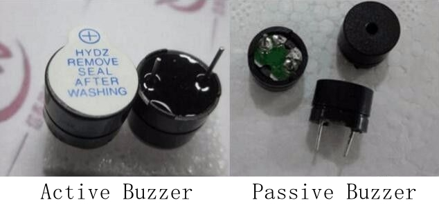
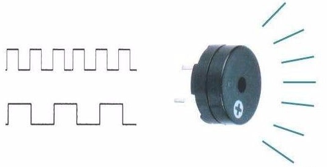
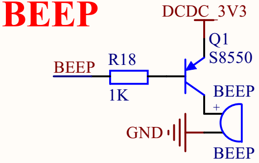

# 蜂鸣器实验

## 修订历史

| 版本 | 日期 | 作者 | 变更表述 |
|------|------|------|------|
| 1.0 | 2021-03-20 | gary.zhou | 初版 |
| 1.1 | 2021-09-15 | Grey.Tu | 修改有源蜂鸣器绘制为无源蜂鸣器控绘制. |
| 1.2 | 2021-11-29 | Grey.Tu | 勘误. |

文档主要介绍如何 PWM 控制 **无源蜂鸣器** ，使 **无源蜂鸣器** 发声。从硬件设计和软件设计两方面讲解，通过阅读本文，可以学习 PWM 基本使用。

有关 API 详解请参考 [QuecPython-misc - PWM](https://python.quectel.com/wiki/#/zh-cn/api/QuecPythonClasslib?id=pwm)


## 硬件描述

蜂鸣器分为 **有源蜂鸣器** 与 **无源蜂鸣器** 两种。 **有源蜂鸣器** 直接供电就会发声，控制如同 LED ，控制引脚输出高低电平即可。硬件电路也与 LED 电路类似。 有关驱动请参考 LED 控制章节。本文主要介绍 **无源蜂鸣器** 的驱动，实现 PWM 控制 **无源蜂鸣器** 。



淘宝搜索购买无源蜂鸣器



无源蜂鸣器通过PWM开关三极管驱动。 我们只需要电源，以及2KHz~5KHz 的pwm方波即可。




## 软件设计

#### 查询开发板对应的IO口

首先确定要控制硬件的哪个引脚，然后通过官网的 API 类库找到对应的 PWM 编号 。详解请参考 [QuecPython-misc - PWM](https://python.quectel.com/wiki/#/zh-cn/api/QuecPythonClasslib?id=pwm) 例: 

| 模块型号                               | **对应引脚号** |
| -------------------------------------- | -------------- |
| EC600S/N ==> PWM2<br />EC600U ==> PWM0 | 引脚号70       |


### **实验代码**

```python
from misc import PWM
import utime as time
import urandom as random
import log


# Creating log object
buzzer_log = log.getLogger("buzzer_test")

# Duration: ms
def outputpwm(HZ, duty_cycle, Duration):
    cycleTime = int((10000000/HZ)/10)
    highTime = int(cycleTime * duty_cycle)
    buzzer_log.debug(
	    """out put pin70 cycleTime {0} * 10us,
	    highTime {1} * 10us, Duration of {2}"""
	    .format(cycleTime, highTime, Duration))
    pwm1 = PWM(PWM.PWM0, PWM.ABOVE_10US, highTime, cycleTime)       
    pwm1.open()
    time.sleep_ms(Duration)
    pwm1.close()
    pass


def test_Buzzer():
	# Set the log output level
	log.basicConfig(level=log.DEBUG)
	# Loop 10 times
	for i in range(10):
		# Random generation of floating point numbers in the start to end range, optionally， 0~1
		duty_cycle = random.uniform(0.1, 0.8)
		# Suggested that the output2000~5000HZ_PWM waveform
		# Generate a random start ~ end Integer between
		HZ = random.randint(2000, 5000)
		outputpwm(HZ, duty_cycle, 500)
		time.sleep_ms(1500)
	pass


if __name__ == "__main__":
	test_Buzzer()
```

## 配套代码

* [下载代码](code/code_buzzer.py)
 <!-- <a href="code\code_buzzer.py" target="_blank">下载代码</ -->