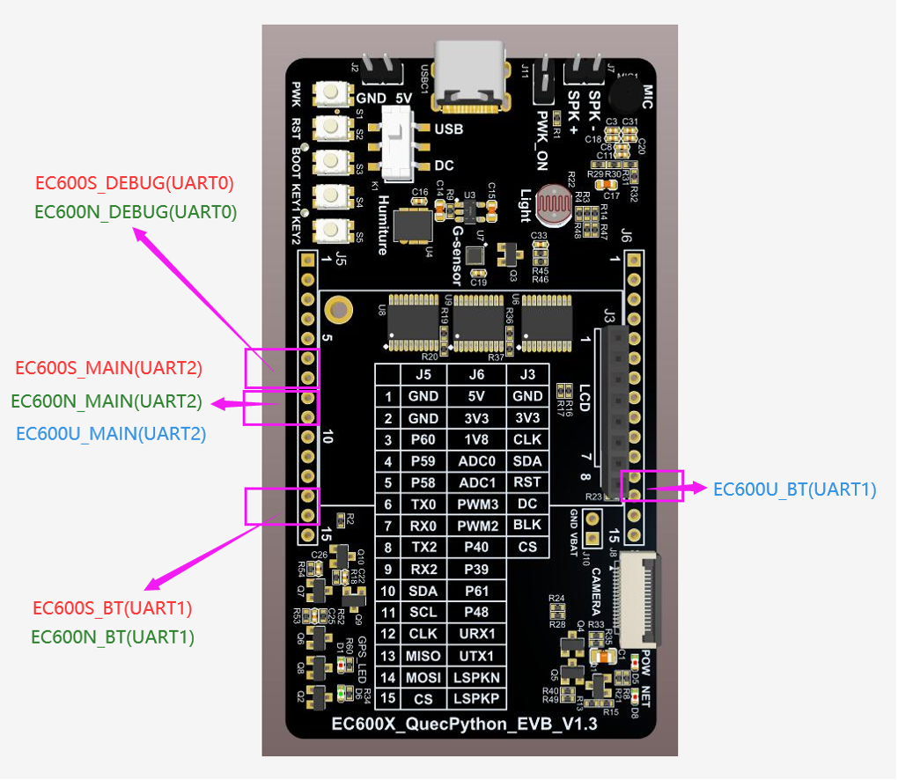
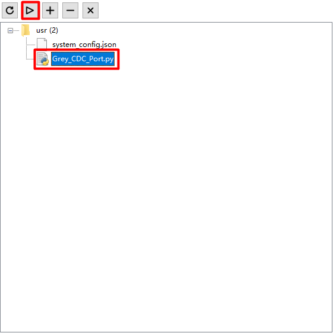
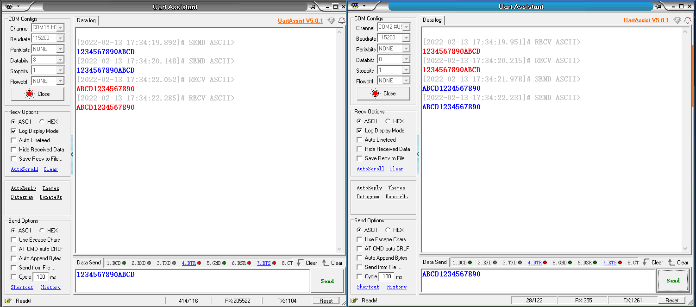

# UART实验

## 修订历史

| 版本 | 日期       | 作者    | 变更表述 |
| ---- | ---------- | ------- | -------- |
| 1.0  | 2021-09-22 | Grey.tu | 初版     |
| 1.1  | 2021-11-29 | Grey.tu | 勘误     |

文档主要介绍QuecPython_UART，UART作为一种常用的通用方式，主要用数据交互，可实现全双工传输。通过本文你将了解到EC600x（包括EC600S、EC600N、EC600U）UART的设置参数及使用方法。

有关API详解请参考 [QuecPython-machine-UART](https://python.quectel.com/wiki/#/zh-cn/api/QuecPythonClasslib?id=uart)


## 硬件设计

针对不同的模组，开放的UART列表如下：

| 模块型号 | UART编号                                                     | UART_PIN                                                     |
| -------- | ------------------------------------------------------------ | ------------------------------------------------------------ |
| EC600S/N | UART0_DEBUG PORT<br>UART1_BT PORT<br/>UART2_MAIN PORT<br />UART3_USB CDC PORT | UART0_DEBUG_PORT(TX => PIN71 & RX => PIN72)<br />UART1_BT_PORT(TX => PIN3 & RX => PIN2)<br />UART2_MAIN_PORT(TX => PIN32 & RX => PIN31)<br />USB_CDC_PORT ==> USB虚拟口，波特率不受限 |
| EC600U   | UART0_DEBUG PORT<br />UART1_BT PORT<br/>UART2_MAIN PORT<br />UART3_USB CDC PORT | UART0_DEBUG_PORT(TX => PIN71 & RX => PIN72)<br />UART1_BT_PORT(TX => PIN124 & RX => PIN123) <br />UART2_MAIN_PORT(TX => PIN32 & RX => PIN31)<br />USB_CDC_PORT ==> USB虚拟口，波特率不受限<br />注: EC600U_DEBUG PORT只能作为DEBUG_LOG输出使用, <br />不能作为UART通信使用. |

官方QuecPython开发板V1.2/V1.3的UART位置标记如下图：



注：此图仅适用于官方QuecPython开发板V1.2/V1.3。后续开发板视情况而定。


## 软件设计

物理 UART 基本连接使用我们在 UART 功能章节已经介绍，我们本章介绍下 USB CDC PORT。

USB CDC PORT 为USB虚拟的串行通信口，此通信口采用 UART 一样的通信协议，但并未真正意义的 UART。它的通信速率不受 UART 波特率的限制，可根据USB协议自动设别。可以更快速率的传输数据，也无需固定波特率的繁琐。

```python
# import log
import utime
import _thread
import ubinascii
from machine import UART

state = 1
uart_x = None
usbcdc = None


def uart_x_read():
    global state
    global uart_x
    global usbcdc

    while state:
        msglen = uart_x.any()  # Returns whether there is a readable length of data
        if msglen:  # Read when data is available
            msg = uart_x.read(msglen)  # Read Data
            utf8_msg = msg.decode()  # The initial data is byte type (bytes), which encodes byte type data
            if "Grey" in utf8_msg:
                break
            else:
                usbcdc.write("{}".format(utf8_msg))  # send data
        utime.sleep_ms(1)
    state = 0


def usbcdc_read():
    global state
    global uart_x
    global usbcdc

    while state:
        msglen = usbcdc.any()  # Returns whether there is a readable length of data
        if msglen:  # Read when data is available
            msg = usbcdc.read(msglen)  # Read Data
            utf8_msg = msg.decode()  # The initial data is byte type (bytes), which encodes byte type data
            if "Grey" in utf8_msg:
                break
            else:
                uart_x.write("{}".format(utf8_msg))  # send data
        utime.sleep_ms(1)
    state = 0


if __name__ == "__main__":
    uart_x = UART(UART.UART2, 115200, 8, 0, 1, 0)
    usbcdc = UART(UART.UART3, 115200, 8, 0, 1, 0)  # It is unvalid to set the baudrate, while in communication, any baudrate is available

    uart_x.write("Grey_test")
    usbcdc.write("Grey_test") 

    _thread.start_new_thread(uart_x_read, ())  # Create a thread to listen for receiving UART messages
    _thread.start_new_thread(usbcdc_read, ())  # Create a thread to listen for receiving CDC messages

    while state:
        utime.sleep_ms(1)
```

运行上面的脚本代码，便可实现物理 UART2 与 USB CDC PORT 的数据透传。


## 下载验证

下载.py 文件到模组运行：



下载之后，便可实现物理 UARTx 与 USB CDC PORT 的数据透传功能。




## 配套代码

<!-- * [下载代码](code/code_UART_CDC.py) -->
 <a href="code/code_UART_CDC.py" target="_blank">下载代码</a>