## 文档历史

**修订记录**

| **版本** | **日期**   | **作者** | **变更表述** |
| -------- | ---------- | -------- | ------------ |
| 1.0      | 2021-09-29 | Chic     | 初始版本     |
| 1.1      | 2022-01-29 | Chic     | 使用sys_bus  |


# QuecPython 接入阿里云

文档主要介绍如何使用“企业物联网平台”，企业物联网平台提供全托管的实例服务，无需自建物联网的基础设施即可便捷地接入和管理设备，具有低成本、高可靠、高性能、易运维的优势。下面主要从MQTT连接方式讲解，通过阅读本文，您将了解到QuecPython连接“企业物联网平台”的过程操作和验证实验理论。

## 云端设置

阿里云首页：<https://www.aliyun.com>

### 进入平台

点击【产品】---【物联网IoT】---【企业物联网平台】

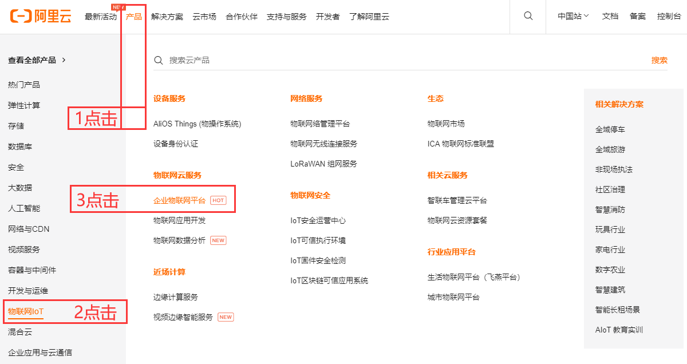

### 创建实例

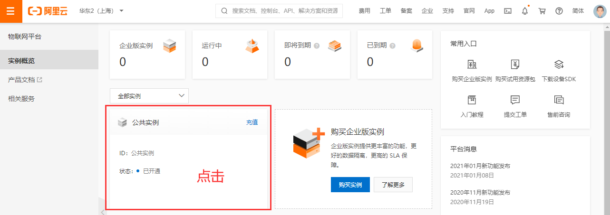

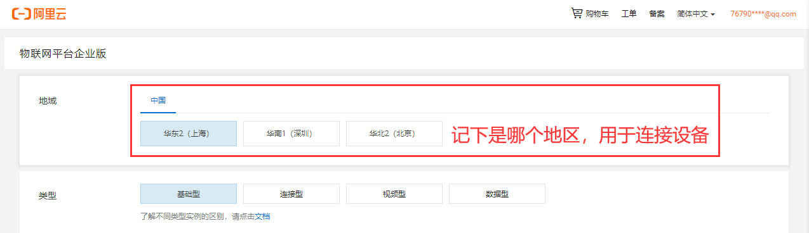

### 创建产品

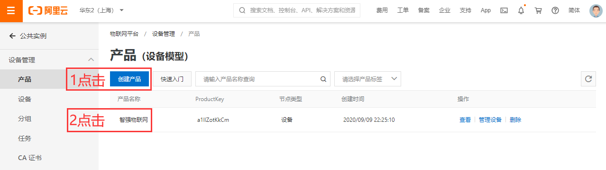

### 添加设备

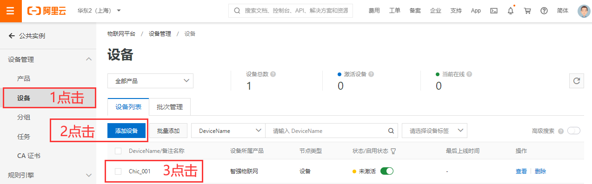

### 获取三元组

三元组ProductKey、DeviceName、DeviceSecret用于下个步骤生成连接密码

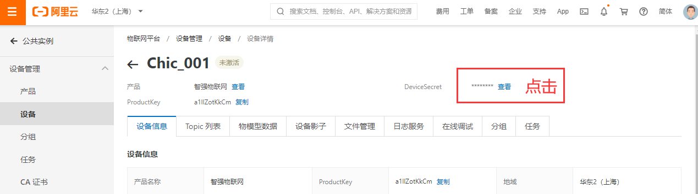

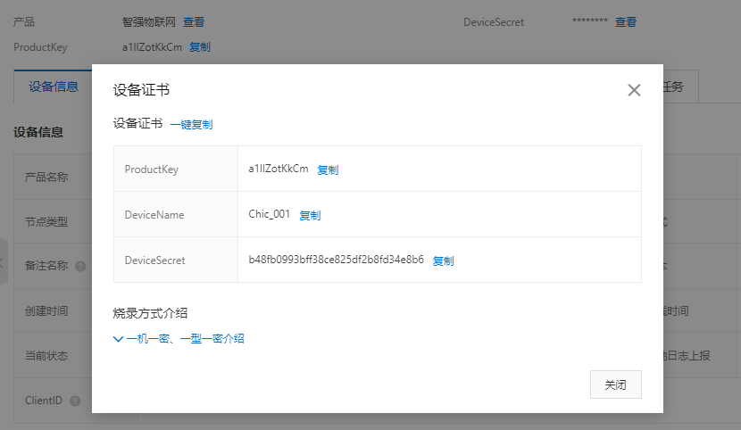

### 生成连接信息

单击下载Password生成小工具

http://docs-aliyun.cn-hangzhou.oss.aliyun-inc.com/assets/attach/189223/cn_zh/1605168543507/MQTT_Password.7z?spm=a2c4g.11186623.2.19.373573a8XfigN5&file=MQTT_Password.7z

#### 填入设备信息：

其中clientid是自定义，一般和deviceName同名即可，用于MQTT连接。

method加密方式要和连接MQTT时的设置一致。

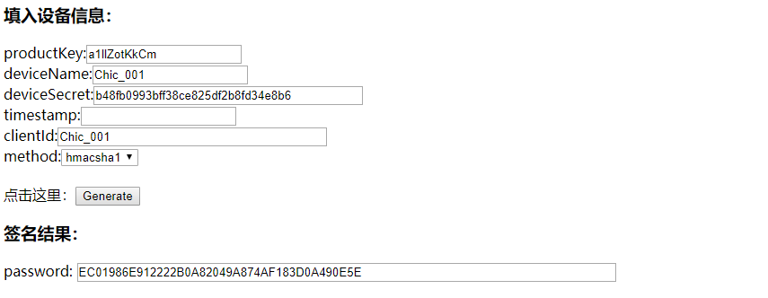

计算签名后，可获得Password，即可连接平台。

```
CLIENT_ID = b'Chic_001|securemode=3,signmethod=hmacsha1|'
SERVER = b'a1llZotKkCm.iot-as-mqtt.cn-shanghai.aliyuncs.com'
PORT = 1883
USER = b'Chic_001&a1llZotKkCm'
PASSWORD = b'EC01986E912222B0A82049A874AF183D0A490E5E'
```

**CLIENT_ID：**格式固定：\${clientId}\|securemode=3,signmethod=hmacsha1\|

​                       完整示例：Chic_001\|securemode=3,signmethod=hmacsha1\|

**USER：**固定格式：\${YourDeviceName}&\${YourProductKey}

​             完整示例：Chic_001&a1llZotKkCm

**PASSWORD：**即上面工具生成的字符串

**PORT：**固定1883

**SERVER：**\${YourProductKey}.iot-as-mqtt.\${YourRegionId}.aliyuncs.com，其中：

​				  ${YourProductKey}：请替换为设备所属产品的的ProductKey，可从物联网平台控制台设备详情页获取。

​				  ${YourRegionId}：在创建实例时选择的地区，替换为您的 Region ID。

​				  https://help.aliyun.com/document_detail/40654.html?spm=a2c4g.11186623.2.21.7b967908BJu7SZ

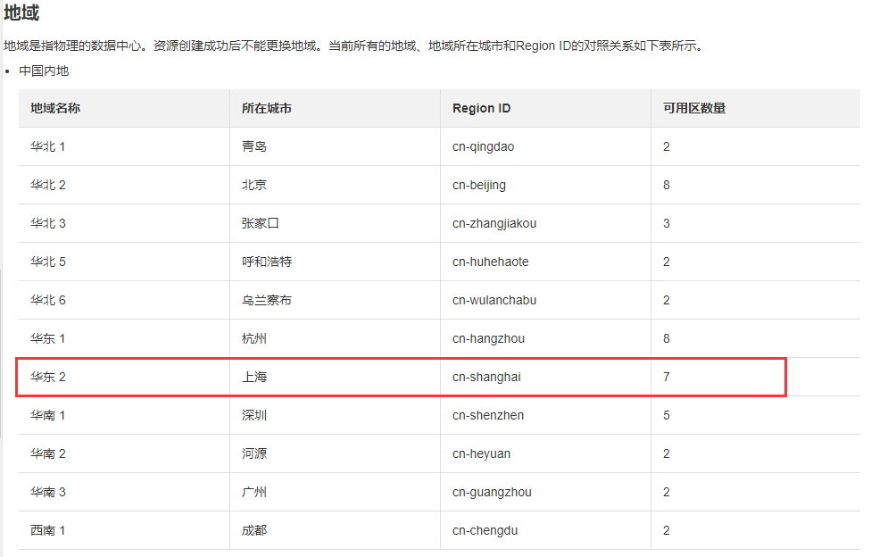

### 上报和下发数据

示例Topic如：/broadcast/a1llZotKkCm/123

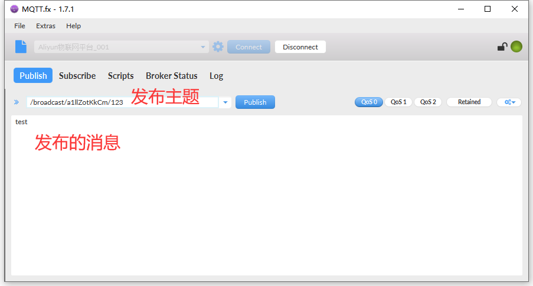

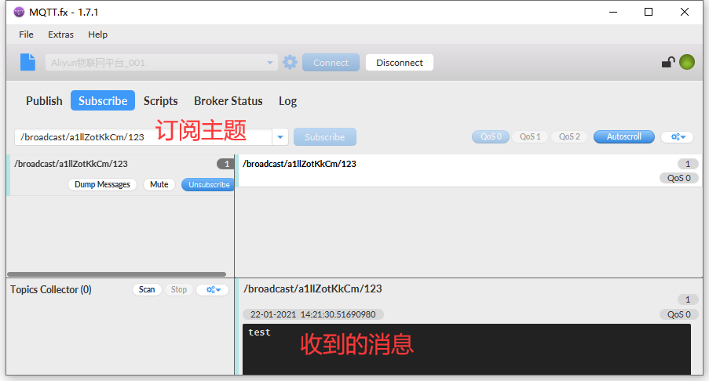

## 软件设计

​		在AliyunCloud平台取得ProductKey、DeviceName、DeviceSecret之后，即可使用aLiYun套件连接云平台，连接云平台的地址和端口固定不变，因此在程序中设定相应连接信息之后，就可以运行实验了。

示例代码：

```python

import utime
import checkNet
from aLiYun import aLiYun
import _thread
import sys_bus


class SYSTOPIC_Class(object):
    RRPC = "rrpc"
    OTA = "ota"
    PUB = "pub"
    SUB = "sub"


class aliyun_Class(object):
    def __init__(self):
        aliyun_Class.inst = self
        self.productKey = "a1llZotKkCm"  # 产品标识
        self.productSecret = 'mj7qKfEn73y07gyK'  # 产品密钥（一机一密认证此参数传入None）
        self.DeviceSecret = None  # 设备密钥（一型一密认证此参数传入None）
        self.DeviceName = "Chic_001"  # 设备名称
        # /broadcast/a1llZotKkCm/123
        self.subscribe_topic1 = "/broadcast" + "/" + self.productKey + "/" + "123"
        self.subscribe_topic2 = "/broadcast" + "/" + self.productKey + "/" + "123"
        self.publish_topic1 = "/broadcast" + "/" + self.productKey + "/" + "123"

        # 创建aliyun连接对象
        self.ali = aLiYun(
            self.productKey,
            self.productSecret,
            self.DeviceName,
            self.DeviceSecret)
        # 设置mqtt连接属性
        clientID = b'clientID'  # 自定义字符（不超过64）
        ret = self.ali.setMqtt(
            clientID,
            clean_session=False,
            keepAlive=60,
            reconn=True)  # False True

        # 设置回调函数
        self.ali.setCallback(self.ali_sub_cb)

    def ali_sub_cb(self, topic, msg):  # 回调函数
        if topic.decode().find(SYSTOPIC.RRPC) != -1:
            sys_bus.publish(SYSTOPIC.RRPC, {"topic": topic, "msg": msg})
        elif topic.decode().find(SYSTOPIC.OTA) != -1:
            sys_bus.publish(SYSTOPIC.OTA, {"topic": topic, "msg": msg})
        else:
            sys_bus.publish(SYSTOPIC.SUB, {"topic": topic, "msg": msg})

    def ali_start(self):
        # 运行
        self.ali.start()
        print('Runing')
        # aLiYun.disconnect()

    def ali_subscribe_topic(self):
        # 订阅主题
        self.ali.subscribe(self.subscribe_topic1, qos=0)
        # self.ali.subscribe(self.subscribe_topic2, qos=0)

    def ali_publish(self, topic, msg):
        ret = self.ali.getAliyunSta()
        # print(ret)
        if ret == 0:
            try:
                self.ali.publish(msg.get('topic'), msg.get("msg"), qos=0)
            except BaseException:
                print('！！！！！！！！！！发送失败')


class Handler(object):
    @classmethod
    def sub(cls, topic, msg):
        print(
            "Subscribe Recv: Topic={},Msg={}".format(
                msg.get('topic').decode(),
                msg.get("msg").decode()))

    @classmethod
    def pub(cls, msg):
        while True:
            sys_bus.publish(SYSTOPIC.PUB, msg)
            utime.sleep_ms(2000)

    @classmethod
    def ota(cls, topic, msg):
        """处理完ota的信息后，同步发送"""
        msg = {"topic": "xxx", "msg": "xxx"}
        """同步publish，同步情况下会等待所有topic对应的处理函数处理完才会退出"""
        sys_bus.publish_sync(SYSTOPIC.PUB, msg)

    @classmethod
    def rrpc(cls, topic, msg):
        """发布rrpc执行下列操作"""
        msg = {"topic": "xxx", "msg": "xxx"}
        """异步publish， """
        sys_bus.publish(SYSTOPIC.PUB, msg)


if __name__ == '__main__':
    PROJECT_NAME = "QuecPython"
    PROJECT_VERSION = "1.0.0"
    checknet = checkNet.CheckNetwork(PROJECT_NAME, PROJECT_VERSION)
    checknet.poweron_print_once()
    checknet.wait_network_connected()

    aliyunClass = aliyun_Class()
    aliyunClass.ali_subscribe_topic()

    SYSTOPIC = SYSTOPIC_Class()
    sys_bus.subscribe(SYSTOPIC.RRPC, Handler.rrpc)
    sys_bus.subscribe(SYSTOPIC.OTA, Handler.ota)
    sys_bus.subscribe(SYSTOPIC.SUB, Handler.sub)
    sys_bus.subscribe(SYSTOPIC.PUB, aliyunClass.ali_publish)

    tuple = ({"topic": aliyunClass.publish_topic1, "msg": "hello world"},)
    _thread.start_new_thread(Handler.pub, tuple)

    aliyunClass.ali_start()

```

接下来就可以下载验证了，python代码不需要编译，直接通过QPYcom工具把.py文件下载到模块中运行。

## 下载验证

下载.py文件到模组运行：

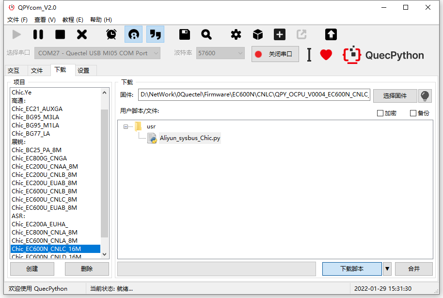

下载之后，手动让脚本运行起来。

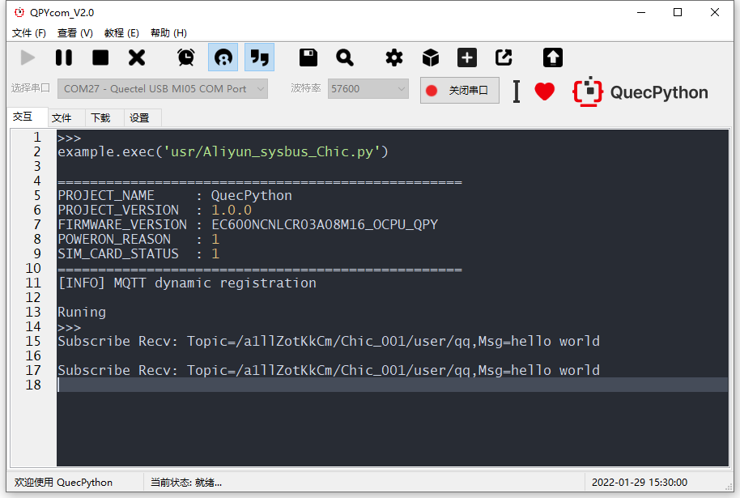

## 配套代码

<!-- * [下载代码](code/Aliyun_sysbus_Chic.py) -->
 <a href="code/Aliyun_sysbus_Chic.py" target="_blank">下载代码</a>