## 文档历史

| **版本** | **日期**   | **作者** | **变更表述** |
| -------- | ---------- | -------- | ------------ |
| 1.0      | 2021-04-30 | Chic     | 初始版本     |
| 1.1      | 2021-09-08 | Chic     | 改为DMP      |


## 登录平台创建项目和产品

设备管理平台：https://iot-cloud.quectel.com/Login 

进入链接后的界面如下图所示：

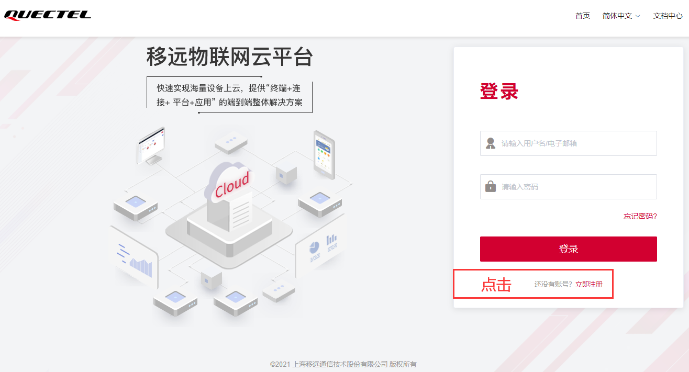

点击【立即注册】，选择自己的类型，我这里是“个人开发者”，使用个人邮箱就可以完成注册，然后使用注册的邮箱登录即可。“限制项”的数量上，企业比个人更多，例如项目数量，企业帐号可以创建的项目数500个，而个人账号只能50个。

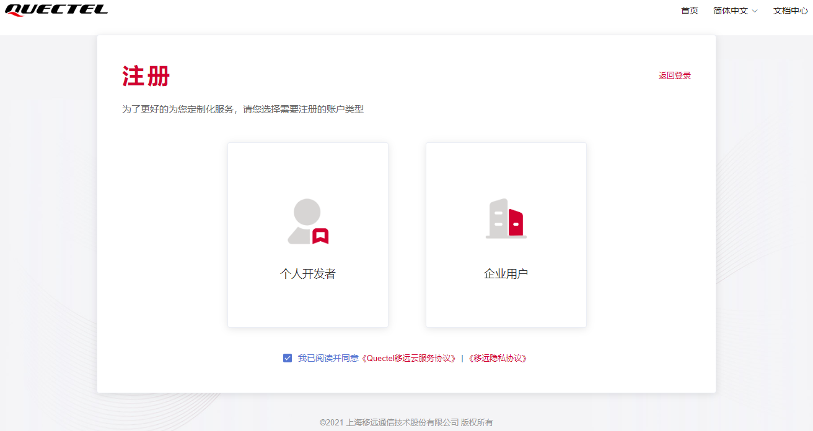

登录之后，可以看到已经创建的项目，我这里有2个项目，点击右侧【新建项目】，建立自己的项目。

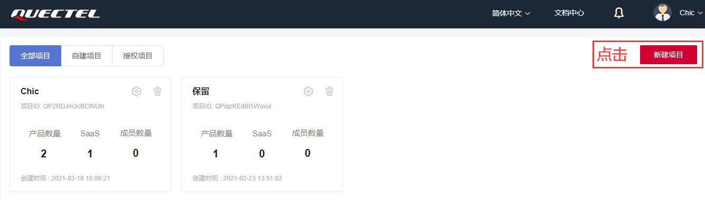

只需输入“项目名称”，点击【确认】，即可完成项目新建。

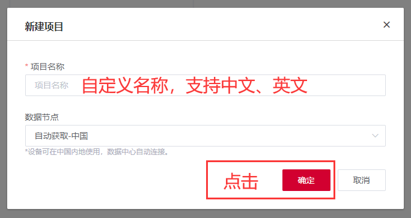

点击左侧上一步创建的项目，查看项目下的产品。

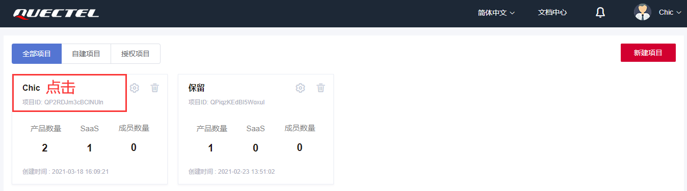

进入项目页面后，新页面中看到项目下的“产品”，点击右侧【创建产品】，新建产品类型。

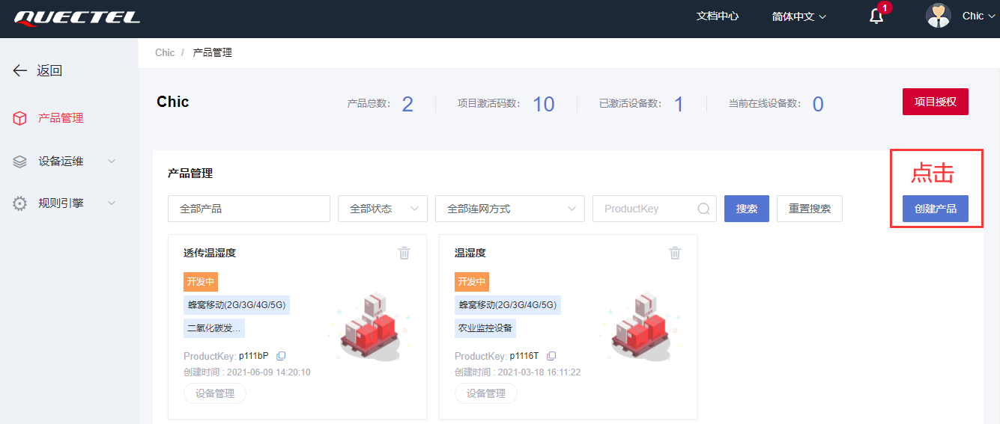

输入“产品名称”，选择产品类型只对物模型产品数据有效，这里我们创建透传产品，透传数据方式通信。

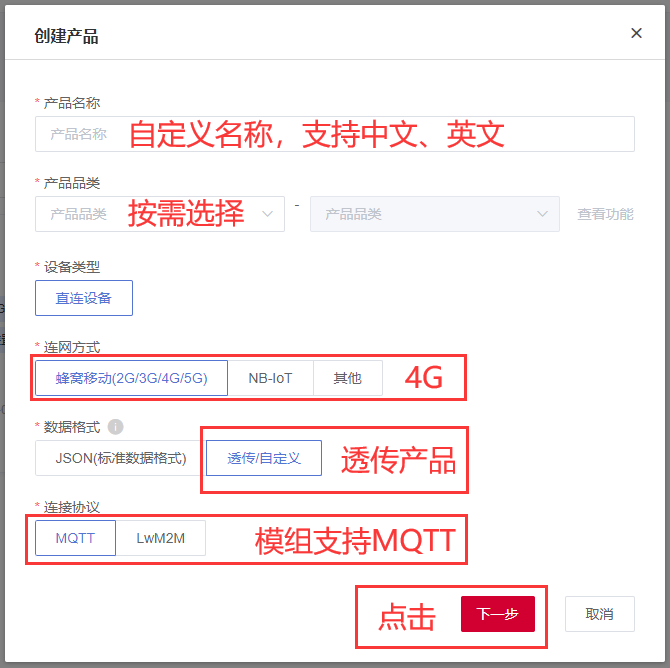

点击【下一步】，选择产品所用的模组型号，点【确认选择】，方便自己管理各个项目，如果没有自己的模组选择，则点击【直接跳过】。

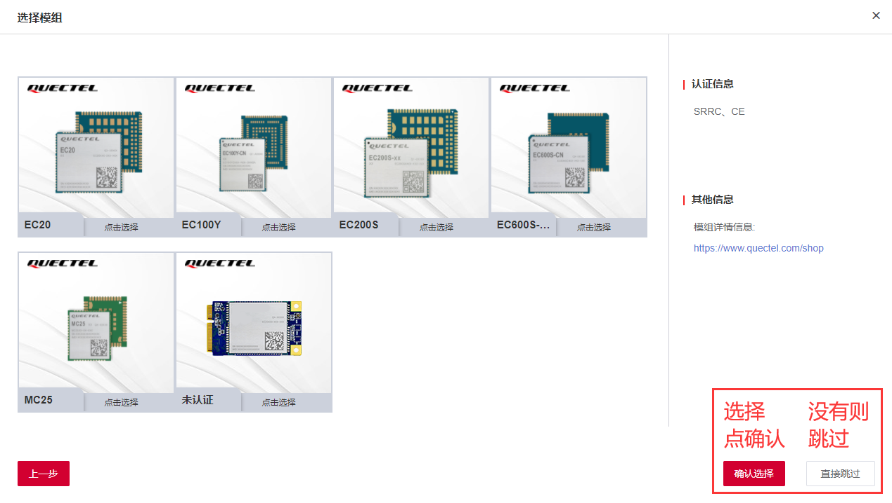

完成创建产品后，可以看到刚才建立的产品信息。

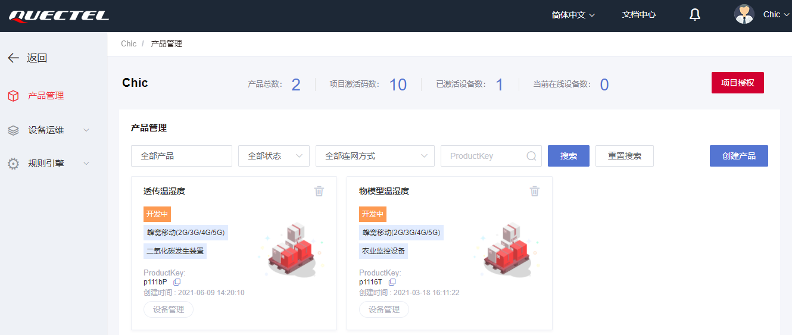

上方显示：

产品总数：项目下的产品数量；

项目激活码数：项目下的总设备激活码数，每激活一个设备消耗一个激活码；

已激活设备数：新增的设备初始状态是未激活，当设备发送上下行消息超过1000条时，设备状态由“未激活”变成“激活”。

当前在线设备数：显示当前连接上平台的设备数量。

 

这里有两个产品，一个PaaS透传产品，支持直接透传数据；另一个是JSON物模型产品，支持在平台定义它的功能。

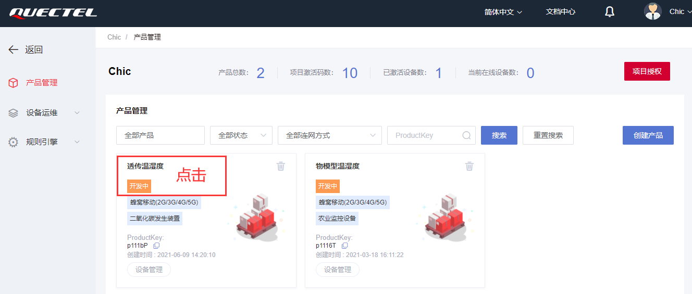

点击产品名称进入查看“产品信息”

【基本信息】重点注意ProductKey、ProductSecret在模组连接平台时用到，数据格式是“透传/自定义”则是PaaS透传产品；如果数据格式是“JSON（标准数据格式）”属于JSON通信物模型产品。

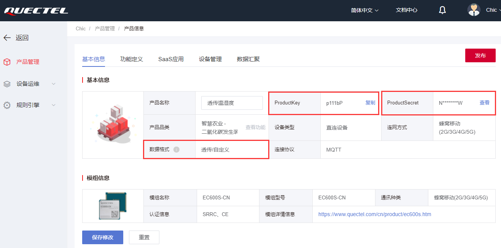


## QuecPython设备连接设备管理平台

下面介绍用QuecPython代码在模组上连接平台。

连接设备至“设备管理平台”

1）设备上电后首先导入quecIot模块，[初始化Quecthing](https://iot-cloud.quectel.com/help?id=3010)。

​	import quecIot

​	quecIot.init()

2）根据产品需要[配置云平台通信协议和引导/认证服务器](https://iot-cloud.quectel.com/help?id=3013)，若不配置，则使用默认的通信协议和服务器地址。

​	quecIot.setServer(1,"iot-south.quectel.com:2883") 

3）根据在云平台创建时获取到的产品信息，[配置云平台产品信息](https://iot-cloud.quectel.com/help?id=3013)。

​	quecIot.setProductinfo("p11169","QlZ**********WJR")  

4）根据产品需要，[配置云平台lifetime](https://iot-cloud.quectel.com/help?id=3013)，若不配置，则使用默认的lifetime(MQTT:120)。

​	quecIot.setLifetime(120) 

5）根据产品需要[配置云平台PDP Context ID](https://iot-cloud.quectel.com/help?id=3013)，若不配置，则使用默认的PDP Conecte ID(1)。

​	quecIot.setPdpContextId(1)

6）根据产品需要[配置云平台自动连接模式](https://iot-cloud.quectel.com/help?id=3011),若不配置，则默认不连接云平台。

​	quecIot.setConnmode(1)  

7）注册[云平台事件接收回调函数](https://iot-cloud.quectel.com/help?id=3016)，根据回调事件判断云平台当前连接状态。

​	quecIot.setEventCB(queciot_even_cb)

 

【设备管理】可以查看该产品下已注册的设备及设备基本详情，同时支持对设备的删除及二次认证。

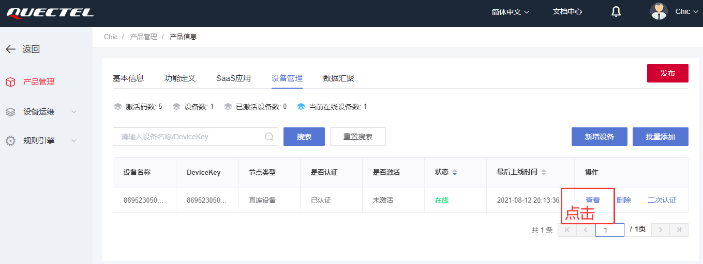

点击设备列表中右侧的“查看”，进入设备详细里面的“设备调试”

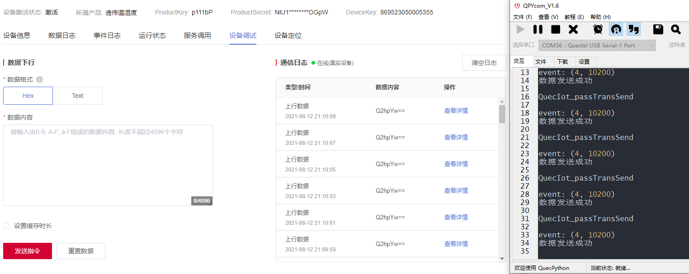


## 软件设计

示例代码：

```python
import quecIot
import _thread
import utime

key = "p111bP"  # 填入产品key
src = "NlU1VFdpN29OOGpW"  # 填入产品密钥

class Quecthing:
    def __init__(self):
        # ''' 初始化qucsdk '''
        quecIot.init()
        # ''' 注册事件回调函数 '''
        quecIot.setEventCB(self.eventCB)
        # ''' 配置产品信息'''
        quecIot.setProductinfo(key, src)
        # ''' 启动云平台连接 '''
        quecIot.setConnmode(1)
        return

    @staticmethod
    def eventCB(data):
        print("event:", data)
        event = data[0]
        errcode = data[1]
        if len(data) > 2:
            data = data[2]

        if event == 1:  # 发送数据操作
            if errcode == 10200:
                print('设备认证成功')
            elif errcode == 10422:
                print('设备已认证（连接失败）')
        elif event == 2:  # 接入操作
            if errcode == 10200:
                print('接入成功')
        elif event == 3:  # 发送数据操作
            if errcode == 10200:
                print('订阅成功')
        elif event == 4:  # 发送数据操作
            if errcode == 10200:
                print('数据发送成功')
        elif event == 5:  # 接收数据操作
            if errcode == 10210:
                print('透传数据')
                print(data)
            if errcode == 10210:
                print('接收数据操作')
            elif errcode == 10211:
                print('平台读取数据')
        elif event == 6:  # 接入操作
            if errcode == 10200:
                print('注销成功（断开连接成功）')
        elif event == 7:  # FOTA操作
            if errcode == 10700:
                print('有升级任务,为配置信息')

def QuecIot_passTransSend():
    while True:
        quecIot.passTransSend(1, 'Chic')
        utime.sleep_ms(2000)

        print('QuecIot_passTransSend')

if __name__ == '__main__':
    Quecthing()
    _thread.start_new_thread(QuecIot_passTransSend, ())
```

接下来就可以下载验证了，python代码不需要编译，直接通过QPYcom工具把.py文件下载到模块中运行。


## 设备调试进阶

【设备管理】可以查看该产品下已注册的设备及设备基本详情，同时支持对设备的删除及二次认证。


点击设备列表中右侧的“查看”，进入设备详细。

【设备信息】物模型产品时可上报信息给平台。

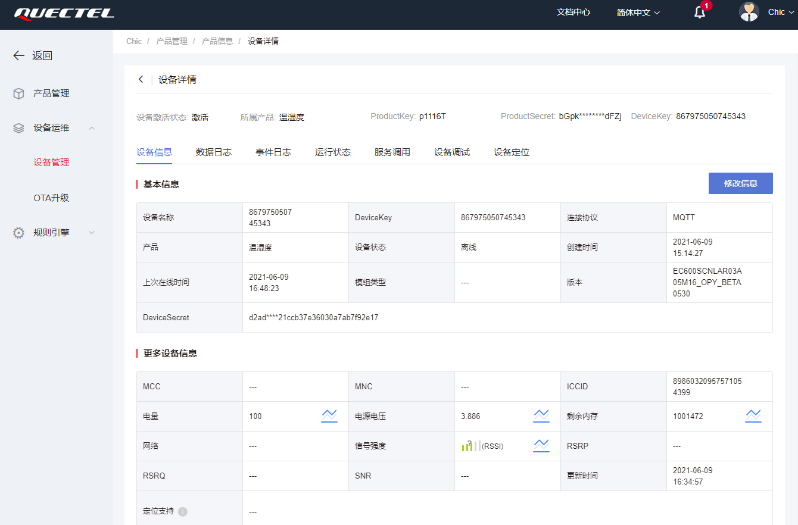

譬如：电量、电源电压、信号强度等，模组上报的信息都在这个页面显示。

【数据日志】中记录的是模组上传的每一条数据内容，在“数据内容”中点击“查看”，选择模组上传的同时支持HexString、Base64、Text等三种数据格式。

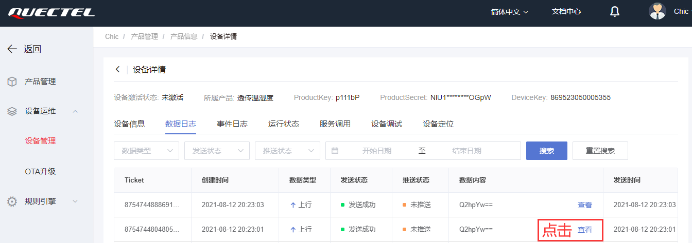

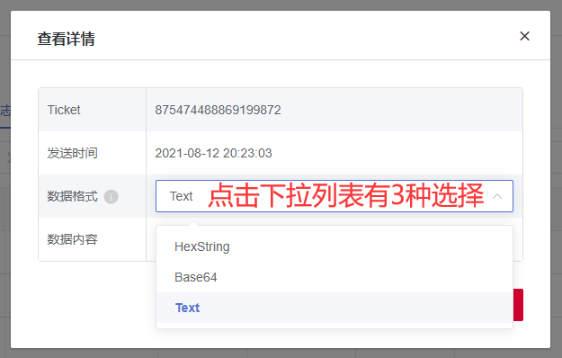

【事件日志】中记录的是模组每次上线、下线等活动的事件。

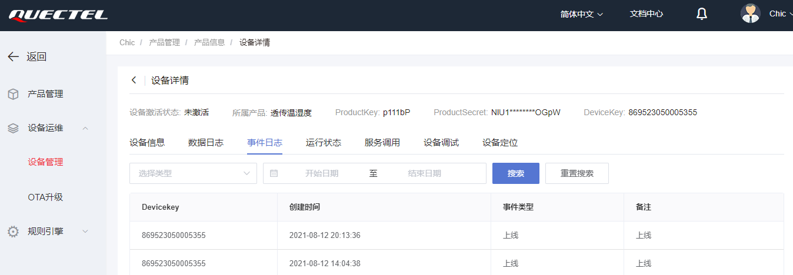

【运行状态】仅在物模型产品时有效。

【服务调用】仅在物模型产品时有效。

【设备调试】在透传设备的设备调试中，有Hex和Text两种数据格式的发送调试。Hex表示十六进制，Text是字符串文本格式。右侧“通信日志”实时显示上行、下行的信息，点击“查看详细”可查看Hex或Text数据。

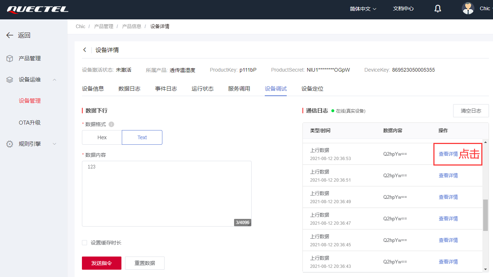

下行数据->模组：Hex

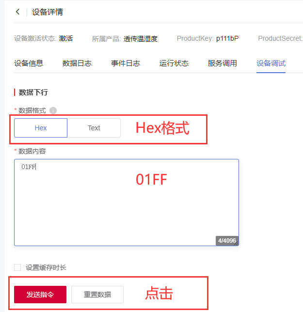

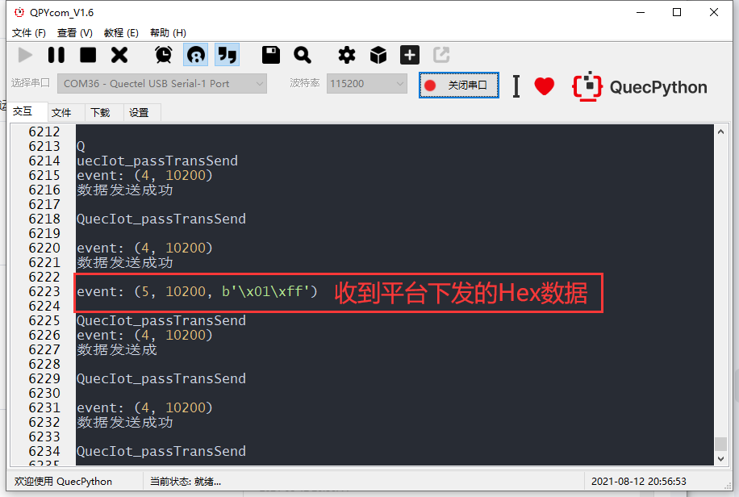

下行数据->模组：Text

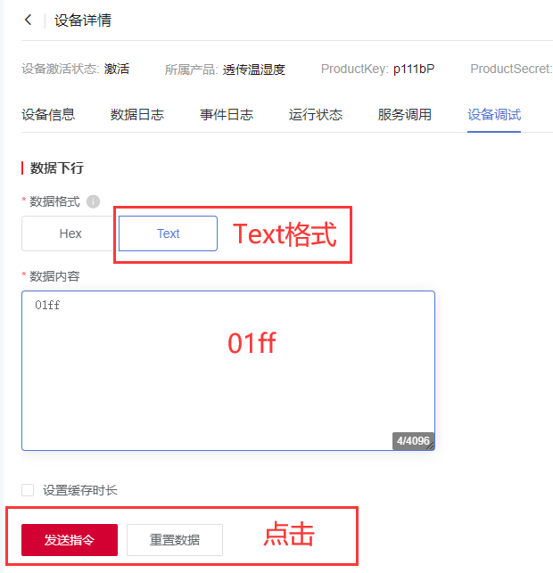

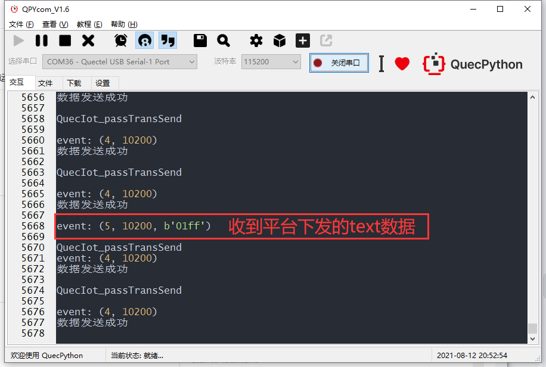

上行数据->平台：

模组中的代码每两秒上传一次数据。

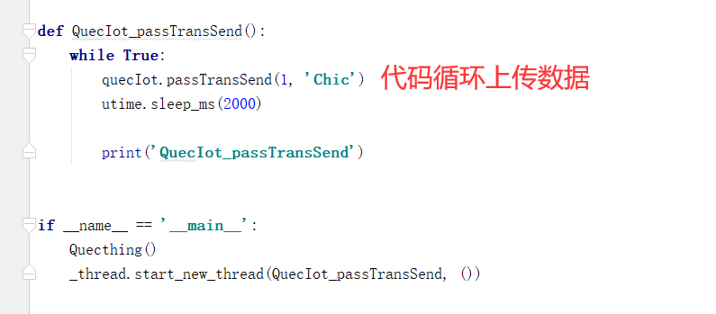

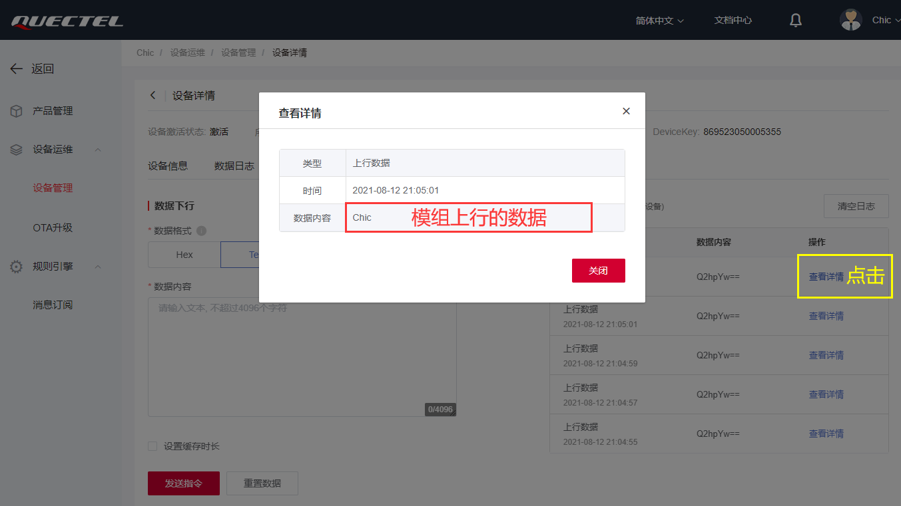


友情链接

设备管理平台：https://iot-cloud.quectel.com/Login 


## 配套代码
