## 文档历史

**修订记录**

| **版本** | **日期**   | **作者** | **变更表述** |
| -------- | ---------- | -------- | ------------ |
| 1.0      | 2021-09-29 | Chic     | 初始版本     |
| 1.1      | 2022-01-29 | Chic     | 使用sys_bus  |


## 前言

文档主要介绍如何使用TencentCloud腾讯云，腾讯云物联网通信（Internet of Things Hub， IoT Hub）旨在提供一个安全、稳定、高效的连接平台，帮助开发者低成本、快速地实现“设备-设备”、“设备-用户应用”、“设备-云服务”之间可靠、高并发的数据通信。不仅可以实现设备之间的互动、设备的数据上报和配置下发，还可以基于规则引擎和腾讯云产品打通，方便快捷地实现海量设备数据的存储、计算以及智能分析。下面主要从MQTT连接方式讲解，通过阅读本文，您将了解到QuecPython连接TencentCloud的过程操作和验证实验理论。

## 云端设置

腾讯云首页：<https://cloud.tencent.com/>

### 进入平台

点击右上角的“控制台”

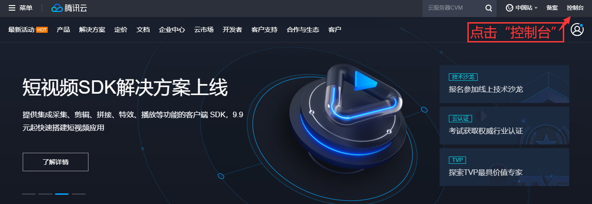

点击“云产品”---“物联网通信”

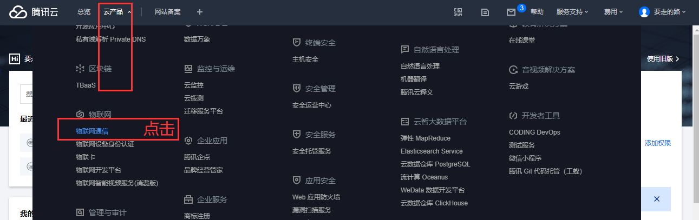

### 创建产品

在创建产品时的“认证方式”选择“密钥认证”

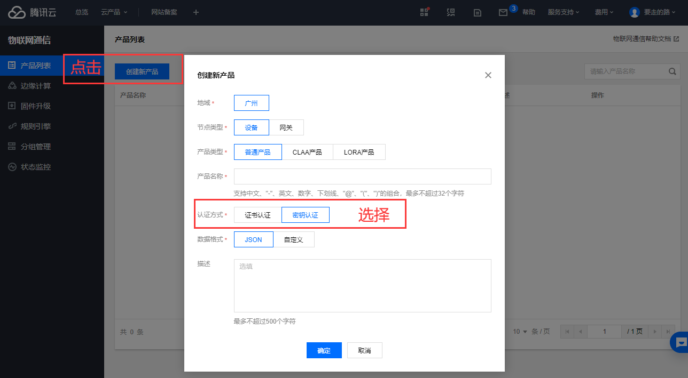

### 添加设备

1.点击图中的“产品名”进入添加设备界面

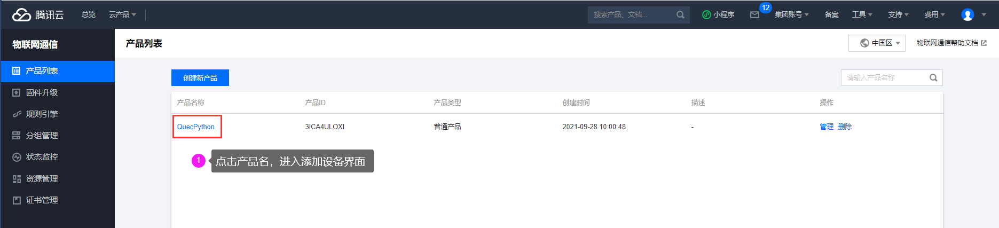

2.按图操作添加设备

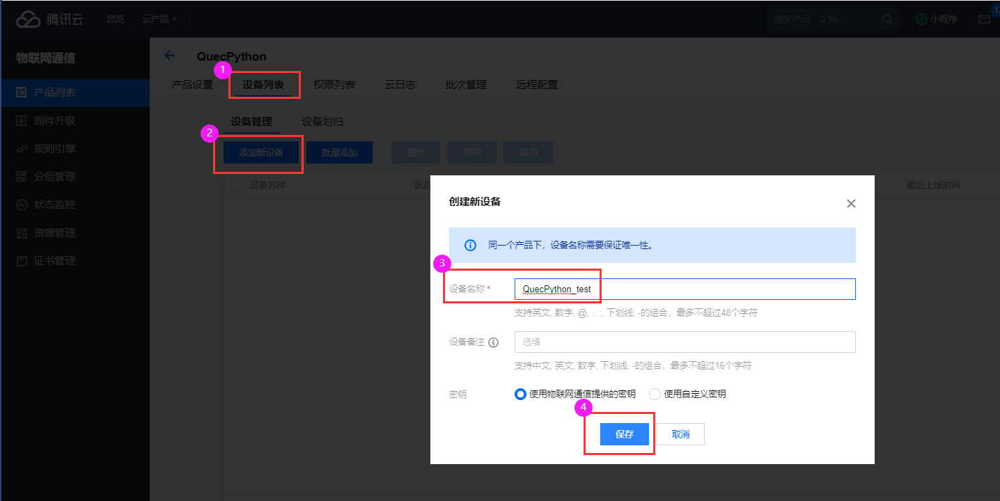

### 生成连接信息

对于一机一密的话，三元组需要关注以下几点：

**“productID”**位置如下（下图的3位置）

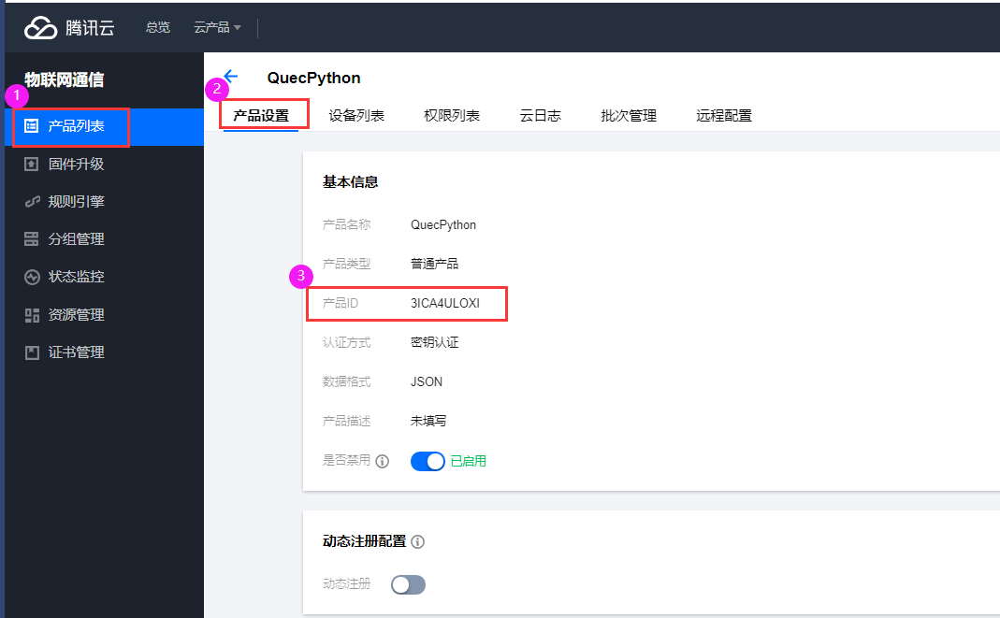

**“devicename”**和**“devicePsk”**位置如下（下图的3、4位置）

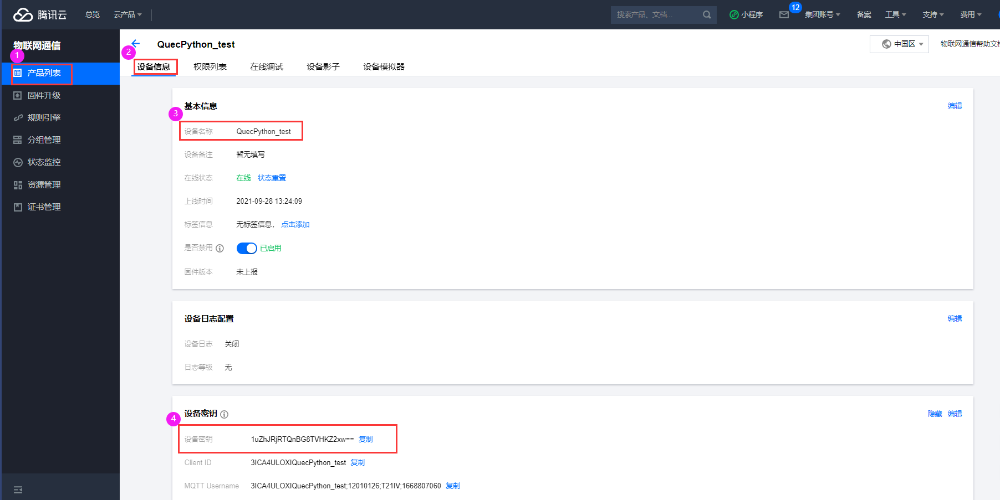

### 规则引擎

规则引擎用于主题消息转发，本文的规则引擎配置如下：

规则引擎1（相同topic的规则转发）：

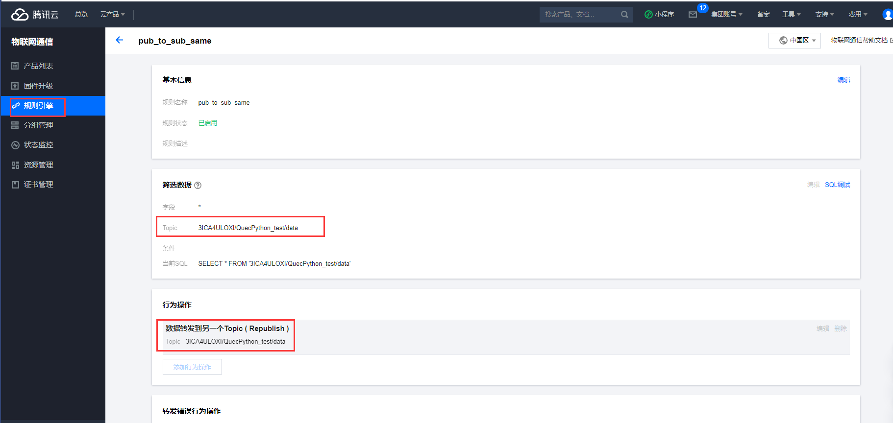

规则引擎2（不同topic的规则转发）：

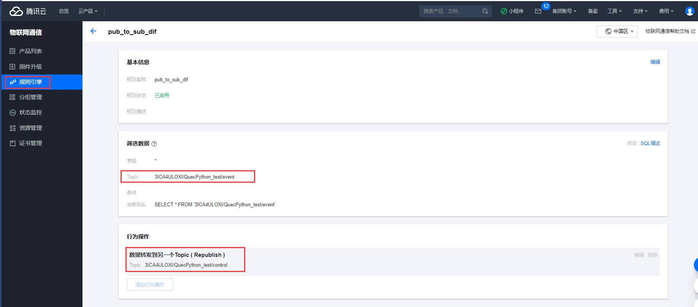

## 软件设计

示例代码如下，在此做几点解释：

（1）本代码使用腾讯云套件测试，对于一机一密的腾讯云连接只需要配置相应的三元组，即**productID、devicename、devicePsk**（具体如何找到对应的信息参考上面“**生成连接信息**”）

（2）本代码做了两个简单的规则转发示例，具体原理是：代码中向**topic = "3ICA4ULOXI/QuecPython_test/data"**发布消息，同时会订阅到此主题的数据（原因是做了规则转发且此主题支持发布与订阅）；代码中向**pub_topic = "3ICA4ULOXI/QuecPython_test/event"**发布消息，会订阅到**sub_topic = "3ICA4ULOXI/QuecPython_test/control"**主题的消息（原因是做了规则转发）

```python

import utime
import checkNet
from TenCentYun import TXyun
import _thread
import sys_bus

class SYSTOPIC_Class(object):
    RRPC = "rrpc"
    OTA = "ota"
    PUB = "pub"
    SUB = "sub"

class TXyun_Class(object):
    def __init__(self):
        self.productID = "X3Z30XABBU"  # 产品标识
        self.devicename = "001"   # 设备名称
        self.devicePsk = None   # 设备密钥（一型一密认证此参数传入None）
        self.ProductSecret = 'TeXbX8bZ40vutWHGxfUGJEZS'   # 产品密钥（一机一密认证此参数传入None）

        # 输入自定义的Topic
        self.subscribe_topic1 = 'X3Z30XABBU/{}/data'.format(self.devicename)
        self.publish_topic1 = 'X3Z30XABBU/{}/data'.format(self.devicename)

        self.tenxun = TXyun(
            self.productID,
            self.devicename,
            self.devicePsk,
            self.ProductSecret)  # 创建连接对象
        self.tenxun.setMqtt()  # 设置mqtt
        self.tenxun.setCallback(self.sub_cb)  # 设置消息回调函数

    def sub_cb(self, topic, msg):   # 云端消息响应回调函数
        if topic.decode().find(SYSTOPIC.RRPC) != -1:
            sys_bus.publish(SYSTOPIC.RRPC, {"topic": topic, "msg": msg})
        elif topic.decode().find(SYSTOPIC.OTA) != -1:
            sys_bus.publish(SYSTOPIC.OTA, {"topic": topic, "msg": msg})
        else:
            sys_bus.publish(SYSTOPIC.SUB, {"topic": topic, "msg": msg})

    def TXyun_start(self):
        # 运行
        self.tenxun.start()
        print('start')

    def TXyun_subscribe_topic(self):
        # 订阅主题
        self.tenxun.subscribe(self.subscribe_topic1, qos=0)
        # self.tenxun.subscribe(self.subscribe_topic2, qos=0)

    def TXyun_publish(self, topic, msg):
        try:
            self.tenxun.publish(msg.get('topic'), msg.get("msg"), qos=0)
        except BaseException:
            print('！！！！！！！！！！发送失败')

class Handler(object):
    @classmethod
    def sub(cls, topic, msg):
        print(
            "Subscribe Recv: Topic={},Msg={}".format(
                msg.get('topic').decode(),
                msg.get("msg").decode()))

    @classmethod
    def pub(cls, msg):
        while True:
            sys_bus.publish(SYSTOPIC.PUB, msg)
            utime.sleep_ms(2000)

    @classmethod
    def ota(cls, topic, msg):
        """处理完ota的信息后，同步发送"""
        msg = {"topic": "xxx", "msg": "xxx"}
        """同步publish，同步情况下会等待所有topic对应的处理函数处理完才会退出"""
        sys_bus.publish_sync(SYSTOPIC.PUB, msg)

    @classmethod
    def rrpc(cls, topic, msg):
        """发布rrpc执行下列操作"""
        msg = {"topic": "xxx", "msg": "xxx"}
        """异步publish， """
        sys_bus.publish(SYSTOPIC.PUB, msg)

if __name__ == '__main__':
    PROJECT_NAME = "QuecPython"
    PROJECT_VERSION = "1.0.0"
    checknet = checkNet.CheckNetwork(PROJECT_NAME, PROJECT_VERSION)
    checknet.poweron_print_once()
    checknet.wait_network_connected()

    TXyunClass = TXyun_Class()
    TXyunClass.TXyun_subscribe_topic()

    SYSTOPIC = SYSTOPIC_Class()
    sys_bus.subscribe(SYSTOPIC.RRPC, Handler.rrpc)
    sys_bus.subscribe(SYSTOPIC.OTA, Handler.ota)
    sys_bus.subscribe(SYSTOPIC.SUB, Handler.sub)
    sys_bus.subscribe(SYSTOPIC.PUB, TXyunClass.TXyun_publish)

    msg = '{{"DeviceName":"{}","msg":"test publish"}}'.format(TXyunClass.devicename)
    tuple = ({"topic": TXyunClass.publish_topic1, "msg": msg},)
    _thread.start_new_thread(Handler.pub, tuple)

    TXyunClass.TXyun_start()

```

接下来就可以下载验证了，QuecPython代码不需要编译，直接通过QPYcom工具把.py文件下载到模块中运行。

## 下载验证

下载.py文件到模组中：

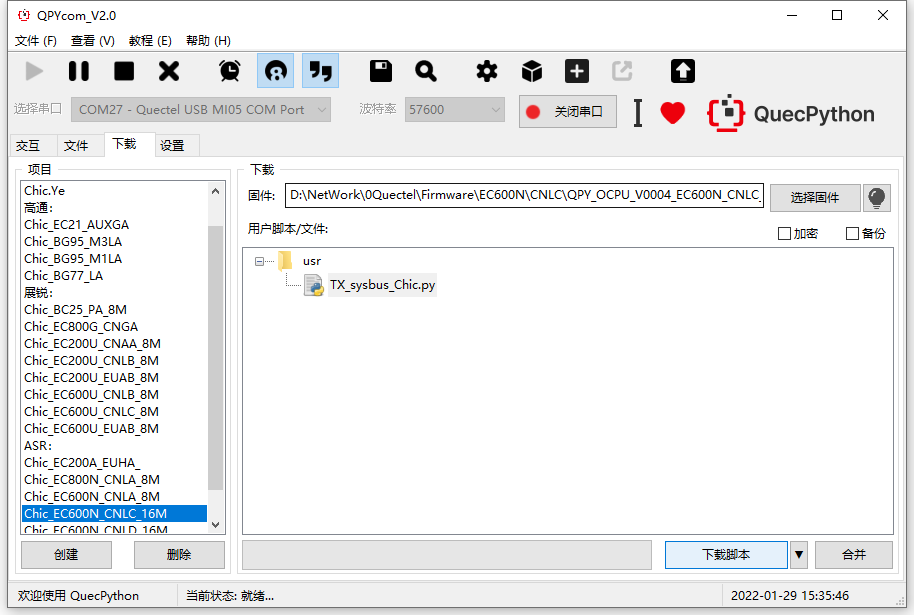

下载之后，手动让脚本运行起来，查看现象如下。

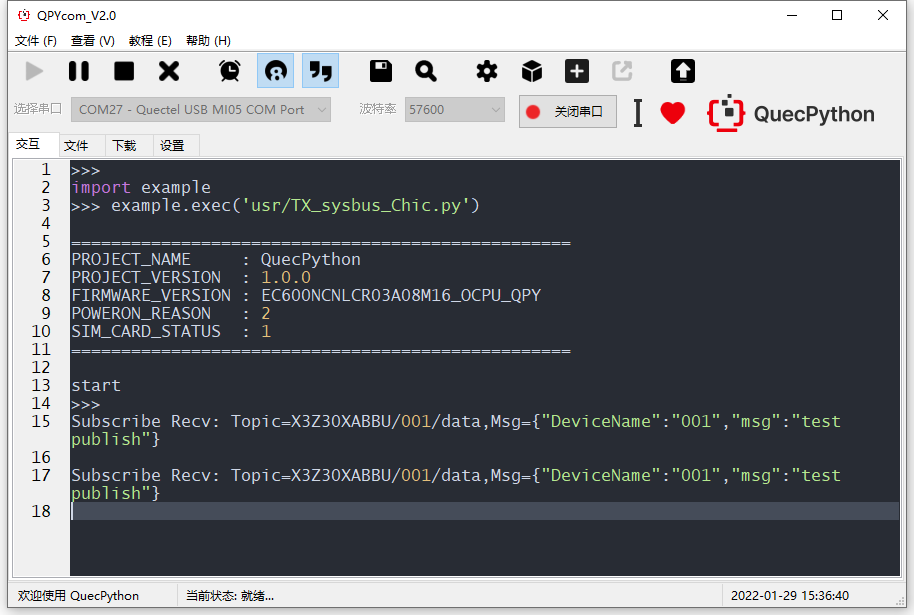


## 配套代码

<!-- * [下载代码](code/TX_sysbus_Chic.py) -->
 <a href="code/TX_sysbus_Chic.py" target="_blank">下载代码</a>