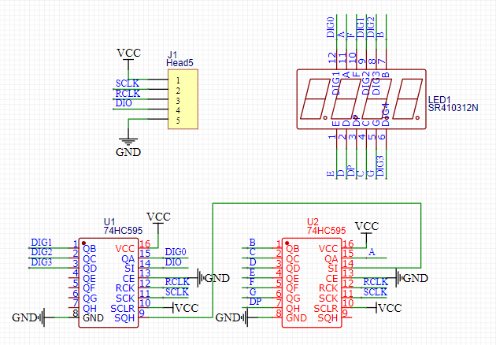
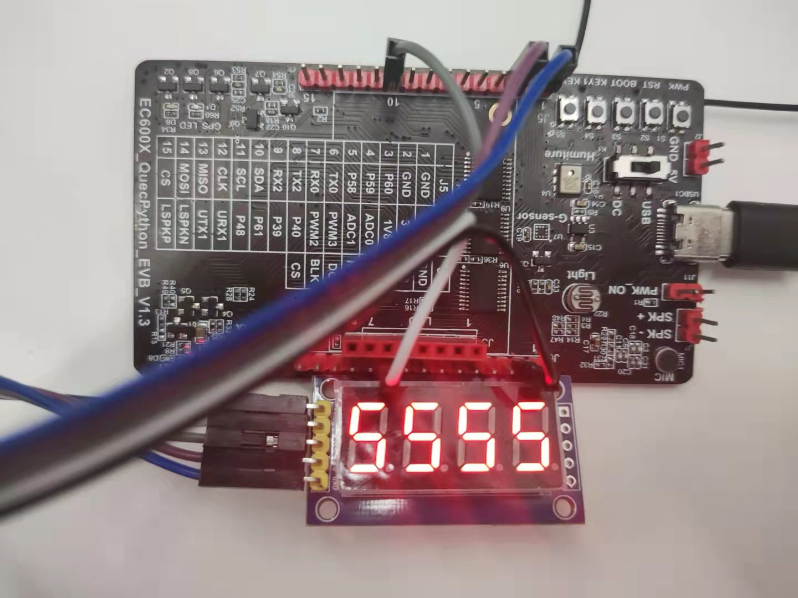

## 修订历史

| 版本 | 日期       | 作者   | 变更表述           |
| ---- | ---------- | ------ | ------------------ |
| 1.0  | 2021-09-23 | Kayden | 初始版本           |
| 1.1  | 2022-03-25 | Kayden | 文档及代码优化调整 |


## 数码管开发实验

本篇文章主要简介基于EC600X_QuecPython_EVB_V1.3开发板进行数码管开发实验，直接适用的模组为EC600S、EC600N、EC600U，其他模组及开发板仅需要较少的修改即可适用，如有疑问请与我们联系。

## 硬件资源

本实验使用的模组硬件资源只有GPIO，由于使用的是数码管模块，仅需要三个GPIO就可以进行本实验。关于数码管模块的介绍和接线情况下面进行详细介绍。

共阳极四位数码管模块原理图：

关于共阳极数码管和74HC595驱动芯片相关资料可自行在互联网中搜索，资料比较丰富。



本实验为了尽量做到搭载不同模组的开发板之间接线的通用性，接线均接在固定的排针脚，具体连接情况以及排针对应软件GPIO号情况见下表，或自行使用原理图并结合[GPIO相关API](https://python.quectel.com/wiki/#/zh-cn/api/QuecPythonClasslib?id=pin)获取相关信息。

| 数码管模块排针名称 | V1.3开发板排针名称及模组引脚号 | EC600S/EC600N GPIO | EC600U GPIO |
| ------------------ | ------------------------------ | ------------------ | ----------- |
| VCC                | 3V3                            | -                  | -           |
| SCLK               | P61                            | GPIO14             | GPIO1       |
| RCLK               | SDA(P58)                       | GPIO28             | GPIO16      |
| DIO                | P60                            | GPIO13             | GPIO4       |
| GND                | GND                            | -                  | -           |

## 实验代码

 <a href="code/Digital_tube.py" target="_blank">下载代码</a>

```python
"""
@Author: Kayden
@Date: 2021-09-23
@Description: Digital tube experiment
@FilePath: Digital_tube.py
"""
from machine import Pin
import utime

'''
数码管模块和V1.3开发板的排针连接方式为：
DIO接开发板上P60对应的排针
RCLK接开发板上P58对应的排针
SCLK接开发板上P61对应的排针
P60对应EC600S/EC600N模组的GPIO13、对应EC600U模组的GPIO4
P56对应EC600S/EC600N模组的GPIO28、对应EC600U模组的GPIO16
P61对应EC600S/EC600N模组的GPIO14、对应EC600U模组的GPIO1
'''
# 当使用的模组为EC600S/EC600N时
# DIO = Pin(Pin.GPIO13, Pin.OUT, Pin.PULL_PU, 0)
# RCLK = Pin(Pin.GPIO28, Pin.OUT, Pin.PULL_PU, 0)
# SCLK = Pin(Pin.GPIO14, Pin.OUT, Pin.PULL_PU, 0)

# 当使用的模组为EC600U时
DIO = Pin(Pin.GPIO4, Pin.OUT, Pin.PULL_PU, 0)
RCLK = Pin(Pin.GPIO16, Pin.OUT, Pin.PULL_PU, 0)
SCLK = Pin(Pin.GPIO1, Pin.OUT, Pin.PULL_PU, 0)


# 字模元组     0 	1	  2	   3	   4	5	 6	   7	   8	9	  A	   b	   C    d	  E      F     -
LED_fonts = (0xC0, 0xF9, 0xA4, 0xB0, 0x99, 0x92, 0x82, 0xF8, 0x80, 0x90, 0x88, 0x83, 0xC6, 0xA1, 0x86, 0x8E, 0xBF)


# 向74HC595写入数据的函数
def LED_OUT(data):
    for i in range(8):
        if data & 0X80:
            DIO.write(1)
        else:
            DIO.write(0)
        data <<= 1
        SCLK.write(0)
        SCLK.write(1)


# 数码管依次显示17个字模的函数
def LED_Display():
    for j in range(17):
        LED_OUT(LED_fonts[j])
        LED_OUT(0x0f)
        RCLK.write(0)
        RCLK.write(1)
        utime.sleep(1)


if __name__ == "__main__":
    while True:
        LED_Display()

```

## 实验操作

1.使用杜邦线进行硬件连接；

2.将示例代码下载进模组运行；

3.查看数码管上显示结果。

最终我们可以看到四个数码管循环显示17个字模，部分现象可见下图：



更多有关于数码管使用的方法可百度查找资料。

