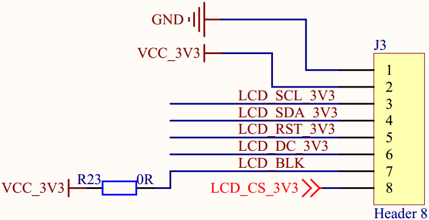
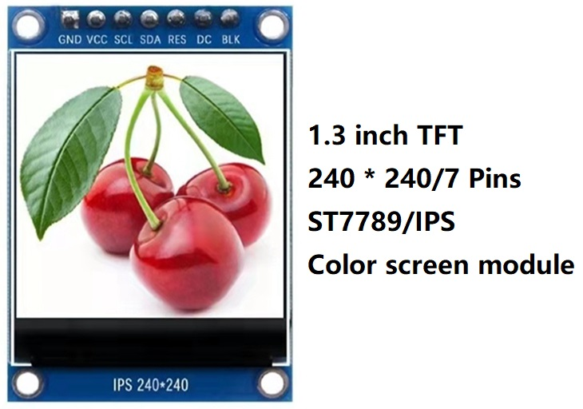
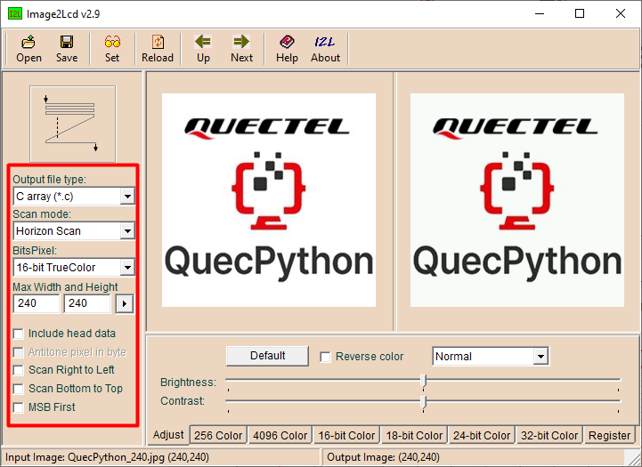
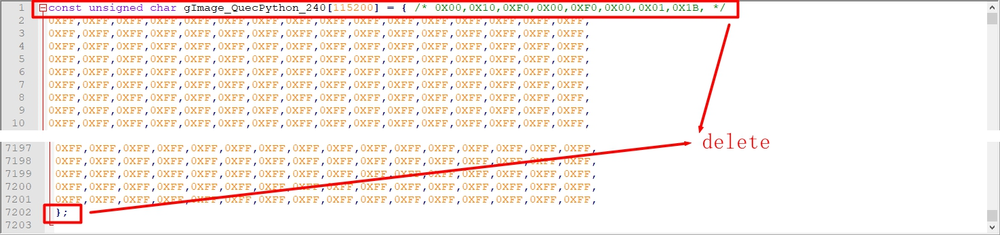
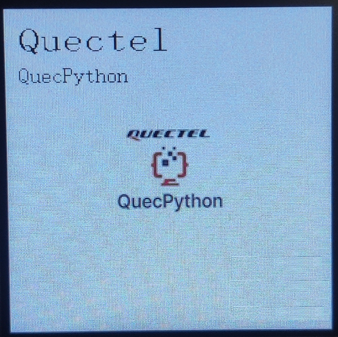
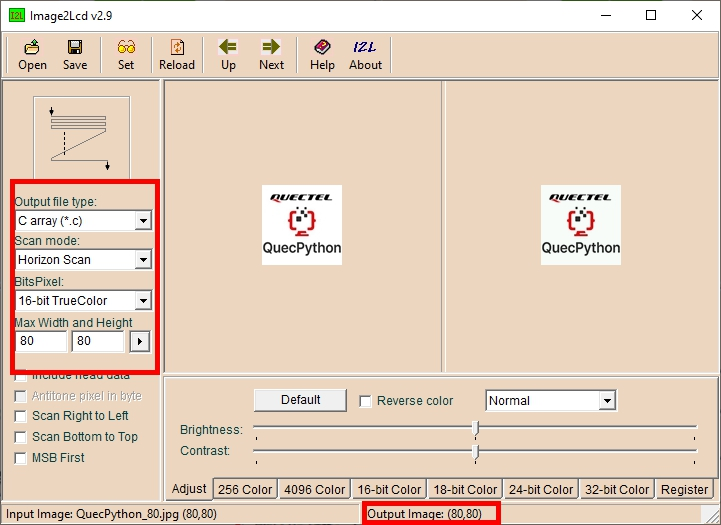
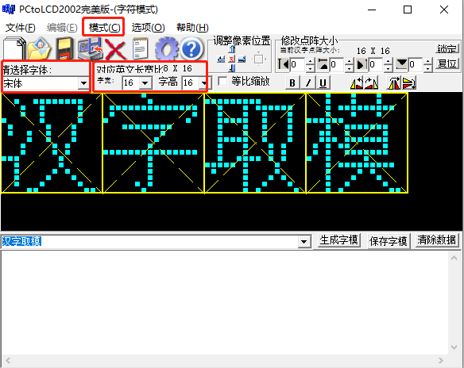
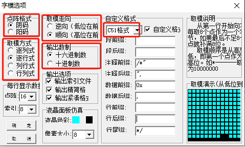
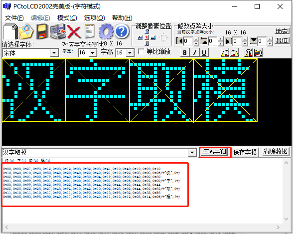

# LCD液晶显示实验

## 修订历史

| 版本 | 日期       | 作者    | 变更表述                 |
| ---- | ---------- | ------- | ------------------------ |
| 1.0  | 2021-10-06 | Grey.Tu | 初版                     |
| 1.1  | 2022-01-14 | Grey.Tu | 修复例程代码不能下载问题 |
| 1.2  | 2022-05-26 | Grey.Tu | 修复已知问题             |

本片文章主要基于 EC600x 介绍 LCD 显示，做一个 LCD 显示的小实验。


## 硬件介绍

### 开发板lcd接口说明



| 序号 | 开发板lcd引脚 | 引脚定义                       | 备份 |
| ---- | ------------- | ------------------------------ | ---- |
| 1    | GND           | 电源地                         |      |
| 2    | VCC_3V3       | 电源3.3V                       |      |
| 3    | LCD_SCL_3V3   | SPI总线时钟信号                |      |
| 4    | LCD_SDA_3V3   | SPI总线写数据信号              |      |
| 5    | LCD_RST_3V3   | 液晶屏复位控制信号，低电平复位 |      |
| 6    | LCD_DC_3V3    | 写寄存器/写数据控制信号        |      |
| 7    | LCD_BLK       | 液晶屏背光控制信号             |      |
| 8    | LCD_CS_3V3    | LCD片选引脚                    |      |

### ST7789V lcd 接口说明

本实验使用的ST7789V LCD显示屏。显示屏引脚定义与开发板的LCD接口是完全匹配的，可以直接插到开发板的LCD接口使用。



| 序号 | lcd引脚 | 引脚定义                       | 备份 |
| ---- | ------- | ------------------------------ | ---- |
| 1    | GND     | 电源地                         |      |
| 2    | VCC     | 电源3.3V                       |      |
| 3    | SCL     | SPI总线时钟信号                |      |
| 4    | SDA     | SPI总线写数据信号              |      |
| 5    | RES     | 液晶屏复位控制信号，低电平复位 |      |
| 6    | DC      | 写寄存器/写数据控制信号        |      |
| 7    | BLK     | 液晶屏背光控制信号             |      |

### 接线方式

以下为 ST7789V 显示屏屏模块与 EC600x_QuecPython 开发板的接线对应关系。

| 序号 | ST7789V显示屏 | EC600x_QuecPython开发板 | 备份     |
| ---- | ------------- | ----------------------- | -------- |
| 1    | GND           | GND                     |          |
| 2    | VCC           | VCC_3V3                 |          |
| 3    | SCL           | LCD_SCL_3V3             |          |
| 4    | SDA           | LCD_SDA_3V3             |          |
| 5    | RES           | LCD_RST_3V3             |          |
| 6    | DC            | LCD_DC_3V3              |          |
| 7    | BLK           | LCD_BLK                 |          |
| 8    |               | LCD_CS_3V3              | 无需连接 |


## 软件设计

本示例中的接口是基于QuecPython 的machine.LCD库实现。由于代码量相对较大，本章我们分文件管理代码，具体可阅读示例程序的源码。

### 文件说明

| 序号 | 文件               | 描述                                                         | 备份 |
| ---- | ------------------ | ------------------------------------------------------------ | ---- |
| 1    | st7789v.py         | 包含驱动IC为ST7789V的液晶屏驱动程序以及显示字符与图片等接口。 |      |
| 2    | fonts.py           | 示例程序中用到的字库。                                       |      |
| 3    | image.py           | 示例程序中用到的小图片显示数据                               |      |
| 4    | image.txt          | 示例程序中用到的大图片显示数据                               |      |
| 5    | example_display.py | 显示主程序，调用其它几个文件中的方法与数据。                 |      |

### LCD初始化函数

本章封装了部分 API 函数。 在介绍这些 API 之前，我们先了解一下已固件中提供的函数接口。这里我们主要介绍 LCD 初始化函数，其他函数较为简单，请自行参考：[QuecPython-machine - LCD](https://python.quectel.com/wiki/#/zh-cn/api/QuecPythonClasslib?id=lcd) 进行了解。

```python
# lcd.lcd_ Init function parameter description
# lcd_ init_ Data: incoming LCD configuration command
# lcd_ Width: the width of the LCD screen. Width not exceeding 500
# lcd_ High: the height of the LCD screen. Height not exceeding 500
# lcd_ CLK: LCD SPI clock. SPI clock is 6.5k/13k/26k/52k
# data_ Line: number of data lines. The parameter values are 1 and 2.
# line_ Num: number of lines. The parameter values are 3 and 4.
# lcd_ Type: screen type. 0：rgb； 1：fstn。
# lcd_ Invalid: pass in the configuration command of LCD locale
# lcd_ display_ On: pass in the configuration command of LCD screen
# lcd_ display_ Off: pass in the configuration command of LCD screen off
# lcd_ set_ Brightness: pass in the configuration command of LCD screen brightness. Set to none to indicate by LCD_ BL_ K controls the brightness (some screens are controlled by registers, and some are controlled by lcd_bl_k)
lcd.lcd_init(lcd_init_data, lcd_width, lcd_hight, lcd_clk, data_line, line_num, lcd_type, lcd_invalid, lcd_display_on, lcd_display_off, lcd_set_brightness)
```

下面通过实际代码介绍 LCD 初始化函数的参数传入。

```python
from machine import LCD                 # Screen display module

# Common color definitions
red = 0xF800            # gules
green = 0x07E0          # green
blue = 0x001F           # blue
white = 0xFFFF          # white
black = 0x0000          # black
purple = 0xF81F         # purple
colour = white          # Default background color

# Screen parameters
screen_high = 240       # Screen height
screen_wide = 240       # Screen height
XSTART_H = 0xf0  		# Start point X coordinate high byte register
XSTART_L = 0xf1  		# Start point X coordinate low byte register
XEND_H = 0xE0  			# End point X coordinate high byte register
XEND_L = 0xE1  			# End point X coordinate low byte register
YSTART_H = 0xf2  		# Start point y coordinate high byte register
YSTART_L = 0xf3  		# Start point y coordinate low byte register
YEND_H = 0xE2  			# End point y coordinate high byte register
YEND_L = 0xE3  			# End point y coordinate low byte register

# Screen initialization parameters
# Three elements in a tuple form a group, and each element in a single group is defined as follows:
# 1: Type, 0 indicates command; 1 represents data; 2 indicates delay
# 2: Length. If the type is 0, the length represents the amount of data after the command; If the type is 1, the length represents the length of the data
# 3: Parameter value
init_data = (
    0, 0, 0x11,
    0, 1, 0x36,
    1, 1, 0x00,
    0, 1, 0x3A,
    1, 1, 0x05,
    0, 0, 0x21,
    0, 5, 0xB2,
    1, 1, 0x05,
    1, 1, 0x05,
    1, 1, 0x00,
    1, 1, 0x33,
    1, 1, 0x33,
    0, 1, 0xB7,
    1, 1, 0x23,
    0, 1, 0xBB,
    1, 1, 0x22,
    0, 1, 0xC0,
    1, 1, 0x2C,
    0, 1, 0xC2,
    1, 1, 0x01,
    0, 1, 0xC3,
    1, 1, 0x13,
    0, 1, 0xC4,
    1, 1, 0x20,
    0, 1, 0xC6,
    1, 1, 0x0F,
    0, 2, 0xD0,
    1, 1, 0xA4,
    1, 1, 0xA1,
    0, 1, 0xD6,
    1, 1, 0xA1,
    0, 14, 0xE0,
    1, 1, 0x70,
    1, 1, 0x06,
    1, 1, 0x0C,
    1, 1, 0x08,
    1, 1, 0x09,
    1, 1, 0x27,
    1, 1, 0x2E,
    1, 1, 0x34,
    1, 1, 0x46,
    1, 1, 0x37,
    1, 1, 0x13,
    1, 1, 0x13,
    1, 1, 0x25,
    1, 1, 0x2A,
    0, 14, 0xE1,
    1, 1, 0x70,
    1, 1, 0x04,
    1, 1, 0x08,
    1, 1, 0x09,
    1, 1, 0x07,
    1, 1, 0x03,
    1, 1, 0x2C,
    1, 1, 0x42,
    1, 1, 0x42,
    1, 1, 0x38,
    1, 1, 0x14,
    1, 1, 0x14,
    1, 1, 0x27,
    1, 1, 0x2C,
    0, 0, 0x29,
    0, 1, 0x36,
    1, 1, 0x00,
    0, 4, 0x2a,
    1, 1, 0x00,
    1, 1, 0x00,
    1, 1, 0x00,
    1, 1, 0xef,
    0, 4, 0x2b,
    1, 1, 0x00,
    1, 1, 0x00,
    1, 1, 0x00,
    1, 1, 0xef,
    0, 0, 0x2c,
)

# Screen area display parameters
# Three elements in a tuple form a group, and each element in a single group is defined as follows:
# 1: Type, 0 indicates command; 1 represents data; 2 indicates delay
# 2: Length. If the type is 0, the length represents the amount of data after the command; If the type is 1, the length represents the length of the data
# 3: Parameter value
lcd_set_display_area = (
    0, 4, 0x2a,
    1, 1, XSTART_H,
    1, 1, XSTART_L,
    1, 1, XEND_H,
    1, 1, XEND_L,
    0, 4, 0x2b,
    1, 1, YSTART_H,
    1, 1, YSTART_L,
    1, 1, YEND_H,
    1, 1, YEND_L,
    0, 0, 0x2c,
    )

lcd = LCD()  														# create object
lcd_init_data = bytearray(init_data)  								# Conversion initialization parameter array
lcd_invalid = bytearray(lcd_set_display_area)  						# Conversion area setting parameter array
lcd.lcd_init(lcd_init_data, screen_high, screen_wide,
                  6500, 1, 4, 0, lcd_invalid, None, None, None)  	# Initialize LCD screen
```

### 封装API函数

#### 创建st7789v对象

> **from usr import st7789v**
>
> **lcd_st7789v = st7789v.ST7789V(width, hight)** 

* 功能：

  创建一个lcd对象，进行lcd初始化。

* 参数：

| 参数  | 类型 | 说明       |
| ----- | ---- | ---------- |
| width | 整型 | 显示屏的宽 |
| hight | 整型 | 显示屏的高 |

* 返回值：

  返回一个lcd对象。

* 示例：

```python
from usr import st7789v
lcd_st7789v = st7789v.ST7789V(240, 240)
```


#### 显示单个字符

> **lcd_st7789v.lcd_show_char(x, y, xsize, ysize, ch_buf, fc, bc)**

* 功能：

  单个字符显示，可显示汉字和ASCII字符。

* 参数：

| 参数   | 类型         | 说明                          |
| ------ | ------------ | ----------------------------- |
| x      | 整型         | x轴起点坐标                   |
| y      | 整型         | y轴起点坐标                   |
| xsize  | 整型         | 待显示字符的宽                |
| ysize  | 整型         | 待显示字符的高                |
| ch_buf | 元组或列表   | 存放待显示字符的字模数据      |
| fc     | 16位十六进制 | 字体颜色，如 0x0000 表示黑色  |
| bc     | 16位十六进制 | 背景颜色，如 0xFFFF  表示白色 |

* 返回值：

  无


#### 单个ASCII字符显示

> **lcd_st7789v.lcd_show_ascii(x, y, xsize, ysize, ch, fc, bc)**

* 功能：

  ASCII字符显示，目前支持8x16、16x24的字体大小，如果需要其他字体大小需要自己增加对应大小的字库数据，并在该函数中增加这个对应字库的字典。

* 参数：

| 参数  | 类型         | 说明                          |
| ----- | ------------ | ----------------------------- |
| x     | 整型         | x轴起点坐标                   |
| y     | 整型         | y轴起点坐标                   |
| xsize | 整型         | 待显示字符的宽                |
| ysize | 整型         | 待显示字符的高                |
| ch    | 字符         | 待显示的ASCII字符             |
| fc    | 16位十六进制 | 字体颜色，如 0x0000 表示黑色  |
| bc    | 16位十六进制 | 背景颜色，如 0xFFFF  表示白色 |

* 返回值：

  无


#### ASCII字符串显示

> **lcd_st7789v.lcd_show_ascii_str(x, y, xsize, ysize, str, fc, bc)**

* 功能：

  ASCII字符串显示，显示顺序，以设置的起始坐标开始自左向右显示。示例中只提供了8x16大小的ascii字符，如果用户需要其他大小的字符，需要自己重新制作字库，并在` lcd_st7789v.lcd_show_ascii(x, y, xsize, ysize, ch, fc, bc)` 接口中增加对新增字库的支持。

  注意，要确定传入的字符串能够在当前行显示完，即传入字符串总长度乘以单个字符宽度的值 ，加上起始坐标x的值不能超过屏宽，否则程序会直接报错，提示超过显示范围。

参数：

| 参数  | 类型         | 说明                          |
| ----- | ------------ | ----------------------------- |
| x     | 整型         | x轴起点坐标                   |
| y     | 整型         | y轴起点坐标                   |
| xsize | 整型         | 待显示字符的宽                |
| ysize | 整型         | 待显示字符的高                |
| str   | 字符串       | 待显示的ASCII字符             |
| fc    | 16位十六进制 | 字体颜色，如 0x0000 表示黑色  |
| bc    | 16位十六进制 | 背景颜色，如 0xFFFF  表示白色 |

* 返回值：

  无。


#### 单个汉字显示

> **lcd_st7789v.lcd_show_chinese(x, y, xsize, ysize, ch, fc, bc)**

* 功能：

  汉字显示，目前支持示例中几个汉字的16x16、16x24、24x24的字体大小，如果需要显示其他汉字以及其他字体大小需要自己增加对应大小的字库数据，并在该函数中增加这个对应字库的字典。

* 参数：

| 参数  | 类型         | 说明                          |
| ----- | ------------ | ----------------------------- |
| x     | 整型         | x轴起点坐标                   |
| y     | 整型         | y轴起点坐标                   |
| xsize | 整型         | 待显示字符的宽                |
| ysize | 整型         | 待显示字符的高                |
| ch    | 字符         | 待显示的汉字                  |
| fc    | 16位十六进制 | 字体颜色，如 0x0000 表示黑色  |
| bc    | 16位十六进制 | 背景颜色，如 0xFFFF  表示白色 |

* 返回值：

  无


#### 汉字字符串显示

> **lcd_st7789v.lcd_show_chinese_str(x, y, xsize, ysize, str, fc, bc)**

* 功能：

  汉字字符串显示，显示顺序，以设置的起始坐标开始自左向右显示。示例中只提供了用到的几个汉字的16x16大小的字库，如果用户需要其他大小的字符，需要自己重新制作字库，并在 `lcd_st7789v.lcd_show_chinese(x, y, xsize, ysize, str, fc, bc)` 接口中增加对新增字库的支持。

  注意，要确定传入的字符串能够在当前行显示完，即传入汉字个数乘以单个汉字宽度的值 ，加上起始坐标x的值不能超过屏宽，否则程序会直接报错，提示超过显示范围。

* 参数：

| 参数  | 类型         | 说明                                |
| ----- | ------------ | ----------------------------------- |
| x     | 整型         | x轴起点坐标                         |
| y     | 整型         | y轴起点坐标                         |
| xsize | 整型         | 待显示字符的宽                      |
| ysize | 整型         | 待显示字符的高                      |
| str   | 字符串       | 待显示的汉字字符串，比如 '移远通信' |
| fc    | 16位十六进制 | 字体颜色，如 0x0000 表示黑色        |
| bc    | 16位十六进制 | 背景颜色，如 0xFFFF  表示白色       |

* 返回值：

  无。


#### 显示小尺寸图片

> **lcd_st7789v.lcd_show_image(image_data, x, y, width, heigth)**

* 功能：

  显示图片，该方法适合显示尺寸较小的图片，如果图片分辨率（宽高）小于80x80，可直接用该方法一次性将图片数据写入显示。

* 参数：

| 参数       | 类型       | 说明                    |
| ---------- | ---------- | ----------------------- |
| image_data | 元组或列表 | 存放待显示图片的RGB数据 |
| x          | 整型       | x轴起点坐标             |
| y          | 整型       | y轴起点坐标             |
| width      | 整型       | 待显示图片的宽度        |
| heigth     | 字符       | 待显示图片的高度        |

* 返回值：

  无


#### 显示大尺寸图片

> **lcd_st7789v.lcd_show_image_file(path, x, y, width, heigth, h)**

* 功能：

  显示图片，该方法适合显示尺寸较大的图片，如果图片分辨率（宽高）大于80x80，需要使用该方法来显示。该方法从文件中读取图片数据分段写入。分段写入原理如下：

  假如要显示图片的分辨率（宽高）为 width*heigth，将待显示的图片分成若干宽高为 width * h 大小的图片，最后一块高度不足h的按实际高度计算，h为分割后每个图片的高度，可由用户通过参数 h 指定，h的取值应该满足关系： `width * h * 2 < 4096`

参数：

| 参数   | 类型   | 说明                                                      |
| ------ | ------ | --------------------------------------------------------- |
| path   | string | 存放图片数据的txt文件路径，包含文件名，如 'usr/image.txt' |
| x      | int    | x轴显示起点                                               |
| y      | int    | y轴显示起点                                               |
| width  | int    | 图片宽度                                                  |
| heigth | int    | 图片高度                                                  |
| h      | int    | 分割后每个图片的高度                                      |

* 返回值：

  无

示例：

假如要显示一张240x240的图片，图片如下：


（1）使用Image2Lcd 软件获取图片色彩数据



（2）得到数据如下图，将该 .c 文件中头部和尾部多余部分都删除，只保留中间的数据部分，确保处理后的数据第一行就是数据，且最后没有多余行，每一行前面没有空格等多余字符



（3）将处理后的图片数据文件保存为txt格式文件，假设命名为image.txt

（4）将image.txt文件上传到开发板模块中【注意，此时没有image.py文件，不需要 from usr import image】

（5）在主程序  example_display_image.py 中，使用如下代码来显示该图片

```python
# -*- coding: UTF-8 -*-


import utime
'''
If there is no checknet Library in the firmware version used by the user, please upload the checknet.mpy file to the usr directory of the module,
And change import checknet to from usr import checknet
'''
import checkNet
from usr import st7789v
# from usr import image

'''
The following two global variables are required. Users can modify the values of the following two global variables according to their actual projects,
The values of these two variables are printed before executing the user code.
'''
PROJECT_NAME = "QuecPython_ST7789V_LCD_Example"
PROJECT_VERSION = "1.0.0"

checknet = checkNet.CheckNetwork(PROJECT_NAME, PROJECT_VERSION)
lcd_st7789v = st7789v.ST7789V(240, 240)


if __name__ == '__main__':
    '''
When running this routine manually, you can remove the delay. If you change the routine file name to main.py, you need to add the delay when you want to start up and run automatically,
Otherwise, the following poweron cannot be seen from the CDC port_ print_ Information printed in once()
    '''
    # utime.sleep(5)
    checknet.poweron_print_once()

    '''
If the user program contains network related code, wait must be executed_ network_ Connected() wait for the network to be ready (dialing succeeded);
If it is a network independent code, you can mask the wait_ network_ connected()
    '''
    # checknet.wait_network_connected()

    # user designation codes
    '''######################【User code star】#####################################'''
  
    # Display a 240 * 240 size picture
    lcd_st7789v.lcd_show_image_file("usr/image.txt", 0, 0, 240, 240, 8)

    '''######################【User code end 】#####################################'''

```

显示结果：


### 实验操作

在实验例程的目录下，找到【显示图片】目录，进入该目录下，有如下几个源码文件：

| 序号 | 文件               | 描述                                                         | 备份 |
| ---- | ------------------ | ------------------------------------------------------------ | ---- |
| 1    | st7789v.py         | 包含驱动IC为ST7789V的液晶屏驱动程序以及显示字符与图片等接口。 |      |
| 2    | fonts.py           | 示例程序中用到的字库。                                       |      |
| 3    | image.py           | 示例程序中用到的小图片显示数据                               |      |
| 4    | example_display.py | 显示主程序，调用其它几个文件中的方法与数据。                 |      |

##### 实验步骤

（1）将240*240的显示屏正确接到模块上；
（2）将本目录的4个py文件（st7789v.py、image.py、fonts.py、example_display.py）拷贝到模块的usr目录下；
（3）进入模块的命令行，执行如下指令即可看到显示屏显示图片：

```
import example
example.exec('usr/example_display_image.py')
```

##### 实验结果




## 字符和图片取模工具使用

### 工具简介

（1）Image2Lcd

Image2Lcd 软件用于图片取模，可以提取单色和彩色图片。

（2）PCtoLCD2002

PCtoLCD2002 是一款字符取模软件，可以生成汉字、英文以及标点符号的字模数据。


### 如何对图片取模

（1）打开 Image2Lcd 软件，点击【打开】按钮，选择要显示的图片；



（2）输出数据类型选择【C语言数组(*.c)】,扫描方式选择【水平扫描】，输出灰度一定要选择【16位真彩色】；

（3）设置图片的最大宽度和高度，实际输出大小以上图中最下方的【输出图像:（xx, yy）】部分显示为准；

（4）点击【保存】按钮，得到图片的取模数据，将其放到元组中保存即可。


### 如何对字符取模(英文客户无需关注)

（1）打开 PCtoLCD2002 软件，依次点击【模式】-【字符模式(W)】；

（2）根据需要选择字体，设置字体大小等；



（3）点击齿轮图标，进入如下所示界面，选择 【阴码】、【逐行式】、【顺向】、【C51格式】，点击确定；



（4）输入要取模的字符后，点击【生成字模】，即可得到对应的字模数据，按照示例 fonts.py 文件中的格式，将字模数据保存到字典中。




## 配套代码

 <a href="code/LCD_file.7z" target="_blank">下载实验材料</a>