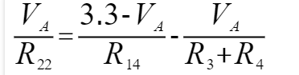
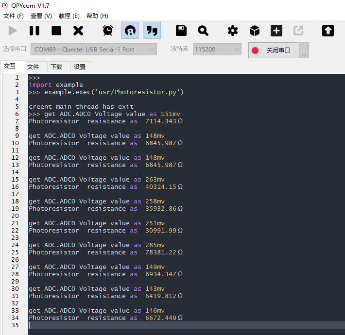

## 修订历史

| 版本 | 日期       | 作者   | 变更表述     |
| ---- | ---------- | ------ | ------------ |
| 1.0  | 2021-09-15 | Kayden | 初始版本修订 |
| 1.1  | 2022-03-21 | Kayden | 文档优化调整 |


## 光敏传感器实验

本篇文章主要简介EC600U ADC 硬件资源(其他模组类同)， 介绍[QuecPython ADC API](https://python.quectel.com/wiki/#/zh-cn/api/QuecPythonClasslib?id=adc)，以及使用ADC来检测当前光敏电阻的阻值。

### 硬件资源 

EC600U引出了四个ADC接口，参考 EC600X_QuecPython_EVB_V2.0_SCH.pdf 文档。

其他开发板参考对应原理图文档，可从下载中心或者QQ群下载：[下载中心](https://python.quectel.com/download)

QQ群：445121768


| 外设 | 引脚 |
| ---- | ---- |
| ADC0 | 19   |
| ADC1 | 20   |
| ADC2 | 113  |
| ADC3 | 114  |

**注：每个模组ADC引脚号API介绍有详细介绍，结合原理图或者硬件设计手册上的引脚号即可。**

ADC0接了一个光敏电阻如下图：


### 光敏电阻实验

#### 实验设计

设计一个实验，根据当前光照强度，实时打印当前的光敏电阻的阻值。下图是开发板上光敏电阻的等效原理图。


ADC0 是我们可以使用ADC外设测试的电压点。



最终可以计算出，按照如下算式计算R22阻值。


#### 实验代码

 <a href="code/Photoresistor.py" target="_blank">下载代码</a>

```python
'''

File: Photoresistor.py

Project: adc

File Created: Thursday, 24th December 2020 5:44:08 pm

Author: chengzhu.zhou

-----

Last Modified: Wednesday, 30th December 2020 10:10:33 am

Modified By: chengzhu.zhou

-----

Copyright 2020 - 2020 quectel

'''

from misc import ADC

import utime as time

import _thread


# unit as Ω

def Voltage_to_Resistance(Volt):

	#

	Va = 2 * Volt

	resistance = (2 * 4700 * 40200 * Va)/(2 * 4700 * (3300 - Va) - (40200 *Va))

	return resistance


def Photoresistor_thread(delay, retryCount):

 		# creat a adc device

		AdcDevice = ADC()

		while retryCount:

				retryCount = retryCount - 1

 				# get ADC.ADC0 value

				adcvalue = AdcDevice.read(ADC.ADC0)

				print("get ADC.ADC0 Voltage value as {0}mv".format(adcvalue))

 				# Converted to resistance

				resistance = Voltage_to_Resistance(adcvalue)

				print("Photoresistor resistance as {0}Ω".format(resistance))

				time.sleep(delay)

		pass


if __name__ == "__main__":

 		# creat a thread Convert ADC to Voltage

		_thread.start_new_thread(Photoresistor_thread, (1, 10))

		print("creent main thread has exit")
```


#### 实验操作

1.将代码烧录进开发板运行；

2.用物品挡住光敏电阻，改变照射到光敏电阻的光强；

3.查看串口输出的阻值的变化。

最终我们可以在串口看到，阻值输出的变化如下。




#### 光敏电阻原理简介

定义：

光敏电阻是用硫化隔或硒化隔等半导体材料制成的特殊电阻器，表面还涂有防潮树脂，具有光电导效应。

特性：

光敏电阻对光线十分敏感。光照愈强，阻值就愈低。随着光照强度的升高，电阻值迅速降低，可降低至1KΩ以下。包含了以下几个特性。

- 伏安特性：

  光敏传感器在一定的入射照度下，光敏元件的电流 *I* 与所加电压 *U*之间的关系称为光敏器件的伏安特性。

- 光照特性

  光敏传感器的光谱灵敏度与入射光强之间的关系称为光照特性，有时光敏传感器的输出电压或电流与入射光强之间的关系也称为光照特性。


### 专业名词

> ***ADC：模数转换***

