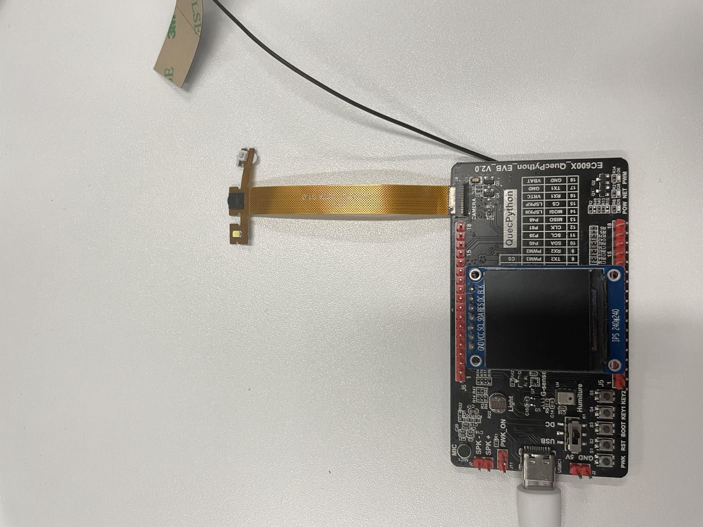
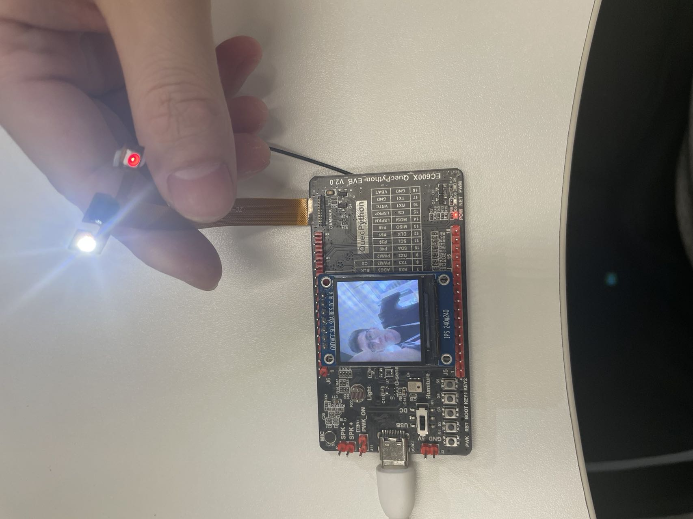
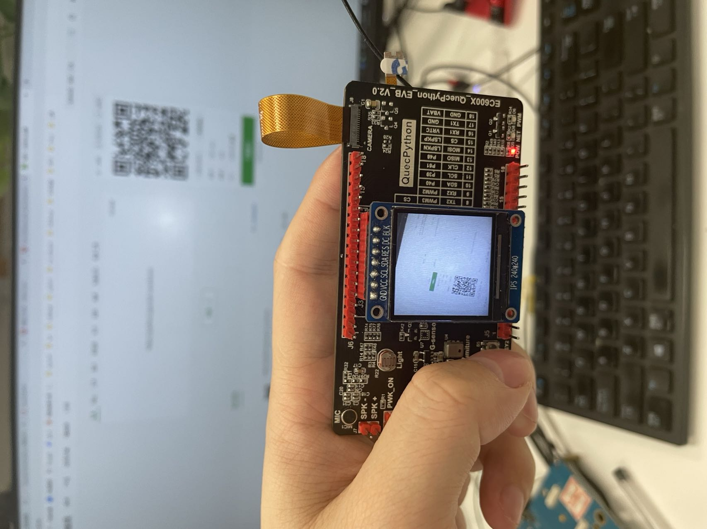
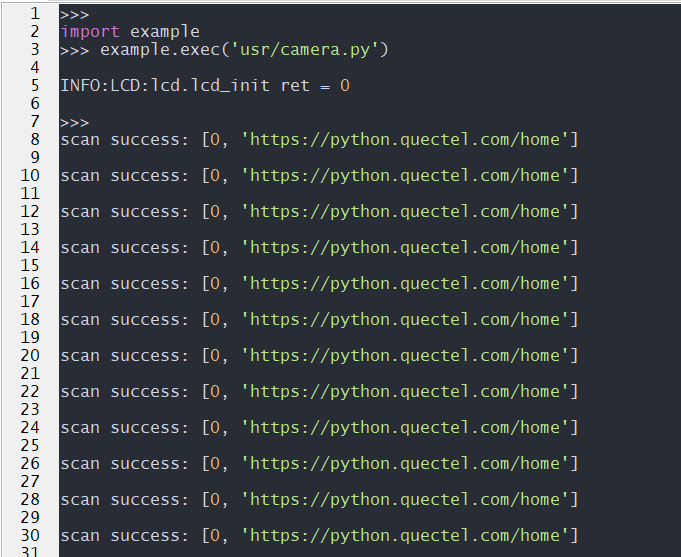
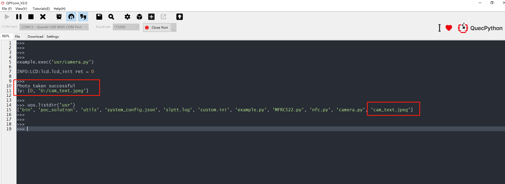
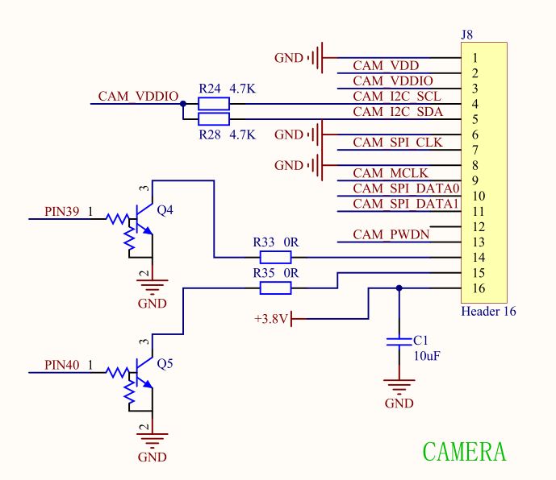

## 修订历史

| 版本 | 日期       | 作者  | 变更表述                         |
| ---- | ---------- | ----- | -------------------------------- |
| 1.0  | 2021-09-15 | Felix | 初始版本修订                     |
| 1.1  | 2022-02-11 | felix | 新增（基于quecpython开发板实操） |

## 引言

本文档基于QuecPython介绍如何通过camera模块实现摄像头预览，扫码，拍照功能，包括接口、配置流程及示例。


目前quecpython支持两种camera IC。后续会继续更新

- BF3901 (8W像素)
- GC032A (30W像素)


以下实验均以gc032a 为例


## 基于quecpython开发板实现camera操作

请以模块最新的固件（支持camera）版本验证

本实验以EC600NCN_LC模块，ST7789V(240X240)屏幕，GC032A(30W)摄像头实现camera演示

### 1.硬件接线

如下图连接硬件



### 2.预览

实现预览功能必须先初始化LCD。LCD具体操作请参考https://python.quectel.com/doc/doc/Advanced_development/zh/QuecPythonSub/LCD.html

脚本链接：[预览脚本](https://gitee.com/quecpython/Community-document/blob/develop/docs/Advanced_development/zh/QuecPythonSub/code/camera.py)

直接运行camera.py脚本




### 2.解码

解码功能lcd非必须。

脚本链接：[预览脚本](https://gitee.com/quecpython/Community-document/blob/develop/docs/Advanced_development/zh/QuecPythonSub/code/camera.py)

得到脚本后，修改脚本的main接口如下：

```
if __name__ == '__main__':
    scan_test = camera_Scan()
    scan_test.open()
    scan_test.start()
```



得到解析结果：



### 3.拍照

拍照功能lcd非必须。

脚本链接：[预览脚本](https://gitee.com/quecpython/Community-document/blob/develop/docs/Advanced_development/zh/QuecPythonSub/code/camera.py)

得到脚本后，修改脚本的main接口如下：

```
if __name__ == '__main__':
    Cap_test = camera_Capture()
    Cap_test.open()
    Cap_test.start(name="cam_text")
```



得到的图片文件可以通过lcd接口显示出来：

在执行完脚本后，在终端输入如下指令：

LCD操作参考[LCD](https://python.quectel.com/wiki/#/zh-cn/api/QuecPythonClasslib?id=%e6%98%be%e7%a4%bajpeg%e5%9b%be%e7%89%87)

```
Cap_test.close() 									#停止camera,否则lcd显示的图片会立即被camera刷掉
Cap_test._lcd.lcd_show_jpg('cam_text.jpeg',0,0)		#调用lcd的方法，显示图片，具体参考lcd操作
```


## 原理图分析

首先，分析原理图，确定camera的型号，引脚等配置



引脚：SCK、SDA（IIC引脚用于配置和读取sensor的寄存器）

MCLK：提供给sensor的主时钟

SPI_CLK：sensor给模块输出的spi时钟

DATA0：摄像头 SPI 数据位 0

DARA1：摄像头 SPI 数据位 1

PWDN：摄像头关断


## Camera相关接口

​	camera接口主要参考官网的wiki（[CAMERA_API库](https://python.quectel.com/wiki/#/zh-cn/api/QuecPythonClasslib?id=camera-%e6%91%84%e5%83%8f%e6%89%ab%e7%a0%81)）


## camera配置开发流程

### LCD初始化（非必须）

​	该部分若需要预览功能，则需要先初始化LCD。

​	具体实现可参考（[LCD使用说明](https://python.quectel.com/doc/doc/Advanced_development/zh/QuecPythonSub/LCD.html)）


### 预览功能

​	该部分功能仅实现设备的预览功能。

```
import camera

preview1 = camera.camPreview(0,640,480,240,320,2)

preview1.open()

preview1.close()
```

​		

​	

### 扫码功能

该部分功能实现预览，扫码功能。

```
def sacn_call(para):
  print(para)

import camera
scan = camera.camScandecode(0,1,640,480,2,240,320) #需要预览功能，需要LCD
#scan = camera.camScandecode(0,1,640,480,0)     #不需要预览功能，即无LCD也可以

scan.open()
scan.start()
scan.callback(sacn_call)
```


### 拍照功能

该部分功能实现预览，拍照功能。

```
def cap_call(para):
  print(para)

import camera
cap = camera.camCapture(0,640,480,0,240,320)

cap.open()
cap.callback(cap_call)

cap.start(240,320,'1')
```


## 附录A术语缩写

表 2 ：术语缩写

```
缩写 		英文全称 						中文全称

LCD 	Liquid Crystal Display 			液晶显示器

SPI 	Serial Peripheral Interface 	串行外设接口
```

