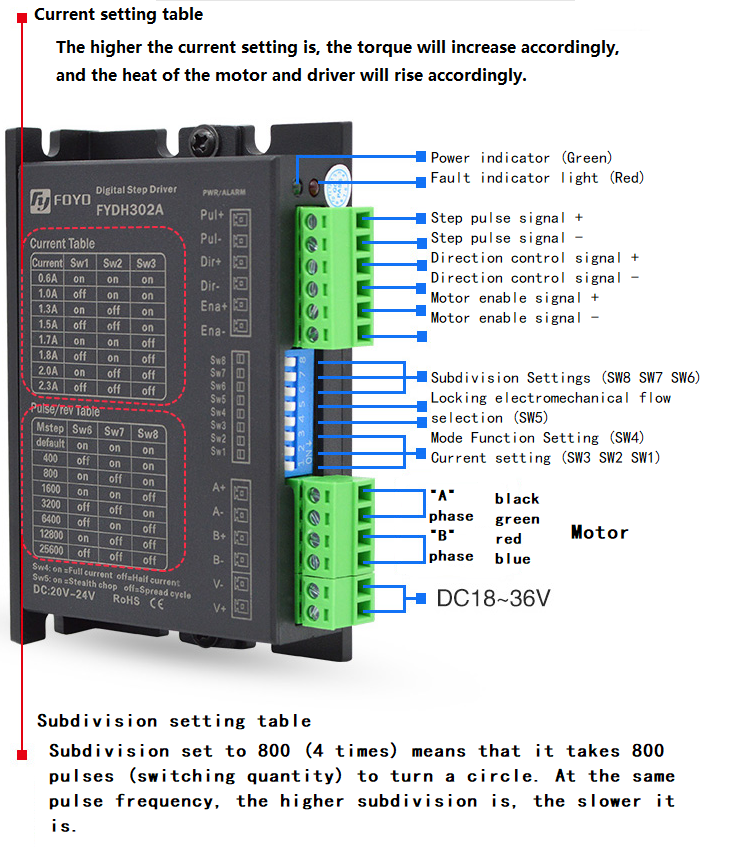
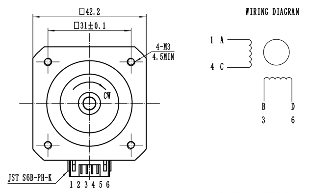

# 步进电机驱动实验

## 修订历史

| 版本 | 日期       | 作者    | 变更表述 |
| ---- | ---------- | ------- | -------- |
| 1.0  | 2021-09-24 | Grey.Tu | 初版     |

本片文章主要描述使用 EC600x 来驱动步进电机控制器，从而驱动步进电机。


## 硬件说明

模块驱动步进电机需要步进电机控制器：

#### 步进电机控制器



#### 步进电机 




步进电机有 42步进电机/ 57步进电机/ 86步进电机等之分，不同的步进电机适配不同的步进电机控制器。

### 实验设备

（1）直流电源，可以输 出 12V~48V  的直流电

（2）步进电机控制器

（3）步进电机

（4）连接线若干

### 驱动说明

步进电机驱动器只需要控制三个引脚，就可以驱动驱动器控制电机了。

（1）ENA使能控制引脚，使能驱动器驱动电机。根据驱动器型号不同电平有所不同。

（2）DIR方向控制引脚，确定顺时针或者是逆时针。根据驱动器型号不同电平有所不同。

（3）PUL步进脉冲引脚，给控制器脉冲。根据设置的细分有不同的脉冲数量步进一个步进角。细分设置为驱动器拨码开关设置。

### 引脚连接

（1）连接好 24V  电源，具体电压根据实际的步进电机驱动器规格确定。 

| 驱动器引脚 | 电源引脚 | 说明     | 备份 |
| ---------- | -------- | -------- | ---- |
| V+         | 24V      | 电源正极 |      |
| V-         | GND      | 电源负极 |      |

（2）连接驱动器与步进电机，具体接线方式根据实际的步进电机驱动器与步进电机规格确定。

| 驱动器引脚 | 步进电机引脚 | 说明 | 备份 |
| ---------- | ------------ | ---- | ---- |
| A+         | A            | A项+ |      |
| A-         | C            | A项- |      |
| B+         | B            | B项+ |      |
| B-         | D            | B项- |      |

（3）连接驱动器和 EC600x 开发板，，具体电压根据实际的步进电机驱动器规格确定。

步进电机驱动器可以采用共阳/共阴两种连接方式，我们这里采用共阳极的连接方式


| 驱动器引脚 | EC600S 开发板引脚 | 说明         | 备份 |
| ---------- | ----------------- | ------------ | ---- |
| ENA+       | 1V8               | 共阳极       |      |
| ENA-       | GPIOx             | 使能控制信号 |      |
| DIR+       | 1V8               | 共阳极       |      |
| DIR+       | GPIOx             | 方向控制信号 |      |
| PUL+       | 1V8               | 共阳极       |      |
| PUL-       | GPIOx / PWMx      | 步进脉冲信号 |      |


## 软件设计

```python
from misc import PWM
from machine import Pin
import utime as time
import urandom as random
import log
def delay_500us():
    for i in range(600):
        pass


def delay_250us():
    for i in range(310):
        pass


ENABLE_MOTOR = 0x1
DISABLE_MOTOR = 0x0

DIR_CLOCKWISE = 0x1
DIR_ANTI_CLOCKWISE = 0x0


class ebf_smd4805():

    dev_log = None

    # Parameters of stepping motor
    sm_para_step = None  # Step angle
    # Parameters of controller
    env_pin = None  # Enable pin
    dir_pin = None  # Direction pin
    pul_pwm = None  # Pulse output pin
    ctrl_divstep = None  # For subdivision parameters, please refer to the controller manual

    def init(self, step, divstep):
        self.dev_log = log.getLogger("ebf_smd4805")
        self.env_pin = Pin(Pin.GPIO7, Pin.OUT, Pin.PULL_DISABLE, 0)
        self.dir_pin = Pin(Pin.GPIO6, Pin.OUT, Pin.PULL_DISABLE, 0)
        # Configure the parameters of the motor
        self.sm_para_step = step
        # Configure the parameters of the controller
        self.ctrl_divstep = divstep

    def reset(self):
        self.env_pin.write(DISABLE_MOTOR)
        self.dir_pin.write(DIR_ANTI_CLOCKWISE)
        if self.pul_pwm is not None:
            self.pul_pwm.close()

    # Initialize PWM according to frequency
    def outputpwm(self, HZ, duty_cycle):
        # Convert Hz to us level
        cycleTime = int(1000000/HZ)
        highTime = int(cycleTime * duty_cycle)
        return highTime, cycleTime

    # Set the output of PWM according to the speed
    def enable_pwm(self, speed):
        # 1. First, calculate the number of pulses required for one revolution according to the stepping angle of the stepping
        Count_pulse = int(360/self.sm_para_step)
        self.dev_log.debug("sm motor step as {0}".format(Count_pulse))
        # 2. According to the subdivision parameters of the controller, calculate the number of pulses required for the controller to control the stepper motor to rotate for one turn
        Count_pulse = int(Count_pulse * self.ctrl_divstep)
        # 3. Finally, calculate how many pulses are needed to rotate the speed cycle in one second, in other words, the frequency
        Count_pulse = int(Count_pulse * speed)
        # 4. Initialize PWM, default duty cycle% 50
        highTime, cycleTime = self.outputpwm(Count_pulse, 0.1)
        self.dev_log.debug(
            """config  frequency  is {0}HZ,cycleTime {1}us, hightime {2}us"""
            .format(Count_pulse, cycleTime, highTime))
        self.pul_pwm = PWM(PWM.PWM2, PWM.ABOVE_10US,
                           int(highTime), int(cycleTime))
        self.pul_pwm.open()
        pass

    def disable_pwm(self):
        self.pul_pwm.close()
        pass

    # Speed is the speed, how many laps per second
    # Duration is the duration, Ms
    # Dir indicates direction
    def run(self, speed, Duration, dir=DIR_CLOCKWISE):
        self.dir_pin.write(dir)
        self.dev_log.info(
            "Configure the motor to rotate {0} revolutions per second".format(speed))
        self.enable_pwm(speed)
        self.env_pin.write(1)
        # delay
        for i in range(int(Duration * 4)):
            delay_250us()
        self.env_pin.write(0)

        self.reset()
        pass


def test_ebf_smd4805():
    log.basicConfig(level=log.DEBUG)
    # log.basicConfig(level=log.INFO)
    ebf_smd4805_dev = ebf_smd4805()
    ebf_smd4805_dev.init(step=1.8, divstep=2)
    for i in range(2, 10):
        ebf_smd4805_dev.run(i, Duration=1000, dir=DIR_CLOCKWISE)
    print("test_ebf_smd4805  Function exit,!!!")
    pass


if __name__ == "__main__":
    # creat a thread Check key status
    test_ebf_smd4805()
```


## 配套代码

<!-- * [下载代码](code/code_ebf_smd4805.py) -->
 <a href="code/code_ebf_smd4805.py" target="_blank">下载代码</a>