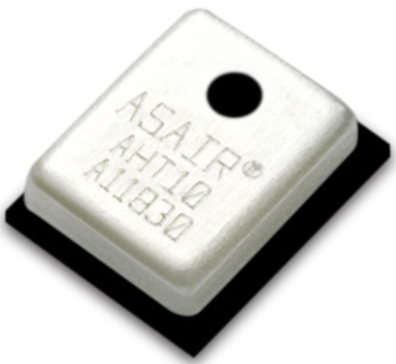

# 内部温湿度传感器实验

## 修订历史

| 版本 | 日期       | 作者    | 变更表述 |
| ---- | ---------- | ------- | -------- |
| 1.0  | 2021-09-28 | Grey.Tu | 初版     |

本片文章主要基于 EC600x 板载温湿度传感器AHT10，做一个温湿度检测的小实验。


## 硬件介绍



AHT10是一款高精度，完全校准，贴片封装的温湿度传感器，MEMS的制作工艺，确保产品具有极高的可靠性与卓越的长期稳定性。传感器包括一个电容式感湿元件和一个高性能CMOS微处理器相连接。该产品具有品质卓越、超快响应、抗干扰能力强、性价比极高等优点。

AHT10 通过 I2C 接口通讯。按照说明书的简介。只需要按照下面的方式，发送数据就可以获取数据了。

1.  上电等待校准数据。 发送 0xE1 0x08 0x00 。 （只需要校准一次就可以）

2.  触发测量，发送 0xAC, 0x33， 0x00 . 即可。

3.  读取数据， 等待70ms 转换。 读取6字节即可。


查看原理图和数据手册 可以确定从机地址为 0x38。

由于是板载的模块，原理图参考上图原理图，不需要其他外部模块。

## 软件设计

1.  初始化AHT10 传感器
2.  触发测量
3.  延时70ms
4.  读取数据
5.  转换温湿度
6.  持续第2步

```python
import log
from machine import I2C
import utime as time


class aht10class:
    i2c_log = None
    i2c_dev = None
    i2c_addre = None

    # Initialization command
    AHT10_CALIBRATION_CMD = 0xE1
    # Trigger measurement
    AHT10_START_MEASURMENT_CMD = 0xAC
    # reset
    AHT10_RESET_CMD = 0xBA

    def write_data(self, data):
        self.i2c_dev.write(self.i2c_addre,
                           bytearray(0x00), 0,
                           bytearray(data), len(data))
        pass

    def read_data(self, length):
        r_data = [0x00 for _ in range(length)]
        r_data = bytearray(r_data)
        self.i2c_dev.read(self.i2c_addre,
                          bytearray(0x00), 0,
                          r_data, length,
                          0)
        return list(r_data)

    def aht10_init(self, addre=0x38, alise="Ath10"):
        self.i2c_log = log.getLogger(alise)
        self.i2c_dev = I2C(I2C.I2C1, I2C.STANDARD_MODE)  #Return I2C object
        self.i2c_addre = addre
        self.sensor_init()
        pass

    @staticmethod
    def aht10_transformation_temperature(data):
        r_data = data
        #Convert the temperature as described in the data book
        humidity = (r_data[0] << 12) | (
            r_data[1] << 4) | ((r_data[2] & 0xF0) >> 4)
        humidity = (humidity/(1 << 20)) * 100.0
        print("current humidity is {0}%".format(humidity))
        temperature = ((r_data[2] & 0xf) << 16) | (
            r_data[3] << 8) | r_data[4]
        temperature = (temperature * 200.0 / (1 << 20)) - 50
        print("current temperature is {0}°C".format(temperature))

    def sensor_init(self):
        # calibration
        self.write_data([self.AHT10_CALIBRATION_CMD, 0x08, 0x00])
        time.sleep_ms(300)  # at last 300ms
        pass

    def ath10_reset(self):
        self.write_data([self.AHT10_RESET_CMD])
        time.sleep_ms(20)  # at last 20ms

    def trigger_measurement(self):
        # Trigger data conversion
        self.write_data([self.AHT10_START_MEASURMENT_CMD, 0x33, 0x00])
        time.sleep_ms(200)  # at last delay 75ms
        # check has success
        r_data = self.read_data(6)
        # check bit7
        if (r_data[0] >> 7) != 0x0:
            print("Conversion has error")
        else:
            self.aht10_transformation_temperature(r_data[1:6])


def i2c_aht10_test():
    ath_dev = aht10class()
    ath_dev.aht10_init()

    #Test ten times
    for i in range(10):
        ath_dev.trigger_measurement()
        time.sleep(1)


if __name__ == "__main__":
    i2c_aht10_test()
```

## 配套代码

<!-- * [下载代码](code/code_i2c_aht10.py)-->
<a href="code/code_i2c_aht10.py" target="_blank">下载代码</a> 