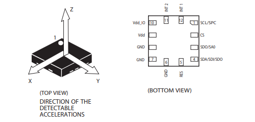

# 加速度传感器实验

## 修订历史

| 版本 | 日期       | 作者    | 变更表述 |
| ---- | ---------- | ------- | -------- |
| 1.0  | 2021-09-29 | Grey.Tu | 初版     |

本片文章主要基于 EC600x_IIC接口介绍三轴加速度传感器LIS2DH12TR，做一个检测加速度的小实验。


## 硬件介绍

### LIS2DH12介绍



LIS2DH12 是属于“nano”系列的超低功耗高性能 3 轴线性加速度计，具有数字 I2C、SPI串行接口标准输出。 器件具有超低功耗工作模式，可实现高级节能、智能、睡眠唤醒以及恢复睡眠功能。 LIS2DH12 具有 ±2g/±4g/±8g/±16g 的动态用户可选满量程，并能通过 1 Hz 到 5 kHz 的输出数据速率测量加速度。器件可配置为通过独立的惯性唤醒 / 自由落体事件以及通过器件自身的位置生成中断信号。中断发生器的阈值 和时序可由终端用户动态设定。具体可以参考 [LIS2DH12.pdf](media/LIS2DH12.pdf) 。

### 硬件连接

引脚功能介绍：

| 引脚号 | 引脚名                | 说明                                                         | 备份 |
| ------ | --------------------- | ------------------------------------------------------------ | ---- |
| 1      | SCL<br />SPC          | IIC/SPI时钟引脚。                                            |      |
| 2      | CS                    | SPI使能引脚，控制芯片通信方式。<br />1：IIC通信；2：SPI通信。 |      |
| 3      | SDO<br />SA0          | SPI模式下为数据输出引脚；<br />IIC模式为设备从地址选择引脚，1：0x19；0：0x18。 |      |
| 4      | SDA<br />SDI<br />SDO | IIC模式下为数据引脚；<br />标准SPI模式下为数据输入引脚；<br />也可以作为SPI的数据输出引脚。 |      |
| 5      | Res                   | 接地即可。                                                   |      |
| 6      | GND                   | 地                                                           |      |
| 7      | GND                   | 地                                                           |      |
| 8      | GND                   | 地                                                           |      |
| 9      | VDD                   | 电源                                                         |      |
| 10     | VDD_IO                | IO参考电平引脚                                               |      |
| 11     | INT2                  | 中断引脚2                                                    |      |
| 12     | INT1                  | 中断引脚1                                                    |      |

本章我们采用 I2C 接口通讯。原理图如下。


本次我们 D0/SA0 引脚高电平。 因此可以确认加速度传感器的从机地址为0x19。


## 软件设计

### LIS2SH12 单击中断使用步骤

LIS2DH12 支持的功能：

1.  单双击检测

2.  自由落体检测

3.  倾斜角测量

4.  切换横屏/竖屏模式

我们使用其单击检测功能，出现单击事件，将其映射到INT1 引脚上面，其处理逻辑大致如下：


### LIS2SH12 初始化

1.  设置 CTRL_REG2 寄存器，开启高通滤波。
2.  设置 CTRL_REG3 寄存器，将中断引到INT1 引脚上面。
3.  设置 CTRL_REG4 寄存器，配置Full-scale selection

### 配置单击中断

1.  配置 CLICK_CFG 寄存器，使能需要检测的感应轴，X,Y,Z
2.  配置 CLICK_THS 寄存器，设置阈值
3.  配置 TIME_LIMIT 寄存器，设置窗口限制
4.  配置 TIME_LATENCY 寄存器，设置延时

### LIS2SH12 使能传感器

1.  配置CTRL_REG1 寄存器，开始使能传感器。

### 实验设计

1.  使用LIS2DH12 传感器的 INT1 引脚产生中断。
2.  轮询此引脚的状态，检测到上升沿以后， 表示中断产生，处理中断。
3.  在中断函数里面读取三轴的状态。

### 实验代码

```python
import log
import utime
import _thread
from machine import I2C
from machine import Pin

# Register address
LIS2DH12_OUT_X_L = 0x28
LIS2DH12_OUT_X_H = 0x29
LIS2DH12_OUT_Y_L = 0x2A
LIS2DH12_OUT_Y_H = 0x2B
LIS2DH12_OUT_Z_L = 0x2C
LIS2DH12_OUT_Z_H = 0x2D
LIS2DH12_FIFO_CTRL_REG = 0x2E

# Control register
LIS2DH12_CTRL_REG1 = 0x20
LIS2DH12_CTRL_REG2 = 0x21
LIS2DH12_CTRL_REG3 = 0x22
LIS2DH12_CTRL_REG4 = 0x23
LIS2DH12_CTRL_REG5 = 0x24
LIS2DH12_CTRL_REG6 = 0x25
LIS2DH12_REFERENCE_REG = 0x26
LIS2DH12_STATUS_REG = 0x27

# Status register
LIS2DH12_STATUS_REG_AUX = 0x7

# Interrupt register
LIS2DH12_INT1_CFG = 0x30
LIS2DH12_INT1_SRC = 0x31
LIS2DH12_INT1_THS = 0x32
LIS2DH12_INT1_DURATION = 0x33

# Identity register
LIS2DH12_WHO_AM_I = 0x0F

# Click the relevant register
LIS2DH12_CLICK_CFG = 0x38
LIS2DH12_CLICK_SRC = 0x39
LIS2DH12_CLICK_THS = 0x3A
LIS2DH12_TIME_LIMIT = 0x3B
LIS2DH12_TIME_LATENCY = 0x3C


# Bind it to the external interrupt pin。
class lis2dh12(object):
    i2c_dev = None
    address = None
    int_pin = None
    dev_log = None

    def init(self, slave_address):
        self.dev_log = log.getLogger("I2C")
        self.address = slave_address
        self.i2c_dev = I2C(I2C.I2C1, I2C.STANDARD_MODE)
        self.int_pin = Pin(Pin.GPIO14, Pin.IN, Pin.PULL_PU, 0)  # Interrupt pin, which changes according to different hardware connections
        self.sensor_init()
        self.single_tap_enable()  # Configure click detection
        self.start_sensor()
        pass

    def read_data(self, regaddr, datalen, debug=True):
        r_data = [0x00 for _ in range(datalen)]
        r_data = bytearray(r_data)
        reg_addres = bytearray([regaddr])
        self.i2c_dev.read(self.address, reg_addres, 1, r_data, datalen, 1)
        ret_data = list(r_data)
        if debug is True:
            self.dev_log.debug(" read 0x{0:02x} from 0x{1:02x}".format(ret_data[0], regaddr))
        return ret_data

    def write_data(self, regaddr, data, debug=True):
        w_data = bytearray([regaddr, data])
        # Temporarily put the address to be transmitted in the data bit
        self.i2c_dev.write(self.address, bytearray(0x00), 0, bytearray(w_data), len(w_data))
        if debug is True:
            self.dev_log.debug(" write 0x{0:02x} to 0x{1:02x}".format(data, regaddr))

    def sensor_reset(self):
        # Reset chip
        self.write_data(LIS2DH12_CTRL_REG5, 0x80)
        utime.sleep_ms(100)
        r_data = self.read_data(LIS2DH12_WHO_AM_I, 1)
        # Confirm that the restart is successful
        while r_data[0] != 0x33:
            r_data = self.read_data(LIS2DH12_WHO_AM_I, 1)
            utime.sleep_ms(5)
        self.dev_log.debug("sensor reset succeeded")
        pass

    def sensor_init(self):
        self.sensor_reset()  # 1. Reset the device; 2. Initialize the sensor
        self.write_data(LIS2DH12_CTRL_REG2, 0x04)  # Enable high resolution
        self.write_data(LIS2DH12_CTRL_REG3, 0x80)  # Lead the interrupt to the INT1 pin. The default high level is valid
        self.write_data(LIS2DH12_CTRL_REG4, 0x08)  # ±2g， High-resolution mode

    def single_tap_enable(self):
        self.write_data(LIS2DH12_CLICK_CFG, 0x15)  # Enable XYZ triaxial click interrupt
        # self.write_data(LIS2DH12_CLICK_CFG, 0x10)  # enables z-axis click interrupt
        self.write_data(LIS2DH12_CLICK_THS, 0x30)  # Set threshold
        self.write_data(LIS2DH12_TIME_LIMIT, 0x18)  # Set time window limit
        self.write_data(LIS2DH12_TIME_LATENCY, 0x02)  # Set delay

    def start_sensor(self):
        self.write_data(LIS2DH12_CTRL_REG1, 0x77)  # Set ODR 400HZ ,enable XYZ
        # self.write_data(LIS2DH12_CTRL_REG1, 0x74)  # Set ODR ,enable Z axis
        utime.sleep_ms(20)  # (7/ODR) = 18ms

    def read_xyz(self):
        data = []
        for i in range(6):
            r_data = self.read_data(LIS2DH12_OUT_X_L + i, 1)
            data.append(r_data[0])
        return data

    def processing_data(self):
        data = self.read_xyz()
        self.dev_log.info("xL:{:0>3d},xH:{:0>3d},yL:{:0>3d},yH:{:0>3d},zL:{:0>3d},zH:{:0>3d}".
                          format(data[0], data[1], data[2], data[3], data[4], data[5]))
        self.dev_log.info("X:{:0>3d}  Y:{:0>3d}  Z:{:0>3d}".
                          format((data[0] & data[1]), (data[2] & data[3]), (data[4] & data[5])))
        pass

    def exti_processing_data(self):
        value = self.int_pin.read()
        if value == 1:  # Interrupt signal detected
            self.processing_data()
            return 1
        else:
            return 0


# Parameter description
# state: whether to enable interrupt reading. 1: enable; 0: not enabled
# delay: delay time (MS). This parameter is invalid in interrupt mode
# retryCount: number of reads
def is2dh12_thread(state, delay, retryCount):
    # | Parameter | parameter type | description               |
    # | --------- | -------------- | ------------------------- |
    # | CRITICAL  | constant       | value of logging level 50 |
    # | ERROR     | constant       | value of logging level 40 |
    # | WARNING   | constant       | value of logging level 30 |
    # | INFO      | constant       | value of logging level 20 |
    # | DEBUG     | constant       | value of logging level 10 |
    # | NOTSET    | constant       | value of logging level 0  |
    log.basicConfig(level=log.INFO)  # Set log output level
    dev = lis2dh12()
    dev.init(0x19)
    while True:
        if state == 1:
            if dev.exti_processing_data() == 1:
                retryCount -= 1
        elif state == 0:
            dev.processing_data()
            utime.sleep_ms(delay)
            retryCount -= 1
        if retryCount == 0:
            break
    print("detection end exit")


if __name__ == "__main__":
    _thread.start_new_thread(is2dh12_thread, (0, 1000, 10))
```


## 配套代码

<!-- * [下载代码](code/code_i2c_lis2dh12.py) -->
 <a href="code/code_i2c_lis2dh12.py" target="_blank">下载代码</a>