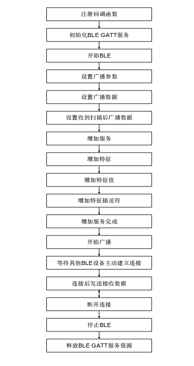

本文主要介绍如何使用QuecPython的BLE功能，并提供一个基本的BLE主从交互示例来作为用户开发的参考。
## 文档历史

| **版本** | **日期** | **作者** | **变更表述** |
| -------- | -------- | -------- | ------------ |
| 1.0      | 2021-09-31| jayceon | 初始版本     |

## 功能支持

当前支持BLE功能的模组有EC200U和EC600U系列。使用的是4.2版本的BLE，模块支持BLE 做主机端和做从机端的功能，一个模块同一时刻只能作为主机或者从机，不能同时进行。

## BLE 简介

BLE (Bluetooth Low Energy)，即低功耗蓝牙，是由传统蓝牙发展而来的一种低功耗无线传输技术，非常适合低功耗、低成本的产品设计。

## BLE API使用说明

请参考QuecPython官方网站上的Wiki说明：[BLE API 说明](https://python.quectel.com/wiki/#/zh-cn/api/QuecPythonClasslib?id=ble-蓝牙低功耗)

## BLE Server 和 Client 的一般开发流程

### BLE Server 流程



### BLE Client  流程


## 示例程序

### BLE Server 示例

```python
# -*- coding: UTF-8 -*-

import ble
import utime


BLE_GATT_SYS_SERVICE = 0  # 0-删除系统默认的GAP和GATT服务  1-保留系统默认的GAP和GATT服务
BLE_SERVER_HANDLE = 0
_BLE_NAME = "Quectel_ble"


event_dict = {
    'BLE_START_STATUS_IND': 0,  # ble start
    'BLE_STOP_STATUS_IND': 1,   # ble stop
    'BLE_CONNECT_IND': 16,  # ble connect
    'BLE_DISCONNECT_IND': 17,   # ble disconnect
    'BLE_UPDATE_CONN_PARAM_IND': 18,    # ble update connection parameter
    'BLE_SCAN_REPORT_IND': 19,  # ble gatt client scan and report other devices
    'BLE_GATT_MTU': 20, # ble connection mtu
    'BLE_GATT_RECV_WRITE_IND': 21, # when ble client write characteristic value or descriptor,server get the notice
    'BLE_GATT_RECV_READ_IND': 22, # when ble client read characteristic value or descriptor,server get the notice
    'BLE_GATT_RECV_NOTIFICATION_IND': 23,   # client receive notification
    'BLE_GATT_RECV_INDICATION_IND': 24, # client receive indication
    'BLE_GATT_SEND_END': 25, # server send notification,and receive send end notice
}

class EVENT(dict):
    def __getattr__(self, item):
        return self[item]

    def __setattr__(self, key, value):
        raise ValueError("{} is read-only.".format(key))

event = EVENT(event_dict)

def ble_callback(args):
    global BLE_GATT_SYS_SERVICE
    global BLE_SERVER_HANDLE
    event_id = args[0]
    status = args[1]
    print('[ble_callback]: event_id={}, status={}'.format(event_id, status))

    if event_id == event.BLE_START_STATUS_IND:  # ble start
        if status == 0:
            print('[callback] BLE start success.')
            ret = ble_gatt_set_name()
            if ret != 0:
                ble_gatt_close()
                return
            ret = ble_gatt_set_param()
            if ret != 0:
                ble_gatt_close()
                return
            ret = ble_gatt_set_data()
            if ret != 0:
                ble_gatt_close()
                return
            ret = ble_gatt_set_rsp_data()
            if ret != 0:
                ble_gatt_close()
                return
            ret = ble_gatt_add_service()
            if ret != 0:
                ble_gatt_close()
                return
            ret = ble_gatt_add_characteristic()
            if ret != 0:
                ble_gatt_close()
                return
            ret = ble_gatt_add_characteristic_value()
            if ret != 0:
                ble_gatt_close()
                return
            ret = ble_gatt_add_characteristic_desc()
            if ret != 0:
                ble_gatt_close()
                return
            ret = ble_gatt_add_service_complete()
            if ret != 0:
                ble_gatt_close()
                return
            if BLE_GATT_SYS_SERVICE == 0:
                BLE_SERVER_HANDLE = 1
            else:
                BLE_SERVER_HANDLE = 16
            ret = ble_adv_start()
            if ret != 0:
                ble_gatt_close()
                return
        else:
            print('[callback] BLE start failed.')
    elif event_id == event.BLE_STOP_STATUS_IND:  # ble stop
        if status == 0:
            print('[callback] ble stop successful.')
        else:
            print('[callback] ble stop failed.')
    elif event_id == event.BLE_CONNECT_IND:  # ble connect
        if status == 0:
            print('[callback] ble connect successful.')
            connect_id = args[2]
            addr = args[3]
            addr_str = '{:02x}:{:02x}:{:02x}:{:02x}:{:02x}:{:02x}'.format(addr[0], addr[1], addr[2], addr[3], addr[4], addr[5])
            print('[callback] connect_id = {}, addr = {}'.format(connect_id, addr_str))

            # utime.sleep(3)
            ret = ble_gatt_send_notification()
            if ret == 0:
                print('[callback] ble_gatt_send_notification successful.')
            else:
                print('[callback] ble_gatt_send_notification failed.')
                ble_gatt_close()
                return
        else:
            print('[callback] ble connect failed.')
    elif event_id == event.BLE_DISCONNECT_IND:  # ble disconnect
        if status == 0:
            print('[callback] ble disconnect successful.')
            connect_id = args[2]
            addr = args[3]
            addr_str = '{:02x}:{:02x}:{:02x}:{:02x}:{:02x}:{:02x}'.format(addr[0], addr[1], addr[2], addr[3], addr[4], addr[5])
            ble_gatt_close()
            print('[callback] connect_id = {}, addr = {}'.format(connect_id, addr_str))
        else:
            print('[callback] ble disconnect failed.')
            ble_gatt_close()
            return
    elif event_id == event.BLE_UPDATE_CONN_PARAM_IND:  # ble update connection parameter
        if status == 0:
            print('[callback] ble update parameter successful.')
            connect_id = args[2]
            max_interval = args[3]
            min_interval = args[4]
            latency = args[5]
            timeout = args[6]
            print('[callback] connect_id={},max_interval={},min_interval={},latency={},timeout={}'.format(connect_id, max_interval, min_interval, latency, timeout))
        else:
            print('[callback] ble update parameter failed.')
            ble_gatt_close()
            return
    elif event_id == event.BLE_GATT_MTU:  # ble connection mtu
        if status == 0:
            print('[callback] ble connect mtu successful.')
            handle = args[2]
            ble_mtu = args[3]
            print('[callback] handle = {:#06x}, ble_mtu = {}'.format(handle, ble_mtu))
        else:
            print('[callback] ble connect mtu failed.')
            ble_gatt_close()
            return
    elif event_id == event.BLE_GATT_RECV_WRITE_IND:
        if status == 0:
            print('[callback] ble recv successful.')
            data_len = args[2]
            data = args[3]  # 这是一个bytearray
            attr_handle = args[4]
            short_uuid = args[5]
            long_uuid = args[6]  # 这是一个bytearray
            print('len={}, data:{}'.format(data_len, data))
            print('attr_handle = {:#06x}'.format(attr_handle))
            print('short uuid = {:#06x}'.format(short_uuid))
            print('long uuid = {}'.format(long_uuid))
        else:
            print('[callback] ble recv failed.')
            ble_gatt_close()
            return
    elif event_id == event.BLE_GATT_RECV_READ_IND:
        if status == 0:
            print('[callback] ble recv read successful.')
            data_len = args[2]
            data = args[3]  # 这是一个bytearray
            attr_handle = args[4]
            short_uuid = args[5]
            long_uuid = args[6]  # 这是一个bytearray
            print('len={}, data:{}'.format(data_len, data))
            print('attr_handle = {:#06x}'.format(attr_handle))
            print('short uuid = {:#06x}'.format(short_uuid))
            print('long uuid = {}'.format(long_uuid))
        else:
            print('[callback] ble recv read failed.')
            ble_gatt_close()
            return
    elif event_id == event.BLE_GATT_SEND_END:
        if status == 0:
            print('[callback] ble send data successful.')
        else:
            print('[callback] ble send data failed.')
    else:
        print('unknown event id.')


def ble_gatt_server_init(cb):
    ret = ble.serverInit(cb)
    if ret != 0:
        print('ble_gatt_server_init failed.')
        return -1
    print('ble_gatt_server_init success.')
    return 0


def ble_gatt_server_release():
    ret = ble.serverRelease()
    if ret != 0:
        print('ble_gatt_server_release failed.')
        return -1
    print('ble_gatt_server_release success.')
    return 0


def ble_gatt_open():
    ret = ble.gattStart()
    if ret != 0:
        print('ble_gatt_open failed.')
        return -1
    print('ble_gatt_open success.')
    return 0


def ble_gatt_close():
    ret = ble.gattStop()
    if ret != 0:
        print('ble_gatt_close failed.')
        return -1
    print('ble_gatt_close success.')
    return 0


def ble_gatt_set_name():
    code = 0  # utf8
    name = _BLE_NAME
    ret = ble.setLocalName(code, name)
    if ret != 0:
        print('ble_gatt_set_name failed.')
        return -1
    print('ble_gatt_set_name success.')
    return 0


def ble_gatt_set_param():
    min_adv = 0x300
    max_adv = 0x320
    adv_type = 0  # 可连接的非定向广播，默认选择
    addr_type = 0  # 公共地址
    channel = 0x07
    filter_strategy = 0  # 处理所有设备的扫描和连接请求
    discov_mode = 2
    no_br_edr = 1
    enable_adv = 1
    ret = ble.setAdvParam(min_adv, max_adv, adv_type, addr_type, channel, filter_strategy, discov_mode, no_br_edr, enable_adv)
    if ret != 0:
        print('ble_gatt_set_param failed.')
        return -1
    print('ble_gatt_set_param success.')
    return 0


def ble_gatt_set_data():
    adv_data = [0x02, 0x01, 0x05]
    ble_name = _BLE_NAME
    length = len(ble_name) + 1
    adv_data.append(length)
    adv_data.append(0x09)
    name_encode = ble_name.encode('UTF-8')
    for i in range(0, len(name_encode)):
        adv_data.append(name_encode[i])
    print('set adv_data:{}'.format(adv_data))
    data = bytearray(adv_data)
    ret = ble.setAdvData(data)
    if ret != 0:
        print('ble_gatt_set_data failed.')
        return -1
    print('ble_gatt_set_data success.')
    return 0


def ble_gatt_set_rsp_data():
    adv_data = []
    ble_name = _BLE_NAME
    length = len(ble_name) + 1
    adv_data.append(length)
    adv_data.append(0x09)
    name_encode = ble_name.encode('UTF-8')
    for i in range(0, len(name_encode)):
        adv_data.append(name_encode[i])
    print('set adv_rsp_data:{}'.format(adv_data))
    data = bytearray(adv_data)
    ret = ble.setAdvRspData(data)
    if ret != 0:
        print('ble_gatt_set_rsp_data failed.')
        return -1
    print('ble_gatt_set_rsp_data success.')
    return 0


def ble_gatt_add_service():
    primary = 1
    server_id = 0x01
    uuid_type = 1  # 短UUID
    uuid_s = 0x180F
    uuid_l = bytearray([0x00, 0x00, 0x00, 0x00, 0x00, 0x00, 0x00, 0x00, 0x00, 0x00, 0x00, 0x00, 0x00, 0x00, 0x00, 0x00])
    ret = ble.addService(primary, server_id, uuid_type, uuid_s, uuid_l)
    if ret != 0:
        print('ble_gatt_add_service failed.')
        return -1
    print('ble_gatt_add_service success.')
    return 0


def ble_gatt_add_characteristic():
    server_id = 0x01
    chara_id = 0x01
    chara_prop = 0x02 | 0x10 | 0x20  # 0x02-可读 0x10-通知 0x20-指示
    uuid_type = 1  # 短UUID
    uuid_s = 0x2A19
    uuid_l = bytearray([0x00, 0x00, 0x00, 0x00, 0x00, 0x00, 0x00, 0x00, 0x00, 0x00, 0x00, 0x00, 0x00, 0x00, 0x00, 0x00])
    ret = ble.addChara(server_id, chara_id, chara_prop, uuid_type, uuid_s, uuid_l)
    if ret != 0:
        print('ble_gatt_add_characteristic failed.')
        return -1
    print('ble_gatt_add_characteristic success.')
    return 0


def ble_gatt_add_characteristic_value():
    data = []
    server_id = 0x01
    chara_id = 0x01
    permission = 0x0001 | 0x0002
    uuid_type = 1  # 短UUID
    uuid_s = 0x2A19
    uuid_l = bytearray([0x00, 0x00, 0x00, 0x00, 0x00, 0x00, 0x00, 0x00, 0x00, 0x00, 0x00, 0x00, 0x00, 0x00, 0x00, 0x00])
    for i in range(0, 244):
        data.append(0x00)
    value = bytearray(data)
    ret = ble.addCharaValue(server_id, chara_id, permission, uuid_type, uuid_s, uuid_l, value)
    if ret != 0:
        print('ble_gatt_add_characteristic_value failed.')
        return -1
    print('ble_gatt_add_characteristic_value success.')
    return 0


def ble_gatt_add_characteristic_desc():
    data = [0x00, 0x00, 0x00, 0x00]
    server_id = 0x01
    chara_id = 0x01
    permission = 0x0001 | 0x0002
    uuid_type = 1  # 短UUID
    uuid_s = 0x2902
    uuid_l = bytearray([0x00, 0x00, 0x00, 0x00, 0x00, 0x00, 0x00, 0x00, 0x00, 0x00, 0x00, 0x00, 0x00, 0x00, 0x00, 0x00])
    value = bytearray(data)
    ret = ble.addCharaDesc(server_id, chara_id, permission, uuid_type, uuid_s, uuid_l, value)
    if ret != 0:
        print('ble_gatt_add_characteristic_desc failed.')
        return -1
    print('ble_gatt_add_characteristic_desc success.')
    return 0


def ble_gatt_send_notification():
    global BLE_SERVER_HANDLE
    data = [0x39, 0x39, 0x39, 0x39, 0x39]  # 随便发点啥数据
    conn_id = 0
    attr_handle = BLE_SERVER_HANDLE + 2
    value = bytearray(data)
    ret = ble.sendNotification(conn_id, attr_handle, value)
    if ret != 0:
        print('ble_gatt_send_notification failed.')
        return -1
    print('ble_gatt_send_notification success.')
    return 0


def ble_gatt_add_service_complete():
    global BLE_GATT_SYS_SERVICE
    ret = ble.addOrClearService(1, BLE_GATT_SYS_SERVICE)
    if ret != 0:
        print('ble_gatt_add_service_complete failed.')
        return -1
    print('ble_gatt_add_service_complete success.')
    return 0


def ble_gatt_clear_service_complete():
    global BLE_GATT_SYS_SERVICE
    ret = ble.addOrClearService(0, BLE_GATT_SYS_SERVICE)
    if ret != 0:
        print('ble_gatt_clear_service_complete failed.')
        return -1
    print('ble_gatt_clear_service_complete success.')
    return 0


def ble_adv_start():
    ret = ble.advStart()
    if ret != 0:
        print('ble_adv_start failed.')
        return -1
    print('ble_adv_start success.')
    return 0


def ble_adv_stop():
    ret = ble.advStop()
    if ret != 0:
        print('ble_adv_stop failed.')
        return -1
    print('ble_adv_stop success.')
    return 0


def main():
    ret = ble_gatt_server_init(ble_callback)
    if ret == 0:
        ret = ble_gatt_open()
        if ret != 0:
            return -1
    else:
        return -1
    count = 0
    while True:
        utime.sleep(1)
        count += 1
        if count % 5 == 0:
            print('##### BLE running, count = {}......'.format(count))
        if count > 120:
            count = 0
            print('!!!!! stop BLE now !!!!!')
            ble_gatt_close()
            ble_gatt_server_release()
            return 0


if __name__ == '__main__':
    main()

```

### BLE Client 示例

```python
# -*- coding: UTF-8 -*-

import ble
import utime
import _thread
import checkNet
from queue import Queue

PROJECT_NAME = "QuecPython_BLE_Client_Example"
PROJECT_VERSION = "1.0.0"
checknet = checkNet.CheckNetwork(PROJECT_NAME, PROJECT_VERSION)

event_dict = {
    'BLE_START_STATUS_IND': 0,  # ble start
    'BLE_STOP_STATUS_IND': 1,   # ble stop
    'BLE_CONNECT_IND': 16,  # ble connect
    'BLE_DISCONNECT_IND': 17,   # ble disconnect
    'BLE_UPDATE_CONN_PARAM_IND': 18,    # ble update connection parameter
    'BLE_SCAN_REPORT_IND': 19,  # ble gatt client scan and report other devices
    'BLE_GATT_MTU': 20, # ble connection mtu
    'BLE_GATT_RECV_NOTIFICATION_IND': 23,   # client receive notification
    'BLE_GATT_RECV_INDICATION_IND': 24, # client receive indication
    'BLE_GATT_START_DISCOVER_SERVICE_IND': 26,  # start discover service
    'BLE_GATT_DISCOVER_SERVICE_IND': 27,    # discover service
    'BLE_GATT_DISCOVER_CHARACTERISTIC_DATA_IND': 28,    # discover characteristic
    'BLE_GATT_DISCOVER_CHARA_DESC_IND': 29, # discover characteristic descriptor
    'BLE_GATT_CHARA_WRITE_WITH_RSP_IND': 30,    # write characteristic value with response
    'BLE_GATT_CHARA_WRITE_WITHOUT_RSP_IND': 31, # write characteristic value without response
    'BLE_GATT_CHARA_READ_IND': 32,  # read characteristic value by handle
    'BLE_GATT_CHARA_READ_BY_UUID_IND': 33,  # read characteristic value by uuid
    'BLE_GATT_CHARA_MULTI_READ_IND': 34,    # read multiple characteristic value
    'BLE_GATT_DESC_WRITE_WITH_RSP_IND': 35, # write characteristic descriptor
    'BLE_GATT_DESC_READ_IND': 36,   # read characteristic descriptor
    'BLE_GATT_ATT_ERROR_IND': 37,   # attribute error
}

gatt_status_dict = {
    'BLE_GATT_IDLE' : 0,
    'BLE_GATT_DISCOVER_SERVICE': 1,
    'BLE_GATT_DISCOVER_INCLUDES': 2,
    'BLE_GATT_DISCOVER_CHARACTERISTIC': 3,
    'BLE_GATT_WRITE_CHARA_VALUE': 4,
    'BLE_GATT_WRITE_CHARA_DESC': 5,
    'BLE_GATT_READ_CHARA_VALUE': 6,
    'BLE_GATT_READ_CHARA_DESC': 7,
}

class EVENT(dict):
    def __getattr__(self, item):
        return self[item]

    def __setattr__(self, key, value):
        raise ValueError("{} is read-only.".format(key))


class BleClient(object):
    def __init__(self):
        self.ble_server_name = 'Quectel_ble' # 目标设备ble名称
        self.connect_id = 0
        self.connect_addr = 0
        self.gatt_statue = 0
        self.discover_service_mode = 0 # 0-discover all service, 1-discover service by uuid

        self.scan_param = {
            'scan_mode' : 1, # 积极扫描
            'interval' :  0x0100,  # 0x100,
            'scan_window' : 0x50,
            'filter_policy' : 0,
            'local_addr_type' : 0,
        }

        self.scan_report_info = {
            'event_type' : 0,
            'name' : '',
            'addr_type' : 0,
            'addr' : 0, # 初始化时，用0表示无效值，实际存放bytearray
            'rssi' : 0,
            'data_len' : 0,
            'raw_data' : 0,
        }

        self.target_service = {
            'start_handle' : 0,
            'end_handle' : 0,
            'uuid_type' : 1, # 短uuid
            'short_uuid' : 0x180F, # 电池电量服务
            'long_uuid' : bytearray([0x00, 0x00, 0x00, 0x00, 0x00, 0x00, 0x00, 0x00, 0x00, 0x00, 0x00, 0x00, 0x00, 0x00, 0x00, 0x00])
        }

        self.characteristic_list = []
        self.descriptor_list = []
        self.characteristic_count = 0   # ql_ble_gatt_chara_count
        self.chara_descriptor_count = 0 # ql_ble_gatt_chara_desc_count
        self.characteristic_index = 0   # ql_ble_gatt_chara_desc_index
        self.current_chara_index = 0    # ql_ble_gatt_cur_chara
        self.current_desc_index = 0     # ql_ble_gatt_chara_cur_desc
        self.ble_short_uuid_pair_len = 7
        self.ble_long_uuid_pair_len = 21

        ret = ble.clientInit(self.ble_client_callback)
        if ret != 0:
            print('ble client initialize failed.')
            raise ValueError("BLE Client Init failed.")
        else:
            print('ble client initialize successful.')
        print('')

    @staticmethod
    def gatt_open():
        ret = ble.gattStart()
        if ret != 0:
            print('ble open failed.')
        else:
            print('ble open successful.')
        print('')
        return ret

    @staticmethod
    def gatt_close():
        ret = ble.gattStop()
        if ret != 0:
            print('ble close failed.')
        else:
            print('ble close successful.')
        print('')
        return ret

    @staticmethod
    def gatt_get_status():
        return ble.getStatus()

    @staticmethod
    def release():
        ret = ble.clientRelease()
        if ret != 0:
            print('ble client release failed.')
        else:
            print('ble client release successful.')
        print('')
        return ret

    def set_scan_param(self):
        scan_mode = self.scan_param['scan_mode']
        interval = self.scan_param['interval']
        scan_time = self.scan_param['scan_window']
        filter_policy = self.scan_param['filter_policy']
        local_addr_type = self.scan_param['local_addr_type']
        ret = ble.setScanParam(scan_mode, interval, scan_time, filter_policy, local_addr_type)
        if ret != 0:
            print('ble client set scan-parameters failed.')
        else:
            print('ble client set scan-parameters successful.')
        print('')
        return ret

    @staticmethod
    def start_scan():
        ret = ble.scanStart()
        if ret != 0:
            print('ble client scan failed.')
        else:
            print('ble client scan successful.')
        print('')
        return ret

    @staticmethod
    def stop_scan():
        ret = ble.scanStop()
        if ret != 0:
            print('ble client failed to stop scanning.')
        else:
            print('ble client scan stopped successfully.')
        print('')
        return ret

    def connect(self):
        print('start to connect.....')
        addr_type = self.scan_report_info['addr_type']
        addr = self.scan_report_info['addr']
        if addr != 0 and len(addr) == 6:
            addr_str = '{:02x}:{:02x}:{:02x}:{:02x}:{:02x}:{:02x}'.format(addr[0], addr[1], addr[2], addr[3], addr[4], addr[5])
            print('addr_type : {}, addr : {}'.format(addr_type, addr_str))
            ret = ble.connect(addr_type, addr)
            if ret != 0:
                print('ble client connect failed.')
            else:
                print('ble client connect successful.')
            print('')
            return ret

    def cancel_connect(self):
        ret = ble.cancelConnect(self.scan_report_info['addr'])
        if ret != 0:
            print('ble client cancel connect failed.')
        else:
            print('ble client cancel connect successful.')
        print('')
        return ret

    def disconnect(self):
        ret = ble.disconnect(self.connect_id)
        if ret != 0:
            print('ble client disconnect failed.')
        else:
            print('ble client disconnect successful.')
        print('')
        return ret

    def discover_all_service(self):
        ret = ble.discoverAllService(self.connect_id)
        if ret != 0:
            print('ble client discover all service failed.')
        else:
            print('ble client discover all service successful.')
        print('')
        return ret

    def discover_service_by_uuid(self):
        connect_id = self.connect_id
        uuid_type = self.target_service['uuid_type']
        short_uuid = self.target_service['short_uuid']
        long_uuid = self.target_service['long_uuid']
        ret = ble.discoverByUUID(connect_id, uuid_type, short_uuid, long_uuid)
        if ret != 0:
            print('ble client discover service by uuid failed.')
        else:
            print('ble client discover service by uuid successful.')
        print('')
        return ret

    def discover_all_includes(self):
        connect_id = self.connect_id
        start_handle = self.target_service['start_handle']
        end_handle = self.target_service['end_handle']
        ret = ble.discoverAllIncludes(connect_id, start_handle, end_handle)
        if ret != 0:
            print('ble client discover all includes failed.')
        else:
            print('ble client discover all includes successful.')
        print('')
        return ret

    def discover_all_characteristic(self):
        connect_id = self.connect_id
        start_handle = self.target_service['start_handle']
        end_handle = self.target_service['end_handle']
        ret = ble.discoverAllChara(connect_id, start_handle, end_handle)
        if ret != 0:
            print('ble client discover all characteristic failed.')
        else:
            print('ble client discover all characteristic successful.')
        print('')
        return ret

    def discover_all_characteristic_descriptor(self):
        connect_id = self.connect_id
        index = self.characteristic_index
        start_handle = self.characteristic_list[index]['value_handle'] + 1

        if self.characteristic_index == (self.characteristic_count - 1):
            end_handle = self.target_service['end_handle']
            print('[1]start_handle = {:#06x}, end_handle = {:#06x}'.format(start_handle - 1, end_handle))
            ret = ble.discoverAllCharaDesc(connect_id, start_handle, end_handle)
        else:
            end_handle = self.characteristic_list[index+1]['handle'] - 1
            print('[2]start_handle = {:#06x}, end_handle = {:#06x}'.format(start_handle - 1, end_handle))
            ret = ble.discoverAllCharaDesc(connect_id, start_handle, end_handle)
        self.characteristic_index += 1
        if ret != 0:
            print('ble client discover all characteristic descriptor failed.')
        else:
            print('ble client discover all characteristic descriptor successful.')
        print('')
        return ret

    def read_characteristic_by_uuid(self):
        connect_id = self.connect_id
        index = self.current_chara_index   # 根据需要改变该值
        start_handle = self.characteristic_list[index]['handle']
        end_handle = self.characteristic_list[index]['value_handle']
        uuid_type = 1
        short_uuid = self.characteristic_list[index]['short_uuid']
        long_uuid = bytearray([0x00,0x00,0x00,0x00,0x00,0x00,0x00,0x00,0x00,0x00,0x00,0x00,0x00,0x00,0x00,0x00])

        ret = ble.readCharaByUUID(connect_id, start_handle, end_handle, uuid_type, short_uuid, long_uuid)
        if ret != 0:
            print('ble client read characteristic by uuid failed.')
        else:
            print('ble client read characteristic by uuid successful.')
        print('')
        return ret

    def read_characteristic_by_handle(self):
        connect_id = self.connect_id
        index = self.current_chara_index  # 根据需要改变该值
        handle = self.characteristic_list[index]['value_handle']
        offset = 0
        is_long = 0

        ret = ble.readCharaByHandle(connect_id, handle, offset, is_long)
        if ret != 0:
            print('ble client read characteristic by handle failed.')
        else:
            print('ble client read characteristic by handle successful.')
        print('')
        return ret

    def read_characteristic_descriptor(self):
        connect_id = self.connect_id
        index = self.current_desc_index  # 根据需要改变该值
        handle = self.descriptor_list[index]['handle']
        print('handle = {:#06x}'.format(handle))
        is_long = 0
        ret = ble.readCharaDesc(connect_id, handle, is_long)
        if ret != 0:
            print('ble client read characteristic descriptor failed.')
        else:
            print('ble client read characteristic descriptor successful.')
        print('')
        return ret

    def write_characteristic(self):
        connect_id = self.connect_id
        index = self.current_chara_index  # 根据需要改变该值
        handle = self.characteristic_list[index]['value_handle']
        offset = 0
        is_long = 0
        data = bytearray([0x40, 0x00])
        print('value_handle = {:#06x}, uuid = {:#06x}'.format(handle, self.characteristic_list[index]['short_uuid']))
        ret = ble.writeChara(connect_id, handle, offset, is_long, data)
        if ret != 0:
            print('ble client write characteristic failed.')
        else:
            print('ble client read characteristic successful.')
        print('')
        return ret

    def write_characteristic_no_rsp(self):
        connect_id = self.connect_id
        index = self.current_chara_index  # 根据需要改变该值
        handle = self.characteristic_list[index]['value_handle']
        data = bytearray([0x20, 0x00])
        print('value_handle = {:#06x}, uuid = {:#06x}'.format(handle, self.characteristic_list[index]['short_uuid']))
        ret = ble.writeCharaNoRsp(connect_id, handle, data)
        if ret != 0:
            print('ble client write characteristic no rsp failed.')
        else:
            print('ble client read characteristic no rsp successful.')
        print('')
        return ret

    def write_characteristic_descriptor(self):
        connect_id = self.connect_id
        index = self.current_desc_index  # 根据需要改变该值
        handle = self.descriptor_list[index]['handle']
        data = bytearray([0x01, 0x02])
        print('handle = {:#06x}'.format(handle))

        ret = ble.writeCharaDesc(connect_id, handle, data)
        if ret != 0:
            print('ble client write characteristic descriptor failed.')
        else:
            print('ble client read characteristic descriptor successful.')
        print('')
        return ret

    @staticmethod
    def ble_client_callback(args):
        global msg_queue
        msg_queue.put(args)


def ble_gatt_client_event_handler():
    global msg_queue
    old_time = 0
    while True:
        cur_time = utime.localtime()
        timestamp = "{:02d}:{:02d}:{:02d}".format(cur_time[3], cur_time[4], cur_time[5])
        if cur_time[5] != old_time and cur_time[5] % 5 == 0:
            old_time = cur_time[5]
            print('[{}]event handler running.....'.format(timestamp))
            print('')
        msg = msg_queue.get() # 没有消息时会阻塞在这
        # print('msg : {}'.format(msg))
        event_id = msg[0]
        status = msg[1]

        if event_id == event.BLE_START_STATUS_IND:
            print('')
            print('event_id : BLE_START_STATUS_IND, status = {}'.format(status))
            if status == 0:
                print('BLE start successful.')
                ble_status = ble_client.gatt_get_status()
                if ble_status == 0:
                    print('BLE Status : stopped.')
                    break
                elif ble_status == 1:
                    print('BLE Status : started.')
                else:
                    print('get ble status error.')
                    ble_client.gatt_close()
                    break

                ret = ble_client.set_scan_param()
                if ret != 0:
                    ble_client.gatt_close()
                    break
                ret = ble_client.start_scan()
                if ret != 0:
                    ble_client.gatt_close()
                    break
            else:
                print('BLE start failed.')
                break
        elif event_id == event.BLE_STOP_STATUS_IND:
            print('')
            print('event_id : BLE_STOP_STATUS_IND, status = {}'.format(status))
            if status == 0:
                print('ble stop successful.')
            else:
                print('ble stop failed.')
                break
        elif event_id == event.BLE_CONNECT_IND:
            print('')
            print('event_id : BLE_CONNECT_IND, status = {}'.format(status))
            if status == 0:
                ble_client.connect_id = msg[2]
                ble_client.connect_addr = msg[3]
                addr = ble_client.connect_addr
                addr_str = '{:02x}:{:02x}:{:02x}:{:02x}:{:02x}:{:02x}'.format(addr[0], addr[1], addr[2], addr[3], addr[4], addr[5])
                print('connect_id : {:#x}, connect_addr : {}'.format(ble_client.connect_id, addr_str))
            else:
                print('ble connect failed.')
                break
        elif event_id == event.BLE_DISCONNECT_IND:
            print('')
            print('event_id : BLE_DISCONNECT_IND, status = {}'.format(status))
            if status == 0:
                ble_client.connect_id = msg[2]
                ble_client.connect_addr = msg[3]
                addr = ble_client.connect_addr
                addr_str = '{:02x}:{:02x}:{:02x}:{:02x}:{:02x}:{:02x}'.format(addr[0], addr[1], addr[2], addr[3], addr[4], addr[5])
                print('connect_id : {:#x}, connect_addr : {}'.format(ble_client.connect_id, addr_str))
            else:
                print('ble disconnect failed.')
            ble_client.gatt_close()
            break
        elif event_id == event.BLE_UPDATE_CONN_PARAM_IND:
            print('')
            print('event_id : BLE_UPDATE_CONN_PARAM_IND, status = {}'.format(status))
            if status == 0:
                connect_id = msg[2]
                max_interval = msg[3]
                min_interval = msg[4]
                latency = msg[5]
                timeout = msg[6]
                print('connect_id={},max_interval={},min_interval={},latency={},timeout={}'.format(connect_id,max_interval,min_interval,latency,timeout))
            else:
                print('ble update parameter failed.')
                ble_client.gatt_close()
                break
        elif event_id == event.BLE_SCAN_REPORT_IND:
            # print('')
            # print('event_id : BLE_SCAN_REPORT_IND, status = {}'.format(status))
            if status == 0:
                # print(' ble scan successful.')

                ble_client.scan_report_info['event_type'] = msg[2]
                ble_client.scan_report_info['name'] = msg[3]
                ble_client.scan_report_info['addr_type'] = msg[4]
                ble_client.scan_report_info['addr'] = msg[5]
                ble_client.scan_report_info['rssi'] = msg[6]
                ble_client.scan_report_info['data_len'] = msg[7]
                ble_client.scan_report_info['raw_data'] = msg[8]

                device_name = ble_client.scan_report_info['name']
                addr = ble_client.scan_report_info['addr']
                rssi = ble_client.scan_report_info['rssi']
                addr_type = ble_client.scan_report_info['addr_type']
                addr_str = '{:02x}:{:02x}:{:02x}:{:02x}:{:02x}:{:02x}'.format(addr[0], addr[1], addr[2], addr[3], addr[4], addr[5])
                if device_name != '' and rssi != 0:
                    print('name: {}, addr: {}, rssi: {}, addr_type: {}'.format(device_name, addr_str, rssi, addr_type))
                    print('raw_data: {}'.format(ble_client.scan_report_info['raw_data']))

                if device_name == ble_client.ble_server_name: # 扫描到目标设备后就停止扫描
                    ret = ble_client.stop_scan()
                    if ret != 0:
                        ble_client.gatt_close()
                        break

                    ret = ble_client.connect()
                    if ret != 0:
                        ble_client.gatt_close()
                        break
            else:
                print('ble scan failed.')
                ret = ble_client.stop_scan()
                if ret != 0:
                    ble_client.gatt_close()
                    break
        elif event_id == event.BLE_GATT_MTU:
            print('')
            print('event_id : BLE_GATT_MTU, status = {}'.format(status))
            if status == 0:
                handle = msg[2]
                ble_mtu = msg[3]
                print('handle = {:#06x}, ble_mtu = {}'.format(handle, ble_mtu))
            else:
                print('ble connect mtu failed.')
                ble_client.gatt_close()
                break
        elif event_id == event.BLE_GATT_RECV_NOTIFICATION_IND:
            print('')
            print('event_id : BLE_GATT_RECV_NOTIFICATION_IND, status = {}'.format(status))
            if status == 0:
                data_len = msg[2]
                data = msg[3]
                print('len={}, data:{}'.format(data_len, data))
                handle = (data[1] << 8) | data[0]
                print('handle = {:#06x}'.format(handle))
            else:
                print('ble receive notification failed.')
                break
        elif event_id == event.BLE_GATT_RECV_INDICATION_IND:
            print('')
            print('event_id : BLE_GATT_RECV_INDICATION_IND, status = {}'.format(status))
            if status == 0:
                data_len = msg[2]
                data = msg[3]
                print('len={}, data:{}'.format(data_len, data))
            else:
                print('ble receive indication failed.')
                break
        elif event_id == event.BLE_GATT_START_DISCOVER_SERVICE_IND:
            print('')
            print('event_id : BLE_GATT_START_DISCOVER_SERVICE_IND, status = {}'.format(status))
            if status == 0:
                ble_client.characteristic_count = 0
                ble_client.chara_descriptor_count = 0
                ble_client.characteristic_index = 0
                ble_client.gatt_statue = gatt_status.BLE_GATT_DISCOVER_SERVICE

                if ble_client.discover_service_mode == 0:
                    print('execute the function discover_all_service.')
                    ret = ble_client.discover_all_service()
                else:
                    print('execute the function discover_service_by_uuid.')
                    ret = ble_client.discover_service_by_uuid()
                if ret != 0:
                    print('Execution result: Failed.')
                    ble_client.gatt_close()
                    break
            else:
                print('ble start discover service failed.')
                ble_client.gatt_close()
                break
        elif event_id == event.BLE_GATT_DISCOVER_SERVICE_IND:
            print('')
            print('event_id : BLE_GATT_DISCOVER_SERVICE_IND, status = {}'.format(status))
            if status == 0:
                start_handle = msg[2]
                end_handle = msg[3]
                short_uuid = msg[4]
                print('start_handle = {:#06x}, end_handle = {:#06x}, short_uuid = {:#06x}'.format(start_handle, end_handle, short_uuid))
                if ble_client.discover_service_mode == 0: # discover service all
                    if ble_client.target_service['short_uuid'] == short_uuid: # 查找到所有服务后，按指定uuid查找特征值
                        ble_client.target_service['start_handle'] = start_handle
                        ble_client.target_service['end_handle'] = end_handle
                        ble_client.gatt_statue = gatt_status.BLE_GATT_DISCOVER_CHARACTERISTIC
                        print('execute the function discover_all_characteristic.')
                        ret = ble_client.discover_all_characteristic()
                        if ret != 0:
                            print('Execution result: Failed.')
                            ble_client.gatt_close()
                            break
                else:
                    ble_client.target_service['start_handle'] = start_handle
                    ble_client.target_service['end_handle'] = end_handle
                    ble_client.gatt_statue = gatt_status.BLE_GATT_DISCOVER_CHARACTERISTIC
                    print('execute the function discover_all_characteristic.')
                    ret = ble_client.discover_all_characteristic()
                    if ret != 0:
                        print('Execution result: Failed.')
                        ble_client.gatt_close()
                        break
            else:
                print('ble discover service failed.')
                ble_client.gatt_close()
                break
        elif event_id == event.BLE_GATT_DISCOVER_CHARACTERISTIC_DATA_IND:
            print('')
            print('event_id : BLE_GATT_DISCOVER_CHARACTERISTIC_DATA_IND, status = {}'.format(status))
            if status == 0:
                data_len = msg[2]
                data = msg[3]
                pair_len = data[0]
                print('pair_len={}, len={}, data:{}'.format(pair_len, data_len, data))
                if data_len > 0:
                    if ble_client.gatt_statue == gatt_status.BLE_GATT_DISCOVER_CHARACTERISTIC:
                        i = 0
                        while i < (data_len - 1) / pair_len:
                            chara_dict = {
                                'handle' : (data[i * pair_len + 2] << 8) | data[i * pair_len + 1],
                                'properties': data[i * pair_len + 3],
                                'value_handle' : (data[i * pair_len + 5] << 8) | data[i * pair_len + 4],
                                'uuid_type' : 0,
                                'short_uuid' : 0x0000,
                                'long_uuid' : bytearray([0x00, 0x00, 0x00, 0x00, 0x00, 0x00, 0x00, 0x00, 0x00, 0x00, 0x00, 0x00, 0x00, 0x00, 0x00, 0x00])
                            }
                            print('handle={:#06x}, properties={:#x}, value_handle={:#06x}'.format(chara_dict['handle'], chara_dict['properties'], chara_dict['value_handle']))
                            if pair_len == ble_client.ble_short_uuid_pair_len:
                                chara_dict['uuid_type'] = 1
                                chara_dict['short_uuid'] = (data[i * pair_len + 7] << 8) | data[i * pair_len + 6]
                                print('short_uuid:{:#06x}'.format(chara_dict['short_uuid']))
                            elif pair_len == ble_client.ble_long_uuid_pair_len:
                                start_index = i * pair_len + 6
                                end_index = start_index + 16
                                chara_dict['uuid_type'] = 0
                                chara_dict['long_uuid'] = data[start_index : end_index]
                                print('long_uuid:{}'.format(chara_dict['long_uuid']))
                            i += 1
                            if ble_client.characteristic_count < 5:
                                ble_client.characteristic_list.append(chara_dict)
                                ble_client.characteristic_count = len(ble_client.characteristic_list)
                            print('characteristic_list len = {}'.format(ble_client.characteristic_count))
                    elif ble_client.gatt_statue == gatt_status.BLE_GATT_READ_CHARA_VALUE:
                        print('data_len = {}'.format(data_len))
                        print('pay_load = {:02x},{:02x},{:02x},{:02x}'.format(data[0], data[1], data[2], data[3]))
            else:
                print('ble discover characteristic failed.')
                ble_client.gatt_close()
                break
        elif event_id == event.BLE_GATT_DISCOVER_CHARA_DESC_IND:
            print('')
            print('event_id : BLE_GATT_DISCOVER_CHARA_DESC_IND, status = {}'.format(status))
            if status == 0:
                data_len = msg[2]
                data = msg[3]
                fmt = data[0]
                print('fmt={}, len={}, data:{}'.format(fmt, data_len, data))
                if data_len > 0:
                    i = 0
                    if fmt == 1: # 16 bit uuid
                        while i < (data_len - 1) / 4:
                            descriptor_dict = {
                                'handle': (data[i * 4 + 2] << 8) | data[i * 4 + 1],
                                'short_uuid': (data[i * 4 + 4] << 8) | data[i * 4 + 3],
                            }
                            print('handle={:#06x}, uuid={:#06x}'.format(descriptor_dict['handle'], descriptor_dict['short_uuid']))
                            i += 1
                            if ble_client.chara_descriptor_count < 5:
                                ble_client.descriptor_list.append(descriptor_dict)
                                ble_client.chara_descriptor_count = len(ble_client.descriptor_list)
                            print('descriptor_list len = {}'.format(ble_client.chara_descriptor_count))
                if ble_client.characteristic_index == ble_client.characteristic_count:
                    print('execute the function read_characteristic_by_uuid.')
                    # ble_client.gatt_statue = gatt_status.BLE_GATT_WRITE_CHARA_VALUE
                    # ret = ble_client.write_characteristic()
                    # ret = ble_client.write_characteristic_no_rsp()

                    ble_client.gatt_statue = gatt_status.BLE_GATT_READ_CHARA_VALUE
                    ret = ble_client.read_characteristic_by_uuid()
                    # ret = ble_client.read_characteristic_by_handle()

                    # ble_client.gatt_statue = gatt_status.BLE_GATT_READ_CHARA_DESC
                    # ret = ble_client.read_characteristic_descriptor()

                    # ble_client.gatt_statue = gatt_status.BLE_GATT_WRITE_CHARA_DESC
                    # ret = ble_client.write_characteristic_descriptor()
                else:
                    print('execute the function discover_all_characteristic_descriptor.')
                    ret = ble_client.discover_all_characteristic_descriptor()
                if ret != 0:
                    print('Execution result: Failed.')
                    ble_client.gatt_close()
                    break
            else:
                print('ble discover characteristic descriptor failed.')
                ble_client.gatt_close()
                break
        elif event_id == event.BLE_GATT_CHARA_WRITE_WITH_RSP_IND:
            print('')
            print('event_id : BLE_GATT_CHARA_WRITE_WITH_RSP_IND, status = {}'.format(status))
            if status == 0:
                if ble_client.gatt_statue == gatt_status.BLE_GATT_WRITE_CHARA_VALUE:
                    pass
                elif ble_client.gatt_statue == gatt_status.BLE_GATT_WRITE_CHARA_DESC:
                    pass
            else:
                print('ble write characteristic with response failed.')
                break
        elif event_id == event.BLE_GATT_CHARA_WRITE_WITHOUT_RSP_IND:
            print('')
            print('event_id : BLE_GATT_CHARA_WRITE_WITHOUT_RSP_IND, status = {}'.format(status))
            if status == 0:
                print('write characteristic value without response successful.')
            else:
                print('write characteristic value without response failed.')
                break
        elif event_id == event.BLE_GATT_CHARA_READ_IND:
            print('')
            # read characteristic value by handle
            print('event_id : BLE_GATT_CHARA_READ_IND, status = {}'.format(status))
            if status == 0:
                data_len = msg[2]
                data = msg[3]
                print('data_len = {}, data : {}'.format(data_len, data))
                if ble_client.gatt_statue == gatt_status.BLE_GATT_READ_CHARA_VALUE:
                    # print('read characteristic value by handle.')
                    pass
            else:
                print('ble read characteristic failed.')
                break
        elif event_id == event.BLE_GATT_CHARA_READ_BY_UUID_IND:
            print('')
            # read characteristic value by uuid
            print('event_id : BLE_GATT_CHARA_READ_BY_UUID_IND, status = {}'.format(status))
            if status == 0:
                data_len = msg[2]
                data = msg[3]
                print('data_len = {}, data : {}'.format(data_len, data))
                handle = (data[2] << 8) | data[1]
                print('handle = {:#06x}'.format(handle))
            else:
                print('ble read characteristic by uuid failed.')
                break
        elif event_id == event.BLE_GATT_CHARA_MULTI_READ_IND:
            print('')
            # read multiple characteristic value
            print('event_id : BLE_GATT_CHARA_MULTI_READ_IND, status = {}'.format(status))
            if status == 0:
                data_len = msg[2]
                data = msg[3]
                print('data_len = {}, data : {}'.format(data_len, data))
            else:
                print('ble read multiple characteristic by uuid failed.')
                break
        elif event_id == event.BLE_GATT_DESC_WRITE_WITH_RSP_IND:
            print('')
            print('event_id : BLE_GATT_DESC_WRITE_WITH_RSP_IND, status = {}'.format(status))
            if status == 0:
                if ble_client.gatt_statue == gatt_status.BLE_GATT_WRITE_CHARA_VALUE:
                    pass
                elif ble_client.gatt_statue == gatt_status.BLE_GATT_WRITE_CHARA_DESC:
                    pass
            else:
                print('ble write characteristic descriptor failed.')
                break
        elif event_id == event.BLE_GATT_DESC_READ_IND:
            print('')
            # read characteristic descriptor
            print('event_id : BLE_GATT_DESC_READ_IND, status = {}'.format(status))
            if status == 0:
                data_len = msg[2]
                data = msg[3]
                print('data_len = {}, data : {}'.format(data_len, data))
                if ble_client.gatt_statue == gatt_status.BLE_GATT_READ_CHARA_DESC:
                    # print('read characteristic descriptor.')
                    pass
            else:
                print('ble read characteristic descriptor failed.')
                break
        elif event_id == event.BLE_GATT_ATT_ERROR_IND:
            print('')
            print('event_id : BLE_GATT_ATT_ERROR_IND, status = {}'.format(status))
            if status == 0:
                errcode = msg[2]
                print('errcode = {:#06x}'.format(errcode))
                if ble_client.gatt_statue == gatt_status.BLE_GATT_DISCOVER_INCLUDES:
                    ble_client.gatt_statue = gatt_status.BLE_GATT_DISCOVER_CHARACTERISTIC
                    print('execute the function discover_all_characteristic.')
                    ret = ble_client.discover_all_characteristic()
                    if ret != 0:
                        print('Execution result: Failed.')
                        ble_client.gatt_close()
                        break
                elif ble_client.gatt_statue == gatt_status.BLE_GATT_DISCOVER_CHARACTERISTIC:
                    ble_client.gatt_statue = gatt_status.BLE_GATT_IDLE
                    print('execute the function discover_all_characteristic_descriptor.')
                    ret = ble_client.discover_all_characteristic_descriptor()
                    if ret != 0:
                        print('Execution result: Failed.')
                        ble_client.gatt_close()
                        break
            else:
                print('ble attribute error.')
                ble_client.gatt_close()
                break
        else:
            print('unknown event id : {}.'.format(event_id))

    # ble_client.release()


event = EVENT(event_dict)
gatt_status = EVENT(gatt_status_dict)
msg_queue = Queue(50)
ble_client = BleClient()


def main():
    checknet.poweron_print_once()
    print('create client event handler task.')
    _thread.start_new_thread(ble_gatt_client_event_handler, ())
    ret = ble_client.gatt_open()
    if ret != 0:
        return -1

    count = 0
    while True:
        utime.sleep(1)
        count += 1
        cur_time = utime.localtime()
        timestamp = "{:02d}:{:02d}:{:02d}".format(cur_time[3], cur_time[4], cur_time[5])
        if count % 5 == 0:
            print('[{}] BLE Client running, count = {}......'.format(timestamp, count))
            print('')
        if count > 130: # 这里设置计数是为了程序运行一会自己退出，方便测试，实际根据用户需要来处理
            count = 0
            print('!!!!! stop BLE Client now !!!!!')
            ble_status = ble_client.gatt_get_status()
            if ble_status == 1:
                ble_client.gatt_close()
            ble_client.release()
            break
        else:
            ble_status = ble_client.gatt_get_status()
            if ble_status == 0: # stopped
                print('BLE connection has been disconnected.')
                ble_client.release()
                break

if __name__ == '__main__':
    main()

```


## 示例说明

上面分别提供了BLE作为从机端（server）和主机端（client）功能的示例程序。其中server的例程是设置了蓝牙名称为 “Quectel_ble”，然后增加了一个关于电池电量的服务（仅添加了服务）并设置了基本属性，将该示例放到模块中跑起来后，可通过手机上安装的nrf Connect软件去搜索名为 “Quectel_ble”的设备，并查看该设备提供的服务；client的示例程序，初始化完成后，开始扫描周边的BLE广播信息，如果扫描到名称为 “Quectel_ble”的设备就停止扫描，并去连接这个设备，然后去发现该设备提供了哪些服务、服务下又有哪些特征描述符等。用户可以用两个模块，一个运行server端示例，一个运行client端示例。

## 注意事项

运行程序之前，要先确认插好蓝牙天线，注意不要插错位置，应该插到开发板上标有BT、WiFi字样或者蓝牙标志的天线座子上。

## 示例程序下载

进入QuecPython官网资源下载页面：https://python.quectel.com/download ，找到标题为 “Demo”的选项，下载解压后，进入其中的BLE目录，即可找到对应的示例程序。