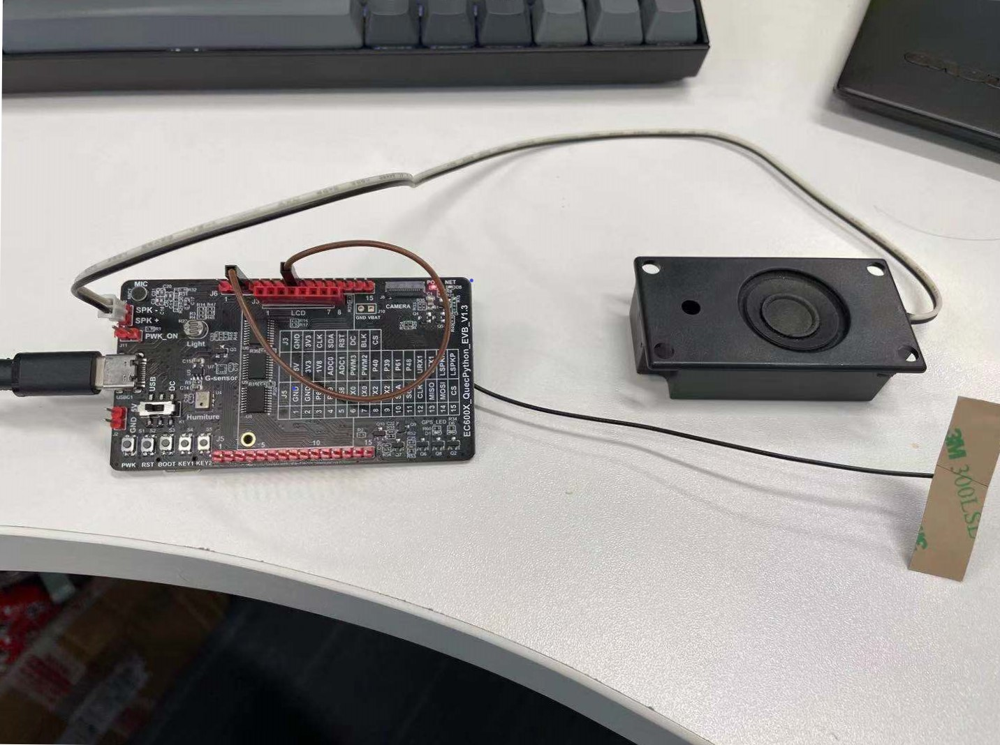

## 文档历史

| **版本** | **日期**   | **作者** | **变更表述** |
| -------- | ---------- | -------- | ------------ |
| 1.0      | 2021-09-31 | igni     | 初始版本     |

##  简介

HLS流媒体播放是基于HTTP协议实现的在线流媒体播放功能，其优势在于可以在不占用flash空间的情况下 实现音频播放，非常适合嵌入式项目应用。当前EC600U平台以及支持基于HTTP协议的流媒体播放功能 包括常用的网络媒体格式如M4A MP3 以及M3U8基于HTTP协议的在线直播,同时也支持RTMP格式的flv流在线音频播放。因为其不需要缓存整个多媒体文件，仅需要输入对应资源的链接 就可以以较少内存占用来实现音频多媒体播放，而且价格低廉，是低成本实现流媒体播放的解决方案之一

注意：RTMP流播需要支持RTMP的软件版本才能支持

### 流媒体播放以及原理

* HTTP：HTTP协议，由web服务器提供可下载的音频文件，设备通过请求链接获取资源存放于缓冲区并且播放，常见的网络音频格式多为m4a和mp3格式 另外，M3U8的直播流格式也是基于HTTP协议来实现，通过不断获取m3u8列表来更新http文件目录 实现流媒体播放

* RTMP：RTMP(Real-Time Messaging Protocol实时消息传送协议)的缩写，它是Adobe Systems公司为Flash播放器和服务器之间音频、视频和数据传输开发的协议。其原理为服务器提供FLV格式的视频流，头部包含解码相关信息，获取之后对FLV格式内容进行解码播放操作

## 硬件链接
以QuecPython开发板为例，接入天线和SIM卡，之后短接1.8V供电和P40脚 给功放使能上电，在SPK+ SPK-上接入扬声器 即可开始测试



## API介绍

### 导入hls库

> **from hls import hls_audio**

### 创建 hls 对象

> **hls = hls_audio(URL)**

### 播放链接

> **hls.play(URL)**


| 参数 | 类型   | 说明                                                         |
| ---- | ------ | ------------------------------------------------------------ |
| URL  | string | HTTP URL，格式如下：<br>http://host\[:port][/app[/filepath]]<br>RTMP URL，格式如下：<br/>rtmp://host\[:port][/app[/playpath]] |


* 功能：

根据用户传入的 HTTP URL 或者RTMP URL 播放对应的在线文件或者RTMP流。 调用后会先确定网络状态 再进行播放操作


* 返回值：

无返回值 后台会播放对应流媒体内容

* 示例：

```python
from hls import hls_audio
hls = hls_audio()
hls.play("http://home.xiupa617.top:38080/file/down4.m4a")  #播放m4a格式文件
```

```python
from hls import hls_audio
hls = hls_audio()
hls.play("rtmp://58.200.131.2:1935/livetv/cctv1")  #播放RTMP音频流
```

### 停止播放链接

> **hls.close()**

* 参数：
无参数，针对hls对象作用


* 功能：

停止当前hls对象的播放


* 返回值：

函数无返回值 后台会播放对应流媒体内容 并且打印相关信息

* 示例：

```python
from hls import hls_audio
hls = hls_audio()
hls.play("http://home.xiupa617.top:38080/file/down4.m4a")  #播放m4a格式文件
hls.close()    #停止m4a播放
```

```python
from hls import hls_audio
hls = hls_audio()
hls.play("rtmp://58.200.131.2:1935/livetv/cctv1")  #播放RTMP音频流
hls.close()    #停止RTMP流播
```


### 文件播放时间跳转

> **hls.seek_secs(second)**


| 参数 | 类型   | 说明                                                         |
| ---- | ------ | ------------------------------------------------------------|
| second  | long | 跳转到对应的second秒数                                       |


* 功能：

跳转当前播放文件到对应的second秒数，仅支持mp3 m4a文件


* 返回值：

无返回值 后台会播放对应流媒体内容 并且打印文件剩余长度

* 示例：

```python
from hls import hls_audio
hls = hls_audio()
hls.play("http://home.xiupa617.top:38080/file/down4.m4a")  #播放m4a格式文件
hls.seek_secs(100)    #跳转到100秒继续播放
```

### 播放音量调节

> **hls.set_volume(volume)**


| 参数 | 类型   | 说明                                                         |
| ---- | ------ | ------------------------------------------------------------|
| volume  | int | 音量level     0~11                                |


* 功能：

设置当前hls对象播放音量


* 返回值：

无返回值

* 示例：

```python
from hls import hls_audio
hls = hls_audio()
hls.play("http://home.xiupa617.top:38080/file/down4.m4a")  #播放m4a格式文件
hls.set_volume(3)    #设置音量为3
```

### 播放暂停、继续

> **hls.pause(state)**


| 参数 | 类型   | 说明                                                         |
| ---- | ------ | ------------------------------------------------------------|
| state  | int | 1：播放暂停 0：播放继续                                |


* 功能：

控制当前hls对象播放暂停 继续


* 返回值：

无返回值

* 示例：

```python
from hls import hls_audio
hls = hls_audio()
hls.play("http://home.xiupa617.top:38080/file/down4.m4a")  #播放m4a格式文件
hls.pause(1)    #播放暂停
hls.pause(0)	#播放继续
```

## 在线音乐盒应用

```python
from hls import hls_audio
import utime
hls = hls_audio()
hls.set_volume(3)    #设置音量为3
URL1 = "http://home.xiupa617.top:38080/file/down.mp3"
URL2 = "http://home.xiupa617.top:38080/file/down5.m4a"
URL3 = "http://home.xiupa617.top:38080/file/down.m3u8"

if __name__ == '__main__':
    print("start URL1")
    hls.play(URL1)
    utime.sleep(7)
    print("now jump to 30s")
    hls.seek_secs(30)
    utime.sleep(7)
    print("now jump to 40s")
    hls.seek_secs(40)
    utime.sleep(7)
    hls.close()
    utime.sleep(1)
    print("start URL2")
    hls.play(URL2)
    utime.sleep(10)
    hls.pause(1)
    print("play paused resume after 3s")
    utime.sleep(3)
    print("now resume")
    hls.pause(0)
    utime.sleep(5)
    hls.close()
    utime.sleep(1)
    print("start URL3")
    hls.play(URL3)
    utime.sleep(10)
    hls.set_volume(9)
    print("now set volume to 9")
    utime.sleep(3)
    hls.set_volume(3)
    print("now set volume to 3")
    hls.close()
    utime.sleep(1)
    print("play finshed")
```