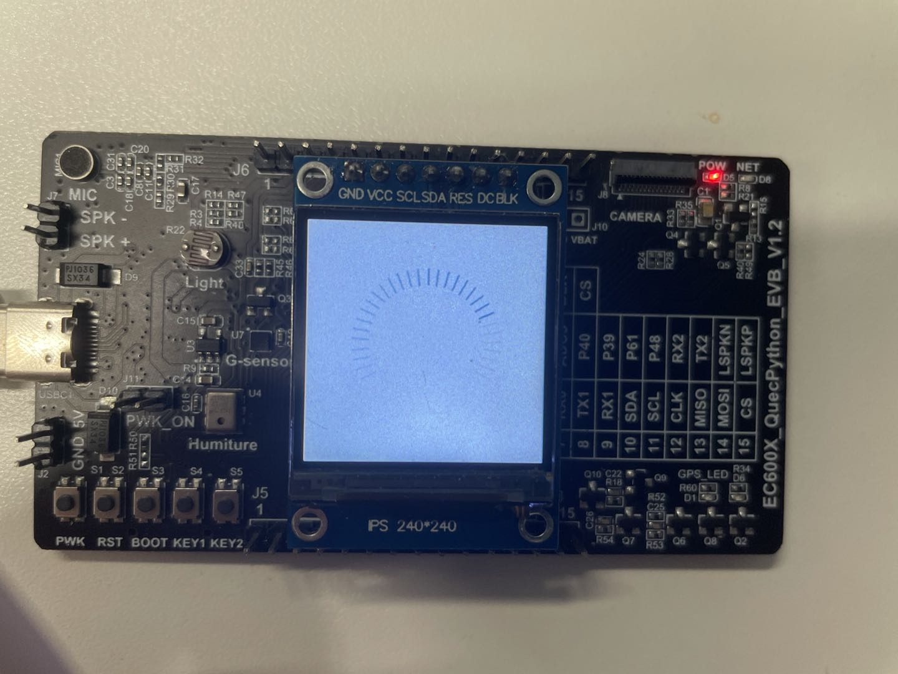
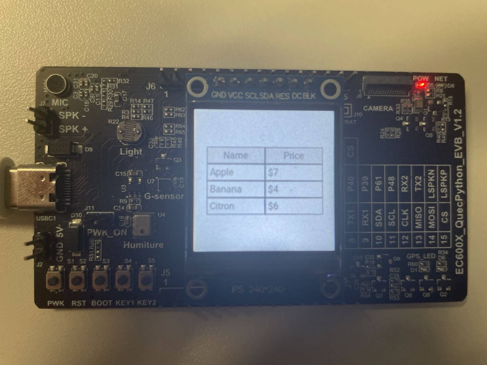
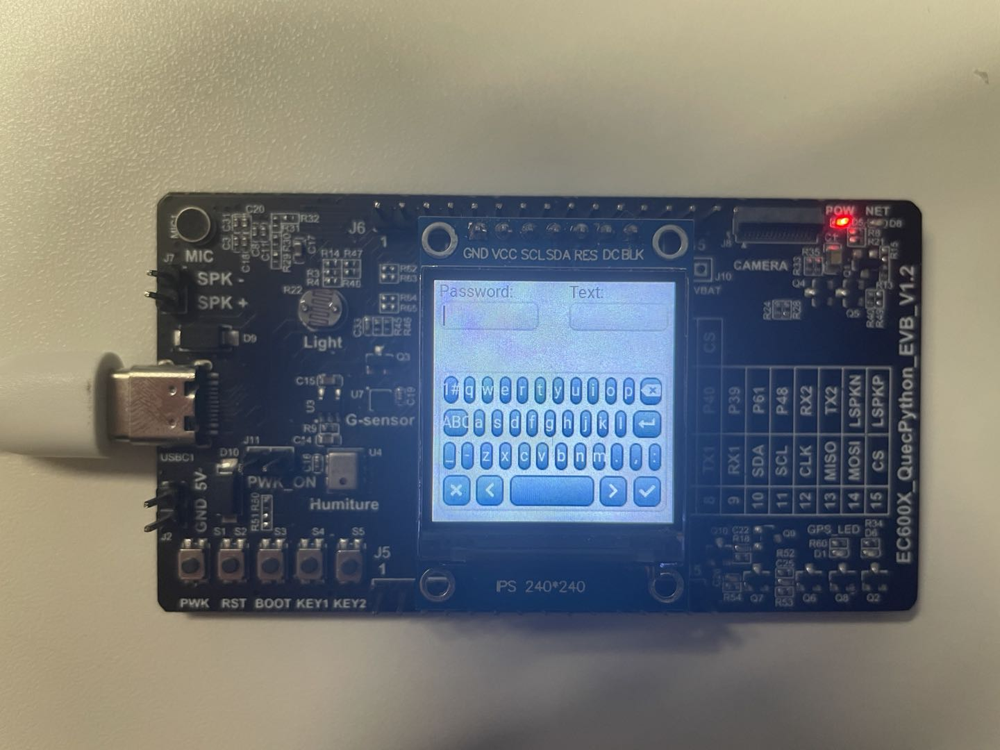

## 引言

本文档基于QuecPython介绍如何通过littlevgl模块实现GUI的绘制。

## 文档历史

**修订记录**

| **版本** | **日期**   | **作者** | **变更表述** |
| -------- | ---------- | -------- | ------------ |
| 1.0      | 2021-09-26 | felix.ye | 初始版本     |


## LVGL介绍

### lvgl优点

（1）开源

（2）丰富的组件（例如按钮，图表，滑块等）

（3）纯C，兼容性强

（4）消耗的资源小（官方说法：64KB flash, 16KB RAM）

（5）支持多种输入设备（按键，触摸板，鼠标，键盘 etc）

（6）多语言 支持UTF-8

（7）高级图形效果：动画，反锯齿，透明度，平滑滚动

（8）支持多个和多种显示设备


### lvgl硬件要求

资源要求：

官方：

​	•16、32 或 64 位微控制器或处理器

​	•推荐大于 16 MHz 的时钟速度

​	•闪存/ROM：非常重要的组件大于 64 kB（建议大于 180 kB）


•内存：

​	•静态 RAM 使用量：大约 8 到 16 kB，具体取决于使用的功能和对象类型

​	•堆栈：大于2kB（建议大于4kB）

​	•动态数据（堆）：大于 4 KB（如果使用多个对象，建议大于 16 KB）。LV_MEM_SIZ E在lv_conf.h 中设置

​	•显示缓冲区：大于“水平分辨率”像素（建议大于 10 × “水平分辨率”）

实际：

 字体库：RO 由于我们内置了字体库，故需要大概400KB

 缓冲区：w * h * 2


### lvgl架构


​		应用程序可以与库通信以创建 GUI。它包含一个 HAL（硬件抽象层）接口来注册您的显示和输入设备驱动程序。

​		lv_hal_disp.c ==> lv_disp_drv_register  注册显示设备驱动，对比quectel，即就是屏幕的一个显示。python开始时，会去告知显示的相关信息，如显示长宽，buf, 底层都是调用该接口注册。

​		v_hal_indev.c ==> lv_indev_drv_register 注册输入驱动（按键，键盘，触摸屏，鼠标）。

​		lv_hal_tick.c ==> lv_tick_inc 为LVGL提供时钟支持

### lvgl绘制流程


​		我们上面调用lv_disp_drv_register， 会传入一个buf。我们再操作时，数据会先填充到该内存中，然后调用flush_cb( 也是lv_disp_drv_register 传入的一个显示驱动程序 )，显示到 实体屏幕上。如果支持LTDC的DMA2D加速，（也就类似GPU，在很多2D绘图的场合提供加速），则可以用DMA 移动到SDRAM.然后调用lv_disp_flush_ready通知LVGL此次绘制完成，可以进行下一次的绘制。


## LVGL概念描述

更详细的内容请参考（[LVGL官网文档](https://docs.lvgl.io/6.1/)）

### objects对象

​		littleVGL 是以对象为概念的，而其最核心的基本对象就是lv_obj控件。其它的所有专用控件（比如按钮，标签，列表等）都是在此lv_obj对象的基础上衍生出来的。

​		对象的创建和删除分别为 lv.obj() 和 lv.obj.delete()。

​		基本属性：

​				每个对象都有基本属性，如下，可以通过 lv.obj.set_... lv.obj.get_...设置/获取属性.

​				\* 位置(Position)

​				\* 大小(Size)

​				\* 父类(Parent)

​				\* 是否可拖拽(Drag enable)

​				\* 是否可点击(Click enable)

​				\* 对齐方式(Alignment)

更详细的内容请参考（[LVGL官网文档—objects](https://docs.lvgl.io/6.1/overview/object.html)）


### event事件

​		事件可以是由 littleVGL 库自身触发的,也可以是由外部物理操作触发的,比如触摸,点击等等。

​		注册api为 obj.set_event_cb


​		


更详细的内容请参考（[LVGL官网文档-event](https://docs.lvgl.io/6.1/overview/event.html)）

### style风格

​		样式用于设置对象的外观。

​		设置样式 lv.obj.set_style() 仅用于基础对象。每个其它对象类型都有自己的样式集函数。

​		例如：btn.set_syle()


​		获取样式 lv.obj,get_style()

​		如果修改对象已使用的样式，为了刷新受影响的对象，可以对使用该样式的每个对象使用lv.obj.refresh_style（obj），也可以使用lv.obj.report_style_mod（&style）通知具有给定样式的所有对象。如果lv.obj.report_style_mod的参数为空，则会通知所有对象。

​		注册api为 obj.set_event_cb

更详细的内容请参考（[LVGL官网文档-style](https://docs.lvgl.io/6.1/overview/style.html)）


## quecpython下lvgl的使用

第一步：初始化LCD

​    	目前，我们的LVGL的显示是基于我们各种LCD。所以我们需要先完成LCD的一个初始化

​    （quecpython wiki上有详细说明，此处不做过多解释，可参考（[LCD使用说明](https://python.quectel.com/doc/doc/sbs/zh/sbs/lcd.html)）） 

第二步：初始化LVGL，实现显示设备驱动的注册

第三步：实现输入设备驱动的注册（非必须）

第四步：实现tick_thread 和 hangdler_thread

第五步：开始实现自己的功能需求


### 显示驱动注册

在 LittlevGL 中，您可以拥有多个显示器，每个显示器都有自己的驱动程序和对象。

lvgl对应gui绘制，故显示驱动注册是必须的。

具体实现如下所示：

```python
lcd.init() #LCD初始化

lv.init()		#LVGL初始化资源
disp_buf1 = lv.disp_buf_t()		#提供lvgl显示buf结构体
buf1_1 = bytes(int(LCD_SIZE_W*LCD_SIZE_H*2))
lv.disp_buf_init(disp_buf1, buf1_1, None, len(buf1_1))
disp_drv = lv.disp_drv_t()
lv.disp_drv_init(disp_drv)
disp_drv.buffer = disp_buf1
disp_drv.flush_cb = lcd.lcd_write	#对应自身的lvgl实现方法
disp_drv.hor_res = LCD_SIZE_W
disp_drv.ver_res = LCD_SIZE_H
lv.disp_drv_register(disp_drv)

lv.tick_inc(5)
lv.task_handler()
```

更详细的内容请参考（[LVGL官网文档-display](https://docs.lvgl.io/6.1/overview/display.html)）


### 输入设备注册

输入设备通常有以下几种：

- 类似指针的输入设备，如触摸屏或鼠标
- 键盘
- 带左/右转向和推送选项的编码器
- 分配给屏幕上特定点的外部硬件按钮


具体实现可参考以下例子

```python
indev_drv = lv.indev_drv_t()
indev_drv.init() 
indev_drv.type = lv.INDEV_TYPE.POINTER	#指针类型
indev_drv.read_cb = touchpad_read		#具体实现方法
indev_drv.register()
```

更详细的内容请参考（[LVGL官网文档-input devices](https://docs.lvgl.io/6.1/overview/indev.html)）


### arc弧

圆弧对象在起点和终点角度内绘制具有给定厚度的圆弧。

详细接口请参考LVGL ARC wiki文档（目前暂未提供）

示例如下：

```python
def arc_demo(self,thread_id):
    print('arc demo start',thread_id)
    global arc_obj
    arc_style =  lv.style_t(lv.style_plain)
    arc_style.line.color = lv.color_make(0,0,255) 
    arc_style.line.width = 8     
    arc_obj = lv.arc(father)
    arc_obj.set_style(lv.arc.STYLE.MAIN, arc_style) 
    arc_obj.set_angles(90, 60)
    arc_obj.set_size(150, 150)
    arc_obj.align(None, lv.ALIGN.CENTER, 0, 0)
    angles = 0
    while 1:
        angles +=5
        if angles >= 359: angles = 359
        if angles < 180: arc_obj.set_angles(180-angles, 180)
        else: arc_obj.set_angles(540-a, 180)
        if angles == 359:
            angles = 0

```


<video src="media/arc.mp4"></video>


### bar 进度条

​		lv.bar 进度条它由背景和指示器俩部分构成,这俩部分的样式都可以被单独设置,然后此进度条会根据它的宽和高的大小来自动决定它是水平进度条还是垂直进度条,可以通过 set_range 接口来设置进度条的数值范围,通过 set_value 接口来设置一个新的进度值,与此同时可选一个进度变化的动画效果,整体上来看,这个控件的使用还是比较简单的. 

​		详细接口请参考LVGL BAR wiki文档（目前暂未提供）

示例如下：

```python
def bar_demo(self,thread_id):
    print('bar demo start',thread_id)
    bar1 = lv.bar(father)
    bar1.set_size(200, 30)
    bar1.align(None, lv.ALIGN.CENTER, 0, 0)
    bar1.set_anim_time(1000)
    while 1:
        bar1.set_value(100, lv.ANIM.ON)
        utime.sleep_ms(2000)
        bar1.set_value(0, lv.ANIM.ON)
        utime.sleep_ms(2000)

```

<video src="media/bar.mp4"></video>

### btn 按钮 

​		lv.btn 按钮其实就是一个 lv.cont容器的复杂变体, lv.btn 按钮是简单的矩形样对象, 但它们在按下或释放时会更改其样式和状态.

​		详细接口请参考LVGL BTN wiki文档（目前暂未提供）

示例如下：

```python
    def lvgl_btn(self):
        btn1 = lv.btn(lv.scr_act())  # 创建一个按钮
        btn1.align(None, lv.ALIGN.CENTER, 0, -40)  # 设置按钮位置
        label = lv.label(btn1)  # 按钮便签
        label.set_text("Button")  # 按钮名称
        btn2 = lv.btn(lv.scr_act())  # 创建一个按钮
        btn2.align(None, lv.ALIGN.CENTER, 0, 40)  # 设置按钮位置
        btn2.set_toggle(True)  # 设置为Toggle按钮
        btn2.toggle()  # 切换按钮状态
        btn2.set_fit2(lv.FIT.NONE, lv.FIT.TIGHT)  # 设置水平垂直方自适应方式
        label = lv.label(btn2)  # 按钮便签
        label.set_text("Toggled")  # 按钮名称
```


### btnm 矩阵按钮

​		lv.btnm 矩阵按钮对象你可以看作是一系列伪按钮的集合, 只不过它是以行和列有序的方式来排列这些子按钮,名称中的 m 就是 matrix(矩阵)的缩写,注意了, 这里故意加了一个伪字来说明它不是真正的 lv.btn 按钮对象, 而是 lv.btnm 内部纯绘制出来的具有按钮外观的图形, 而且这个图形具有和 lv.btn 按钮一样的点击效果, 这种伪按钮的好处是它基本不占内存消耗(一个伪按钮大概需要 8 个字节), 这属于 littleVGL 的一种优化操作, 所以如果你有多个按钮集合的应用场景的话,请最好使用 lv.btnm 控件, 而不要去使用 lv_cont 容器外加 lv_btn 按钮的方案.

​		lv.btnm 控件可以给它内部的每个伪按钮设置文本标题以及设置相对的大小, 然后它还可以通过 lv.`btnm`.set_btn_ctrl 接口来设置其内部按钮的各种控制属性,比如是否可见, 是否处于禁用状态等等, 除此之外 lv.btnm具有和 lv.label对象一样的文本重绘色功能,以及自己专的“One toggle”特性,可以通过 lv.`btnm`.set_one_toggle接口来使能“One toggle”特性,使能之后, 在同一时刻就只能允许最多一个按钮处于切换态了. 当 lv.btnm 内部的按钮被点击或者被重复长按下时, 它会给它的事件回调函数发送lv.EVENT.VALUE_CHANGED事件, 于此同时这个按钮的 id号会作为事件自定义数据传递过去,那我们在事件回调函数中可以通过如下代码的方式来获取按钮的 id 号: btn_id = obj.get_active_btn_text(); print(“ 当前被按下的按钮 id 为: %s” , % btn_id); 除了这种方式外,我们还可以通过 lv.`btnm`.get_active_btn()接口来获取按钮的 id 号, 注意了, 当按钮被重复长按下时, 它也是发送 lv.EVENT.VALUE_CHANGED 事件, 而不是发送前面章节介绍过的 lv.EVENT.LONG_PRESSED_REPEAT 事件, 如果你不想让按钮具有重复长按效果的话, 那我们是可以通过控制属性来设置的.最后我们来说一下 lv.btnm 对象内部按钮的排列方式, 它是以从左往右 ,从上到下的方式来排列的,其内部的每一个按钮都具有一个唯一的 id号, 这个 id号也是按照上面的排列方式来进行分配的, 从 0 开始分配, 然后依次增 1, 整体上来说, lv.btnm 控件有点小复杂, 但是只要你掌握了,就可以实现很强大的功能, 我们后面要讲到的 lv.kb 键盘控件也是利用 lv.btnm 控件来实现的.

​		详细接口请参考LVGL BTNM wiki文档（目前暂未提供） 

示例如下：

```python
def btnm_handler(obj, event):  # LVGL回调函数
    if event == lv.EVENT.VALUE_CHANGED:
        btn_id = obj.get_active_btn_text()
        print("%s was pressed" % btn_id)
        
def btnm_demo(self):
    print('btnm demo start')
    btnm_map = ["OK", "DEL", "\n",
                "1", "2", "3", "\n",
                "4", "5", "6", "\n",
                "7", "8", "9", "\n",
                "*", "0", "#", ""]
    btnm1 = lv.btnm(father)
    btnm1.set_size(235, 235)
    btnm1.set_map(btnm_map)
    btnm1.align(None, lv.ALIGN.CENTER, 0, 0)
    btnm1.set_event_cb(self.btnm_handler)

```


### Calendar 日历

​		lv.calendar 日历控件是用来显示或者设置日期的, 只包含年, 月, 日, 星期等信息, 是不包含时, 分, 秒等信息的, 此控件主要由上下俩部分构成, 上面的部分我们叫做 HEADER,里面有显示年, 月文本信息和上下翻月份的箭头按钮。

​		详细接口请参考LVGL Calendar wiki文档（目前暂未提供） 

示例如下：

```python
def event_handler(obj, event):  # LVGL回调函数
    # 日历点击回调逻辑
    if event == lv.EVENT.CLICKED:  # 发现点击修改
        date = obj.get_pressed_date()  # 获取选中的日期
        if date is not None:  # 判断点击非空
            obj.set_today_date(date)  # 修改显示的日期
def calendar_demo(self):
    print('calendar demo start')
    calendar = lv.calendar(father, None)  # 创建一个日历
    calendar.set_size(235, 235)  # 调整日期大小，以确保适合自己的显示区域
    calendar.align(None, lv.ALIGN.CENTER, 0, 0)  # 设置显示位置
    calendar.set_event_cb(self.event_handler)  # 设置回调函数
    today = lv.calendar_date_t()  # 创建设置今天的日期句柄
    today.year = 2021  # 年
    today.month = 8  # 月
    today.day = 1  # 日
    calendar.set_today_date(today)  # 日历设置今天
    calendar.set_showed_date(today)  # 日历重点显示今天
    highlihted_days = [
        lv.calendar_date_t({'year': 2021, 'month': 8, 'day': 7}),
        lv.calendar_date_t({'year': 2021, 'month': 8, 'day': 12})
    ]
    calendar.set_highlighted_dates(highlihted_days, len(highlihted_days))  # 重点显示

```


### Canvas 画布TODO

​		lv.canvas 是一个画布控件，你可以在它上面绘制任意图形，以及进行旋转等操作，但是此lv.canvas 画布控件必须得依赖于一个 buffer 缓冲区，此 buffer 缓冲区必须得是全局的或者静态的，即只要保证在使用此画布控件期间，此 buffer 缓冲区不会被释放掉就可以了，

​		可以通过canvas.set_buffer( buffer, width, height,cf)接口来给画布控件设置一个buffer缓冲区， 此接口同时指定了画布绘图区域的宽和高，以及画布的颜色格式。

​	 	详细接口请参考LVGL canvas wiki文档（目前暂未提供） 

示例如下：

```python
import lvgl as lv

class CANVAS_Class(object):
    inst = None

    def __init__(self):
        CANVAS_Class.inst = self

    def CANVAS_process(self):
        CANVAS_WIDTH  = 80
        CANVAS_HEIGHT = 50

        style = lv.style_t()
        lv.style_copy(style, lv.style_plain)
        style.body.main_color = lv.color_make(0xFF,0,0)
        style.body.grad_color = lv.color_make(0x80,0,0)
        style.body.radius = 4
        style.body.border.width = 2
        style.body.border.color = lv.color_make(0xFF,0xFF,0xFF)
        style.body.shadow.color = lv.color_make(0xFF,0xFF,0xFF)
        style.body.shadow.width = 4
        style.line.width = 2
        style.line.color = lv.color_make(0,0,0)
        style.text.color = lv.color_make(0,0,0xFF)

        # CF.TRUE_COLOR requires 2 bytes per pixel
        cbuf = bytearray(CANVAS_WIDTH * CANVAS_HEIGHT * 2)

        canvas = lv.canvas(lv.scr_act())
        canvas.set_buffer(cbuf, CANVAS_WIDTH, CANVAS_HEIGHT, lv.img.CF.TRUE_COLOR)
        canvas.set_size(CANVAS_WIDTH,CANVAS_HEIGHT)
        canvas.align(None, lv.ALIGN.CENTER, 0, 0)
        canvas.fill_bg(lv.color_make(0xC0, 0xC0, 0xC0))

        canvas.draw_rect(0, 0, CANVAS_WIDTH//2, CANVAS_HEIGHT//2, style)

        canvas.draw_text(0, CANVAS_HEIGHT//2, 100, style, "text", lv.label.ALIGN.LEFT)
        
   def KEY_process(self):
    while True:
        key_mun = self.KEY_Scan()
        if key_mun == 1:
            lv.scr_act().clean()
        elif key_mun == 2:
            CANVAS_inst = CANVAS.CANVAS_Class.inst
            CANVAS_inst.CANVAS_process()
        else:
            pass

        utime.sleep_ms(1)
```


### Checkbox 复选框

​		lv.cb 复选框是由 3 部分组成的，

​		第一部分是最外层的背景，

​		第二部分是内部左侧的小方块，这个小方块其实就是一个 lv.btn 按钮，所以这个小方块也具有 5 种状态和相应的 5 个样式， 

​		第三部分是内部右侧的文本，这个文本其实就是 lv.label 标签，可以通过 lv.cb.set_text 接口来给复选框设置文本，

​		通过 lv.cb.set_checked 接口来设置复选框是否被选中，当复选框被点击时， 它会发送一个lv.EVENT.VALUE_CHANGED事件给它的事件回调函数，然后就是复选框的大小是自适应的，也就是说使用obj.set_size 接口来设置复选框的大小是无效的，它只会根据它内部的文本大小来决定自身的大小。 

​		详细接口请参考LVGL checkbox wiki文档（目前暂未提供） 

示例代码如下：

```python
def cb_hangler(obj,event):
    if event == lv.EVENT.VALUE_CHANGED:
        print("State: %s" % ("Checked" if obj.is_checked() else "Unchecked"))
def cb_demo(self,thread_id):
    print('cb demo start',thread_id)
    cb = lv.cb(father)
    cb.set_text("I agree to terms and conditions.")
    cb.align(None, lv.ALIGN.CENTER, 0, 0)
    cb.set_event_cb(self.cb_hangler)
    while 1:
        cb.set_checked(True)
        utime.sleep_ms(1000)
        cb.set_checked(False)
        utime.sleep_ms(2000)

```

<video src="media/cb.mp4"></video>


### chart 图表

​		lv.chart 图表控件主要是由背景, 水平垂直分割线, 数据线(series)三部分构成的, 其中数据线是 lv.chart 图表控件中最重要的部分, 一条数据线就是一些数据点的集合, 一条数据线可以被绘制成折线, 柱状, 散点, 面积等几种主要的图表类型, 或者是这几种图表类型共同组拼后的结果, 即进行位或操作, 而一个 lv.chart 图表控件中又可以同时绘制多条数据线, 数量是不受限制的, 每条数据线的颜色都可以单独指定, 这是通过  `chart`.add_series(color)添加数据线接口来具体操作的, 我们说过了数据线就是数据点的集合, 说的再具体一点就是 y 坐标点的集合, 至于数据点的个数我们是可以通过 `chart`.set_point_count(point_num)接口来设置的,对于数据值的修改或者更新

​		详细接口请参考LVGL chart wiki文档（目前暂未提供） 

示例如下：	

```python
def chart_demo(self):
    print('chart demo start')
    # Create a chart
    chart = lv.chart(father)
    chart.set_size(200, 150)
    chart.align(None, lv.ALIGN.CENTER, 0, 0)
    chart.set_type(lv.chart.TYPE.POINT | lv.chart.TYPE.LINE)   # Show lines and points too
    chart.set_series_opa(lv.OPA._70)                           # Opacity of the data series
    chart.set_series_width(4)                                  # Line width and point radious
    chart.set_range(0, 100)
    # Add two data series
    ser1 = chart.add_series(lv.color_make(0xFF,0,0))
    ser2 = chart.add_series(lv.color_make(0,0x80,0))
    # Set points on 'dl1'
    chart.set_points(ser1, [10, 10, 10, 10, 10, 10, 10, 30, 70, 90])
    # Set points on 'dl2'
    chart.set_points(ser2, [90, 70, 65, 65, 65, 65, 65, 65, 65, 65])

```


### Container 容器

​		所谓的容器就是一个载体，用来装东西的，在 littleVGL 中，可以用来存放各种各样的子对象，当子对象的数量越来越多时，子对象们在父容器中的排列方式就显得尤为重要，因此容器就有一个专门的 Layout 布局属性来约束子对象们的摆放，layout 布局间隙是由样式来控制的，具体表现在 style.body.padding 样式属性上，容器除了 layout 这个重要特性外，还有一个 Auto fit 大小自动适应的特性.只要弄懂了 Layout 和 Auto fit 这俩个概念，容器的使用就特别简单了，所以请务必搞懂，因为后面还有许多复杂一点的控件是由容器构成的。

​		详细接口请参考LVGL container wiki文档（目前暂未提供）

示例如下：

```python
def cont_demo(self):
    print('cont demo start')
    cont = lv.cont(father)
    cont.set_auto_realign(True)                    # Auto realign when the size changes
    cont.align_origo(None, lv.ALIGN.CENTER, 0, 0)  # This parametrs will be sued when realigned
    cont.set_fit(lv.FIT.TIGHT)
    cont.set_layout(lv.LAYOUT.COL_M)
    label = lv.label(cont)
    label.set_text("Short text")
    utime.sleep(2)
    label = lv.label(cont)
    label.set_text("It is a long text")
    utime.sleep(2)
    label = lv.label(cont)
    label.set_text("Here is an even longer text")

```


<video src="media/cont.mp4"></video>


### Drop-down list 下拉列表

​		下拉列表允许用户从列表中选择一个值，默认关闭（非活动）。当下拉列表处于非活动状态时，它会显示单个值。激活后（通过单击下拉列表），它会显示一个值列表，用户可以从中选择一个值。当用户选择新值时，下拉列表将恢复为非活动状态并显示新值。

​		详细接口请参考LVGL drop down wiki文档（目前暂未提供）

示例如下：

```python
def ddlist_demo(self):
    print('ddlist demo start')
    # Create a drop down list
    ddlist = lv.ddlist(lv.scr_act())
    ddlist.set_options("\n".join([
                        "Apple",
                        "Banana",
                        "Orange",
                        "Melon",
                        "Grape",
                        "Raspberry"]))
    ddlist.set_fix_width(150)
    ddlist.set_fix_height(150)
    ddlist.set_draw_arrow(True)
    # Enable auto-realign when the size changes.
    # It will keep the bottom of the ddlist fixed
    ddlist.set_auto_realign(True)
    # It will be called automatically when the size changes
    ddlist.align(None, lv.ALIGN.IN_BOTTOM_MID, 0, -20)
    while True:
        ddlist.open(lv.ANIM.ON)
        utime.sleep(2)
        ddlist.close(lv.ANIM.ON)
        utime.sleep(2)

```

<video src="media/ddlist.mp4"></video>

### Gauge  仪表

​		仪表是带有刻度标签和指针的仪表。

​		详细接口请参考LVGL gauge wiki文档（目前暂未提供）

示例如下：

​		

```python
def gauge_demo(self):
    print('gauge demo start')
    # Create a style
    style = lv.style_t()
    lv.style_copy(style, lv.style_pretty_color)
    style.body.main_color = lv.color_hex3(0x666)     # Line color at the beginning
    style.body.grad_color =  lv.color_hex3(0x666)    # Line color at the end
    style.body.padding.left = 10                     # Scale line length
    style.body.padding.inner = 8                     # Scale label padding
    style.body.border.color = lv.color_hex3(0x333)   # Needle middle circle color
    style.line.width = 3
    style.text.color = lv.color_hex3(0x333)
    style.line.color = lv.color_hex3(0xF00)          # Line color after the critical value
    # Describe the color for the needles
    needle_colors = [
        lv.color_make(0x00, 0x00, 0xFF),
        lv.color_make(0xFF, 0xA5, 0x00),
        lv.color_make(0x80, 0x00, 0x80)
    ]
    # Create a gauge
    gauge1 = lv.gauge(lv.scr_act())
    gauge1.set_style(lv.gauge.STYLE.MAIN, style)
    gauge1.set_needle_count(len(needle_colors), needle_colors)
    gauge1.set_size(150, 150)
    gauge1.align(None, lv.ALIGN.CENTER, 0, 20)
    # Set the values
    gauge1.set_value(0, 10)
    gauge1.set_value(1, 20)
    gauge1.set_value(2, 30)

```


### image 图片

lv.img 就是一个图片控件，它就是根据你传入的图片源来显示你想要的图片，littleVG为了提供最大的灵活性，它支持如下三种图片源方式： 

  1) 内部 C 数组，用 lv.img_dsc_t 结构体来进行描述 

  2) 外部存储文件，比如 SD 卡或者 U 盘上的图片文件 

  3) lv.SYMBOL.XXX 形式的图标字体或者文本，此时 lv.img 图片就相当于一个 lv.label标签控件。


详细接口请参考LVGL image wiki文档（目前暂未提供）

示例如下：

```python
def img_demo(self):
    print('img demo start')
    from usr import lv_ex_image2
    img_dsc = lv_ex_image2.img_get_dsc()	#获取图片数组
    obj = lv.img(lv.scr_act())
    obj.set_size(lv_ex_image2.img_w ,lv_ex_image2.img_h)
    obj.align(None, lv.ALIGN.CENTER, 0, 0)
    obj.set_src(img_dsc)
```


### Image button 图片按钮

​		lv.imgbtn 图片按钮控件跟 lv.btn 按钮控件是非常相似的，它只不过是在 lv.btn 按钮控件的每一个状态基础上增加了图片显示的功能，之前我们已经学习过了 lv.btn 按钮章节和 lv.img 图片章节，现在再来学习它们的混合体 lv.imgbtn 图片按钮控件就会简单很多。

​		我们知道按钮是具有五种状态的，而在 lv.imgbtn 图片按钮中也是同样具有五种状态的， 我们可以通过imgbtn.set_src(lv.btn.STATE.XX,img_src)接口来给每一种状态设置一个对应的图片，不过这里有一点需要注意的是，这里的 img_src 图片源不支持图标字体和文本的方式，当采用这种方式设置图片之后，图片按钮的大小是自动适配图片大小的，用 lv_obj_set_size接口来修改图片按钮的大小是无效的。

​		当 lv.imgbtn 图片按钮使用 imgbtn.set_toggle(True)接口使能 toggle 功能之后，用户的每一次 toggle 操作都会触发一个 lv.EVENT.VALUE_CHANGED 事件，当然了，你可以直接使用imgbtn.set_state(lv.btn.STATE.XX)接口来改变图片按钮的状态，但是这种方式是不会触发lv.EVENT.VALUE_CHANGED 事件的。

​		详细接口请参考LVGL image button wiki文档（目前暂未提供）

示例如下：详细请参考文档

```python
import lvgl as lv                     
import utime                         
from usr import lv_ex_imgbtn2
from usr import lv_ex_imgbtn3

class IMGBTN_Class(object):
    inst = None

    def __init__(self):
        IMGBTN_Class.inst = self
        self.state = lv.btn.STATE.REL

    def IMGBTN_process(self):
        img_dsc2 = lv_ex_imgbtn2.img_get_dsc()
        img_dsc3 = lv_ex_imgbtn3.img_get_dsc()

        self.imgbtn = lv.imgbtn(lv.scr_act())
        self.imgbtn.align(None, lv.ALIGN.CENTER, 0, 0)
        self.imgbtn.set_src(lv.btn.STATE.REL, img_dsc2)
        self.imgbtn.set_src(lv.btn.STATE.PR, img_dsc3)

        utime.sleep_ms(1000)
        self.imgbtn.set_state(1)
        utime.sleep_ms(1000)
        self.imgbtn.set_state(0)

    def IMGBTN_Run(self):
        self.IMGBTN_process()
        
	def KEY_process(self):
        while True:
            key_mun = self.KEY_Scan()
            if key_mun == 1:
                lv.scr_act().clean()
                utime.sleep_ms(500)
                lv_ex_imgbtn.IMGBTN_Class.inst.IMGBTN_Run()
            elif key_mun == 2:
                IMGBTN_inst = lv_ex_imgbtn.IMGBTN_Class.inst
                IMGBTN_inst.imgbtn.toggle()
                if IMGBTN_inst.state == lv.btn.STATE.REL:
                    IMGBTN_inst.state = lv.btn.STATE.PR
                else:
                    IMGBTN_inst.state = lv.btn.STATE.REL
                IMGBTN_inst.imgbtn.set_state(IMGBTN_inst.state)
                print(IMGBTN_inst.state)
            else:
                pass

            utime.sleep_ms(1)
```


### Keyboard 键盘

​		lv.kb 键盘其实就是一个复杂而又特殊的 lv.btnm 矩阵按钮对象, 而 lv.btnm 矩阵按钮我们在前面的章节中也学习过了, 所以借助前面的知识, 我们应该能更好的理解 lv.kb 键盘. 

​		lv.kb 键盘有 2 种模式, 一种是 lv.kb_MODE_TEXT 文本键盘, 另一种是 lv.kb_MODE_NUM 数字键盘, 其中文本键盘复杂一些, 它里面包含了小写, 大写, 符号三类键盘。

​		虽然文本键盘-符号中也含有 0123456789 数字字符, 但对比数字键盘而言 数字键盘表现的更专一, 它只能输入数字, 对于创建出来的键盘, 如果你不指定它的坐标位置和大小的话, 那么它是有一个默认的坐标位置和大小的 ,默认是与父对象底部居中对齐的,默认宽度等于父对象的可适应宽度(即除掉左右内边距后的宽度),默认高度等于父对象的可适应高度(即除掉上下内边距后的高度)的一半,一个 lv.kb 键盘对象可以绑定一个 lv.ta 文本域对象, 这是通过 `kb`.set_ta(ta)接口来完成绑定的, 一旦绑定之后, 用户在键盘上按下的字符会相应的输入到绑定的文本域控件中, 于此同时键盘对象也可以接管对文本域控件上光标的控制,接管之后的好处就是一致性体验更好, 具体表现是当键盘绑定新的文本域控件时, 键盘会将之前绑定的文本域控件上的光标给隐藏掉, 而让新绑定的文本域控件上显示光标,这个接管光标的操作是通过 `kb`.set_cursor_manage(true)接口来完成的,默认是不接管的.

​		详细接口请参考LVGL keyboard wiki文档（目前暂未提供）

示例如下：

```python
def kb_demo(self):
    # Create styles for the keyboard
    rel_style = lv.style_t()
    pr_style  = lv.style_t()
    lv.style_copy(rel_style, lv.style_btn_rel)
    rel_style.body.radius = 0
    rel_style.body.border.width = 1
    lv.style_copy(pr_style, lv.style_btn_pr)
    pr_style.body.radius = 0
    pr_style.body.border.width = 1
    # Create a keyboard and apply the styles
    kb = lv.kb(lv.scr_act())
    kb.set_cursor_manage(True)
    kb.set_style(lv.kb.STYLE.BG, lv.style_transp_tight)
    kb.set_style(lv.kb.STYLE.BTN_REL, rel_style)
    kb.set_style(lv.kb.STYLE.BTN_PR, pr_style)
    # Create a text area. The keyboard will write here
    ta = lv.ta(lv.scr_act())
    ta.align(None, lv.ALIGN.IN_TOP_MID, 0, 10)
    ta.set_text("")
    # Assign the text area to the keyboard
    kb.set_ta(ta)

```

<video src="media/kb.mp4" controls="controls" width="400" height="600">您的浏览器不支持播放该视频！</video>


### Label  标签

​		标签是用于显示文本的基本对象类型。

​		详细接口请参考LVGL label wiki文档（目前暂未提供）

示例如下：

```python
def label_demo(self):
    label1 = lv.label(lv.scr_act())
    label1.set_long_mode(lv.label.LONG.BREAK)     # Break the long lines
    label1.set_recolor(True)                      # Enable re-coloring by commands in the text
    label1.set_align(lv.label.ALIGN.CENTER)       # Center aligned lines
    label1.set_text("#000080 Re-color# #0000ff words# #6666ff of a# label " +
                    "and  wrap long text automatically.")
    label1.set_width(150)
    label1.align(None, lv.ALIGN.CENTER, 0, -30)
    label2 = lv.label(lv.scr_act())
    label2.set_long_mode(lv.label.LONG.SROLL_CIRC)     # Circular scroll
    label2.set_width(150)
    label2.set_text("It is a circularly scrolling text. ")
    label2.align(None, lv.ALIGN.CENTER, 0, 30)

```

<video src="media/label.mp4"></video>

### LED led灯

​		lv.led 控件就是一个简单的指示灯, 它的外形可以通过样式来修改, 简单的来说一般为一个小圆点或者一个小矩形, 它具有一个 0 到 255 级可调的亮度属性, 当为 0 时代表最暗, 为 255时代表最亮, 基于此亮度属性, 又引出了 OFF 和 ON 俩种状态的概念, 当为 OFF 状态时, 其本质就是设置亮度值为 100, 当为 ON 状态时, 其本质就是设置亮度值为 255, 整体上来说,这个控件的使用非常简单. 

​		详细介绍请参考TODO

​	示例如下：

```python
def led_demo(self):
    # Create a style for the LED
    style_led = lv.style_t()
    lv.style_copy(style_led, lv.style_pretty_color)
    style_led.body.radius = 800 # large enough to draw a circle
    style_led.body.main_color = lv.color_make(0xb5, 0x0f, 0x04)
    style_led.body.grad_color = lv.color_make(0x50, 0x07, 0x02)
    style_led.body.border.color = lv.color_make(0xfa, 0x0f, 0x00)
    style_led.body.border.width = 3
    style_led.body.border.opa = lv.OPA._30
    style_led.body.shadow.color = lv.color_make(0xb5, 0x0f, 0x04)
    style_led.body.shadow.width = 5
    # Create a LED and switch it OFF
    led1  = lv.led(lv.scr_act())
    led1.set_style(lv.led.STYLE.MAIN, style_led)
    led1.align(None, lv.ALIGN.CENTER, -80, 0)
    led1.off()
    # Copy the previous LED and set a brightness
    led2  = lv.led(lv.scr_act(), led1)
    led2.align(None, lv.ALIGN.CENTER, 0, 0)
    led2.set_bright(190)
    # Copy the previous LED and switch it ON
    led3  = lv.led(lv.scr_act(), led1)
    led3.align(None, lv.ALIGN.CENTER, 80, 0)
    led3.on()
```


### line 线

​	Line 对象能够在一组点之间绘制直线。

​	详细接口请参考LVGL line wiki文档（目前暂未提供）


示例如下：

```python
def line_demo(self):
    # Create an array for the points of the line
    line_points = [ {"x":5, "y":5}, 
                    {"x":70, "y":70}, 
                    {"x":120, "y":10}, 
                    {"x":180, "y":60}, 
                    {"x":240, "y":10}]
    # Create new style (thick dark blue)
    style_line = lv.style_t()
    lv.style_copy(style_line, lv.style_plain)
    style_line.line.color = lv.color_make(0x00, 0x3b, 0x75)
    style_line.line.width = 3
    style_line.line.rounded = 1
    # Copy the previous line and apply the new style
    line1 = lv.line(lv.scr_act())
    line1.set_points(line_points, len(line_points))      # Set the points
    line1.set_style(lv.line.STYLE.MAIN, style_line)
    line1.align(None, lv.ALIGN.CENTER, 0, 0)

```


### list 列表

​		列表是从背景页面和其上的按钮构建的，Buttons包含一个可选的类似图标的Image(也可以是一个符号）和一个label，当列表变得足够长时，它可以滚动。

​		详细接口请参考LVGL list wiki文档（目前暂未提供）

示例如下：

```python
def list_event(obj,event):
    if event == lv.EVENT.CLICKED:
        print("Clicked: %s" % lv.list.get_btn_text(obj))
def list_demo(self):
    # Create a list
    list1 = lv.list(lv.scr_act())
    list1.set_size(160, 200)
    list1.align(None, lv.ALIGN.CENTER, 0, 0)
    # Add buttons to the list
    list_btn = list1.add_btn(lv.SYMBOL.FILE, "New")
    list_btn.set_event_cb(self.list_event)
    list_btn = list1.add_btn(lv.SYMBOL.DIRECTORY, "Open")
    list_btn.set_event_cb(self.list_event)
    list_btn = list1.add_btn(lv.SYMBOL.CLOSE, "Delete")
    list_btn.set_event_cb(self.list_event)
    list_btn = list1.add_btn(lv.SYMBOL.EDIT, "Edit")
    list_btn.set_event_cb(self.list_event)
    list_btn = list1.add_btn(lv.SYMBOL.SAVE, "Save")
    list_btn.set_event_cb(self.list_event)

```


### Line meter 线表

​		Line Meter 对象由一些绘制比例的径向线组成。

​		详细接口请参考LVGL line meter wiki文档（目前暂未提供）

示例如下：

```python
def lmeter_demo(self):
    # Create a style for the line meter
    style_lmeter = lv.style_t()
    lv.style_copy(style_lmeter, lv.style_pretty_color)
    style_lmeter.line.width = 2
    style_lmeter.line.color = lv.color_hex(0xc0c0c0)              # Silver
    style_lmeter.body.main_color = lv.color_hex(0x91bfed)         # Light blue
    style_lmeter.body.grad_color = lv.color_hex(0x04386c)         # Dark blue
    style_lmeter.body.padding.left = 16                           # Line length
    # Create a line meter
    lmeter = lv.lmeter(lv.scr_act())
    lmeter.set_range(0, 100)                    # Set the range
    lmeter.set_value(80)                        # Set the current value
    lmeter.set_scale(240, 31)                   # Set the angle and number of lines
    lmeter.set_style(lv.lmeter.STYLE.MAIN, style_lmeter)          # Apply the new style
    lmeter.set_size(150, 150)
    lmeter.align(None, lv.ALIGN.CENTER, 0, 0)

```



### Message box 消息框

​		消息框由背景Container、Label和用于按钮的Button矩阵构建。其中Container容器是用来充当消息框的背景，label 标签是用来显示消息框消息内容，而 btnm 矩阵按钮是用来充当消息框的底部按钮栏 。

​		详细接口请参考LVGL message box wiki文档（目前暂未提供）

示例如下：

```python
    def lvgl_mbox(self):
        global g_poc_style_plain_16
        global LCD_SIZE_H
        global LCD_SIZE_W
        test_log.info("=================LVGL.mbox_Demo=================")
        self.lcd.lcd_clear(colour)  # 清屏

       
        def event_handler(obj, event):
            if event == lv.EVENT.VALUE_CHANGED:
                print("Button: %s" % lv.mbox.get_active_btn_text(obj))

        # btns = ["Apply", "Close", ""]

        mbox_test = lv.mbox(self.scr_obj)
        mbox_test.set_text("A message box with two buttons.");
        # mbox_test.add_btns(btns)
        mbox_test.set_width(200)
        mbox_test.set_event_cb(event_handler)
        mbox_test.align(None, lv.ALIGN.CENTER, 0, 0)  # Align to the corner
```


### Page 页面

​		**lv.page** 页面控件是由俩个 lv.cont 容器控件构成的，其中一个容器作为 lv.page 页面控件的背景层，另外一个容器作为 lv.page 页面控件的载体，此载体可以用来存放其他任何类型的子对象，算是发挥了它容器自身的本色，如果此载体的大小超过了 lv.page 控件自身的大小，那么此载体就可以在水平或者垂直方向上进行滚动了，通过滚动操作，就能实现在有限的可视区域内跟更多的子对象进行交互操作了，为了方便后面理解，我们把此容器或者此载体简称为scrl ，其实就是 Scroll 单词的缩写。

​		当进行滚动操作时，lv.page 页面控件上可以出现可选的滚动条进行示意，根据不同的运用场景，此滚动条总共有6种模式，我们可以通过 page.set_sb_mode( SB_MODE)接口来设置滚动条的模式，如果我们想要让 lv.page 页面控件中的某一个子对象处于可见状态时，除了用户滚动操作可以实现外，我们还可以调用page.focus(child, lv.ANIM.ON/OFF)接口来使此 child 子对象获得聚焦，接着 lv.page 页面控件会自动将此 child 子对象滚动到可见状态，在这个过程中，我们可以选择是否具有动画效果，动画时长可以通过 page.set_anim_time(anim_time)接口来进行设置，除此之外，我们还可以通过 page.scroll_hor(dist)和 page.scroll_ver(dist)接口来更为具体的控制页面的滚动，一个是控制水平方向的，另外一个是控制垂直方向的。

​		最后我们来说一下 lv.page 页面控件的边缘半圆弧动画效果，当我们通过page.set_edge_flash(en)接口使能此效果之后，如果用户将页面滚动到了某边缘时，那么此边缘上就会出现一个半圆弧动画效果，主要是提醒用户你已经滑到边缘了，还算是一个比较人性化，炫酷的小功能。

​		详细接口请参考LVGL page wiki文档（目前暂未提供）

示例如下：

```python
import lvgl as lv
import utime


class PAGE_Class(object):
    inst = None

    def __init__(self):
        PAGE_Class.inst = self

    def PAGE_Process(self):
        # Create a scroll bar style
        style_sb = lv.style_t()
        lv.style_copy(style_sb, lv.style_plain)
        style_sb.body.main_color = lv.color_make(0, 0, 0)
        style_sb.body.grad_color = lv.color_make(0, 0, 0)
        style_sb.body.border.color = lv.color_make(0xff, 0xff, 0xff)
        style_sb.body.border.width = 1
        style_sb.body.border.opa = lv.OPA._70
        style_sb.body.radius = 800  # large enough to make a circle
        style_sb.body.opa = lv.OPA._60
        style_sb.body.padding.right = 3
        style_sb.body.padding.bottom = 3
        style_sb.body.padding.inner = 8  # Scrollbar width

        # Create a page
        page = lv.page(lv.scr_act())
        page.set_size(150, 200)
        page.align(None, lv.ALIGN.CENTER, 0, 0)
        page.set_style(lv.page.STYLE.SB, style_sb)  # Set the scrollbar style

        # Create a label on the page
        label = lv.label(page)
        label.set_long_mode(lv.label.LONG.BREAK)  # Automatically break long lines
        label.set_width(page.get_fit_width())  # Set the label width to max value to not show hor. scroll bars
        label.set_text("""Lorem ipsum dolor sit amet, consectetur adipiscing elit,
        sed do eiusmod tempor incididunt ut labore et dolore magna aliqua.
        Ut enim ad minim veniam, quis nostrud exercitation ullamco
        laboris nisi ut aliquip ex ea commodo consequat. Duis aute irure
        dolor in reprehenderit in voluptate velit esse cillum dolore
        eu fugiat nulla pariatur.
        Excepteur sint occaecat cupidatat non proident, sunt in culpa
        qui officia deserunt mollit anim id est laborum.""")

        page.set_edge_flash(True)
        utime.sleep_ms(500)
        page.scroll_ver(-200)
        utime.sleep_ms(300)
        page.scroll_ver(-200)
        utime.sleep_ms(300)
        page.scroll_ver(-200)
        utime.sleep_ms(300)
        page.scroll_ver(-200)
        utime.sleep_ms(300)
        page.scroll_ver(-200)
        
    def KEY_process(self):
        while True:
            key_mun = self.KEY_Scan()
            if key_mun == 1:
                lv.scr_act().clean()
            elif key_mun == 2:
                PAGE_inst = PAGE.PAGE_Class.inst
                PAGE_inst.PAGE_Process()
            else:
                pass

            utime.sleep_ms(1)
```


### preloader 预加载器

​		预加载控件可以说是进度条类型中的一种，但它有点特殊，它不能表示出当前事务的具体进度值，它只能示意当前事务正在处理中，所以它有它专门的应用场景，lv.preload预加载控件是基于 lv.arc 控件衍生出来的，所以在外观上，它们之间是差不多的，lv.preload 是由一个圆环作为背景，然后还有一个小圆弧绕着这个背景圆环在做旋转动画。

​		小圆弧所占的角度是通过 preload.set_arc_length(deg)接口来设置的，然后小圆弧的旋转动画方式有俩种，这俩种方式的共同特点是在顶部时速度慢，不同点是，在旋转的过程中，一种是小圆弧对应的角度保持不变，另外一种是小圆弧对应的角度由小变大，再由大变小来回交替，可以通过 preload.set_type(type)接口来设置到底为哪一种旋转方式，还可以通过 preload.set_dir(dir)接口来设置旋转的方向，默认为顺时针旋转。

​		详细接口请参考LVGL preloader  wiki文档（目前暂未提供）

示例如下：

```python
def preload_demo(self):
    # Create a style for the Preloader
    style = lv.style_t()
    lv.style_copy(style, lv.style_plain)
    style.line.width = 10                          # 10 px thick arc
    style.line.color = lv.color_hex3(0x258)        # Blueish arc color
    style.body.border.color = lv.color_hex3(0xBBB) # Gray background color
    style.body.border.width = 10
    style.body.padding.left = 0
    # Create a Preloader object
    preload = lv.preload(lv.scr_act())
    preload.set_size(100, 100)
    preload.align(None, lv.ALIGN.CENTER, 0, 0)
    preload.set_style(lv.preload.STYLE.MAIN, style)

```

<video src="media/preload.mp4"></video>


### Roller  滚轮

​		roller 是一个滚轮控件,它和 ddlist 下拉列表框控件非常的相似,最大的区别在于 ddlist 是以展开和收缩的方式来选择选项值的,而 roller 是以滚动的方式来选择选项值的,你只需要把想要被选择的选项值滚动到中间位置即可 。

​	详细接口请参考LVGL roller wiki文档（目前暂未提供）

示例代码：

```python
def roller_handler(obj,event):
    if event == lv.EVENT.VALUE_CHANGED:
        option = " "*10
        obj.get_selected_str(option, len(option))
        print("Selected month: %s" % option.strip())
def roller_demo(self):
    roller1 = lv.roller(lv.scr_act())
    roller1.set_options("\n".join([
                        "January",
                        "February",
                        "March",
                        "April",
                        "May",
                        "June",
                        "July",
                        "August",
                        "September",
                        "October",
                        "November",
                        "December"]), lv.roller.MODE.INIFINITE)
    roller1.set_visible_row_count(4)
    roller1.align(None, lv.ALIGN.CENTER, 0, 0)
    roller1.set_event_cb(self.roller_handler)

```


### Slider 滑块

​		Slider 对象看起来像一个带有旋钮的bar。可以拖动旋钮来设置一个值。滑块也可以是垂直的或水平的。

​		详细接口请参考LVGL slider wiki文档（目前暂未提供）

示例如下：

```python
    def slider_handler(obj,event):
        if event == lv.EVENT.VALUE_CHANGED:
            print("Value: %d" % obj.get_value())
    
    def slider_demo(self):
        # Create styles
        style_bg = lv.style_t()
        style_indic = lv.style_t()
        style_knob = lv.style_t()
        lv.style_copy(style_bg, lv.style_pretty)
        style_bg.body.main_color =  lv.color_make(0,0,0)
        style_bg.body.grad_color =  lv.color_make(0x80, 0x80, 0x80)
        style_bg.body.radius = 800 # large enough to make a circle
        style_bg.body.border.color = lv.color_make(0xff,0xff,0xff)
        lv.style_copy(style_indic, lv.style_pretty_color)
        style_indic.body.radius = 800
        style_indic.body.shadow.width = 8
        style_indic.body.shadow.color = style_indic.body.main_color
        style_indic.body.padding.left = 3
        style_indic.body.padding.right = 3
        style_indic.body.padding.top = 3
        style_indic.body.padding.bottom = 3
        lv.style_copy(style_knob, lv.style_pretty)
        style_knob.body.radius = 800
        style_knob.body.opa = lv.OPA._70
        style_knob.body.padding.top = 10
        style_knob.body.padding.bottom = 10
        # Create a slider
        slider = lv.slider(lv.scr_act())
        slider.set_style(lv.slider.STYLE.BG, style_bg)
        slider.set_style(lv.slider.STYLE.INDIC, style_indic)
        slider.set_style(lv.slider.STYLE.KNOB, style_knob)
        slider.align(None, lv.ALIGN.CENTER, 0, 0)
        slider.set_event_cb(self.slider_handler)
        while True:
            slider.set_value(100,lv.ANIM.ON)
            utime.sleep(2)
            slider.set_value(0,lv.ANIM.ON)
            utime.sleep(2)

```


<video src="media/slider.mp4"></video>


### Spinbox 旋转框

​		lv.spinbox递增递减控件本质上就是一个 lv.ta 文本域控件，只不过在功能上做了某种延伸，主要是用于递增或者递减地调节某数值，它是可以按照某个 step 步值来精确调节的，具体的 step 步值是通过spinbox.set_step(step)接口来设置的，比如 step 设置为 10，那么当你递增一次或者递减一次时，原来的数值将会增加10或者减少10，而一次递增操作是通过spinbox.increment()接口来完成的，递减操作是通过 spinbox.decrement()接口来完成的。当递增或者递减之后的值将要超出所设置的范围时，数值将会保持不变，而这个限定范围是通过 spinbox.set_range(min, max)接口来设置的。

​		详细接口请参考LVGL spinbox wiki文档（目前暂未提供）

示例如下：

```python
def spinbox_handler(obj,event):
    if event == lv.EVENT.VALUE_CHANGED:
        print("Value: %d" % obj.get_value())
    elif event == lv.EVENT.CLICKED:
    # For simple test: Click the spinbox to increment its value
        obj.increment()
def spinbox_demo(self):
    spinbox = lv.spinbox(lv.scr_act())
    spinbox.set_digit_format(5, 3)
    spinbox.step_prev()
    spinbox.set_width(100)
    spinbox.align(None, lv.ALIGN.CENTER, 0, 0)
    spinbox.set_event_cb(self.spinbox_handler)

```

<video src="media/spinbox.mp4"></video>

### sw 开关

​		开关可用于打开/关闭某些东西。看起来像一个小滑块。

​		详细接口请参考LVGL sw box wiki文档（目前暂未提供）

示例如下：

```python
def sw_handler(obj,event):
    if event == lv.EVENT.VALUE_CHANGED:
        print("State: %s" % ("On" if obj.get_state() else "Off"))
def sw_demo(self):
    # Create styles for the switch
    bg_style = lv.style_t()
    indic_style = lv.style_t()
    knob_on_style = lv.style_t()
    knob_off_style = lv.style_t()
    lv.style_copy(bg_style, lv.style_pretty)
    bg_style.body.radius = 800
    bg_style.body.padding.top = 6
    bg_style.body.padding.bottom = 6
    lv.style_copy(indic_style, lv.style_pretty_color)
    indic_style.body.radius = 800
    indic_style.body.main_color = lv.color_hex(0x9fc8ef)
    indic_style.body.grad_color = lv.color_hex(0x9fc8ef)
    indic_style.body.padding.left = 0
    indic_style.body.padding.right = 0
    indic_style.body.padding.top = 0
    indic_style.body.padding.bottom = 0
    lv.style_copy(knob_off_style, lv.style_pretty)
    knob_off_style.body.radius = 800
    knob_off_style.body.shadow.width = 4
    knob_off_style.body.shadow.type = lv.SHADOW.BOTTOM
    lv.style_copy(knob_on_style, lv.style_pretty_color)
    knob_on_style.body.radius = 800
    knob_on_style.body.shadow.width = 4
    knob_on_style.body.shadow.type = lv.SHADOW.BOTTOM
    # Create a switch and apply the styles
    sw1 = lv.sw(lv.scr_act())
    sw1.set_style(lv.sw.STYLE.BG, bg_style)
    sw1.set_style(lv.sw.STYLE.INDIC, indic_style)
    sw1.set_style(lv.sw.STYLE.KNOB_ON, knob_on_style)
    sw1.set_style(lv.sw.STYLE.KNOB_OFF, knob_off_style)
    sw1.align(None, lv.ALIGN.CENTER, 0, -50)
    sw1.set_event_cb(self.sw_handler)
    # Copy the first switch and turn it ON
    sw2 = lv.sw(lv.scr_act(), sw1)
    sw2.on(lv.ANIM.ON)
    sw2.align(None, lv.ALIGN.CENTER, 0, 50)
    sw2.set_event_cb(lambda o,e: None)

```


### table 表

​		和往常一样，表是由包含文本的行、列和单元格构建的。
​		表格对象非常轻，因为只存储文本。没有为单元创建真实对象，但它们只是动态绘制的。

​		详细接口请参考LVGL table wiki文档（目前暂未提供）

示例如下：

```python
def table_demo(self):
    # Create a normal cell style
    style_cell1 = lv.style_t()
    lv.style_copy(style_cell1, lv.style_plain)
    style_cell1.body.border.width = 1
    style_cell1.body.border.color = lv.color_make(0,0,0)
    # Crealte a header cell style
    style_cell2 = lv.style_t()
    lv.style_copy(style_cell2, lv.style_plain)
    style_cell2.body.border.width = 1
    style_cell2.body.border.color = lv.color_make(0,0,0)
    style_cell2.body.main_color = lv.color_make(0xC0, 0xC0, 0xC0)
    style_cell2.body.grad_color = lv.color_make(0xC0, 0xC0, 0xC0)
    table = lv.table(lv.scr_act())
    table.set_style(lv.table.STYLE.CELL1, style_cell1)
    table.set_style(lv.table.STYLE.CELL2, style_cell2)
    table.set_style(lv.table.STYLE.BG, lv.style_transp_tight)
    table.set_col_cnt(2)
    table.set_row_cnt(4)
    table.align(None, lv.ALIGN.CENTER, 0, 0)
    # Make the cells of the first row center aligned
    table.set_cell_align(0, 0, lv.label.ALIGN.CENTER)
    table.set_cell_align(0, 1, lv.label.ALIGN.CENTER)
    # Make the cells of the first row TYPE = 2 (use `style_cell2`)
    table.set_cell_type(0, 0, 2)
    table.set_cell_type(0, 1, 2)
    # Fill the first column
    table.set_cell_value(0, 0, "Name")
    table.set_cell_value(1, 0, "Apple")
    table.set_cell_value(2, 0, "Banana")
    table.set_cell_value(3, 0, "Citron")
    # Fill the second column
    table.set_cell_value(0, 1, "Price")
    table.set_cell_value(1, 1, "$7")
    table.set_cell_value(2, 1, "$4")
    table.set_cell_value(3, 1, "$6")

```



### Tabview 视图

​		选项卡视图对象可用于组织选项卡中的内容。

​		详细接口请参考LVGL tabview wiki文档（目前暂未提供）

示例如下：

```python
def tabview_demo(self):
    # Create a Tab view object
    tabview = lv.tabview(lv.scr_act())
    # Add 3 tabs (the tabs are page (lv_page) and can be scrolled
    tab1 = tabview.add_tab("Tab 1")
    tab2 = tabview.add_tab("Tab 2")
    tab3 = tabview.add_tab("Tab 3")
    # Add content to the tabs
    label = lv.label(tab1)
    label.set_text("""This the first tab
    If the content
    of a tab
    become too long
    the it 
    automatically
    become
    scrollable.""")
    label = lv.label(tab2)
    label.set_text("Second tab")
    label = lv.label(tab3)
    label.set_text("Third tab")

```


### Text area 文本区

​		文本区域是一个带有标签和光标的页面。可以向其中添加文本或字符。长行被包装，当文本变得足够长时，文本区域可以滚动

​		详细接口请参考LVGL text area wiki文档（目前暂未提供）

示例如下：

```python
    def ta_handler(ta,event):
        if event == lv.EVENT.INSERT:
           # get inserted value
            ptr = lv.C_Pointer()
            ptr.ptr_val = lv.event_get_data()
            if ptr.str_val == "\n":
                print("Ready")
        elif event == lv.EVENT.CLICKED:
            # Focus on the clicked text area
            kb.set_ta(ta)
    def kb_event_cb(event_kb, event):
        # Just call the regular event handler
        event_kb.def_event_cb(event)
    def ta_demo(self):
        global kb
        HOR_RES = lv.disp_get_hor_res(lv.disp_get_default())
        # Create the password box
        pwd_ta = lv.ta(lv.scr_act())
        pwd_ta.set_text("")
        pwd_ta.set_pwd_mode(True)
        pwd_ta.set_one_line(True)
        pwd_ta.set_width(HOR_RES // 2 - 20)
        pwd_ta.set_pos(5, 20)
        pwd_ta.set_event_cb(self.ta_handler)
        # Create a label and position it above the text box
        pwd_label = lv.label(lv.scr_act())
        pwd_label.set_text("Password:")
        pwd_label.align(pwd_ta, lv.ALIGN.OUT_TOP_LEFT, 0, 0)
        # Create the one-line mode text area
        oneline_ta = lv.ta(lv.scr_act(), pwd_ta)
        oneline_ta.set_pwd_mode(False)
        oneline_ta.set_cursor_type(lv.CURSOR.LINE | lv.CURSOR.HIDDEN)
        oneline_ta.align(None, lv.ALIGN.IN_TOP_RIGHT, -5, 20)
        oneline_ta.set_event_cb(self.ta_handler)
        # Create a label and position it above the text box
        oneline_label = lv.label(lv.scr_act())
        oneline_label.set_text("Text:")
        oneline_label.align(oneline_ta, lv.ALIGN.OUT_TOP_LEFT, 0, 0)
        # Create a keyboard and make it fill the width of the above text areas
        kb = lv.kb(lv.scr_act())
        kb.set_pos(5, 90)
        kb.set_event_cb(self.kb_event_cb) # Setting a custom event handler stops the keyboard from closing automatically
        kb.set_size(HOR_RES - 10, 140)
        kb.set_ta(pwd_ta) # Focus it on one of the text areas to start
        kb.set_cursor_manage(True) # Automatically show/hide cursors on text areas

```



### Tile view  平铺视图

​		Tile view是一个容器对象，其中的元素（称为Tile）可以以网格形式排列。通过滑动，用户可以在磁贴之间导航。
​		如果Tileview是屏幕大小的，它会提供一个您可能在smartwatches上看到的用户界面。

​		详细接口请参考LVGL tileview wiki文档（目前暂未提供）

示例如下：

```python
import lvgl as lv                       # LVGL显示模块
import utime                            # 延时

class tileview_Class(object):
    inst = None

    def __init__(self):
        tileview_Class.inst = self

    def tileview_Process(self):
        valid_pos = [{"x":0, "y": 0}, {"x": 0, "y": 1}, {"x": 1,"y": 1}]

        # resolution of the screen
        HOR_RES = lv.disp_get_hor_res(lv.disp_get_default())
        VER_RES = lv.disp_get_ver_res(lv.disp_get_default())

        tileview = lv.tileview(lv.scr_act())
        tileview.set_valid_positions(valid_pos, len(valid_pos))
        tileview.set_edge_flash(True)

        tile1 = lv.obj(tileview)
        tile1.set_size(HOR_RES, VER_RES)
        tile1.set_style(lv.style_pretty)
        tileview.add_element(tile1)

        # Tile1: just a label
        label = lv.label(tile1)
        label.set_text("Tile 1")
        label.align(None, lv.ALIGN.CENTER, 0, 0)

        # Tile2: a list
        lst = lv.list(tileview)
        lst.set_size(HOR_RES, VER_RES)
        lst.set_pos(0, VER_RES)
        lst.set_scroll_propagation(True)
        lst.set_sb_mode(lv.SB_MODE.OFF)
        tileview.add_element(lst)

        list_btn = lst.add_btn(None, "One")
        tileview.add_element(list_btn)

        list_btn = lst.add_btn(None, "Two")
        tileview.add_element(list_btn)

        list_btn = lst.add_btn(None, "Three")
        tileview.add_element(list_btn)

        list_btn = lst.add_btn(None, "Four")
        tileview.add_element(list_btn)

        list_btn = lst.add_btn(None, "Five")
        tileview.add_element(list_btn)

        list_btn = lst.add_btn(None, "Six")
        tileview.add_element(list_btn)

        list_btn = lst.add_btn(None, "Seven")
        tileview.add_element(list_btn)

        list_btn = lst.add_btn(None, "Eight")
        tileview.add_element(list_btn)

        # Tile3: a button
        tile3 = lv.obj(tileview, tile1)
        tile3.set_pos(HOR_RES, VER_RES)
        tileview.add_element(tile3)

        btn = lv.btn(tile3)
        btn.align(None, lv.ALIGN.CENTER, 0, 0)

        label = lv.label(btn)
        label.set_text("Button")

        utime.sleep_ms(1000)
        tileview.set_tile_act(0,1,1)
        utime.sleep_ms(1000)
        tileview.set_tile_act(1,1,1)
        utime.sleep_ms(1000)
        tileview.set_tile_act(0,1,1)
        utime.sleep_ms(1000)
        tileview.set_tile_act(0,0,1)
        
    def KEY_process(self):
        while True:
            key_mun = self.KEY_Scan()
            if key_mun == 1:
                lv.scr_act().clean()
            elif key_mun == 2:
                tileview_inst = tileview.tileview_Class.inst
                tileview_inst.tileview_Process()
            else:
                pass
```


### Window 

​		lv.win 窗体是一个最复杂的类似于容器的控件, 它主要是由上下俩部分组成, 上面主要是一个 `header` 容器, 下面主要是一个存放内容的 `page` 页面, 在 `header` 容器里的左侧是一个窗体标题, 在右侧是一个控制按钮栏, 所以换句话来说, 它其实就是我们之前学过的 lv.cont 容器控件, lv.label 标签控件, lv.page 页面控件的一个组合使用。

​		详细接口请参考LVGL window wiki文档（目前暂未提供）


示例如下：

```python
    def win_demo(self):
        # Create a window
        win = lv.win(lv.scr_act())
        win.set_title("Window title")                 # Set the title
        # Add control button to the header
        close_btn = win.add_btn(lv.SYMBOL.CLOSE)      # Add close button and use built-in close action
        close_btn.set_event_cb(lv.win.close_event_cb)
        win.add_btn(lv.SYMBOL.SETTINGS)               # Add a setup button
        # Add some dummy content
        txt = lv.label(win)
        txt.set_text(
        """This is the content of the window
        You can add control buttons to
        the window header
        The content area becomes automatically
        scrollable is it's large enough.
        You can scroll the content
        See the scroll bar on the right!"""
        )

```


## 附录A术语缩写


表 2 ：术语缩写

```
缩写 		英文全称 						中文全称

LCD 	Liquid Crystal Display 			液晶显示器

SPI 	Serial Peripheral Interface 	串行外设接口
```

