## Quectel_QuecPython_QPYcom工具使用说明

### 文档历史

**修订记录**

| **版本** | **日期**   | **作者**    | **变更表述**                                                 |
| -------- | ---------- | ----------- | ------------------------------------------------------------ |
| 1.0      | 2020-10-31 | 吴永聪/袁帅 | 初始版本                                                     |
| 1.0      | 2020-11-8  | 吴永聪      | 1.新增用户使用GUIDE   2.新增常见问题解决    3.新增驱动安装及开发板介绍   4.新增快速入门 |
| 1.1      | 2021-03-1  | 袁帅        | 1.新增工具栏功能说明   2.交互页面功能新增说明            |
| 1.2      | 2021-07-13 | 袁帅        | V1.6版本下载页面调整说明                                     |
| 1.3      | 2021-11-13 | 袁帅        | V1.8版本使用说明调整                                         |
| 1.4      | 2022-03-31 | 郭臻        | V2.6版本新增功能说明                                         |
| 1.5      | 2022-05-31 | 袁帅        | fota包制作功能                                               |
| 1.6      | 2022-07-27 | 郭臻        | V2.9版本新增功能说明                                               |

### 快速入门

#### 固件下载 

（1） 在提供的软件工具中，找到QPYcom工具压缩包，解压后，双击运行该软件；

（2） 创建项目名称，点击【选择固件】选择固件升级包，python版的固件包在提供的 SDK 包中的 Firmware 目录；

（3）左键倒三角形，选择【Download FW】，点击Download FW进行固件下载；

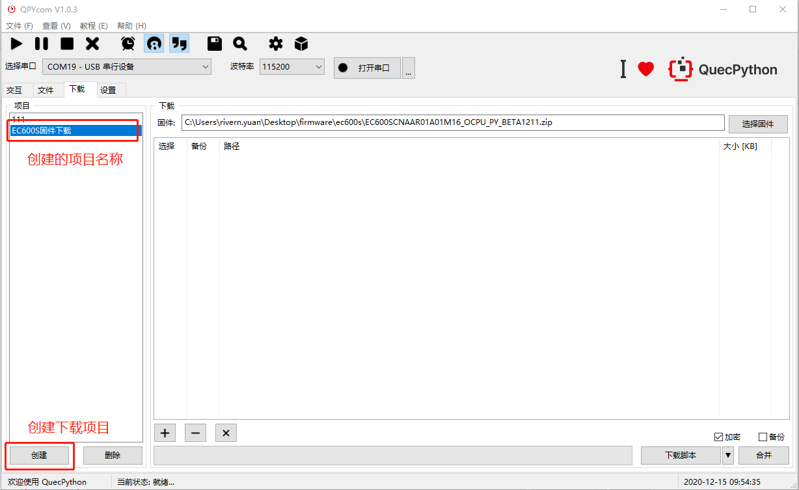

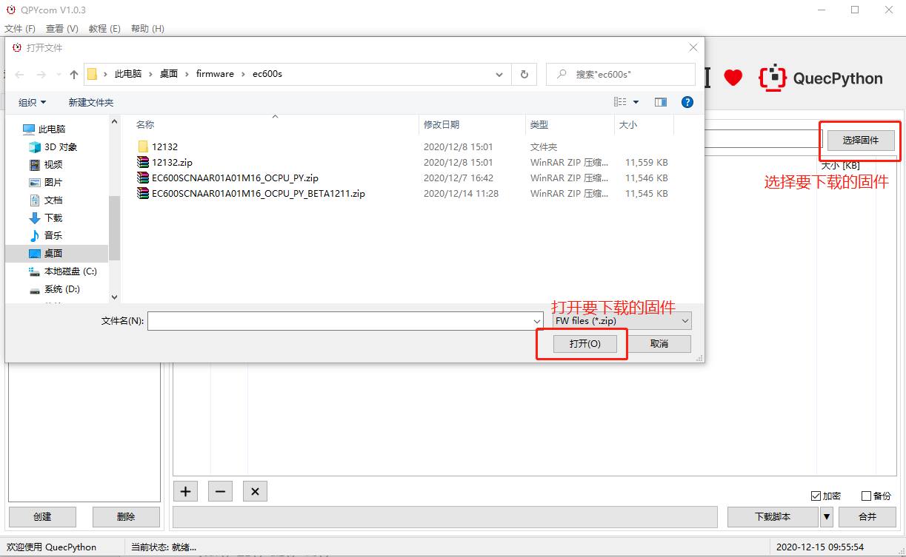

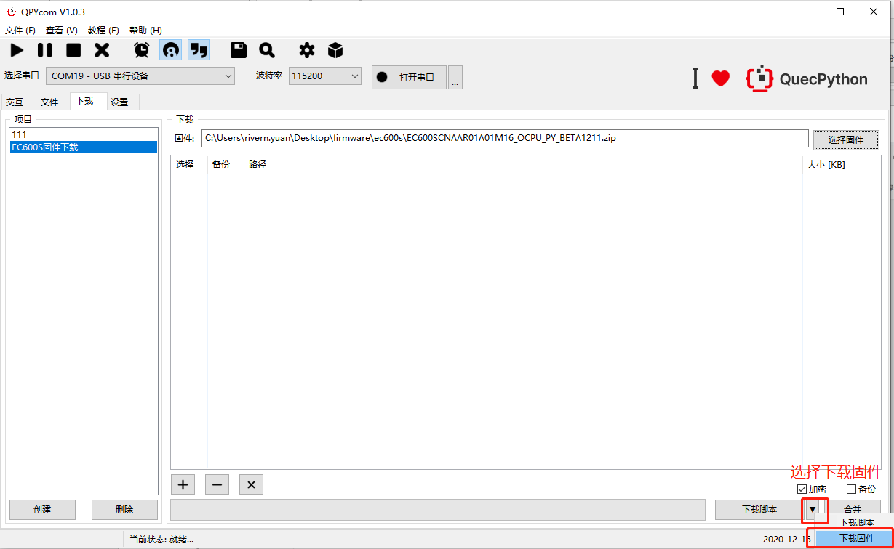

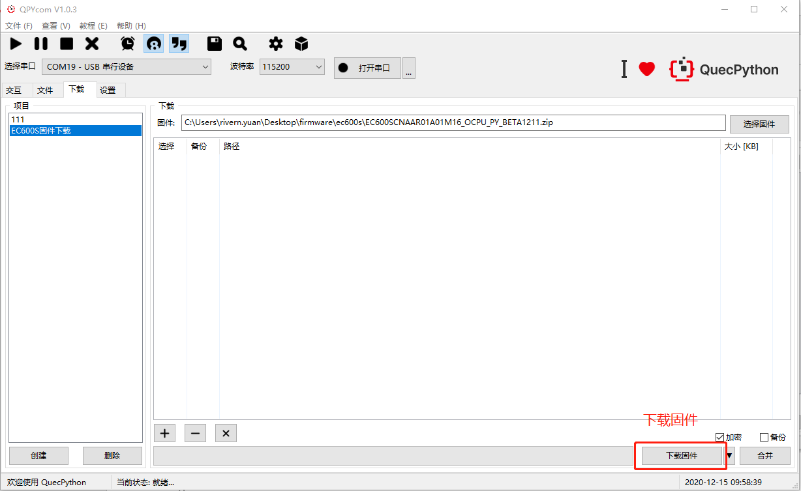

#### 脚本下载

（1）  在提供的软件工具中，找到QPYcom工具压缩包，解压后，双击运行该软件；

（2） 创建项目，点击'**+**'号选择需要下载的python文件；

（3） 左键倒三角形，选择【Download script】，点击Download script进行脚本下载；

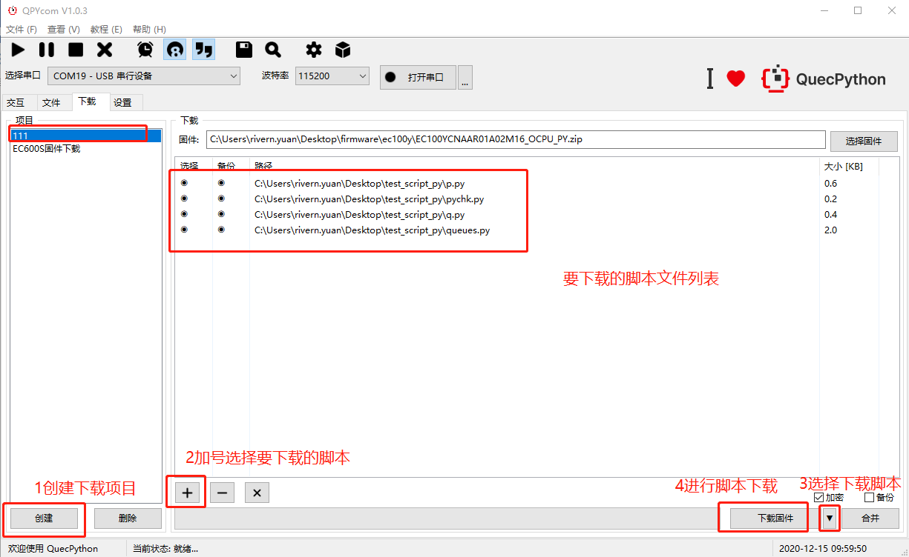

#### 交互窗口

（1） 在提供的软件工具中，找到QPYcom工具压缩包，解压后，双击运行该软件；

（2） 进入到交互主页面：

（3）在交互主界面可以通过交互窗口与模块进行手动输入交互，交互主界面说明如图所示：

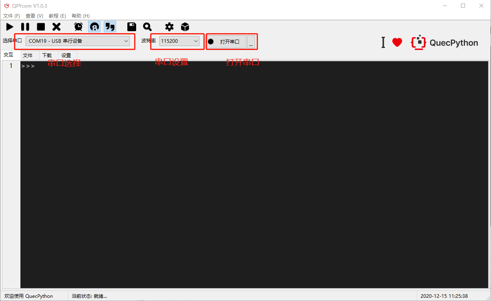

### 主界面功能

本章主要介绍QPYcom工具的主要功能说明，用户操作功能使用Guide可详见第五章。

在提供的 SDK 工具包中，进入 tools 目录，找到并解压 QPYcom.zip文件，进入解压后的目录找到 QPYcom.exe 工具，通过该工具，我们可以将自己的python
脚本文件下载到模块中，与模块进行命令行交互，同时该脚本工具也支持固件下载，升级检测等功能，用户可根据需求选择相关功能模块进行操作。如下图所示：

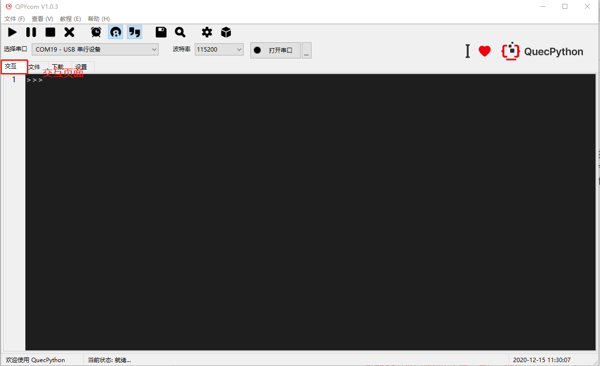

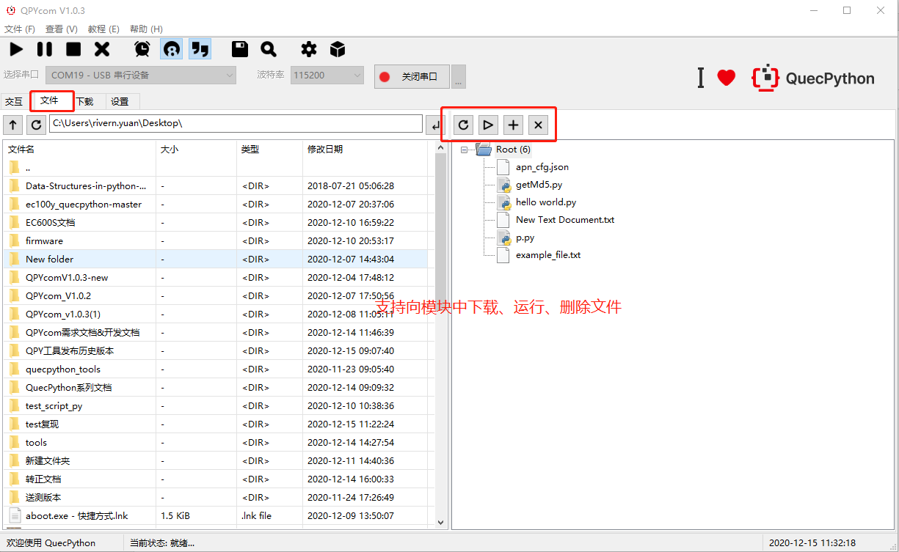

2.  python文件向串口中下载、运行、查看

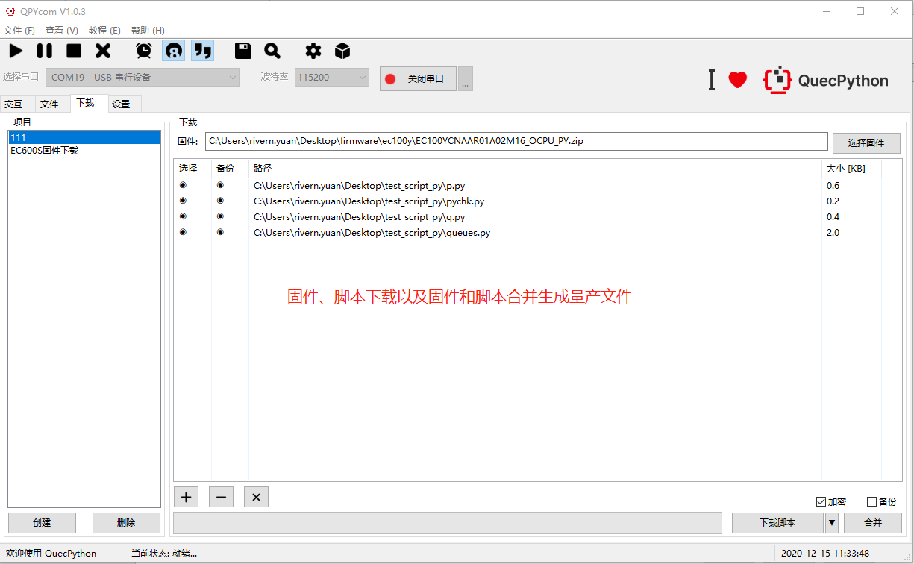

3.  固件及python脚本下载

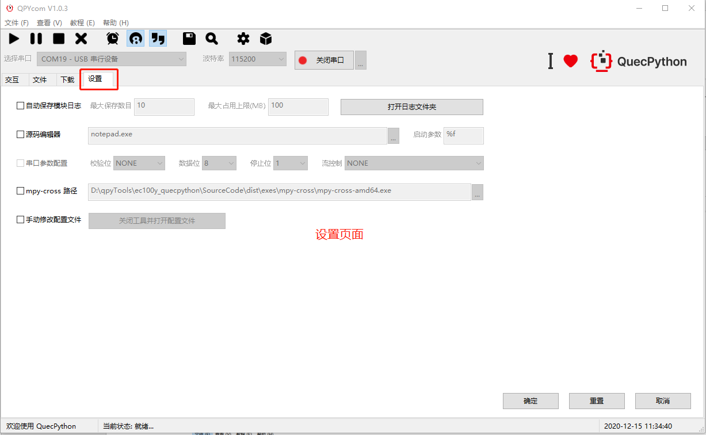

#### 文件栏目

#### 保存

-   文件栏目，有日志文件保存选项，点击'**保存**'用户可选择日志保存的路径。如图所示：

文件栏目

-   用户点击保存按钮后，选择日志保存路径，如图所示：

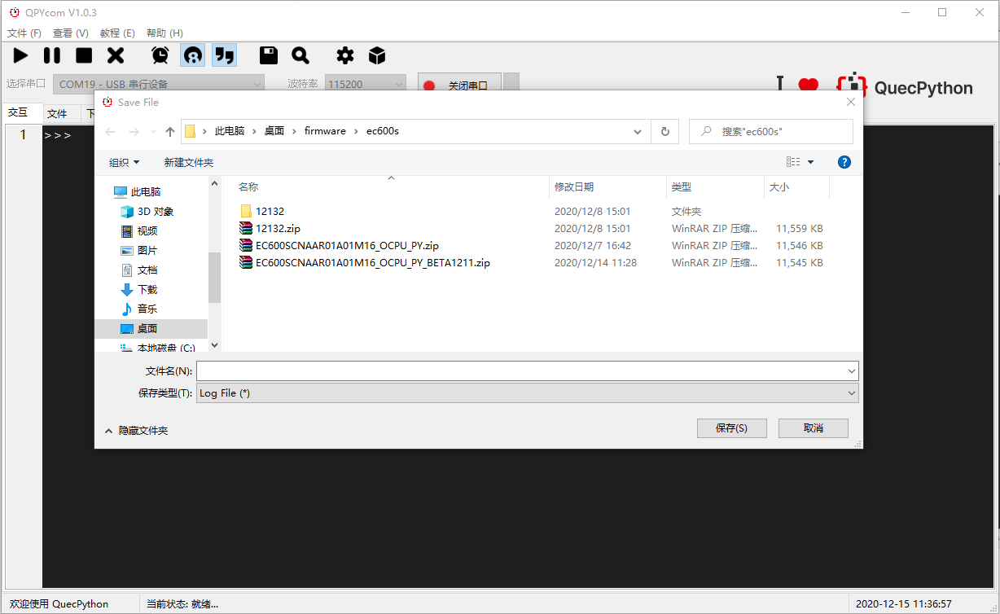

文件保存

#### 退出

-   用户选择退出，则退出整个应用程序。

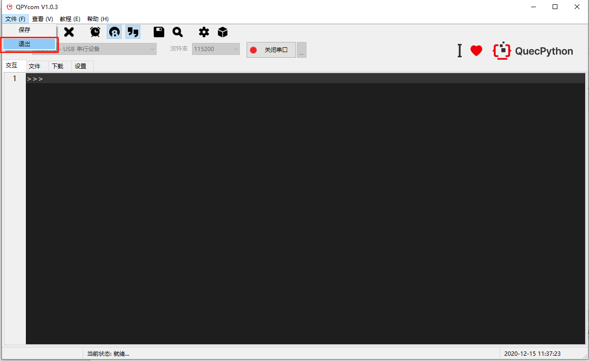

### 查看栏目

查看栏目包含【**交互命令行、文件浏览、下载固件/脚本、软件设置、语言切换、模块日志和下载日志保存查看**】功能。如图所示。

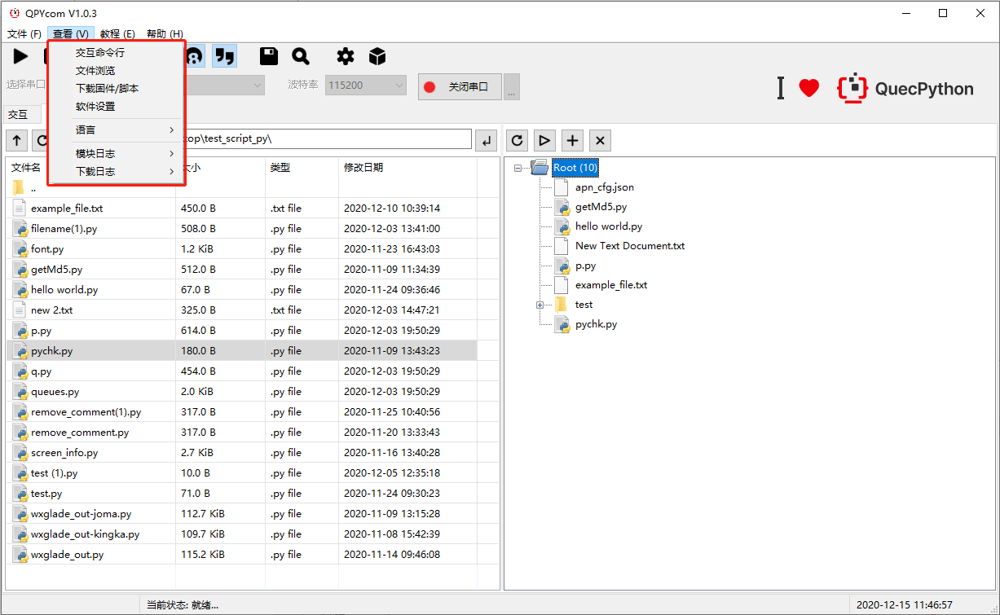

### 交互命令行

用户依次点击'**查看\--\>交互命令行**'可进入交互主界面，在交互主界面可以通过交互窗口与模块进行手动输入交互，交互主界面说明如图所示：

### 主界面按钮

交互主界面相关按钮说明如下：

-   
     开启与模块间命令行交互
-   
     暂停与模块间命令行交互
-   
     停止与模块间命令行交互
-   
     屏幕打印清除
-   
     显示打印时间
-   
     行号显示
-   
     主交互界面主题切换（黑色与白色主题切换）
-   
     交互日志保存
-   
     交互日志关键字搜索
-   
     模块日志设置、串口参数配置等选项设置
-   
      工具箱，可手动添加快捷指令(配置在config.ini中)
-   
      配置工具箱按钮,可自行配置需要的命令,注意命令数量最大16条,命令名称长度最大16个字符
-   
     置顶按钮,点击按钮使工具处于置顶状态
-   
     fota升级按钮用于制造fota包

#### **fota包制作流程**

点击fota升级按钮后，会弹出两个子菜单，分别是ASR_FOTA 和 RDA_FOTA

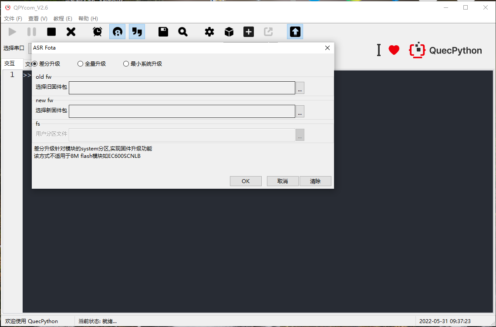

**ASR_FOTA包制作**

步骤1：选择需要做差分包的新旧固件包

步骤2：点击ok生成差分包，生成的差分包位置为folder指定目录，若未指定则在exes/ASR_Fotatools目录下

**RDA_FOTA包制作**

步骤1：选择需要做差分包的新旧固件包

步骤2： 点击ok生成差分包，实现原理参考[RDA_FOTA](https://python.quectel.com/doc/doc/sbs/zh/QuecPythonPlatform/FOTA_RDA.html)，

`注意事项：差分需要选择新旧固件包`

**200A_FOTA包制作**

步骤1：选择需要做差分包的新旧固件包

步骤2： 点击ok生成差分包

`注意事项：差分需要选择新旧固件包`

### 文件浏览 

用户选择'**查看\--\>文件浏览**'，可以实现本地python文件与模块端python文件的上传、查看、添加、删除操作，如图所示：

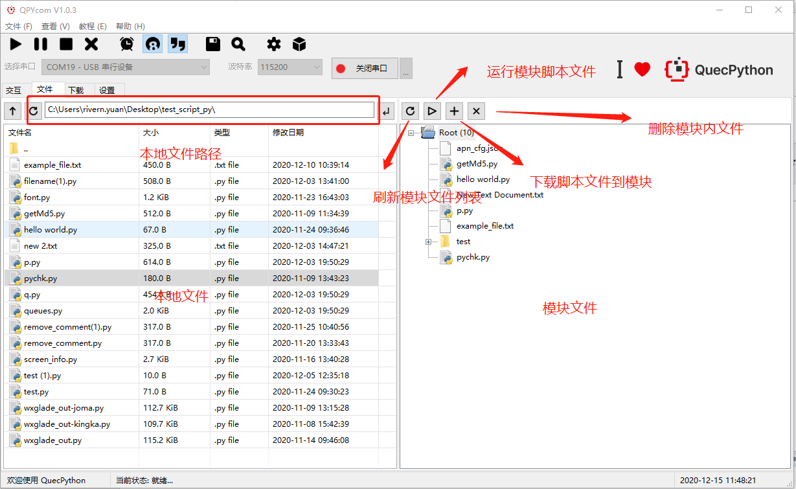

除了通过上传按钮上传文件之外,还可通过拖拽实现本地文件上传模块,需要选中左侧本地文件拖拽至右侧文件夹中实现文件上传功能,拖拽后状态栏会有下载进度显示,注意文件只可拖放至文件夹中,拖到错误的位置会提示相应错误,可以通过uos.mkdir()来新建文件夹然后拖拽本地文件来实现在在模块中新建文件夹的需求,注意文件只可拖拽至显示'+','-'的文件夹中,对于没有显示相应符号的文件夹,重新刷新即可显示。

### 下载固件脚本

用户选择'**下载**'按钮，可以实现本地python脚本文件批量上传以及模块烧录固件功能，操作步骤为：

-   在左侧导航栏创建项目

-   点击选择固件从本地选择固件，固件位置为提供的SDK包中firmware目录下，注意选择固件只可选择zip文件

-   通过图示位置选择要下载的脚本，可以通过点击脚本文件进行指定删除

-   通过左键点击图中倒三角标识来切换下载脚本和下载固件的功能

-   用户选择固件和所需要的脚本文件后点击合并按钮生成量产文件，合并过程中，除进度条外所有控件皆不可用，注意下载过程中保持USB
    AT Port不被占用

-   注意V1.6之后的下载页面下载脚本改成以目录结构的形式下载到模块，取消原先的按钮，可通过右键点击的形式来增加文件和文件夹以及删除，也可通过拖放来将文件从本地拖到工具中，点击下载脚本下载到模块中。

-   如图所示：

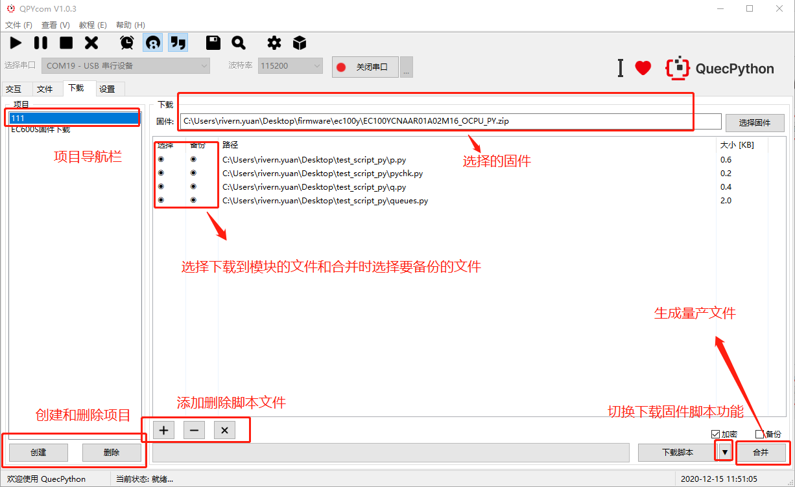

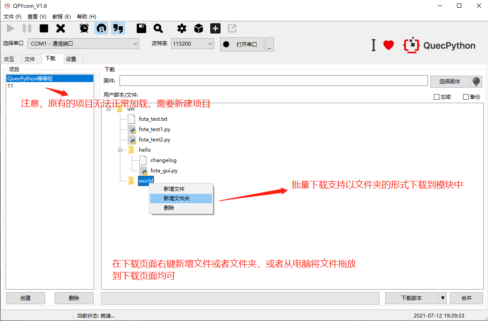

#### 下载固件

-   工具进入下载页面，点击"创建"项目，新建要下载的固件。如图所示：

-   选择固件，如图所示：

-   左击下拉选择箭头，选择"下载固件"，即"Download FW", 如图所示：

####  下载脚本

-   本地python脚本文件批量上传到模块内：如图所示：

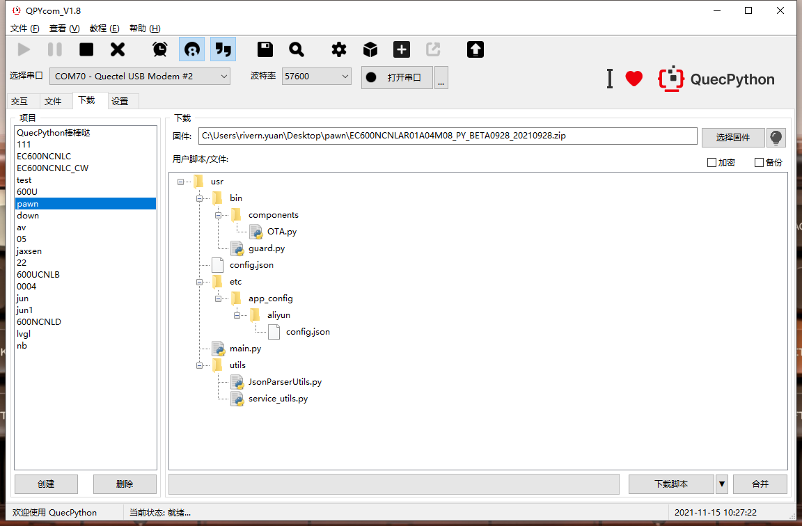

第一步、根据需求，创建用户项目（点击"创建"按钮）；

第二步、选择需要下载到模块的用户脚本（图(2)）；

第三步、点击如图所示按钮，切换到"下载脚本"模式；

第四步、点击"下载脚本"开始下载脚本，下载过程中有进度条提示；

### 固件脚本合并

用户选择'**下载**'页面，可以实现本地python脚本文件与固件合并生成量产文件功能，操作步骤为：

-   在左侧导航栏创建项目

-   点击选择固件从本地选择固件

-   通过图示位置选择要合并的脚本，可以通过点击脚本文件进行指定删除，可以一键导入整个目录结构来实现合并具有复杂目录结构的项目

-   用户选择加密和备份按钮来实现备份和加密功能

-   详细量产步骤方法见《Quectel_QuecPython_产线下载方案_V1.0.docx》

-   如图所示：

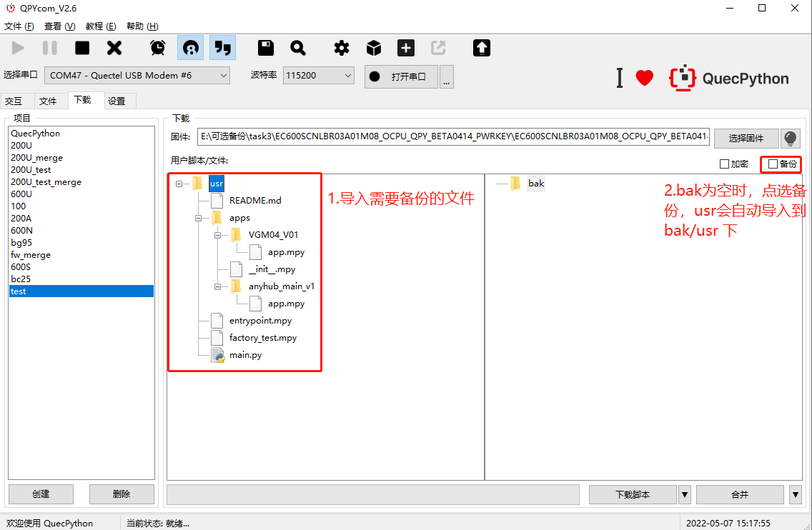

- 点选备份后（bak/usr区要为空或者不存在），usr自动导入到bak/usr下，如下图所示：

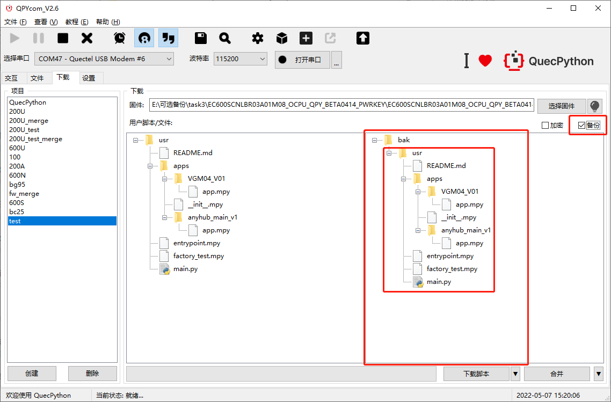

-  在此之后再在usr下添加文件，文件只会存在usr区，不会从bak/usr目录下恢复到usr；再在bak下添加文件，文件只会存在bak区，不会从bak/usr目录下恢复到usr，如图所示：

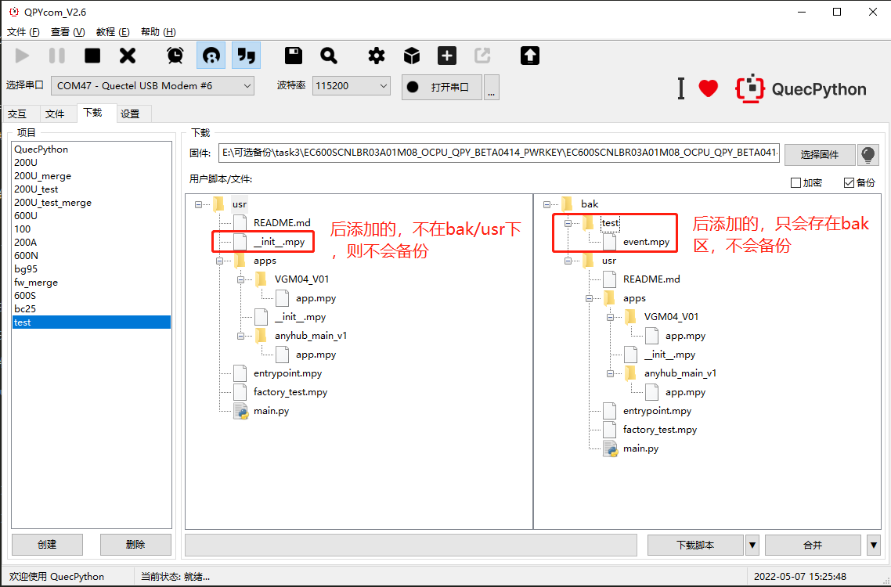

-  ASR固件合并，可选择 .zip 和 .bin 后缀（QPYcom工具2.9版本添加）
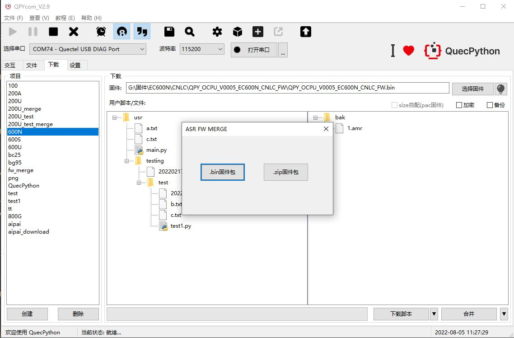

-  RDA固件合并，可选择设置 usr和bak分区大小（新固件才可，若不支持并且有勾选则会仅显示大小，不支持修改； 工具2.9版本添加）
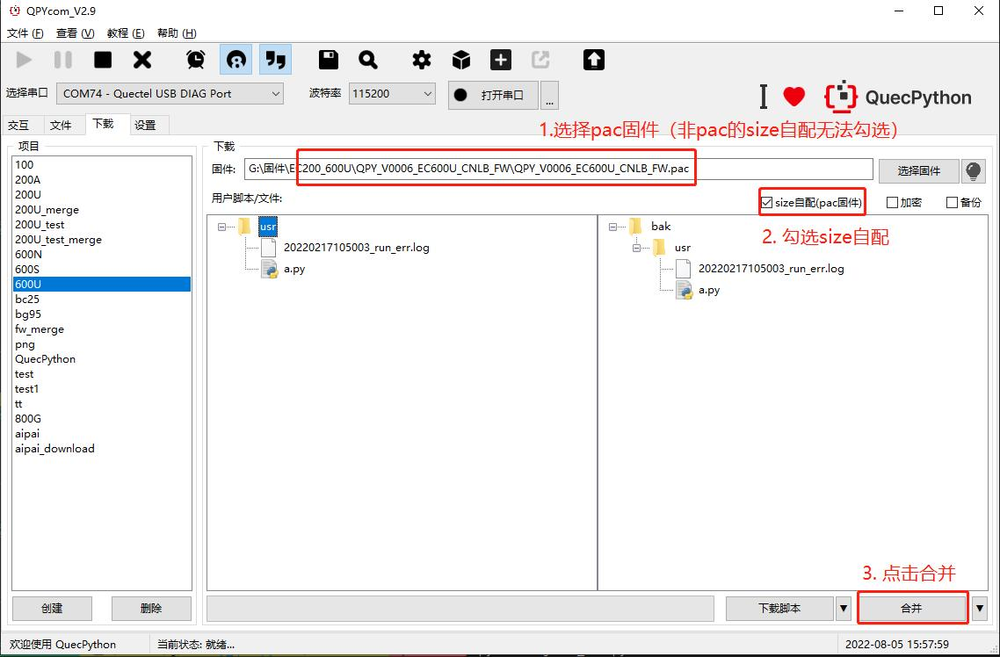
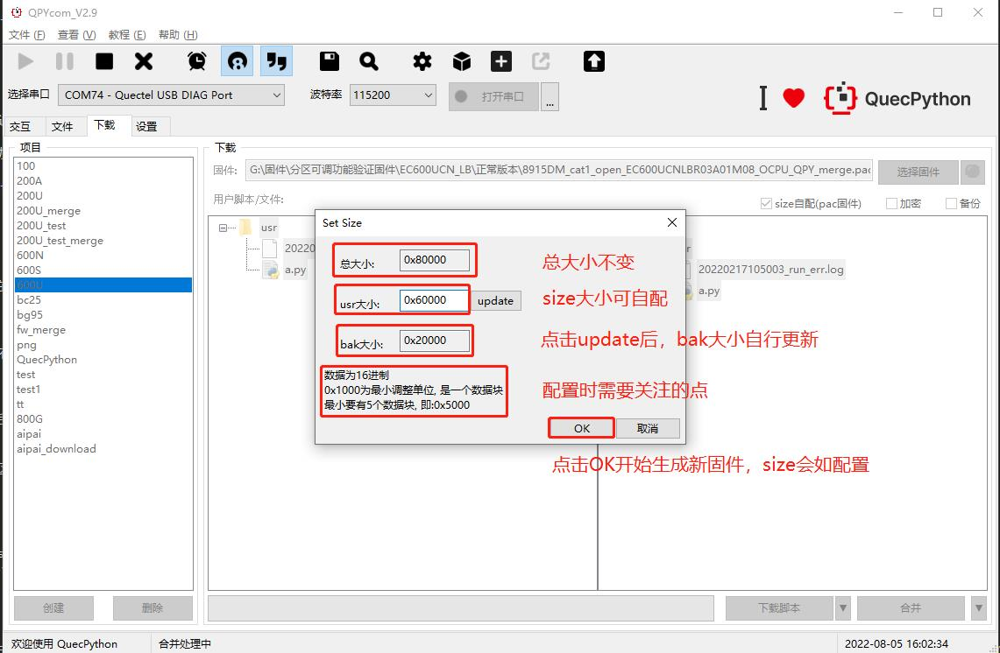

- 注：

  1. 备份按钮未勾选，usr区和 bak下非usr部分会合并到固件，且均不备份
  2. 文件只有同时在 usr 和 bak/usr 并勾选了备份才会备份

### 软件设置

用户选择'**查看\--\>软件设置**'栏目，可以进入软件设置界面，在软件设置界面，用户可以进行模块日志自动保存、单条日志保存大小限制、日志保存条数设置、串口参数配置（包括校验位、数据位、停止位、流控制）、mpy-cross加密工具路径设置，新增设置交互页面字体设置,且设置可保存持久生效,如图所示。

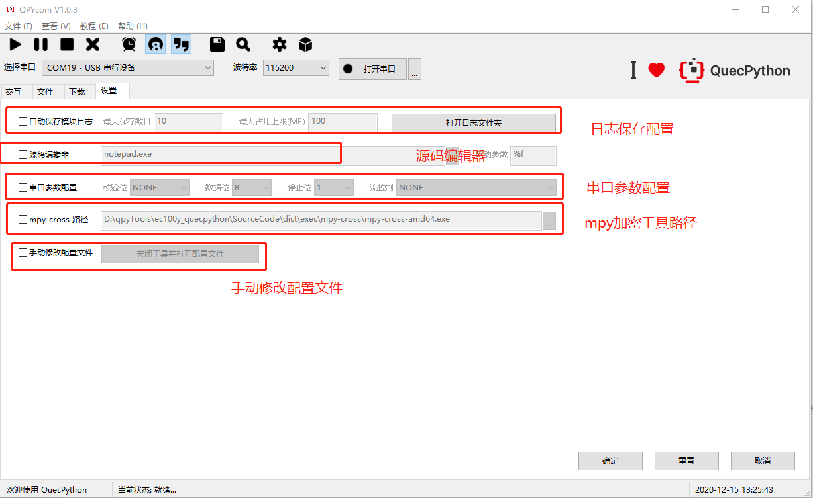

###  Language 栏目

-   用户选择**'查看\--\>Language'**栏目，可以进行软件语言切换，目前支持简体中文和英文两种语言的切换。

### 模块日志

-   用户选择**'查看\--\>模块日志'**，可以对模块日志进行查看以及选择模块日志新的保存路径。

### 下载日志

-   用户选择**'查看\--\>下载日志'**，可以对下载日志进行查看以及选择下载日志新的保存路径。

###  教程栏目

#### 官方网站

-   用户选择'**教程\--\>官方网站**'可以访问我们QuecPython的官方网址：<http://qpy.quectel.com/>

#### 在线wiki

-   用户选择 '**教程\--\>在线wiki**'，可以访问我们QuecPython的wiki教程：

> <http://qpy.quectel.com/wiki/#/>

#### 在线教程

-   用户选择'**教程\--\>在线教程**'，可以访问我们QuecPython的视频教程：<http://qpy.quectel.com/index.html#video>

#### 在线交流

-   用户选择 '**教程\--\>在线交流**'，可以访问我们QuecPython的在线社区

#### 资料下载

-   用户选择'**教程\--\>资料下载**'，可以访问我们QuecPython的资源下载：<http://qpy.quectel.com/down.html>

### 帮助

在帮助界面，用户可以进行版本更新检查，版本查阅，访问QuecPython官网及移远官网。

#### 检查升级

用户选择'**帮助\--\>检查升级**'栏目，则软件会检查是否有新版本更新，如果没有新版本则会提示目前已经是最新版本，如果有新版本则会把更新内容及版本号提示用户。

-   如果是强制升级提醒，用户选择升级则会开始更新操作，用户选择取消则会直接退出应用程序；

-   如果是忽略升级，是本次可忽略的文件，用户选择忽略则会在下次软件启动时重新提示用户更新，本次不再提示，用户选择升级则会开始更新操作；

-   如果是忽略升级，是永久可忽略的文件，用户选择忽略则会在下次软件启动时不再重新提示用户更新，用户选择升级则会开始更新操作。

-   升级过程中会有进度条和升级日志显示，且在升级过程中无法对工具进行操作

如图所示：

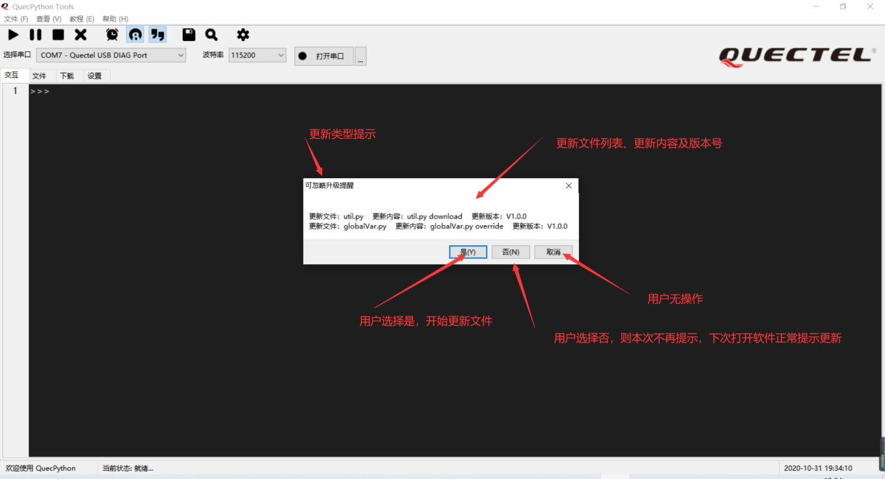

#### changelog

-   用户选择**'帮助\--\>changelog'**，将会打开工具changelog，查看工具迭代功能点，changelog文件在工具根目录下。

#### 使用指导

-   用户选择**'帮助\--\>使用指导**'，将会打开本文档，查看工具的使用说明书，文档的原文件在工具根目录下。

#### 关于Quectel移远

-   用户选择**'帮助\--\>关于Quectel移远'**，将会访问移远官网。

#### 关于QuecPython

-   用户选择**'帮助\--\>关于QuecPython'**，将会访问移远QuecPython\'官网。

#### 版本

-   用户选择**'帮助\--\>版本'**，将会提示工具当前版本号。

## QPYcom工具版本修改点说明

### 版本: v2.9

平台: EC100Y/EC600S/EC600U/EC200U/EC600N/EC800N/BC25/EC200A/BG95

日期: 2022/07/27

更新内容:

feature
1. 工具 帮助--版本信息（使用指导）链接到 文档中心
2. 新增 200A fota制作功能
3. ASR制作FOTA包新增功能
4. 展锐制作FOTA包新增功能
5. 工具打开 显示打印时间，则将该功能设置为默认打开，重启工具也会默认打开
6. 勾选 设置-自动连接上一次串口 后，串口意外中断会自动连接上次打开的串口（打开工具后，第一次连接需要手动连接，之后意外断开才会自动连接），手动点击 关闭串口，不会再自动连接上，需再次手动打开才能自动连接; 
   下载固件等同于手动关闭串口，下载完成后，需手动打开串口才会打开自动连接。
7. 下载 -- 选择固件，第一个筛选 所有固件（*.zip;*.bin;*.pac;*.lod;*.blf;*.mbn）都可选
8. 合并固件逻辑调整：
9. 下载展锐所有的固件都不擦文件系统
10. 展锐下载固件卡在一个点600秒才会报失败，若日志输出 [ERROR] DownLoad Failed 立即报错退出
11. 展锐合并固件文件系统客户可配置，展锐固件才可勾选 size自配
12. 工具所在目录不能有空格，否则会提示：工具所在路径中有空格, 请换个路径打开(建议使用全英文路径)，并自动关闭工具
13. 支持800G固件下载与合并
14. 展锐下载固件exe更新
15. BG95 固件合并（备份功能）：

bug修复：
1. 合并固件时，没有对bak区的文件检测是否存在
2. 下载固件，合并固件时，文件路径中有空格也可正常使用
3. 高分辨率下，工具size不适配调整
4. 下载文件，如果模组中有目录，会删除失败，有概率导致下载文件缺失

### 版本: v2.8

平台: EC100Y/EC600S/EC600U/EC200U/EC600N/EC800N/BC25/EC200A/BG95

日期: 2022/06/06

更新内容:

feature
1. 合并固件，备份可选(1. 只放usr不备份，2.只放bak区不备份，3.usr/bak区都放，正常备份) 
2. 合并固件, 本身不带锁的py文件不会被 亿赛通加密
3. ASR合并固件统一.bin 后缀
4. 一键合并烧录（有勾选备份也需要检查checksum.json）
5. 下载展锐固件，固件中存在 FBD2SFL1PY_U 或者 FBD2SFL2PY_U 就不去清除分区(没有清除的弹窗)；
  合并展锐固件，固件中存在 FBD2SFL1PY_U 或者 FBD2SFL2PY_U，固件的 size 和 address 就用固件中的配置，若不存在就用默认值
  注：之前只检测 FBD2SFL1PY_U，新添加了 FBD2SFL2PY_U 的检测
6. 更新ASR下载固件工具
7. 合并固件时，对exe 可读权限检测 调整为 可执行权限检测

bug修复
1. 合并固件，对生成固件的目录选择如果有非法字符（中文或者空格）会有窗口提示
2. 下载页面，文件下禁止添加文件与文件夹，并有窗口提示
3. BG95 批量下载文件超过10个会下载不进去
4. 文件窗口 删除和清除功能bug修复
5. 修复文件没有修改日期时，文件窗口文件显示不出来
6. 修复BG95下载固件，进度100%后需要等很久（大概30S）才弹窗下载固件成功
7. BG95下载文件模块断电，重启后无法再次下载文件，必须要重启工具才能重新下载

### 版本: v2.7

平台: EC100Y/EC600S/EC600U/EC200U/EC600N/EC800N/BC25/EC200A/BG95

日期: 2022/05/14

更新内容:  退版到2.5

### 版本: v2.6

平台: EC100Y/EC600S/EC600U/EC200U/EC600N/EC800N/BC25/EC200A/BG95

日期: 2022/05/06

更新内容:

bug fixes
1. 下载页面，文件下禁止添加文件与文件夹，并有窗口提示
                                    
feature
1. 备份可选
2. 合并固件, 本身不带锁的py文件不会被 亿赛通加密
3. ASR合并固件统一.bin 后缀
4. 一键合并烧录
5. 合并固件，对生成固件的目录选择如果有非法字符会有窗口提示

### 版本: v2.5

平台: EC100Y/EC600S/EC600U/EC200U/EC600N/EC800N/BC25/EC200A/BG95

日期: 2022/04/12

更新内容:

bug fixes
1. 合并固件，非py文件加密和备份全选后，无法正常备份
2. 版本不兼容:
  2.1 win10 1809打不开
  2.2 win10 教育版200A合并固件闪退
  2.3 win7 无法打开工具
3. 200A 下载固件restart两次，进度条会重复两次（注：restart两次下载固件会失败，进度条不会出现两次）

feature
1. BG95 合并固件调整，自行指定 customer.app 和 efs.bin
2. 手动打印日志，取消时间戳打印
3. 在文件页 回车到目录下，按回车按钮弹窗文件夹
4. app log 取消多余空行打印
5. 代码重构，合并固件加密备份逻辑简化 

### 版本: v2.4

平台: EC100Y/EC600S/EC600U/EC200U/EC600N/EC800N/BC25/EC200A/BG95

日期: 2022/03/15

更新内容:

bug fixes
1. 修复展锐下载合并生成并备份的固件，usr下会多出目录

feature
1. 新增展锐合并固件时，获取pac包中内置的size与address，若在pac包中未获取到，则取用默认值
2. 展锐旧固件下载有擦除的弹窗，新固件下载没有擦除的弹窗

### 版本: v2.3

平台: EC100Y/EC600S/EC600U/EC200U/EC600N/EC800N/BC25/EC200A/BG95

日期: 2022/03/10

更新内容:

bug fixes
1. 修复下载固件成功后不关闭窗口45秒后会报错

feature
1. 新增EC200A平台下载固件功能
2. 新增EC200A平台合并固件功能
3. 新增EC200A平台加密备份功能
4. 新增BG95平台下载固件功能
5. 新增BG95平台合并固件功能

### 版本: v2.1

平台: EC100Y/EC600S/EC600U/EC200U/EC600N/EC800N/BC25

日期: 2022/02/11

更新内容:

bug fixes
1. 修复保存的日志里有多余换行的问题
2. 日志保存时保存文件无上限问题

feature
1. 新增BC25平台合并固件功能
2. 新增BC25平台加密备份功能
3. 新增交互页面在打印时间戳的情况下也能输入
4. 优化 部分初始文件夹 可以在初始化的时候生成，而不是没有这个文件的时候无法启动
5. 代码重构

### 版本: v2.0

平台: EC100Y/EC600S/EC600U/EC200U/EC600N/EC800N/BC25

日期: 2022/01/10

更新内容:

bug fixes
1. 使用工具箱快捷指令时，在600U上概率性打印日志信息不全
2. 修复工具切换英语之后部分提示框依旧显示中文问题
3. 备份合并的时候如果未选中main.py,此时勾选加密会出现加密文件校验和失败问题
4. 在一行的中间位置进行中文输入时输入错乱的问题
5. 执行完py文件之后必须刷新文件才能继续下载文件问题解决
6. 传文件过程中断电后工具必须重启才可用正常使用
7. 解决大文件列表刷新失败问题（文件数量很多的时候，刷新概率性失败）
8. 工具箱快捷指令名称长度限制调整（15->20）

feature
1. 工具箱默认指令增加（关机和获取版本号命令）
2. 新增对crtl + E快捷键的支持
3. 工具菜单栏新增git仓库的链接
4. 升级QPYcom附带的aboot工具版本
5. 文件页面文件导航栏输入框新增可以通过windows资源导航窗口访问
（输入框为空的时候通过回车键可以触发） 

### 版本: v1.9

平台: EC100Y/EC600S/EC600U/EC200U/EC600N/EC800N/BC25

日期: 2021/11/30

更新内容:

bug fixes
1. 下载页面新建目录-字符限制和长度限制取消
2. 工具在未连接模块的情况下下载固件提示未连接模块同时不启动下载进度检测线程
3. nb下载固件因为串口芯片无法确定下载口故改成用户自己选择串口
4. 下载固件完之后不点结束等待一会还是会提示失败(实际成功)bug解决
5. 工具执行完脚本后延时逻辑移除（判断脚本执行完成逻辑）
6. 下载一组文件每个下载都重启问题解决（会导致main.py自动运行）
7. 解决不同设备上可能会图标加载失败弹窗或者无法启动的问题
8. 工具打开at口卡顿问题解决
9. 修复新版本展锐合并的固件 无法烧录问题
10. 打开串口之后自动刷新目录引起卡顿问题解决

feature
1. 工具新增 crtl a&b&c&d的支持
2. 合并之后生成固件的名字---改成原始固件+日期的名字,移除对合并脚本的格式要求

### 版本: v1.8

平台: EC100Y/EC600S/EC600U/EC200U/EC600N/BC25

日期: 2021/09/28

更新内容:
    
bug fixes
1. 串口显示错乱问题修复，在已连接状态下不刷新串口列表
2. 备份文件自动恢复不生效问题修复
3. 部分英文翻译问题修复

feature
1. 新增对BC25模块的支持(支持下载BC25固件)
2. 新增RDA平台(EC600U/EC200U)的固件合并功能
3. 新增RDA平台(EC600U/EC200U)的加密和备份功能
4. 交互页面输入命令的记录去重(方向键切换历史命令时重复命令只需一次)
5. 文件页面新增打开串口自动刷新模块文件
6. 下载文件(拖拽文件和批量下载)速度优化

### 版本: v1.7

平台: EC100Y/EC600S/EC600U/EC200U/EC600N

日期: 2021/08/12

更新内容:

bug fixes
1. 合并和加密同时选择时合并失败的问题
2. 暂停交互的功能在打开/关闭串口后显示的页面切换但是功能实际上没有切换
3. 搜索大日志时找不到结果问题修复(定位问题优化中)
4. 修复project文件夹缺失时创建默认项目失败导致工具无法使用
5. 下载页面文件树结构存在多个目录时最后一个目录添加文件时显示错乱
6. 600U拖拽文件时文件大小校验失效问题解决
7. 下载页面文件树结构文件层次加多了显示错乱

feature
1. ui修改：新建文件——>添加文件
2. ui修改：文件上右键，增加：添加文件/新建文件夹；和该文件同级目录
3. ui修改：菜单增加分隔线
4. ui修改：删除确认弹窗提示
5. ui修改：root节点，如果是空，菜单增加一个：导入功能，本机目录递归添加 
6. 文件页面左侧栏新增功能支持文件夹拖拽(按照本地的目录结构将文件下载到模块的usr分区下)
7. 工具栏新增制作fota包功能菜单

### 版本: v1.6

平台: EC100Y/EC600S/EC600U/EC200U/EC600N

日期: 2021/07/06

更新内容:

bug fixes
1. 解决交互页面不是以>>>结尾时刷新文件堵塞的问题
2. 文件页面从左侧本地文件页面拖放到右侧模块页面下方空白区域时不再报错,默认下载到根目录
3. 英文翻译问题完善

feature
1. 下载页面下载脚本列表修改为treeCtrl,支持以目录结构的形式下载文件到模块中去
2. treeCtrl--目录树的每个节点可右键点击弹出菜单，新增文件/新增文件夹/删除
3. treeCtrl--目录树中每个节点显示对应模块中的位置与下载到模块中的位置一致
4. treeCtrl--目录树中的每个文件节点可鼠标悬浮显示文件在电脑上的实际位置和大小
5. treeCtrl--目录树中文件和目录节点增加对中文字符的限制(无法创建中文目录和文件名带中文字符的文件)
6. 对treeCtrl目录树中的目录和文件节点编辑会保存到配置文件，下次打开该项目时显示上次退出时的内容
7. 支持从windows本地拖放文件到treeCtrl中,且可以通过放置的位置来下载具体的文件夹中,拖放到空白位置时会下载到根目录
8. 增加默认项目,当项目列表为空时打开工具会新增默认项目
9. 点击下载固件后,先检测是否打开了串口,如果打开了,关闭所有的串口,再进行下载固件的操作

### 版本: v1.5

平台: EC100Y/EC600S/EC600U/EC200U/EC600N

日期: 2021/06/18

更新内容:

bug fixes
1. 修复在EC600SCNLB/CNLA.EC600U.EC600N上tab补全大概率失效问题，增加tab自动补全稳定性
2. 打印模块日志时增加时间戳便于debug
3. 手动保存日志增加时间戳,分次写入避免日志过多导致工具崩溃，保存完成弹窗提示
4. 合并量产固件时从选择的固件包中取customer_fs和customer_backup_fs文件的大小来生成bin文件,避免因配置文件中size大小与实际模块size大小不一致导致合并后烧录失败问题
5. 解决下载超过模块可用空间大小文件无提示的问题,下载文件的大小限制由配置文件改为实时获取模块剩余空间(拖动文件下载未加此限制)
6. UI:下载页面的'+','-','x'按钮大小修改为正方形
7. UI:工具栏新增tooltips方便用户正确使用
8. UI:文件页面的本地文件列表中各列的列宽调整，其中文件名列的宽度为自适应
9. UI:自动保存日志的checkbox，容易产生歧义,自动保存日志设置,设置保存数目或占用上限为0时不自动保存

feature
1. 设置页面新增禁止Windows自动休眠选项
2. 下载文件完成的弹窗提示内容调整为下载成功

### 版本: v1.4

平台: EC100Y/EC600S/EC600U/EC200U

日期: 2021/05/10

更新内容:

bug fixes
1. 设置页配置的默认的mpycross路径错误问题修复
2. 交互页面for/if/while...换行输入后内容无法删除问题修复
3. 工具窗口版本号上边增加分割线
4. win10 ltsc无法打开工具(部分电脑无法打开工具)

feature
1. 设置页的确定.重置.取消按钮增加tips提示(鼠标悬停提示)帮助用户了解其具体功能
2. 工具增加对高分屏的支持
3. 文件页面右侧模块文件列表上右键新增菜单包括新增文件.新建文件夹.删除.属性等常用功能
4. 下载固件前对zip固件包进行检查，若未解压则提示客户解压zip文件
5. 下载页面选择固件按钮右侧新增按钮帮助客户直接获取固件(点击跳转官网下载固件页面)
6. 调整合并的固件名称后缀为zip方便客户量产

### 版本: v1.3

平台: EC100Y/EC600S/EC600U/EC200U

日期: 2021/04/27

更新内容:

bug fixes
1. 差分包升级问题修复,生成差分包时没有带上main.py,需要生成差分包时请勿勾选加密
2. 合并固件时,ec600scnlb的customer_fs.bin大小为5120kb,实际应该是384kb
3. 优化弹窗提示内容,优化repl异常情况的处理逻辑
4. 弹窗提示翻译内容修复

feature
1. 对ec600scnla的兼容
2. 工具的自动升级功能由强制升级改为非强制升级并且在升级时提示版本更新内容
3. 固件包名称后缀由zip改为bin,下载固件兼容bin文件,合并固件生成固件格式为bin文件        
4. 新增提示信息弹窗用于通知用户重要信息(可配置信息内容.弹窗次数.消息有效期.弹窗模式等)

### 版本号: v1.2

平台: EC100Y/EC600S/EC600U/EC200U

日期:  2021/03/25

更新内容: 

bug fixes
1. 模块串口识别问题修复(打开串口的情况下重启模块或者断联,打开串口的按钮状态不会切换)
2. 运行脚本打印信息的过程中可以删除打印的日志信息问题修复
3. 文件页面刷新不及时和无效问题修复,刷新文件页面状态栏提示修复(刷新文件的同时状态栏提示)
4. 拖拽下载文件过程中重启或者拔掉模块引起的异常问题修复(串口状态自动切换,重启后交互使用异常需要重启工具)
5. 串口断联的情况自动切换按钮状态,状态栏提示断联信息
    
feature 
1. 新增制作app-fota包功能,合并的同时生成fota包(差分包名称:main.zip)
2. 合并前必须选择串口逻辑调整,移除合并protectfile功能
3. 文件页面拖拽文件可以拖到文件树右侧的空白处

### 版本号: v1.1.5

平台: EC100Y/EC600S/EC600U/EC200U

日期:  2021/03/16

更新内容: 

bug fixes
1. 通过工具栏新增指令按钮增加指令名称包含中文时新增失败问题修复
2. 没有选中项目的情况下点击下载脚本页面锁住无法操作
3. 当模块中在运行main.py时打开串口失败问题修复
4. 合并时文件名出错问题修复
    
feature 
1. 工具兼容EC600SCNLB版本,包括脚本下载/固件下载/合并量产功能
2. 工具兼容EC600UCNLB/EC200UCNLB版本,包括脚本下载/固件下载功能
3. 移除对老版本单文件系统的兼容性

### 版本号: v1.1.4

平台: EC100Y/EC600S

日期:  2021/02/24

更新内容: 

bug fixes
1. 在apn_cfg.json文件中，每个字典的最后一个逗号缺失
2. 文件页面加载部分文件时图标加载异常(.dxg文件...)    
3. REPL中的文本在单引号后高亮显示(例如包含文本:isn't defined的traceback。问题已解决，而且REPL的样式也改变了)
4. 搜索到尽头之后搜索无反应(现在会回溯到最开始)
5. 在“下载页面”中，如果一列移动到另一列，则无法检查或取消检查文件(限制列之间的互相移动)
6. 由于编码问题导致的FW下载失败
7. 从AT固件升级到PY固件时失败
8. 从下载页面中打印脚本下载后的文件内容时包含多余的换行(例如打印apn_cfg.json文件会有多余的换行)
9. "如果“备份”复选框是勾选“下载页面”，合并FW下载后“bak”文件夹为空"问题修复
10. 端口在应用程序中不显示,修复端口概率性不显示问题
11. repl限制了所有的中文字符,包括打印信息的中文,现只限制输入的中文字符,输出中文正常显示
    
feature 
1. 当试图删除受保护的文件，应该弹出提示框
2. "quickCMD在添加超过max会后被阻止名称和/或命令的字符长度"
3. 在下载页面上可以使用键盘delete键从projectlist删除项目
4. 在REPL中，在左键按住并移动字符的过程中，没有高亮显示(选中)任何内容，直到一个版本左键单击(shift加左移=选中)
5. 在应用程序的每次启动时都实现日志文件的创建，并将日志分成两个文件——std和err
6. 右键单击可以在下载页面的文件列表中编辑文件(在设置中配置编辑器)
7. 优化下载页面'选择'和'备份'列的选择和未选择状态图标(比之前更加显眼)

### 版本号: v1.1.3

平台: EC100Y/EC600S

日期:  2021/02/05

更新内容: 

bug fixes
1. FW下载时，状态栏显示百分比
2. 新的config.ini创建了[quickCMD]部分
3. [quickCMD]不允许命令名超过15个字符
4. 在下载笔记本中，重新启动应用程序后，项目的顺序不会改变
5. CTRL + V在REPL中阻塞中文字母
6. 在projectlist中删除项目后，将选定具有相同索引的项目
7. 在REPL中搜索找到的单词，在关闭搜索窗口后不会保持高亮显示
8. 在输入REPL中不存在的单词后，有一条消息说没有找到单词，所有的字母都不是变成白色
9. 下载合并FW后，“下载笔记本”列表中未选中的文件即为合并后的文件不再列在模块中
10. 按下打开日志文件夹按钮后，选中的笔记本上的所有东西都不会闪烁
11. 在文件笔记本中，删除文件的按钮为“-”

feature 
1. 自检和提示项目
2. REPL中的日志查询功能
3. 在下载笔记本中拖放文件
4. 代码编辑器的功能是在右击中实现的
5. 在串口连接中断或模块崩溃的情况下，状态栏会提示用户发出通知
6. 调整字体设置以及保存设置
7. REPL控制台不允许使用中文字母
8. 在文件笔记本中下载文件时，提示用户模块上的剩余空间(用于5 mb)
9. 当打开日志时，该工具会添加一个时间戳，以帮助定位错误位置
10. 解决下载固件时串口选择逻辑问题
11. 当下载脚本并在下载笔记本上合并时，页面会冻结
12. 文件页面新增执行清除按钮和状态栏通知
13. 在文件笔记本的所有按钮的工具提示被实现

### 版本号: v1.1.2

平台: EC100Y/EC600S

日期:  2021/01/26

更新内容: 

bug fixes
1. main.py上电自动运行时工具不打印运行日志
2. 去注释功能引起的导入文件内容缺失问题修复(移除去注释功能)
3. 连接main串口时概率提示重复插入模块
4. 合并选择加密时不加密main.py文件(main.mpy无法上电自运行)

feature 
1. 合并时生成备份文件的checksum.json文件校验算法由sha256修改成crc32

### 版本号: v1.1.1

平台: EC100Y/EC600S

日期:  2020/12/25--2021/01/11

更新内容: 

bug fixes
1. 工具栏新增逻辑:如果是非暂停状态，点击停止，开始按钮恢复可用，变成黑色，暂停按钮变成灰色。
2. 升级窗口比例调整
3. 连接main串口时概率提示重复插入模块
4. 重复启动判断逻辑调整，修复小概率启动失败问题
5. 优化英文翻译内容

feature 
1. 新增置顶按钮实现窗口置顶功能
2. 设置页面新增字体设置，可修改交互页面字体
3. 新增py文件下载时去除注释功能

### 版本号: v1.1.0

平台: EC100Y/EC600S

日期:  2020/12/21

更新内容: 

bug fixes
1. 调整下载页面文件列表最大化之后的页面适配&文件列表多选效果调整
2. 工具栏暂停和开始与模块交互之间没有区分,新增开始与暂停工具图标以区分当前工具状态
3. 修复windows部分图标无法加载问题导致工具报错&无法启动(lnk.psd.pdf)
4. 工具栏屏幕清除打印按钮清除后页面新增输入符号">>>"
5. 修复下载页面可以创建同名项目和无命名项目导致项目导航栏错位的问题
6. 下载页面导航栏删除项目后无选中问题修复
7. 翻译缺失问题修复,英文界面部分翻译优化
7. 修复工具在系统语言为塞尔维亚语时无法启动问题
8. tab补全结果无法对齐问题改善(等宽字体调整)
9. 下载固件包路径有空格时超时错误解决

feature 
1. 状态栏调整(刷新&下载固件&合并时新增状态栏提示)
2. 远程升级过程中通过进度条提示用户整个升级过程，进度条支持当前进度&总进度&升级日志(上个版本问题修复)
3. 合并文件备份功能可以通过勾选单选框来实现备份指定文件
4. 新增工具箱功能支持发送快捷指令(可在config.ini配置文件中编辑指令),最大指令16条,最大指令名称长度10个字符
5. 防呆下载,相应模块只能下载模块型号对应的固件,下载错误固件时会提示固件版本错
6. 帮助菜单栏新增changelog和使用指导菜单选项用于帮助用户使用工具
7. 打开工具时根据系统语言自动切换语言选项(非中文和英文系统时自动切换为英文)
8. 合并前检查文件中是否有main.py, 并要求用户加上如下两个全局变量：PROJECT_NAME PROJECT_VERSION, 生成固件包前检查是否有这两个变量，固件包名为 PROJECT_NAME+PROJECT_VERSION
9. 下载页面新增.删除.清除按钮新增tooltip

### 版本号: v1.0.3

平台: EC100Y/EC600S

日期:  2020/12/04

更新内容: 

bug fixes
1. 文件页面的目录树刷新时，只能显示文件，无法遍历所有子文件夹和其文件
2. 动态获取工具进程名称，避免使用固定名称，防止用户修改工具名称
3. 下载固件去除必须有AT口的限制,不检测AT口直接使用adownload下载固件实现救砖功能

feature 
1. 交互页面新增tab补全功能以及上下方向键查看历史记录
2. 远程升级过程中通过进度条提示用户整个升级过程，进度条支持当前进度&总进度&升级日志
3. 新增文件备份功能，合并时将要备份的文件写入固件备份分区生成customer_backup_fs.bin文件
4. 文件页面支持将本地文件拖放到模块指定目录下,支持删除&运行文件夹下指定文件
5. 适配v07新版本固件双文件系统并保持向上兼容性
6. 工具运行日志新增下载固件adownload日志，见logs/software目录下

### 版本号: v1.0.2

平台: EC100Y/EC600S

日期:  2020/11/25

更新内容: 

bug fixes
1. 下载文件前，应检查被下载文件大小，并检查模块可用空间，通过后才可下载，否则提示用户错误信息
2. 下载脚本.fw.合并等操作前，应检查目标文件是否实际存在
3. “下载”页面不全选脚本，下载脚本后，进度条百分比不同步
4. 加密功能不可用问题修复
5. 关闭工具后，未完全退出,进程残留
6. 修复工具可以重复启动问题
7. 下载固件时禁用'打开/关闭串口'按钮
8. 移除下载脚本前必须先选择固件策略
9. 修复加密单个文件时重复加密问题
10. 解决下载固件超时和失败时gui不可用问题
11. 修复下载固件后菜单失效问题

feature 
1. python脚本下载前语法检测，语法错误弹窗提示
2. 添加重复文件，统一提示“xx,xx,xx”文件重复
3. 高分屏和普屏的按钮错位调整，分辨率小于屏幕尺寸时默认打开最大化

### 版本号: v1.0.1

平台: EC100Y

日期:  2020/11/10

更新内容: 

bug fixes
1. 工具首次启动，界面为英文
2. 工具 “固件下载/脚本下载” 切换后，按钮仍为英文，而此时已经选择为中文，部分翻译失效
3. 下载开始后，其他tab仍可用，退出工具无提示
4. 工具“固件下载”功能，打开串口，选择固件后，点击下载FW，可以听到串口断联提示音，设备管理器观察到出现download口，后无动作
5. 工具“脚本下载”功能：打开串口，选择脚本后点击下载，无法下载任何脚本
6. 工具下载脚本时，gui会卡死；下载脚本完成后，没有任何提示
7. 下载脚本时，已选择脚本总大小没有限制
8. 下载脚本时，下载按钮默认为下载脚本
9. 下载脚本时，选择并下载大量文件（几十个），实际下载到模块内的文件仅有几个
10. 下载fw过程开始后，存在几秒失去响应的阶段

### 版本号: v1.0.0

平台: EC100Y

日期:  2020/11/08

更新内容: 
    初始版本
