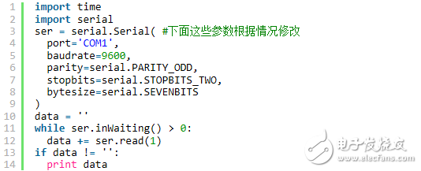

## QPYcom工具交互原理

QPYcom是***Quectel移远***官方发布的QuecPython开发调试工具。稳定可靠易用高效，被誉为是QuecPython的屠龙刀。

QPYcom使用CPython语言编写，wxGlade设计GUI，WXPython为图形库，PyInstaller打包exe的Windows工具。

### 安装pyserial库

但是工具是怎么进行串口通信的呢

答案就是 pySerial库,这个包的使用非常简单,先安装pySerial。

想要用python操作串口，首先需要下载相关模块:

-  pyserial ([https://pypi.org/project/pyserial/](https://pypi.org/project/pyserial/))

-  pywin32 ([https://pypi.org/project/pywin32/](https://pypi.org/project/pywin32/))

### 通过pyserial操作串口

安装好库之后就可以通过python打开串口了

```python
import serial
ser=serial.Serial("com1",baudrate = 9600, bytesize = 8,parity = 'N',stopbits = 1,timeout=0.5) # winsows系统使用com1口连接串行口
```

设备名对于不同的设备和操作系统是不一样的。 比如,在Windows系统上,你可以使用0,1等表示的一个设备来打开通信端”COM0”和”COM1”。 一旦端口打开,那就可以使用read() , readline() 和 write() 函数读写数据了。

操作串口示例

```python
print ser.name  #打印设备名称
print ser.port  #打印设备名
ser.open  ()  #打开端口
s = ser.read(10) #从端口读10个字节
ser.write("hello")  #向端口些数据
ser.close()  #关闭端口
data = ser.read(20) #是读20个字符
data = ser.readline()  #是读一行，以/n结束，要是没有/n就一直读，阻塞。
data = ser.readlines()和ser.xreadlines() #都需要设置超时时间
ser.baudrate = 9600  #设置波特率
ser.isOpen() #看看这个串口是否已经被打开

```

QuecPython 串口写入示例

```python
ser.write(b"import uos\r\n")
ser.write(b"print(uos.listdir('/usr'))\r\n")
```

同理可以使用pyserial来实现向模块中写入文件和读出文件内容，以下为读出文件示例



### 命令行工具


[下载链接](code/quecpython.py)

**下载文件到本地** 

quecpython.py -d COM24 -b 115200 -f cp :/example_mqtt.py ./example_mqtt.py 

**上传本地文件** 

quecpython.py -d COM24 -b 115200 -f cp ./example_mqtt.py :/ 

**列出模块端文件和目录** 

quecpython.py -d COM24 -b 115200 -f ls / 

**模块端创建目录** 

quecpython.py -d COM24 -b 115200 -f mkdir test_dir 

**模块端删除文件** 

quecpython.py -d COM24 -b 115200 -f rm example_mqtt.py 

**模块端删除目录** 

quecpython.py -d COM24 -b 115200 -f rmdir test_dir 

**显示模块端文件内容** 

quecpython.py -d COM24 -b 115200 -f cat /example_mqtt.py 