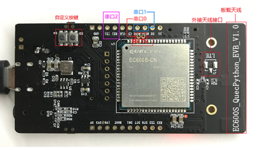

# 开发板常见问题

本文主要介绍用户在基于官方开发板或自行设计的电路板进行 QuecPython 入门学习和开发环境搭建时可能遇到的问题，涉及具体软硬件功能开发的问题不在本文中涉及，请参阅其他章节。

### **EC600S开发板与模组串口对应图**

EC600S开发板（EC600S_QuecPython_EVB_V1.x 开发板）的串口位置如下图：

### **板子接出的串口无法通信**

要注意接口是1.8V还是3.3V，电平匹配才能正常通信。

### **接上USB线为什么灯不亮**

检查模块电压，保证模组的3.8V电压稳定，必要时用电池供电。

### **EC600SV1.1的QuecPython开发板在测试TTS功能时的注意事项有哪些？**

外设是接的喇叭，但是在TTS中配置的是“话筒”。

由于V1.1上面加了一个功放，此时需要拉高模组（硬件拉高）socket的pin58（功放的使能脚），或者指令使能“audio_EN = Pin(Pin.GPIO11, Pin.OUT, Pin.PULL_PD, 1)”。

外接的喇叭是功率是有限制的，建议小于8R 2W。

