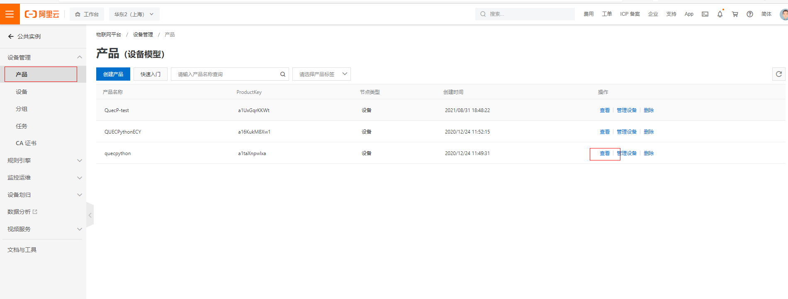

## About document

**Revision history**

| **Version** | **Date**   | **Author** | **Description** |
| ----------- | ---------- | ---------- | --------------- |
| 1.0         | 2021-09-15 | Jaxsen     | Initial Version |

## Function introduction

2. Detect access to network when starting up and switch network notifier.
4. Connect server and detect server status regularly. 
6. Control the volume via GPIO
8. Play tts audio
10. Query history record
12. Auto registration and reattachment

## Usage

### Get code

- [Apply for the Cloud speaker via official website of Quectel]([下载 (quectel.com)](https://python.quectel.com/download))
- Unzip it and convert `main.txt` into`main.py`

### Code needs to be modified

#### Set the parameter of Aliyun server

- Parameter used to connect server
  - Set product key
  - Set private key
  - Set name
  - Set private key
- Set Topic
  - Subscribe topic

#### Set “+/-" of the volume

- Mode 
  - Default  volume mode 

- Volume mode key_mode=0
  - Set the gpio of "+" key, when there exists up/down edge event, it will trigger the volume+ mode
  - Set the gpio of "-" key, when there exists up/down edge event, it will trigger the volume- mode
- Historical record mode key_mode=1 
  - It will switch when the up/down edge event was triggered in key_fun, which will switched to historical info mode from volume mode.  
  - It will broadcast the last historical trade record. 

#### Set the GPIO of network notifier

- Set the GPIO of network notifier

#### Run code

Run **main.py** code block on module 

### Set cloud server

Address: [ (aliyun.com)](https://iot.console.aliyun.com/product)

#### Create product

#### Add device into corresponding product.

#### Self-defined topic

- Query

- Self-defined topic

- Compile

- Authority selection
  - Publish and subscribe

#### The connection is a success

#### Publish message

- Click to publish

- Deliver message
  - Message format
  - {"orderID": 1,"productID": 11111111,"msg": "The Alipay is paid 1000 *yuan* ","PayStatus": 1,"createTime": "2020/10/31 13:45:52"}

