## Revision history

| Version | **Date**   | **Author**   | **Description**                    |
| :------ | ---------- | ------------ | ---------------------------------- |
| 1.0     | 2021-11-25 | Jeremy Jiang | Initial version                    |
| 1.1     | 2021-11-30 | Chavis Chen  | Added more details on illustration |

## Illustration 

- The GUI tool is mainly used to debug DTU on PC. In addition, all functions exposed by DTU are equipped with corresponding debugging modules on GUI.                
- Along with QuecPython EVB, the GUI can be used to verify the prototype quickly before developing terminal product. 
- Login the [Download QuecPython Resource](https://python.quectel.com/download) to check and download the GUI tool of DTU. (Limited to Windows system only; However, when the GUI is used to develop on cross-platform, which is vulnerable to extend to Ubuntu or Mac).

## Run DTU GUI tools

**Double click to open DTU  GUI tool**

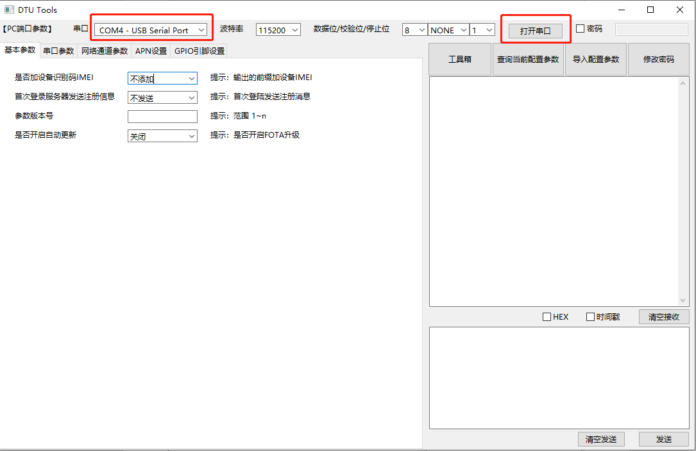

**The DTU tool after running.** 

**Open serial port**

## Introduction on DTU GUI tools

### Toolbox

**The query functions  of toolbox currently：**

- Query IMEI Number 
- Query local number 
- Query version number 
- Query signal strength 
- Diagnose query 
- Query ICCID
- Query ADC voltage 
- Query GPIO info
- Query battery voltage 
- Query temperature and humidity 
- Query network connection status 
- Query base station status
- Base station location

**E. g.** Query IMEI number 

Returned data:  `【2021-11-24 20:35:39】 869537055499330`

### Query current configuration parameter 

**The operation steps are shown as figure below** 

**All above steps are done, query current configuration parameter correspondingly.** 

### Import configuration parameter 

#### Configure basic parameter 

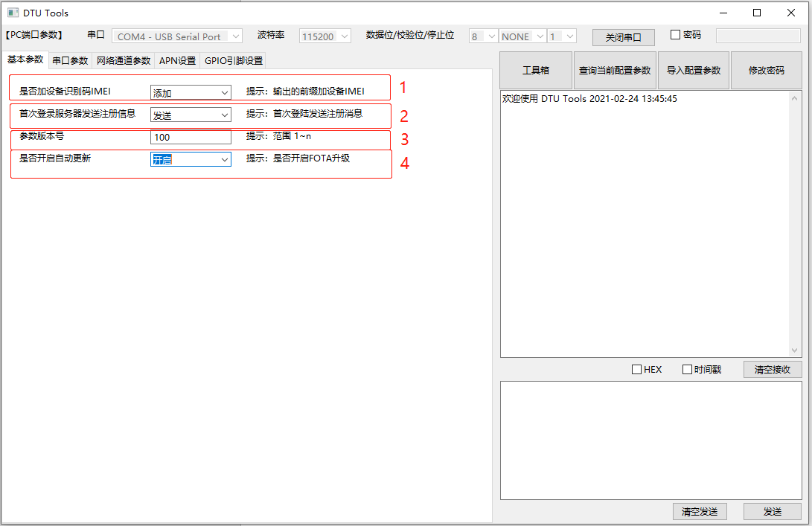

**Refer to the digital code above **

1. **Adding IMEI is to place it in front of the returned data。** 

`864430010001091{"code": "20000", "data": "864430010001091", "success": 1}`

No need to add IMEI 

`{"code": "20000", "data": "864430010001091", "success": 1}`

2. **Send registration message when getting access to server for the first time ** 

Once enabled, it will send registration message when getting access to tcp/udp server successfully, the following contents show the detailed format by default. 

`{"csq": "25", "imei": "864430010001091", "iccid": "898600F21274F6605263", "ver":"100"}`  

If the registration message, which sent by getting access to server for the first time, is assigned in the configuration parameter on tcp/udp, as a result, the self-assigned will be sent. 

For detailed parameter configurations of tcp/udp, which will be illustrated specifically later. 

3. **FW version** 

The value should be over 0. 

4. **Whether auto-upgrade is enabled**

For enabling auto-upgrade, you can query whether the upgraded FW package is needed Via OTA Cloud when starting DTU. 

Suggestion: Before enabling auto-upgrade, it is available to backup the former configuration files in accord with actual need. However, the auto backup is not supported temporarily. 

#### Serial port parameter

Parameters such as baud rates, digital bit, parity bits and stop bits are contained in these three serial ports. 

Currently, it does not support the configuration of serial port, however, it will be released later. 

#### Configure network parameter 

Click the "Open" button of any channel, the data of 7 channels will be imported to configuration files. For other channels, if the parameters are not configured, the empty data will be imported to configuration files correspondingly. Therefore, there is a need to set the configuration parameter of all channels via demands when clicking "Open" button.

##### Channel type: HTTP

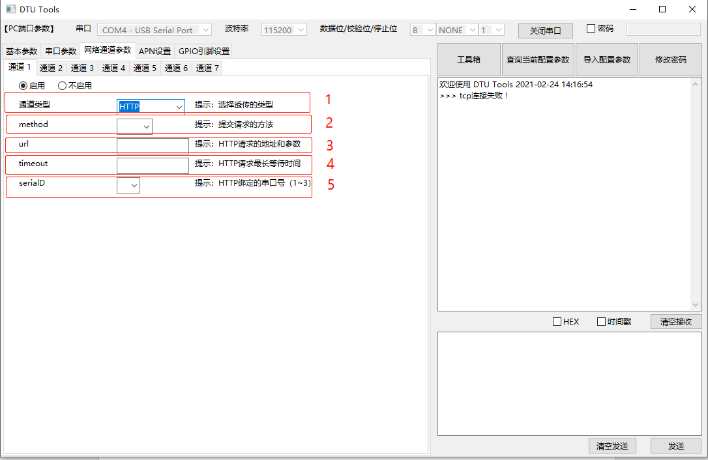

| **Field** | **Type** | **Required** | **Indication** |
| --- | --- | --- | --- |
| method | Str | true | Method to submit request |
| url | str | true | Address and parameter of HTTP request |
| data | json | false | For post request, please fill in, while for get request, there is no need |
| timeout | int | false | The longest waiting time for HTTP request |
| serialD | int | true | Bound serial port number (1-2) by HTTP |

**Note**: the bound serial port number of serialID is under preparation, which will be released along with other serial port configuration. 

##### Channel type: SOCKET TCP/SOCKET UDP

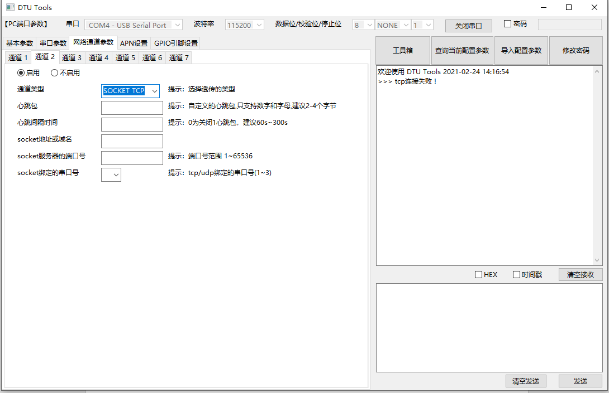

The corresponding indication of parameter as described above.

| **Field** | **Type** | **Required** | **Indication** |
| --- | --- | --- | --- |
| tcp | str | true | TCP flag of Socket |
| ping | str | false | The assigned heart-beat package by user, which supports digital and character only. There is no need to fill in under the circumstance of 2-4 bytes. Default as ”123“. |
| time | int | true | The "0"  refers to closing heart-beat package, the suggested time range is 60s to 300s. |
| url | str | true | The address and domain name of socket |
| port | int | true | The port number of socket server |
| KeepAlive | int | false | The longest keepAlive time of link, the unit is s. which defaults as 300s. |
| serialD | int | true | Bound serial port number (1-2) by tcp/udp |

##### Channel type: MQTT 

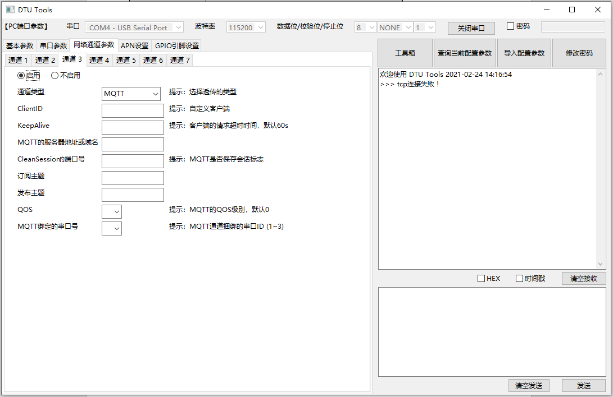

| **Field** | **Type** | **Required** | Indication |
| --- | --- | --- | --- |
| clentID | int | true | Assigned Client ID |
| keepAlive | int | false | Keepalive time on client terminal, default as 60s |
| address | str | true | Address and domain name of MQTT |
| port | int | true | The port number of socket server |
| cleanSession | int | false | Whether the session is saved in MQTT. The "0" refers to continuous session, while 1 means cleaning session automatically when off-line, default as 0. |
| Sub | str | true | Subscribe topic |
| pub | str | true | Publish topic |
| qos | int | true | QOS of MQTT, default as 0. |
| retain | int | true | Retain the parameter  published by MQTT, default as 0. |
| serialD | int | true | Bound serial port number (1-3) by MQTT                       |

##### Channel type: Aliyun/Tencent Cloud

When carrying out unique-certificate-per-product authentication on Aliyun/Tencent Cloud, if the device connection on Aliyun is a failure, there is a need to create **sercet.json** with device name and device private key manually. For more details, please refer to "secret.json" file. 

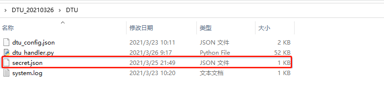

Similarly, if same issue occurs on Tencent Cloud, it is also needed to create **tx_secret.json** manually. 

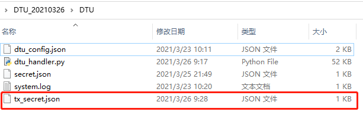

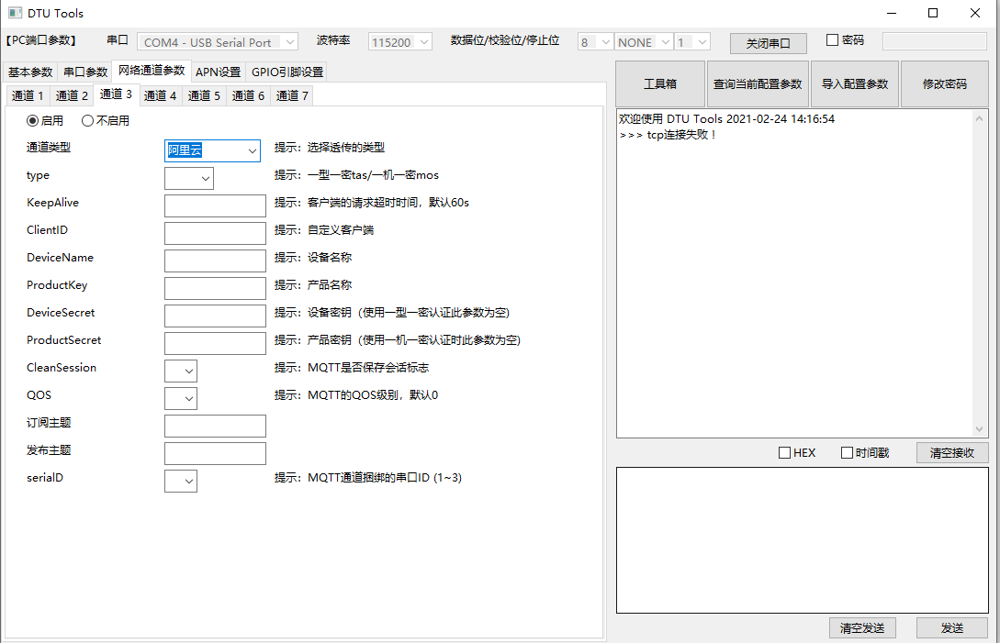

| **Field** | **Type** | **Required** | **Indication** |
| --- | --- | --- | --- |
| type | int | true | Unique-certificate-per-product authentication tas/Unique-certificate-per-device authentication mos |
| keepAlive | int | false | The longest time for communication (The unit is s, default as 300, which ranges from 60 to 1200. It is valid to fill in or not. |
| clientID | str | true | Client ID. The assigned character (less than 64 is preferred) |
| Devicename | str | true | Device name |
| ProductKey | str | true | Product key |
| DeviceSecret | str | false | Device secret key (No bother to fill in for unique-certificate-per-product authentication) |
| ProductSecret | str | false | Product secret key (No bother to fill in for unique-certificate-per-device authentication) |
| cleanSession | int | false | Flag to save session in MQTT (0: the client ID is perpetual, when disconnected, the subscription and queue will be reserved, while 1 means deleting all related info of the client ID when disconnected), default as 0. |
| QOS | int | false | QOS (Quality of Service) of MQTT message (default as 0, both 0 and 1 are available). 0: For sender, he will only send message once without trying again. 1: the sender sends message at least one time to guarantee the message arrive at Broker. |
| subTopic | str | true | Subscribe topic |
| pubTopic | str | true | Publish topic |
| serialD | int | true | Bound serial port number (1-3) by MQTT                       |

##### Set APN 

The APN is not available now. 

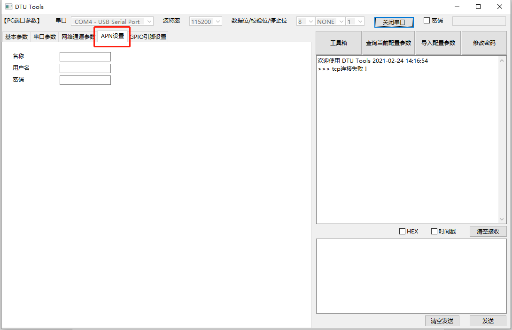

##### Set GPIO pin 

The GPIO pin setting is not available now. 

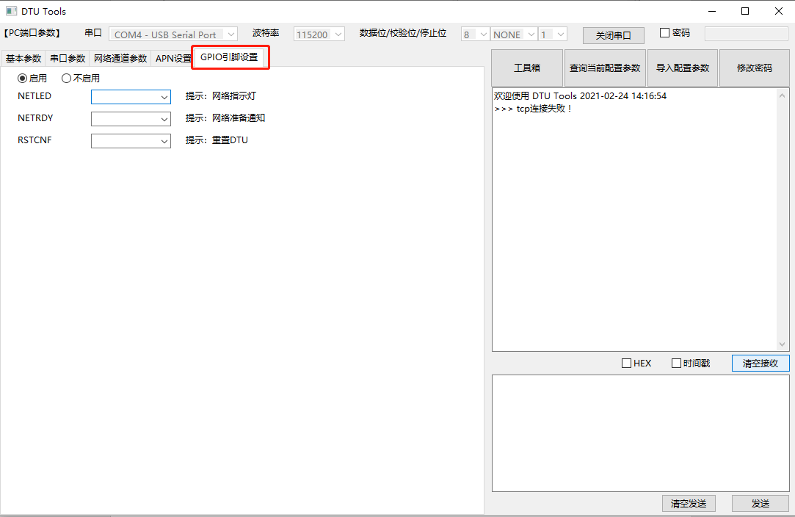

NETLED -- GPIO for Network LED （gpio1 to gpio 128)

NETRDY -- Once the network is ready, notify GPIO (gpio 1 to gpio128)

RSTCNF -- GPIO used to reset DTU parameter (gpio 1 to gpio 128)

### Modify password

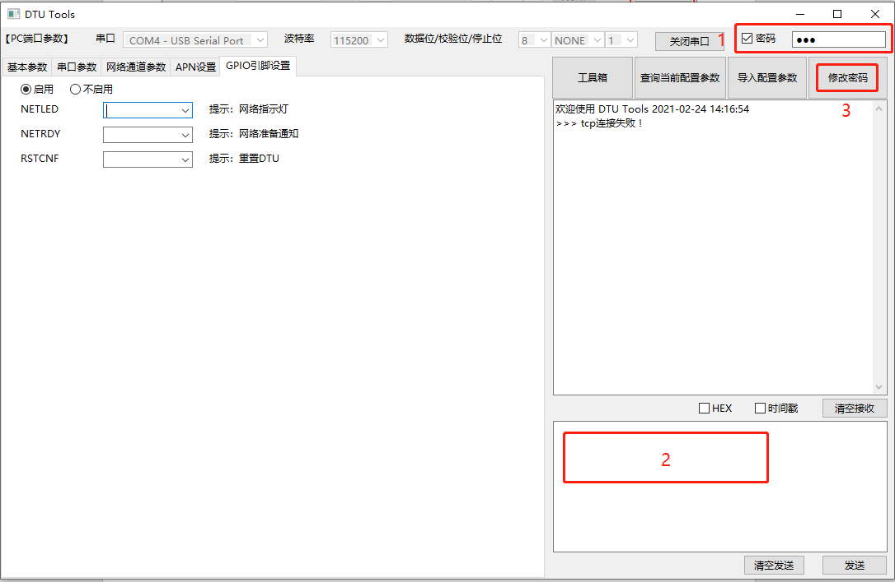

1. Tick "Password" button and input the current password. 
2. Input the latest password
3. Click "Modify password" button 

### Configure the output data format

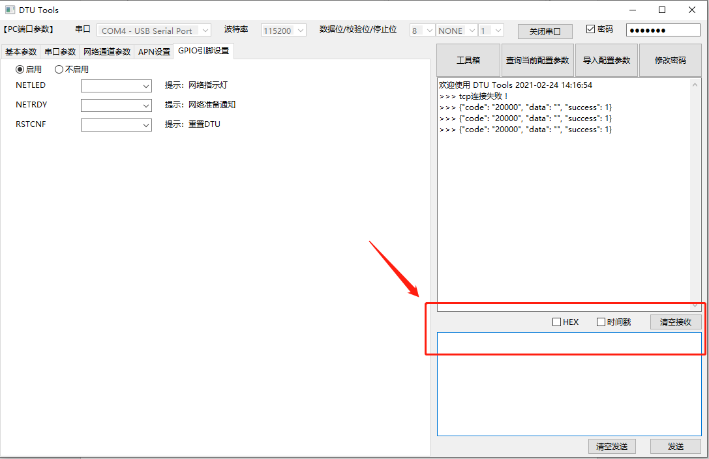

**Convert the output data as that of hex.** 

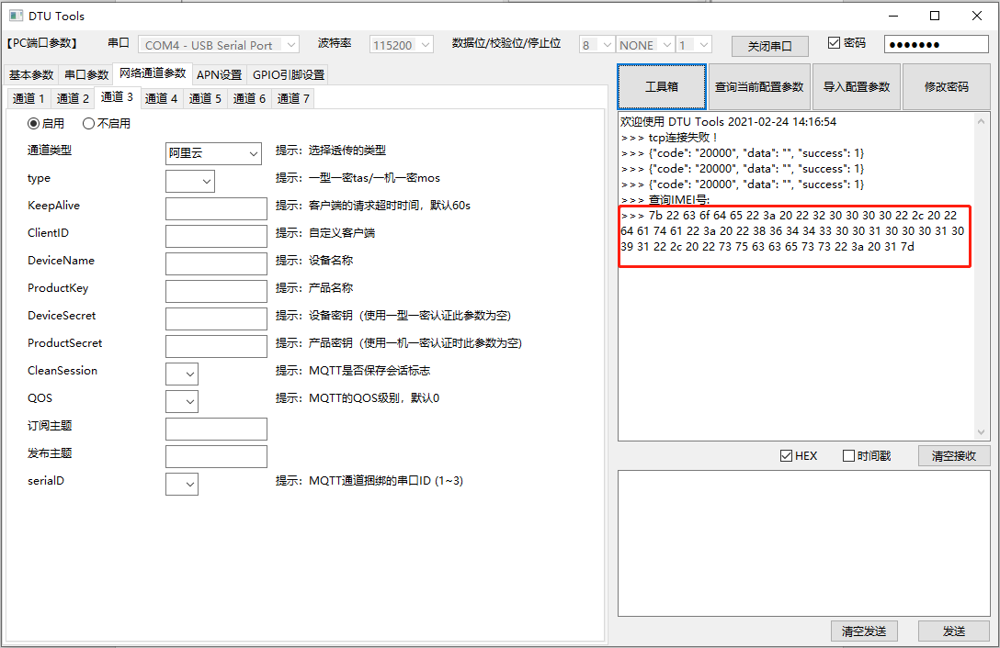

**Time Stamp: add the time stamp in front of the output data** 

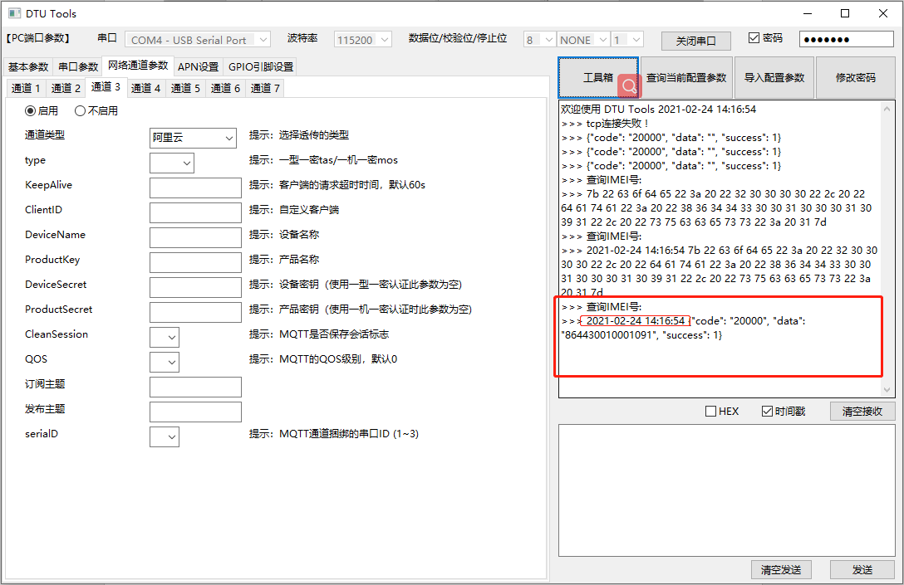

**Clear the reception: Clear the output blanket ** 

### Format demand of input blanket 

**1. Query command ：**

**Query command in condition of no password is needed** 

Input `0 ` and click send. 

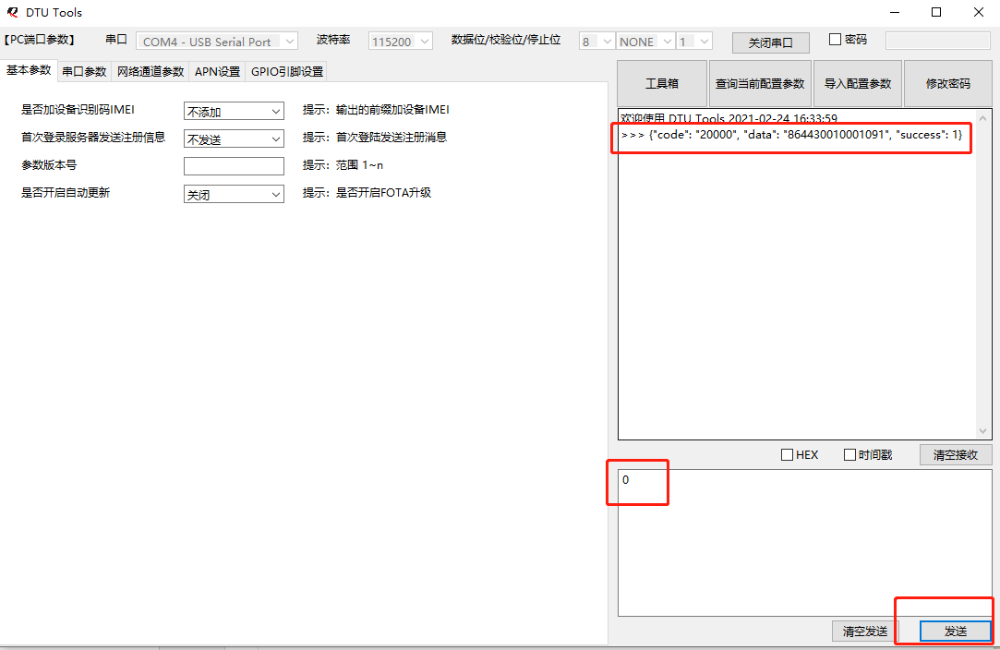

**Query command via password**

2. Input function code beforehand, input password as above blanket then, click "send" correspondingly. 
3. Input function code and **json** data as red blanket shows. 

E. g. `28,1921009046,{"password":"123","data":{}}` 

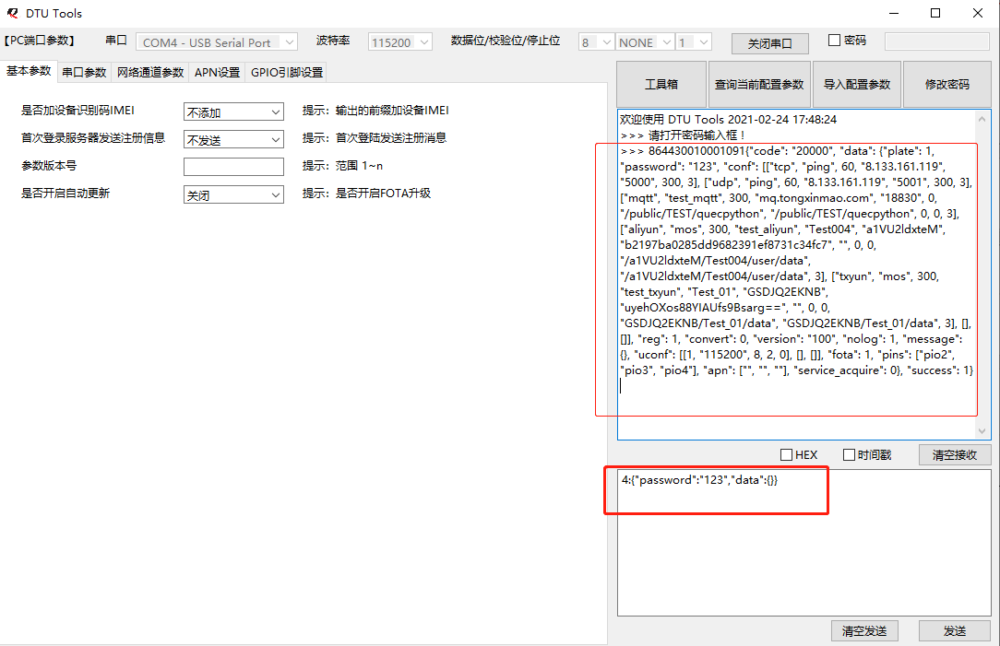

**2. Modify the command to configure parameter**

It is a combination of function code and modified data. 
`47,1564156496,{"password":"123","data":{"apn": ["", "", ""]}}`
The individual field shall be isolated via a colon(:), while the latter content is the modified **json** data. 

Kindly reminder: Under no circumstance that the Chinese character will be allowed in **json** data. 

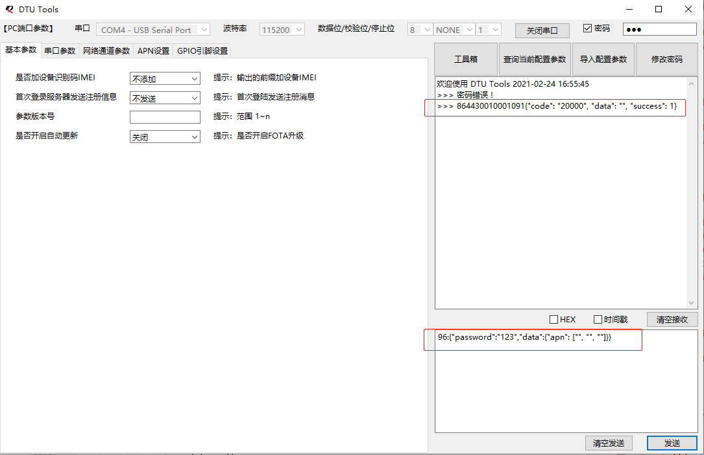

As above figure implies, the returned data is 1, which means the modification is a success. 