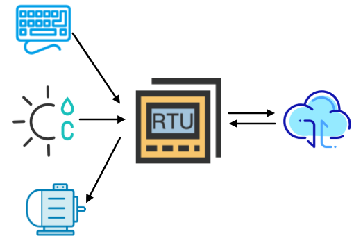
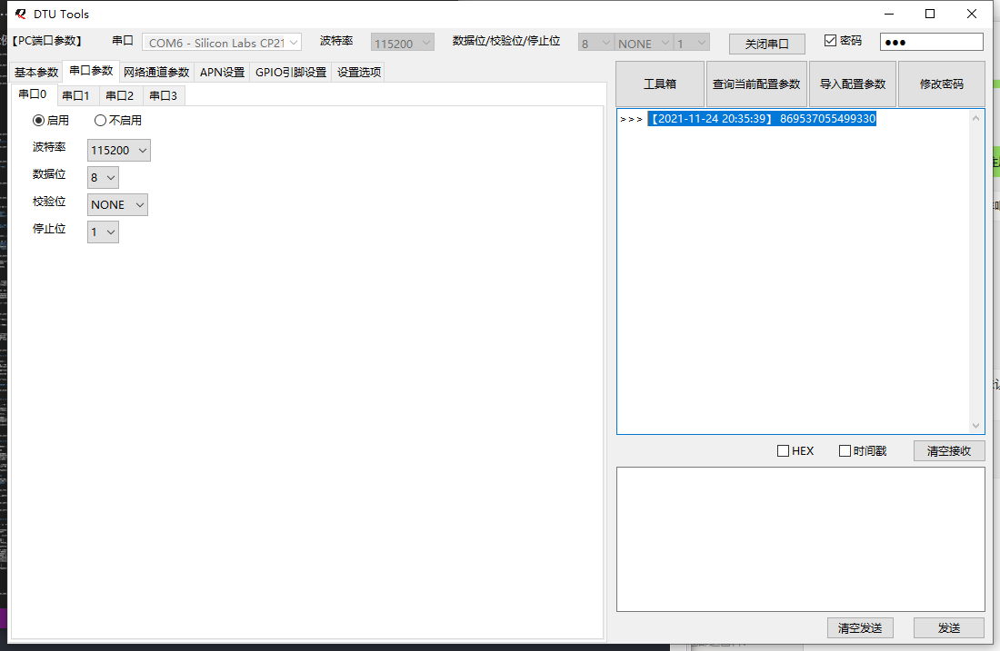
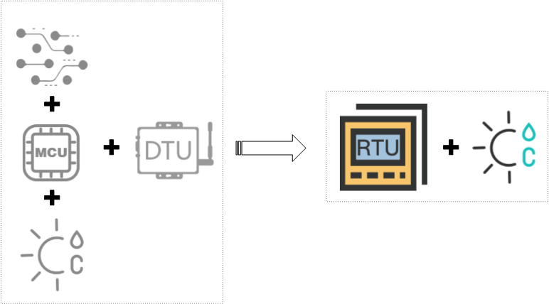

## Revision History

| Version | **Date**   | **Author** | **Description** |
| :------ | ---------- | ---------- | --------------------- |
| 1.0     | 2021-11-25 | Chavis Chen | Initial version |
| 1.1     | 2021-11-30 | Chavis Chen | Added the description on auxiliary components of DTU and service |

## Illustration on DTU

### DTU

- DTU, abbreviation of Data Transfer Unit, is a wireless terminal device specially used for transmitting serial port data from MCU to the server through wireless communication network.
- Service logic: After collecting data, the sensor will send it to MCU, The collected data by MCU via serial port will be transmitted to server with the assist of DTU. Subsequently, the server will analyze, handle, display and save according to the received data. 

### RTU

- The RTU is derived from Remote Terminal Unit. 
- For detailed service logic, it is divided into two parts:  data collection & report as well as remote command control.  
    - Data collection & report: Comply with that on DTU. 
    - Remote command control: The server will deliver control command, once received by RTU, it will trigger and control device to carry out all services. 
- To some extent, the RTU is the combination of DTU and control unit. 
- The DTU illustrated in the following text is equal to RTU. 

### Applicable industry and scenario

- Water resource and hydro-power 
- Exploitation of mineral resources
- Geological disasters monitoring and warning
- Environment protection
- Fire protection and security
- Municipal pipe network 

## DTU as well as its capacity of Quectel 

### Product line

| The modules that supporting DTU currently |
| ----------------------------------------- |
| EC200U_CNLB                               |
| EC200U_EUAB                               |
| EC600U_CNLB                               |
| EC600U_CNLC                               |
| EC600N_CNLA                               |
| EC600N_CNLC                               |
| EC600S_CNLA                               |
| EC600S_CNLB                               |

### Product capacity 

- **2 serial port channels**  
- **The channel supports multiple protocols and Cloud platforms such as HTTP, UDP, MQTT, Aliyun, Tencent Cloud and QuecCloud.**
- **Support transmission of multiple Cloud channels** 
- **Support local and remote parameter configuration** 
- **Support OTA upgrade** 
- **Support data storage in the condition of off-line** 
  - In condition of unstable network, once the transmission is failed, the data will be saved locally temporarily. After the network is repaired, the data in the local will be transmitted to Cloud priorly. 
  - The data saved in off-line can be relied on configuration file. 
- **Support modbus**
- **Support command and transparency modes for sake of the connection of device that does not support modbus.** 
  - In command mode, it supports controlling DTU and reading parameter. In addition, it supports assigning cloud channel and MQTT topic instead of transmitting the same message to all channels or topics. 
  - In transparency mode, each serial port just supports the transparency of single channel, however, it also supports assigning MQTT topic. 
- **Support common used sensor, executive unit and input device.** 
  - Sensors：
  	- Photo-resistor（BH1750、OPT3001、GL5516、GL5528）
  	- 3 axis accelerometer（ADXL346、BMA250、LIS2DH12TR）
  	- Integrated humidity and temperature sensor（HDC1080、HDC2080、AHT10、DHT11）
  	- Ignitable gas sensor 
  	- CO2 gas sensor
  	- GNSS module 
  	- ...

  - Executive unit
    - Power Amplifier 
    - Motor
    - LED
    - LCD（ILI9225、ST7735、ST7789、SSD1306、UC1628）
    - ...

  - Input device 
  	- Microphone 
  	- Camera（GC032A、BF3901）
  	- Matrix keyboard 
  	- ...
- **Support QuecPython, the secondary development can be accomplished by Python codes.**
- **Open various peripheral interfaces such as GPIO, SPI, IIC,PWM for the convenience of peripheral extension.** 

### Auxiliary components and service of product

The auxiliary components and service of DTU in we Quectel are aimed at supporting the prototype authentication and function development of terminal product better. 

#### QuecPython EVB with abundant resources

Equipped with abundant resources, the QuecPython EVB of we Quectel supports photo-resistor, integrated temperature and humidity sensor, microphone interface, LED, LCD interface, Camera interface as well as other peripheral interfaces.  Matched with the GUI mentioned below, the prototype authentication of terminal product can be carried out on QuecPython EVB. 

#### The powerful GUI tool on master computer 

In terms of the function of all units on DTU, the GUI provides corresponding interaction serial ports to debug DTU via PC. It can be considered as the quick prototype authentication before developing terminal product. 

[Download DTU GUI tool ](https://python.quectel.com/download)

#### About QPYcom 

QPYcom is a versatile tool with features of QuecPython repl interaction, file transmission between PC and module, making file system image, packaging and burning FW. 

If there is a need for user to carry out the secondary development of DTU, the development efficiency will be improved heavily by QPYcom. 

[Download QPYcom](https://python.quectel.com/download)

For the user guide of QPYcom, please refer to the  `docs` folder under the installation directory. 

#### Generate configuration file on-line

It is convenient for user to click button or fill in necessary parameters via the DTU platform for sake of generating configuration file on-line quickly. In addition, it supports importing file to the local and on-line upgrade when carrying out configuration file to DTU. 

This function is not available yet. 

### Product advantage 

- **Add command mode. The device can control DTU and send data to DTU actively in this mode.** 

- **Support generating DTU configuration file via web. (Not available yet)**

- **Support GUI on master computer, realize the prototype authentication of device development in a rapid way.** 

- **Support Cloud channel and MQTT Topic selections** 

  - In command mode, the DTU supports transmitting data to assigned cloud channel instead of all channels. By this way, it can save data and reduce garbage. 
  - Channels such as MQTT, Aliyun and Tencent Cloud all support topic selection, while as for DTU, it supports transmitting data to assigned topic. 
  - The channel can be bound to serial port, after that, it will only transmit data to bound serial port. 

- **Add verification mechanism in transparency to guarantee the correctness when uploading data**

  - Dual verification mechanism with serial port communication, meanwhile, it can verify data length and CRC32 (Cyclic Redundancy Check 32). 
  - Verify re-transmission mechanism when failure, it will retransmit even if it is a failure. 

- **The modbus mode is adaptable to command mode, the user can communicate directly.** 

- **The RTU can serve as console, as a result, the MCU can be abandoned. The development cost on HW and SW can be decreased correspondingly.** 

  - The RTU plays the role of console to delete the MCU and peripheral circuits, as a result, the HW cost will be reduced. 

    

  - Carry out secondary development via Python to reduce the cost on SW. 
    
    
    
  - Applicable to multiple modules. When transferring among different modules via Python, there is no need to modify code. 

- **Convenient to extend service**

  - Open various peripheral interfaces such as GPIO, SPI, IIC, PWM and etc for the convenience of peripheral extension. 

- **Powerful customer service and technical support capacity** 

## Working principle of Quectel DTU 

### Command mode 

### Transparency mode 

### Modbus mode 

In modbus mode, there is a need to follow. In addition, it also adhere  to the applicable rules of DTU in industry simultaneously. When the DTU serves as master, it will ask for data and transmit it to cloud from slave device periodically according to the user configuration. 