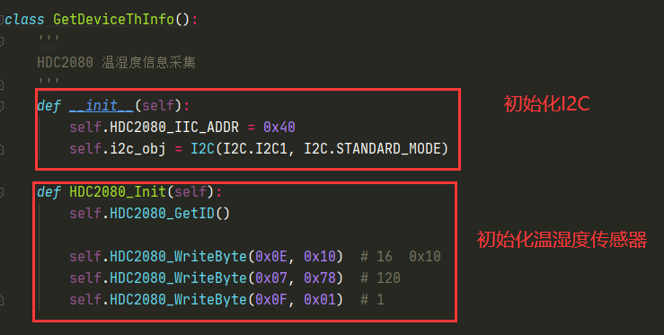

## Revision History

| Version | **Date**   | **Author** | **Description**                   |
| ------- | ---------- | ---------- | --------------------------------- |
| 1.0     | 2021-01-08 | Pawn       | Initial Version                   |
| 1.1     | 2021-09-14 | Pawn       | Updated the code save path（SDK） |

## Preamble

After purchasing our QuenPython and EC600S EVB with temperature and humidity sensor, the client can query the data reported by device on PC more vividly via this system. 

System address: <http://quectracker.quectel.com:8080/>

The system will be reserved regularly. Therefore, you can just take it as a reference in case that some modifications on functions will not comply with that described in this illustration. 

## About running environment and peripherals

### Module series

All tests displayed in this document is based on EC600S, please check the module appearance. 

  

  

#### Adapting sensor 

BMA250E: Accelerometer

HDC2080: Temperature and humidity sensor

OPT3001: Light intensity transmitter

#### FW version

In terms of debugging and developing, it is needed to use the EC600S V0003 or later. 

## Platform operation 

### Register and log in 

#### Enter register surface

Input and enter http://quectracker.quectel.com:8080/ on browser, then click "Register now" button.

  

#### Fill in related info

  

### About function

After login, the default menu displayed is the device list from which you can check your own device list, detailed device via certain conditions and reported data by device. 

  

#### Add device 

In this page, the client can click "Add" button so as to make his own device reserve into system. In addition, the IMEI, name and ICCID of the device should be inputted. 

Among which 

2.  IMEI, with 15 bits, is the unique symbol of communication module that engraved by laser, such as 868681048629412.
4.  The client can define the device name by himself to differentiate various devices; otherwise, it will be IMEI by default. 
6.  ICCID is the 20 numbers of SIM card that plugged into the module. Normally, it will be printed on the surface of the SIM card, such as 89860445041990085958.

**Note: Each client can add at a maximum of 5 devices for free.  **

  

  

#### Check the reported info of device

Click the magnifier icon of certain data operation row of the list surface and you will check the device info, including in device info, moving trace, deviation trace, real-time location, temperature & humidity change and reported history. 

2. Device specification: The latest parameter reported by device, such as temperature, humidity, IoT access number (Corresponding phone number when inserting SIM card), ICCID (Reserved data, if it is not consistent with the reported, take the reported as the principle), volume and SW version. Since there are multiple parameters, if some of which are not reported, there will be a failure to display. 

  

2. Moving trace: Draw out the historical trace on map according to deleted location info, which can be played. 

  

3. Deviation trace: Rectify the trace points to the location of the nearest road. 

  

4. Real time location: It displays the location of the latest time as well as the temperature and humidity info.  Moreover, the exact location address will be assumed according to coordinates on map. 

  

5. Temperature : Draw the temperature change curve in accord with the data reported by device previously to check the abnormality. 

  

6. Humidity:  Draw the humidity change curve in accord with the data reported by device previously to check the abnormality. 

  

7. Report history: Display the unanalyzed message record that reported by device. 

  

### System management

Two functions are enrolled in system management menu: Client management and user management. 

#### Client management

As for registered user, if it is a need to manage the multiple clients on lower level, this function can be available. 

Once the user registered this system, one client record will be recorded by default. In terms of the company name, it should be the info when registering, however,it is also valid to add the company time by client. For details, query the indication of above figure. 

  

#### User management

If there is a need for the same client to login in several accounts, this menu can be used to carry out it, or create account for its subsidiary. For more functions, you can refer to the following figure. 

  

  

### Register and certificate device

#### Download code

[Download code](code/conde.zip)

#### Device registration procedure

Finish the registration procedure via the real case code of registration and certification provided by platform.

1.  Download codes to find out the QuecThing.mpy and quecth.py.

  

2.  Upload the QuecThing.mpy and quecth.py into module via Qpycom and run it, the next figure tells the specific procedure. 

  

As for the devices of the same imei, the repeated registration will be a failure. While the logging in private key returned, once the registration is a success, is used as the device imei. As  a result, it is suggested to save it eternally for the convenience of test. 

#### Illustration of Quecth.py

  

### Report device info

#### Code performance and explanation

1. Three Axis info 

  

  

  

1. Humidity and temperature data

  

  

1. light data

  

  

#### About execution

2. Before that, we should modify the parameter of mqtt connection. In the primary stage, the private key of the device should be configured in "Connect" parameter to get access to cloud. Then, import the connection parameter when initialising mqtt data. 

  

As for getting device and mqttServer, please refer to device registration and certification. 

  

3. Once above procedure is done, import the EC600S_tracker.py into module via QPYcom to run. 

  

#### Query the reported attribute on platform

  

  

  

## Common issues 

2. When it returns failure to register or check the product info when registering device, please check whether the configured product ID and private key are matched.  
4. When the gathered data is empty or failure, there is necessary to check whether the configured sensor parameter is right as it varied in type of sensor. 
6. Once the MQTTEXException:4 occurred when it attempted to get access to cloud, please check whether the configured parameter or the mqtt service address is right. if encounter the failure to analyze domain name, you can try usocket.getaddrinfo() and reattach it. 
8. If there exists characters like {XXXX} on codes, there is a need to configure the placeholder. On the other hand, it is also one kind of formatted output such as {imei}, we should substitute it as the corresponding imei. 
10. Any question on API when checking codes, you can check our the API illustration on our library for more specific info. 
12. Please make sure the successful registration of module is under the circumstance of the mqtt is connected. 
