## 文档历史

**修订记录**

| **版本** | **日期**   | **作者** | **变更表述** |
| -------- | ---------- | -------- | ------------ |
| 1.0      | 2021-09-15 | 许润杰   | 初始版本     |

## 功能介绍

1. 开机联网检测, 网络指示灯切换

2. 服务器连接, 和定时检测服务器状态
3. gpio控制音量加减
4. tts语音播放
5. 查询历史记录
6. 自动注网, 自动重连

## 使用

### 代码获取

- [从我们官网找到云喇叭连接]([下载 (quectel.com)](https://python.quectel.com/download))

- 然后解压, 将`main.txt`转换为`main.py`

### 需要更改的项目代码

#### 设置阿里云服务器参数

- 连接服务器参数
  - 设置项目key
  - 设置秘钥
  - 设备名称
  - 设备秘钥
- 设置topic
  - 订单topic

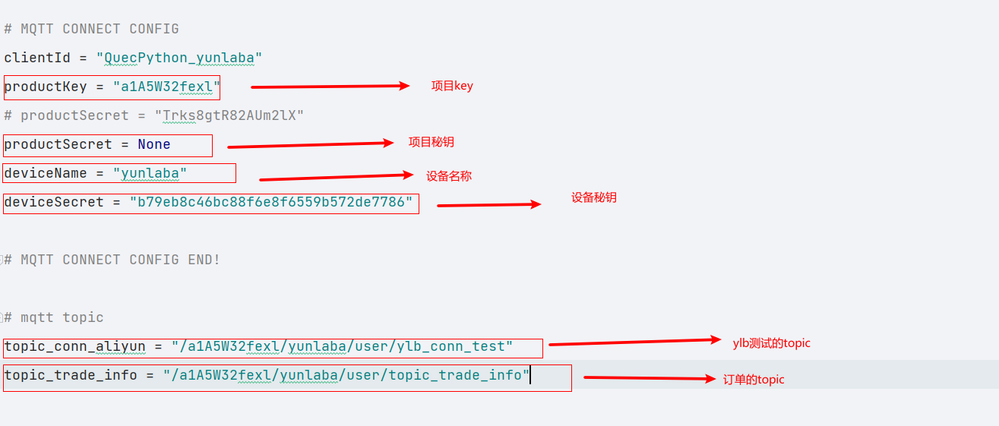

#### 设置按键加减音量

- 模式
  - 默认是音量模式

- 音量模式 key_mode = 0
  - 设置音量+健的gpio, 当gpio有上下边沿事件触发时会音量+模式
  - 设置音量-键的gpio,  当gpio有上下边沿事件触发时会音量-模式
- 历史记录模式 key_mode = 1
  - key_fun有上下边沿事件触发切换时, 会从音量模式切换到历史信息模式
  - 会播报上一比的历史订单记录

#### 设置网络指示灯的GPIO

- 设置网络指示灯的gpio

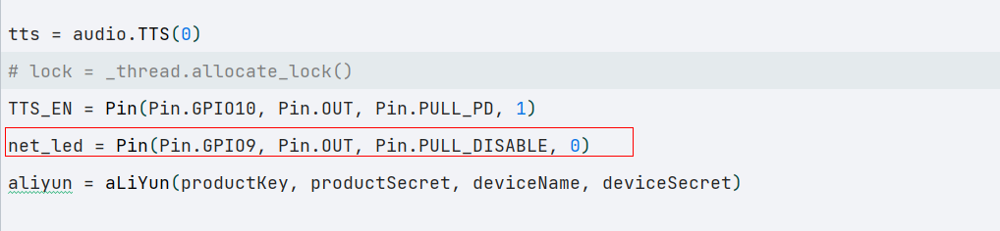

#### 运行代码

在模块中运行main.py代码块

### 云服务器设置

地址[物联网平台 (aliyun.com)](https://iot.console.aliyun.com/product)

#### 创建产品

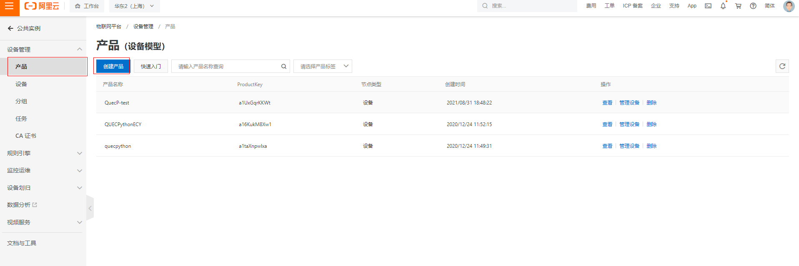

#### 添加设备到对应产品下

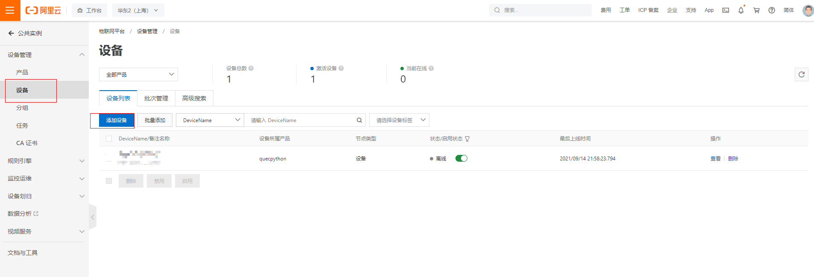

#### 自定义topic

- 查看

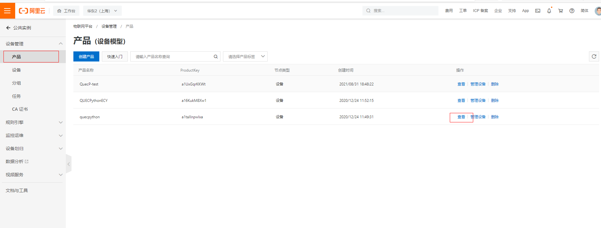

- 自定义topic

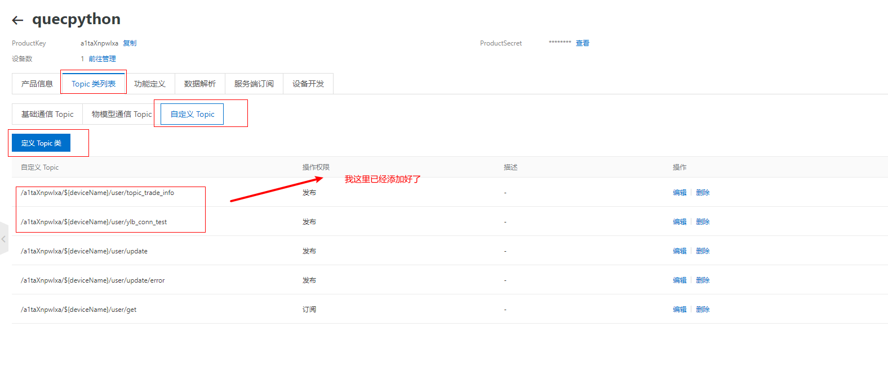

- 编辑

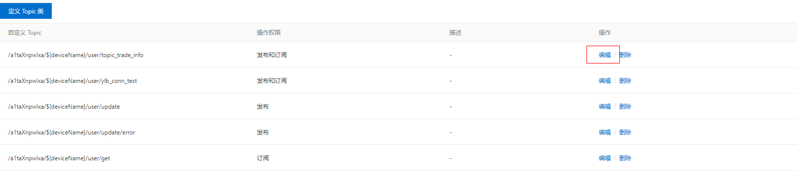

- 权限选择
  - 发布和订阅

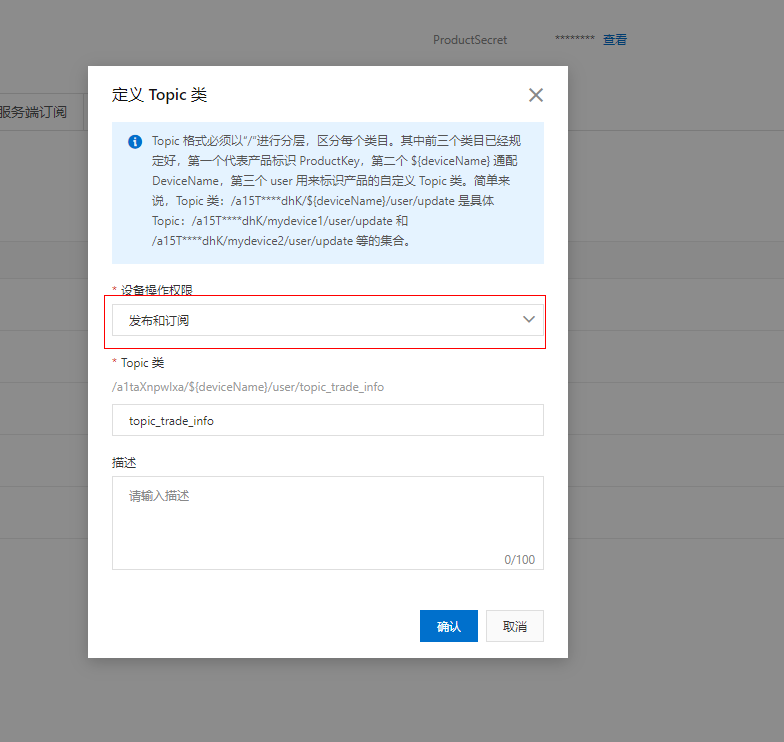

#### 连接成功

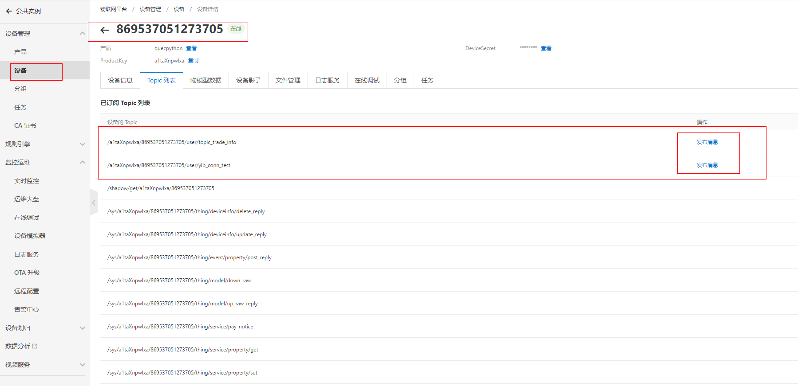

#### 发布消息

- 点击发布

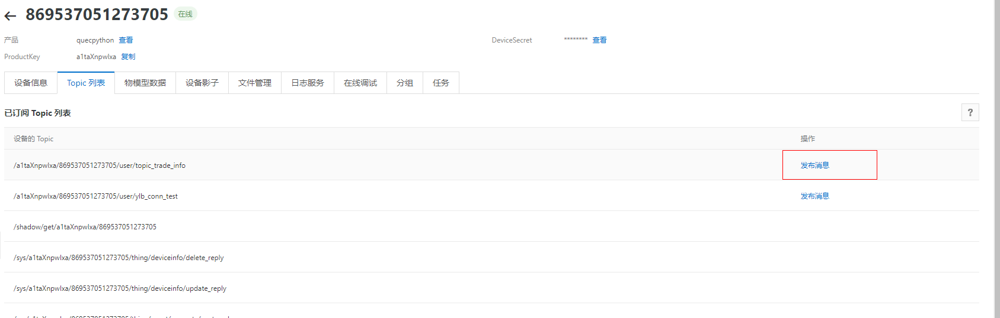

- 下发消息
  - 消息格式
  - {"orderID": 1,"productID": 11111111,"msg": "支付宝到账1000元","PayStatus": 1,"createTime": "2020/10/31 13:45:52"}

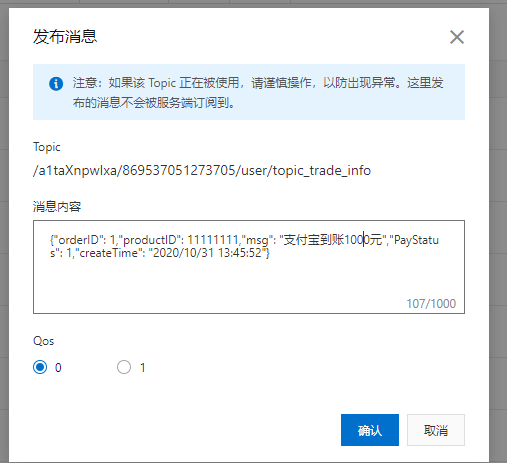

