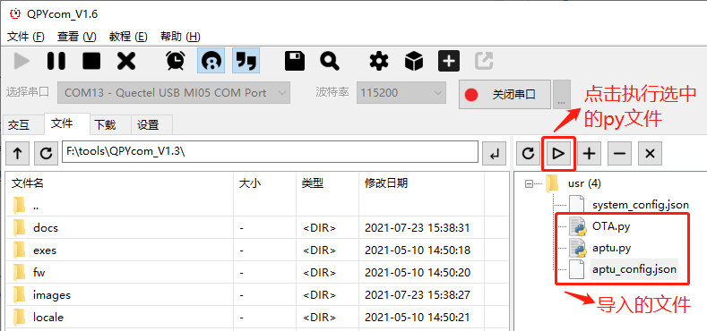

## 文档历史

**修订记录**

| **版本** | **日期** | **作者** | **变更表述** |
| --- | --- | --- | --- |
| 1.0 | 2020-07-27 | 陈驰 | 初始版本 |


## 摘要

本文旨在介绍QuecPython的APTU（Application Packet Transparent Unit，应用报文透传单元）的概念及应用方法。

## APTU简介


### 概念

APTU，全称为Application Packet Transparent Unit，即应用报文透传单元。

APTU以数据透传的方式广泛应用于家电、工业等需要联网的应用场景，只需在生产时将配置文件导入到文件系统即可。

### 脚本文件

APTU功能共3个脚本文件，分别说明如下：

- OTA.py：执行用户文件升级工作；该文件本身也可以被升级
- aptu.py：执行透传业务主逻辑；
- aptu_config.json：配置文件，主要包含UART、网络、服务器、设备信息，及OTA等相关的配置信息。


### 功能

- **通过配置文件配置所有功能的参数**

aptu_config.json文件配置了功能相关的所有参数。

- **开机时事件上报**

开机后，在数传功能准备好或出错时，会 **上报且仅上报一次** 事件通知。

- **数据透传**

APTU以串口作为数据传输链路，来自设备端的串口数据以TCP协议直接透传到服务器；

来自TCP服务器的数据，将直接通过串口透传到设备端。

- **脚本升级**

开机并且网络连通后，会自动检测是否需要升级脚本，当有升级计划时，则会自动升级。

- **自动重连**

当从服务器掉线后，模块会自动重连服务器。

设备端接收到数传功能准备好的通知后，即可开始数传业务。


## 使用方法

### 配置文件

**配置文件内容**

用户需根据自己的项目需求修改配置文件的参数。

配置文件的内容如代码清单1所示，为了方便理解，以下在json文本中添加了#打头的 **不应该存在的注释内容**

代码清单1 aptu_config.json文件内容

{

```json
{
    "UART":{ # 串口相关配置
        "No":2, # 串口号
        "baudRate":9600, # 波特率
        "startBitsLen":1, # 起始位
        "dataBitsLen":8, # 数据位
        "parity":"None", # 奇偶校验，无："None"，奇校验："Odd"，偶校验："Even"
        "stopBitsLen":1, # 停止位
        "flowCtrl":"disable", # 硬件流控，使能："enable"，禁止："disable"
        "significantBit":"least" # LSB
    },
    
    "Network":{ # 网络相关配置
        "timeWaitForOK":30 # 等待自动拨号完成的超时时间，单位s
    },
    
    "Server":{ # 服务器相关配置
        "ipType":"IPv4", # 连接的IP类型，"IPv4"、"IPv6"
        "protocol":"TCP", # 连接的传输层类型，"TCP"、"UDP"
        "domain":"www.baidu.com", # 域名
        "port":80, # 端口
        "keepAlive":{ # 心跳配置
            "useThisItem":"off", # 关闭心跳，打开："on"，关闭："off"
            "parameters":{ # 心跳配置参数
                "keepIdle":60, # 心跳间隔时间，单位s
                "keepInterval":5, # 每次心跳时，心跳包的重发时间间隔，单位s
                "keepCount":3 # 每次心跳时，心跳包的重发次数
            }
        }
    },
    
    "DeviceInfo":{ # 移远云平台上注册的设备信息
        "moduleType":"EC600S-CX", # 模块类型，建议"模块型号-项目名称"的命名方式
        "UID":"305", # 字符串类型，唯一标识符
        "PK":"2bb2a48bd30b6a525a30bc64d8b3d8e0" # 秘钥
    },
    
    "OTA":{ # OTA升级配置
        "autoUpgrade":true # 布尔型，自动升级：true，非自动升级：false
    }
}

```

}

**【注意】**

- 冒号 **左边的** key，严格 **区分大小写** 。
- 冒号 **右边的** value，除了DeviceInfo内部的字段以外，其余字符串类型的值 **不区分大小写** 。
- 由于QuecPython暂时不支持TCP的心跳选项配置，Server.keepAlive.useThisItem的值请设置为off。
- 布尔型的值，均为所有字母小写的true和false。

### 配置文件缺省值

配置文件中，&quot;UART&quot;的&quot;No&quot;和&quot;baudRate&quot;、&quot;Server&quot;的&quot;domain&quot;和&quot;port&quot;是 **必选项** 。

其他非必须项都可以删除，但是代码中会对其做缺省处理，现将缺省行为整理如表1所示：

表1 配置文件缺省行为


上表中：

- 任何字段的字体为黑色时，该字段及其下包含的内容，可从配置文件中删除，使用其缺省值。
- 当黑色字体的字段出现在配置文件中时，其紧邻的下一级的红色字体的字段是必选项。
- 第一列字体为红色的字段，必须出现在配置文件中。
- &quot;Server&quot;对象中不含包&quot;keepAlive&quot;字段时，表示关闭心跳功能。
- &quot;DeviceInfo&quot;和&quot;OTA&quot;对象同时出现，才能开启OTA功能。

### 导入脚本文件

通过QPYcom将三个文件全部导入到模块中。

导入成功后，看到QPYcom工具文件传输页面的右侧栏中增加了下图红框中的三个文件。

选中aptu.py后，点击图1中的执行按钮，即可测试脚本功能。



图1 脚本文件导入方法


### 在业务中调用aptu模块

在业务脚本中添加代码清单2所示的3行代码，即可开启功能：

代码清单2 启动APTU功能

```python
from usr import aptu
aptu_obj = aptu.aptu_cls()
aptu_obj.start()
```

aptu_cls类的对象初始化函数包含两个默认参数，原型如代码清单3所示：

代码清单3 aptu_cls类的对象初始化函数

```python
@classmethod
def __init__(cls, projectName = "APTU", projectVersion = "V1.0.0"):
    try:
        cls.PROJECT_NAME = projectName
        cls.PROJECT_VERSION = projectVersion
        cls.config = cls.__read_config()
        cls.__uart_init()
        cls.__data_call_check()
        cls.__ota_check()
    except Exception as e:
        cls.__exception_handler(e.args[0])
        raise

```

可以看出，缺省的参数分别是项目名称和版本号，业务上根据自己的需要进行填充，默认值分别为&quot;APTU&quot;和&quot;V1.0.0&quot;。


## 事件上报

虽然APTU完全工作与透传模式，但是开机后功能是否正常，是有必要通知到设备端的。

上文已经提及，在数传功能准备好或出错后，会 **上报且仅上报一次** 事件通知。


### 事件上报的格式

事件上报以json文本的格式组织，示例如代码清单4所示：

代码清单4 事件上报的json格式

{

```json
{
    "result": {
        "code": 0,
        "desc": "OK"
    },
    "data": {
        "SN": "D1Q21E2130204660P",
        "IMEI": "861681053233719"
    }
}

```

}

上述文本的json对象包含两个子对象&quot;result&quot;和&quot;data&quot;。

- &quot;result&quot;对象包含两个字段&quot;code&quot;和&quot;desc&quot;，用于报告APTU是否准备好数传功能。
- &quot;data&quot;对象包含两个字段&quot;SN&quot;和&quot;IMEI&quot;，只有当&quot;result&quot;中的&quot;code&quot;值为0时，才会包含&quot;data&quot;对象。

以上各字段的数据类型说明如表2所示：

表2 数据类型说明

| **字段** | **数据类型** |
| --- | --- |
| code | 整数 |
| desc | 字符串 |
| SN | 字符串 |
| IMEI | 字符串 |

### 事件结果释义

&quot;result&quot;对象即为事件的结果通知。

事件的结果释义如表3所示：

表3 事件结果释义

| **code** | **desc** | **mark** |
| --- | --- | --- |
| 1 | OTA plain comes | 有新版待更新，模块报出此通知后，会自动重启升级至新版本 |
| 0 | OK | 数传准备好，可以开始传输数据 |
| -1 | config error | 配置文件错误 |
| -2 | net error | 网络错误 |
| -3 | socket create error | socket创建失败 |
| -4 | socket option set error | socket选项设置失败 |
| -5 | socket connect error | 服务器连接失败 |
| -6 | DNS error | 域名解析失败 |
| -7 | UART error | 串口操作失败 |
| -8 | sys error | 系统级别错误 |

