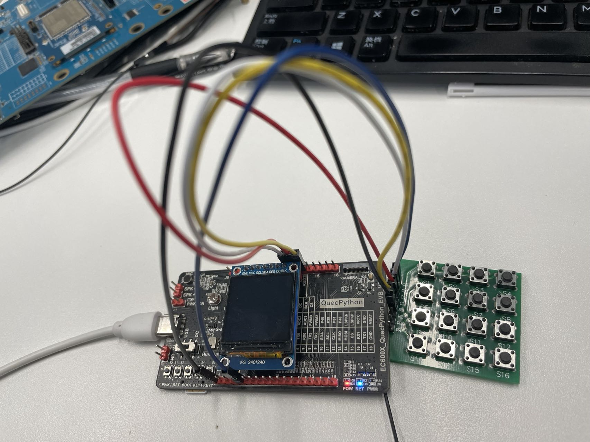
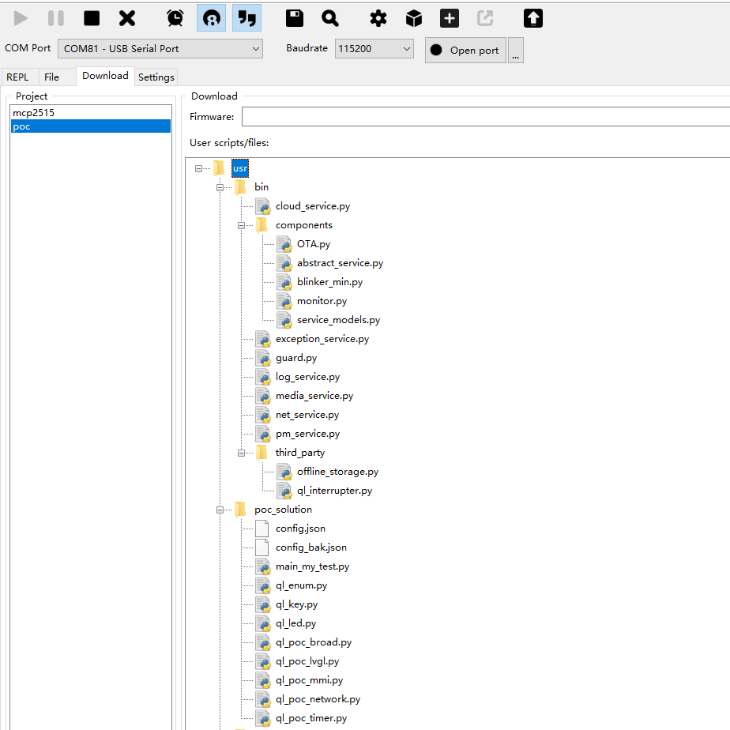
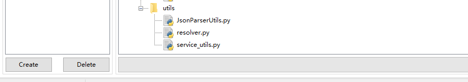
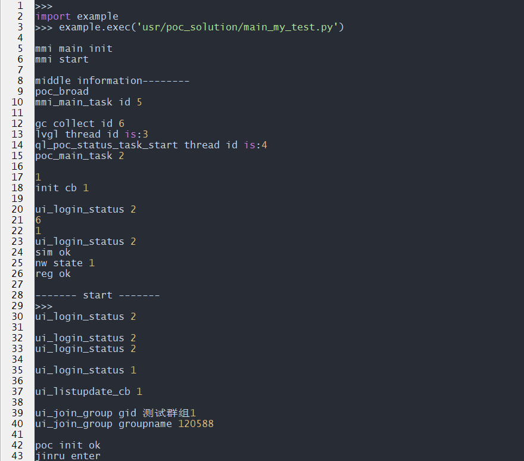
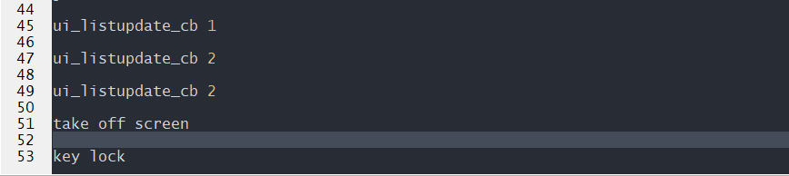
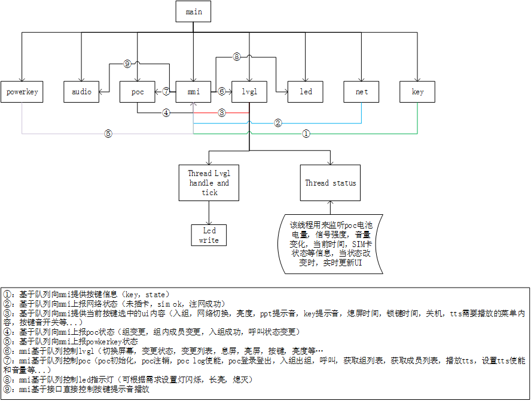

## 修订历史

| Version | **Date**   | **Author** | **Change expression**                        |
| :------ | ---------- | ---------- | -------------------------------------------- |
| 1.0     | 2021-09-29 | felix      | 初始版本                                     |
| 1.1     | 2022-02-09 | felix      | 第二版（增加结合quecpython开发板的使用步骤） |

## 引言

本文档基于Helios_service 框架对POC各个组件进行说明。


## 基于quecpython开发板实现POC解决方案步骤

### 1.固件选择

​		目前POC只针对 EC600N EC600S 对应系类推出定制固件。客户可基于该类固件开发POC功能。

​		烧录poc定制固件，该固件仅适用于学习，不可量产。（量产请联系移远）

​		[EC600NCN_LC POC固件地址](https://gitee.com/qpy-solutions/poc/blob/master/EC600NCNLCR01A01M16_OCPU_QPY_POC_BETE220209.rar)

### 2.平台注册

​		目前POC仅支持善里和伯纳德平台，客户可以自行选择。

​		客户提供sim卡的ICCID号给移远，移远将对应的sim卡加入客户选择的平台。

​		必须进行平台注册，否则无法进行正常的对讲功能。

### 3.硬件接线

结合ql_key.py中对引脚的定义：

```
KEY_MENU = Pin.GPIO13	==》引脚号：60 	==》开发板KEY1 	==》菜单和确认按钮
KEY_EXIT = Pin.GPIO12	==》引脚号：59	==》开发板KEY2	==》退出和解锁按钮
KEY_UP = Pin.GPIO11		==》引脚号：58	==》开发板PIN58	==》上翻按钮
KEY_DOWN = Pin.GPIO8	==》引脚号：39 	==》开发板PIN39	==》下翻按钮
KEY_VOL_UP = Pin.GPIO14	==》引脚号：61	==>开发板PIN61	 ==》音量＋按钮
KEY_PTT = Pin.GPIO10	==》引脚号：48	==>开发板PIN48	==》对讲按钮
```

实物图：



### 4.烧录脚本

获取脚本：[poc_solution脚本](https://gitee.com/qpy-solutions/poc)

使用QPYcom烧录poc_solution和helios_servier脚本,如图所示：





注：详细的qpycom操作请参考相关文档说明（[QPYcom使用说明](https://python.quectel.com/doc/doc/Advanced_development/zh/QuecPythonTools/QPYcom.html)）

### 5.运行脚本，实机操作

​		执行poc_solution目录下 main_my_test.py。

​		执行效果如下：





### 6.UI界面介绍

#### 1.按键介绍

​		上述烧录的固件中，开发板上 

​				KEY1对应菜单和确认按钮。

​				KEY2对应退出和解锁按钮。

​				PIN58对应上翻按钮。

​				PIN39对应下翻按钮。

​				PIN61对应音量＋按钮。

​				PIN48对应对讲按钮。

#### 2.视频界面演示

​			以下视频对应该脚本的实物演示

<video id="video" controls="" preload="none"> <source id="mp4" src="./media/poc_show_1.mp4" type="video/mp4"> </video>


## 基于POC_solution二次开发

### 模块说明

​		目前POC只针对 EC600N EC600S 对应系类推出指定固件。客户可基于该类固件开发POC功能。

​		关于poc 接口请参考wiki poc部分

​		后续会将给POC相关内容移植至HeliosSDK。


### 资源说明

​		POC对讲机主要资源消耗分为统计如下：

​		（1）POC库本身消耗的资源。 RO:600KB

​		（2）LVGL消耗的资源。 RO:500KB（主要时字体库消耗和dispbuf）

​		（3）LCD屏幕消耗。heap (水平分辨率\*垂直分辨率\*2)

​		（4）对讲时audio消耗的heap (100K)


### 硬件配置

​		目前我们POC支持两种平台，伯纳德和善里。	

​		sim卡：使用quecpython POC功能，需将sim 加入指定的上述平台（联系我们即可）。否则无法注册成功。

​		LCD：使用POC功能，一般会搭配GUI使用，故需要一款屏幕。屏幕驱动的内容可参考（[LCD使用说明](https://python.quectel.com/doc/doc/sbs/zh/sbs/lcd.html)）

​		KEY：一款对讲机，需要进行按键控制。

​		

### 软件组件说明

​		POC对讲机solution分为如下7个组件：

​		（1）mmi :  主控，接收并处理各个组件的消息，充当消息收集处理中心。

​		（2）key:	监听按键状态，上报按键状态至mmi（key:按键功能 state：按键状态（长按，按下，释放））

​		（3）led:	反应设备状态，由mmi控制

​		（4）net:	检测sim和注网状态，将状态上报至mmi

​		（5）broad:	实现poc对讲机功能和tts播放

​		（6）LVGL:	实现对屏幕的驱动以及gui的绘制

​		（7）Timer: 	定时器。提供相关定时功能，为需要定时控制的组件服务。例如控制息屏，键盘锁等。


​		对应分成如下11个线程（线程之间通过队列实现通信）



### 实物演示

​		以下视频分别为彩色屏（st7789）和 黑白屏（uc1603）的实物演示

<video id="video" controls="" preload="none"> <source id="mp4" src="./media/poc_show_1.mp4" type="video/mp4"> </video>


<video id="video" controls="" preload="none"> <source id="mp4" src="./media/poc_show_2.mp4" type="video/mp4"> </video>

### POC_solution目录结构说明

```
usr																		    # 用户分区
├─main.py 																	# 用户代码（程序入口）
├─bin																		# 脚本和启动器（下面放着一些共有服务和一些公有的组件）
│  ├─cloud_service.py														  # 云服务组件
│  ├─exception_service.py       											   # 异常服务组件
│  ├─guard.py                   									            # 全局监控和配置文件的启动容器
│  ├─log_service.py             								       		    # 日志服务组件
│  ├─media_service.py           							  				    # 媒体服务组件
│  ├─net_service.py             								 			    # 网络服务组件
│  ├─pm_service.py              	    										# 低功耗服务组件
│  └─components                 								 				# 该目录下存放一些公共组件
│  │   ├─abstract_service.py   							  						# 服务抽象类
│  │   ├─blinker_min.py        								 					
│  │   ├─monitor.py            													
│  │   ├─OTA.py                													# OTA升级组件
│  │   └─service_models.py     							 						# 服务模型基类
│  └─third_party                											
│       ├─ql_interrupter.py   								   					# 第三方服务组件,外部中断/看门狗等
│       └─ ...
├─etc                            												# 配置文件目录（非必须存在）
│   ├─app_config                												# app业务服务配置文件目录
│   └─system_config             												# 系统服务配置文件目录
├─log                            												# 日志存储服务（非必须存在，选择日志存储为本地时自动创建）
└─utils                            												# 通用工具目录
│  ├─JsonParserUtils.py          												# josn处理utils
│  ├─resolver.py                												# 时间格式化处理器
│  └─service_utils.py             												# 单例模式类实现
|
|
└─poc_solution                            										# poc solution文件目录
│  ├─config.json          														# 配置文件，保存一些亮度值，音量值等信息
│  ├─config_bak.py                												# 配置文件备份
│  └─ql_enum.py 																# solution 一些公共变量
│  └─ql_key.py 																	# solution 按键实现组件
│  └─ql_led.py 																	# solution led实现组件
│  └─ql_poc_broad.py 															# solution 对讲机功能实现组件
│  └─ql_poc_lvgl.py 															# solution GUI绘制和联动组件
│  └─ql_poc_mmi.py 																# solution 中央控制器组件
│  └─ql_poc_network.py 															# solution 网络组件
│  └─ql_poc_timer.py 															# solution 定时器组件
│  └─ ...

```


### 二次开发

#### 1.如何添加LCD

​		（1）编写对应LCD的驱动，具体参考（[LCD使用说明](https://python.quectel.com/doc/doc/Advanced_development/zh/QuecPythonSub/LCD.html)）

​		（2）直接替换LVGL组件中的LCD相关代码。

​					1. 将lvgl组件中的初始化参数替换

​					2. 将lvgl组件中的写屏参数替换

​					3. 将lvgl组件中的息屏，亮屏参数替换

​					4. 将lvgl组件中的屏幕分包率替换

​	举例：如将屏幕st7789 替换为 ILI9225

​		左侧为st7789 240X240, 右侧为ILI9225 176X220

| #ST7789<br />lcd_init_param=( <br/>2, 0, 120,<br/>0, 0, 0x11,<br/>0, 1, 0x36,<br/>1, 1, 0x00,<br/>0, 1, 0x36,<br/>1, 1, 0x00,<br/>0, 1, 0x3A,<br/>1, 1, 0x05,<br/>0, 0, 0x21,<br/>0, 5, 0xB2,<br/>1, 1, 0x05,<br/>1, 1, 0x05,<br/>1, 1, 0x00,<br/>1, 1, 0x33,<br/>1, 1, 0x33,<br/>0, 1, 0xB7,<br/>1, 1, 0x23,<br/>0, 1, 0xBB,<br/>1, 1, 0x22,<br/>0, 1, 0xC0,<br/>1, 1, 0x2C,<br/>0, 1, 0xC2,<br/>1, 1, 0x01,<br/>0, 1, 0xC3,<br/>1, 1, 0x13,<br/>0, 1, 0xC4,<br/>1, 1, 0x20,<br/>0, 1, 0xC6,<br/>1, 1, 0x0F,<br/>0, 2, 0xD0,<br/>1, 1, 0xA4,<br/>1, 1, 0xA1,<br/>0, 1, 0xD6,<br/>1, 1, 0xA1,<br/>0, 14, 0xE0,<br/>1, 1, 0x70,<br/>1, 1, 0x06,<br/>1, 1, 0x0C,<br/>1, 1, 0x08,<br/>1, 1, 0x09,<br/>1, 1, 0x27,<br/>1, 1, 0x2E,<br/>1, 1, 0x34,<br/>1, 1, 0x46,<br/>1, 1, 0x37,<br/>1, 1, 0x13,<br/>1, 1, 0x13,<br/>1, 1, 0x25,<br/>1, 1, 0x2A,<br/>0, 14, 0xE1,<br/>1, 1, 0x70,<br/>1, 1, 0x04,<br/>1, 1, 0x08,<br/>1, 1, 0x09,<br/>1, 1, 0x07,<br/>1, 1, 0x03,<br/>1, 1, 0x2C,<br/>1, 1, 0x42,<br/>1, 1, 0x42,<br/>1, 1, 0x38,<br/>1, 1, 0x14,<br/>1, 1, 0x14,<br/>1, 1, 0x27,<br/>1, 1, 0x2C,<br/>0, 0, 0x29,<br/>0, 1, 0x36,<br/>1, 1, 0x00,<br/>0, 4, 0x2a,<br/>1, 1, 0x00,<br/>1, 1, 0x00,<br/>1, 1, 0x00,<br/>1, 1, 0xef,<br/>0, 4, 0x2b,<br/>1, 1, 0x00,<br/>1, 1, 0x00,<br/>1, 1, 0x00,<br/>1, 1, 0xef,<br/>0, 0, 0x2c,<br/>)<br />lcd_invalid_param = (<br/>0,4,0x2a,<br/>1,1,XSTART_H,<br/>1,1,XSTART_L,<br/>1,1,XEND_H,<br/>1,1,XEND_L,<br/>0,4,0x2b,<br/>1,1,YSTART_H,<br/>1,1,YSTART_L,<br/>1,1,YEND_H,<br/>1,1,YEND_L,<br/>0,0,0x2c,<br/>)<br/><br/>lcd_displayon_param = (<br/>0,0,0x11,<br/>2,0,20,<br/>0,0,0x29,<br/>)<br/><br/>lcd_displayoff_param = (<br/>0,0,0x28,<br/>2,0,120,<br/>0,0,0x10,<br/>)<br /># 分辨率<br/>LCD_SIZE_W = 240<br/>LCD_SIZE_H = 240 | ILI9225<br />lcd_init_param=( <br/>2, 0, 120,<br/>0,1,0x02,<br/>1,2,0x01,0x00,<br/>0,1,0x01,<br/>1,2,0x01,0x1C,<br/>0,1,0x03,<br/>1,2,0x10,0x30,<br/>0,1,0x08,<br/>1,2,0x08,0x08,<br/>0,1,0x0B,<br/>1,2,0x11,0x00,<br/>0,1,0x0C,<br/>1,2,0x00,0x00,<br/>0,1,0x0F,<br/>1,2,0x14,0x01,<br/>0,1,0x15,<br/>1,2,0x00,0x00,<br/>0,1,0x20,<br/>1,2,0x00,0x00,<br/>0,1,0x21,<br/>1,2,0x00,0x00,<br/>0,1,0x10,<br/>1,2,0x08,0x00,<br/>0,1,0x11,<br/>1,2,0x1F,0x3F,<br/>0,1,0x12,<br/>1,2,0x01,0x21,<br/>0,1,0x13,<br/>1,2,0x00,0x0F,<br/>0,1,0x14,<br/>1,2,0x43,0x49,<br/>0,1,0x30,<br/>1,2,0x00,0x00,<br/>0,1,0x31,<br/>1,2,0x00,0xDB,<br/>0,1,0x32,<br/>1,2,0x00,0x00,<br/>0,1,0x33,<br/>1,2,0x00,0x00,<br/>0,1,0x34,<br/>1,2,0x00,0xDB,<br/>0,1,0x35,<br/>1,2,0x00,0x00,<br/>0,1,0x36,<br/>1,2,0x00,0xAF,<br/>0,1,0x37,<br/>1,2,0x00,0x00,<br/>0,1,0x38,<br/>1,2,0x00,0xDB,<br/>0,1,0x39,<br/>1,2,0x00,0x00,<br/>0,1,0x50,<br/>1,2,0x00,0x01,<br/>0,1,0x51,<br/>1,2,0x20,0x0B,<br/>0,1,0x52,<br/>1,2,0x00,0x00,<br/>0,1,0x53,<br/>1,2,0x04,0x04,<br/>0,1,0x54,<br/>1,2,0x0C,0x0C,<br/>0,1,0x55,<br/>1,2,0x00,0x0C,<br/>0,1,0x56,<br/>1,2,0x01,0x01,<br/>0,1,0x57,<br/>1,2,0x04,0x00,<br/>0,1,0x58,<br/>1,2,0x11,0x08,<br/>0,1,0x59,<br/>1,2,0x05,0x0C,<br/>0,1,0x07,<br/>1,2,0x10,0x17,<br/>0,1,0x22,<br/>)<br />lcd_invalid_param = (<br/>0,1,0x36,<br/>1,2,XEND,<br/>0,1,0x37,<br/>1,2,XSTART,<br/>0,1,0x38,<br/>1,2,YEND,<br/>0,1,0x39,<br/>1,2,YSTART,<br/>0,1,0x20,<br/>1,2,XSTART,<br/>0,1,0x21,<br/>1,2,YSTART,<br/>0,1,0x22,<br/>)<br/><br/>lcd_displayon_param = (<br/>0,1,0x07,<br/>1,2,0x10,0x17,<br/>)<br/><br/>lcd_displayoff_param = (<br/>0,1,0x07,<br/>1,2,0x10,0x04,<br/>)<br /># 分辨率<br/>LCD_SIZE_W = 176<br/>LCD_SIZE_H = 220 |
| ------------------------------------------------------------ | ------------------------------------------------------------ |


#### 2.如何添加KEY

​		添加按键简单，但是要写好按键对应的功能项。

​		添加按键步骤：

​		（1）：确定按键号，按键功能

​		（2）：处理按键功能

举例如下：

​		添加PTT按键

​		（1）：PTT 对应GPIO14, 实现呼叫

​					例如：KEY_PTT = Pin.GPIO14

​					即在ql_key.py 中的 key_value 写入对应值。

```
key_value = [
    (KEY_MENU, QUEC_MMI_KEY_MENU),
    (KEY_EXIT, QUEC_MMI_KEY_EXIT),
    (KEY_UP, QUEC_MMI_KEY_PF1),
    (KEY_DOWN, QUEC_MMI_KEY_PF2),
    (KEY_VOL_UP, QUEC_MMI_KEY_VOL_UP),
    (KEY_PTT, QUEC_MMI_KEY_PTT),		#加上这一行即可
]
```


​		（2）：第二步中上报了KEY_PTT 至 MMI中控，需要在中控中控制对应的按键功能

​				在ql_enum.py 中确定PTT 的位置，如果没有，可以添加。

```
QUEC_MMI_KEY_NULL = 0
QUEC_MMI_KEY_MENU = 1
QUEC_MMI_KEY_OK = 2
QUEC_MMI_KEY_EXIT = 3
QUEC_MMI_KEY_PF1 = 4
QUEC_MMI_KEY_PF2 = 5
QUEC_MMI_KEY_PTT = 6
QUEC_MMI_KEY_EXT_PTT = 7
QUEC_MMI_KEY_VOL_UP = 8
QUEC_MMI_KEY_VOL_DWON = 9
QUEC_MMI_KEY_MAX = 9
```

​				

​				在ql_poc_mmi.py 中，添加按键的处理内容	

```python
    def mmi_key_ptt(self,para):
        if(para[1] == MMI_MSG_FUNC_KEY_PRESS):
            print("call ...")
            self.ON_SPEAK = 1
            key_to_lvgl_data=[LVGL_CONTROL_STATUE_CHANGE, LVGL_CONTROL_STATUS_CALL, "呼叫中"]
            ui.lvgl_queue_put(key_to_lvgl_data)
            key_to_poc_data=[MSG_TYPE_STACK, POC_CONTROL_SPEAK, 1]
            poc.broad_queue_put(key_to_poc_data)
            quec_mmi_led_set(QUEC_MMI_LED_RED)
            #ql_led.
        elif(para[1] == MMI_MSG_FUNC_KEY_UP):
            print("kongxian")
            self.ON_SPEAK = 0
            key_to_lvgl_data=[LVGL_CONTROL_STATUE_CHANGE, LVGL_CONTROL_STATUS_CALL, "空闲"]
            ui.lvgl_queue_put(key_to_lvgl_data)
            key_to_poc_data=[MSG_TYPE_STACK, POC_CONTROL_SPEAK, 0]
            poc.broad_queue_put(key_to_poc_data)
            quec_mmi_led_set(QUEC_MMI_LED_GREEN_FLASHING)
```


​			将按键处理函数按ql_enum.py中的位置，添加至ql_poc_mmi.py中的self.mmi_key_handle_func_list 中，例如下面内容

​			PPT对应QUEC_MMI_KEY_PTT = 6， 故PPT的处理函数对应mmi_key_handle_func_lis[QUEC_MMI_KEY_PTT ]

```python
        self.mmi_key_handle_func_list = (
            None, self.mmi_key_memu, None, self.mmi_key_exit, self.mmi_key_pf1, self.mmi_key_pf2, self.mmi_key_ptt,
            None, self.mmi_key_vol_up, self.mmi_key_vol_down
        )
```


#### 3.注册平台	

​		目前平台是基于固件的，固件是伯纳德平台，则代码注册的就是伯纳德平台。同理，固件是善里平台，则代码注册的就是善里的平台。

#### 4.如何修改GUI

​			添加GUI是POC中比较复杂的内容。其中涉及到当前界面各组件的变化，以及和按键之间的联动等。

​			简单介绍该poc solution中的各个界面的层级关系

```
#  MenuIndex:菜单索引      MasterMenu：父菜单索引      MasterItem：父菜单项索引     MenuTitle：菜单标题     MenuConfig：菜单配置    ItemIndex：菜单项索引 ItemTitle:菜单项名
#  MenuConfig[0]:菜单项数目    
#  MenuConfig[1]：需要操作的组件（为空则默认组件为roller）
#  MenuConfig[2]：UP功能函数(为空则默认组件为roller,采用UP公共函数) 
# MenuConfig[3]：DOWN功能函数(为空则默认组件为roller,采用UP公共函数) 
# MenuConfig[4]：ENTER功能函数(为None则走公共的enter方法)
# MenuConfig[5]：EXIT功能函数(为None则走公共的enter方法)

self.Menus = [
{'MenuIndex': MENU_WELCOME, 'MenuObj': None, 'MasterMenu': None, 'MasterItem': None, 'MenuTitle': "初始化界面", 
'MenuConfig': [0, None, None, None, self.ql_poc_switch_init_to_home_screen,self.ql_poc_switch_init_to_home_screen], 
"ItemIndex" : None, 'ItemTitle':None},

{'MenuIndex': MENU_MAIN, 'MenuObj': None, 'MasterMenu': None, 'MasterItem': None, 'MenuTitle': "main界面", 
'MenuConfig': [1, None, None, None, self.ql_poc_switch_home_to_main_menu_screen, None], 
"ItemIndex" : [MENU_MENU], 'ItemTitle':None},

{'MenuIndex': MENU_MENU, 'MenuObj': None, 'MasterMenu': MENU_MAIN, 'MasterItem': None, 'MenuTitle': "menu界面", 
'MenuConfig': [4, None, None, None, self.ql_poc_switch_main_menu_enter_handle, self.ql_poc_switch_main_menu_to_home_screen], 
"ItemIndex" : [MENU_PUBLIC], 'ItemTitle' : None},

#主菜单以下的菜单
{'MenuIndex': MENU_PUBLIC, 'MenuObj': None, 'MasterMenu': MENU_MENU, 'MasterItem': None, 'MenuTitle': "公共设置", 
'MenuConfig': [1, None, None, None, self.ql_poc_switch_public_menu_enter_handle, self.ql_poc_switch_public_menu_exit_handle], 
"ItemIndex" : None, 'ItemTitle':None},

{'MenuIndex': MENU_ABOUT, 'MenuObj': None, 'MasterMenu': MENU_MENU, 'MasterItem': None, 'MenuTitle': "关于本机", 
'MenuConfig': [1, None, None, None, None, self.ql_poc_switch_loacl_informations_to_main_menu_screen], 
"ItemIndex" : None, 'ItemTitle':None},


{'MenuIndex': MENU_POWEROFF, 'MenuObj': None, 'MasterMenu': MENU_MENU, 'MasterItem': None, 'MenuTitle': "关机界面", 
'MenuConfig': [0, None, None, None, self.ql_poc_poweroff_OK_handle, self.ql_poc_switch_poweroff_to_home_screen], 
"ItemIndex" : None, 'ItemTitle':None},
]
```

从该列表中，可以看出各个界面直接是如何通信联动，以及之间的层级关系。以PUBLIC 界面为例。

从字典MenuIndex中可以看出PUBLICde 索引号为MENU_PUBLIC。（该值用于实际操作中找到对应的界面）

MenuObj 表示这个界面lvgl obj

MasterMenu中可以看出，PUBLIC的父菜单为Main。

MasterItem表示PUBLIC在 父菜单的菜单项索引。目前solution中未使用，留着备用

MenuTitle 表示PUBLIC的一个标题。这个在solution中有重要作用。

MenuConfig 这个体现该界面的一些具体的操作方法。

​		MenuConfig[0]:菜单的菜单项数目

​		MenuConfig[1]：需要操作的组件（为空则默认组件为roller）,这个是上翻下翻的操作对象

​		MenuConfig[2]：UP功能函数(为空则默认组件为roller,采用UP公共函数)

​		MenuConfig[3]：DOWN功能函数(为空则默认组件为roller,采用UP公共函数)

​		MenuConfig[4]：ENTER功能函数(为None则走公共的enter方法)

​		MenuConfig[5]：EXIT功能函数(为None则走公共的enter方法)

ItemIndex ItemTitle在solution中未体现，留着备用


完成一个界面的绘制需要如下几个步骤。

​			具体操作步骤如下：（以关机界面举例，其它例子类推）

​			（1）完成上述列表中的关机界面字典

​			（2）绘制关机界面,同步上述字典中的数值

​			（3）确定关机界面进入和退出动作

​			（4）编写关机界面OK操作函数

​			（5）编写如何进入关机界面

（以关机界面举例，其它例子类推）

​			（1）编写关机界面字典项

```
{'MenuIndex': MENU_POWEROFF, #关机界面索引号
'MenuObj': None, 			#关机界面 lvgl obj
'MasterMenu': None, 		# 无父界面
'MasterItem': None, 		#无父菜单项索引
'MenuTitle': "关机界面", 	#界面label
'MenuConfig': [0, None, None, None, self.ql_poc_poweroff_OK_handle, self.ql_poc_switch_poweroff_to_home_screen], 
			#界面无操作组件，即上下翻无效
			#界面按下OK 界面对应的处理 self.ql_poc_poweroff_OK_handle
			#界面按下exit,界面对应的处理 self.ql_poc_switch_poweroff_to_home_screen
"ItemIndex" : None, 'ItemTitle':None}, # 未使用
```

​			（2）绘制界面			

```python
    def ql_poc_poweroff_screen_create(self):
        poweroff_screen = lv.obj(self.middle_obj)
        poweroff_screen.set_style(self.g_poc_style_plain_16)
        poweroff_screen.set_size(LCD_SIZE_W,int(LCD_SIZE_H*0.625))
        # self.poweroff_screen = poweroff_screen
        poweroff_item_Menu = self.getMenusByIndex(MENU_POWEROFF)	#同步menu表对应MenuObj 
        poweroff_item_Menu['MenuObj'] = poweroff_screen


        poweroff_label = lv.label(poweroff_screen)
        poweroff_label.set_style(lv.label.STYLE.MAIN,self.g_poc_style_plain_16)
        poweroff_label.set_text("警告")
        poweroff_label.set_pos(int((LCD_SIZE_W- poweroff_label.get_width())/2), int(LCD_SIZE_H*0.025))

        poweroff_information_label = lv.label(poweroff_screen)
        poweroff_information_label.set_style(lv.label.STYLE.MAIN,self.g_poc_style_plain_16)
        poweroff_information_label.set_text("是否确认关机！！！")
        poweroff_information_label.set_long_mode(lv.label.LONG.SROLL_CIRC)
        poweroff_information_label.set_align(lv.label.ALIGN.CENTER)
        poweroff_information_label.set_pos(0, int(LCD_SIZE_H*0.31))
        poweroff_information_label.set_size(LCD_SIZE_W, int(LCD_SIZE_H*0.44))
        self.poweroff_information_label = poweroff_information_label
```

​				（3）确定关机界面进入和退出

```python
    # 进入关机界面
    def ql_poc_switch_to_poweroff_screen(self):
        active_item_Menu = self.getMenusByIndex(self.Active_Index)	#找到当前活动界面的字典项
        poweroff_item_Menu = self.getMenusByIndex(MENU_POWEROFF)	#找到关机界面的字典项

        lv.obj.set_hidden(active_item_Menu['MenuObj'], True)	#隐藏当前活动界面
        lv.obj.set_hidden(poweroff_item_Menu['MenuObj'], False)	#进入关机界面

        self.current_menu_label = poweroff_item_Menu['MenuTitle']	#同步当前界面标题
        self.Active_Index = MENU_POWEROFF		#同步当前界面的索引号
    
    # 关机界面返回
    def ql_poc_switch_poweroff_to_home_screen(self):
        active_item_Menu = self.getMenusByIndex(self.Active_Index)	#找到当前活动界面的字典项 （即关机界面）
        main_item_Menu = self.getMenusByIndex(MENU_MAIN)			#找到主界面的字典项

        lv.obj.set_hidden(active_item_Menu['MenuObj'], True)		#隐藏关机界面
        lv.obj.set_hidden(main_item_Menu['MenuObj'], False)			#进入主界面

        self.current_menu_label = main_item_Menu['MenuTitle']		#同步当前界面标题
        self.current_screen = MENU_MAIN								#同步当前界面的索引号
```

​		（4）编写关机界面OK操作函数

```python
    def ql_poc_poweroff_OK_handle(self):
        datatommi = [MMI_MSG_TYPE_UI_EVEN, MMI_MSG_FUNC_UI_EVENT_POWEROFF]	#将消息传递给中控，由中控处理
        print(datatommi)
        self.mmi.mmi_queue_put(datatommi)
```

​		（5）编写如何进入改界面。在solution中，长按exit键，即进入该界面。

​				长按exit按键，按键组件将消息传递给中控，中控再将消息传递给lvgl组件，lvgl确定进入该组件

```python
    def ui_lvgl_thread(self,thread_id):
        print("lvgl thread id is:%d" % thread_id)

        global lvgl_queue
        lvgl_queue = queue.Queue(50)
        while(1):
            lvgl_data = lvgl_queue.get()
            if not lvgl_data:
                continue
            if(lvgl_data[0] == LVGL_CONTROL_SCREEN_CHANGE and lvgl_data[1] == LVGL_CONTROL_SCEREN_POWEROFF):
                # 进入确认关机界面
                self.ql_poc_switch_to_poweroff_screen()
           
           
           
        ...#省略
```


#### 4.TTS使用

​		TTS的实际使用，是在ql_poc_broad组件中，其它组件需要播放tts时，需要将消息提交给中控，中控处理后将处理结果发送给ql_poc_broad,然后完成TTS播放。

​		举例如下：lvgl组件需要播放菜单选择


​		发送的队列为 datatommi = [MMI_MSG_TYPE_UI_EVEN, MMI_MSG_FUNC_UI_EVENT_MENU_TTS_PLAY， "菜单选择" ]

​		MMI_MSG_TYPE_UI_EVEN：表示由UI发给中控

​		MMI_MSG_FUNC_UI_EVENT_MENU_TTS_PLAY ：表示UI界面需要播放TTS

​		 "菜单选择" ：具体播放的内容


​	队列确定之后，调用 self.mmi.mmi_queue_put(datatommi) 发送至中控


#### 5.代码调试指南

​			我们poc solution代码是基于模块化实现的，每一个组件分为一个文件。各个组件只与mmi(中控)进行消息传递，更好的保障了各个组件的独立性。我们在调试的过程中，可以只运行各个组件，看看该组件是否满足你的需求。


## 资源获取

poc_solution脚本：	https://gitee.com/qpy-solutions/poc

poc固件：					https://gitee.com/qpy-solutions/poc/blob/master/EC600NCNLCR01A01M16_OCPU_QPY_POC_BETE220209.rar


## 附录A术语缩写

表 2 ：术语缩写

| 缩写 | 英文全称                    | 中文全称     |
| ---- | --------------------------- | ------------ |
| LCD  | Liquid Crystal Display      | 液晶显示器   |
| SPI  | Serial Peripheral Interface | 串行外设接口 |


