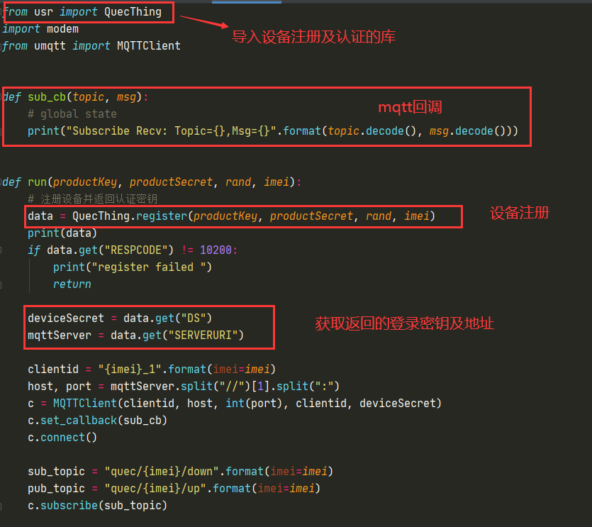

## 修订历史

| Version | **Date**   | **Author** | **Change expression**   |
| ------- | ---------- | ---------- | ----------------------- |
| 1.0     | 2021-01-08 | Pawn       | 初始版本                |
| 1.1     | 2021-09-14 | Pawn       | 更新代码存放路径（SDK） |

## 引言

当客户购买我们的QuecPython，EC600S开发板（携带温湿度传感器版本）时，通过本系统可以更直观在PC端查看设备上报数据。
系统地址：<http://quectracker.quectel.com:8080/>

系统会定期维护更新，本说明仅供参考，不排除后期有功能改动不符合本说明内容描述。

## 运行环境及外设介绍

### 模块型号

此文档中描述的实验基于EC600S运行。模块外形展示如下图：

html 
  

html 
  

#### 适配传感器型号介绍

BMA250E: 加速度传感器

HDC2080: 温湿度传感器

OPT3001: 光照传感器

#### 固件版本

请使用EC600S V0003及以上版本进行调试开发。

## 平台操作说明

### 注册登录

#### 进入注册页面

首先在浏览器中打开http://quectracker.quectel.com:8080/, 点击【立即注册】按钮，进入注册页面

html 
  

#### 填写注册信息

html 
  

### 功能介绍

登录后默认菜单为设备列表页面，在这个页面上可以查看自己的设备列表、根据条件查询具体设备、查看具体的设备上报数据。

html 
  

#### 添加设备

在这个页面上客户可以点击【添加】按钮，将自己购买的设备维护到系统里，添加设备需要输入设备的IMEI号，和设备名称、ICCID。

其中：

1.  IMEI为15位的通信模组唯一标示，镭雕在通信模组上，如868681048629412；

2. 设备名称客户自定义，方便区分不同的设备，不填写默认为IMEI号；

3. ICCID为模组里插入的SIM卡的20位卡号，一般会印在SIM卡表面，如89860445041990085958。

**注：每个免费客户可添加设备数上限为5个。**

html 
  

html 
  

#### 设备上报信息查看

点击列表页面上某一条数据操作列的放大镜图标，可查看具体的设备信息，包括设备信息、移动轨迹、纠偏轨迹、实时定位、温度变化、湿度变化、上报历史。

1. 设备信息：主要展示了设备最近一次上报的各种参数信息，如温度、湿度、物联网接入号（插入sim卡对应的手机号）、ICCID（维护的数据，如上报不一致以上报为准）、电量、软件版本等；参数较多，如果有部分参数未上报则无法正常显示。

html 
  

2\. 移动轨迹：根据筛选的定位信息在地图上描绘出设备的历史形式轨迹，可以播放。

html 
  

3\. 纠偏轨迹：对轨迹点进行修正，将所有轨迹点修正到最近的道路上的位置

html 
  

4.实时定位：显示设备最后定位地点，及温湿度信息，并根据地图坐标推断定具体定位地址

html 
  

5\. 温度变化：根据设备历史上报数据点绘制温度变化曲线，方便观察温度异常点

html 
  

6\. 湿度变化：根据设备历史上报数据点绘制温度变化曲线，方便观察温度异常点

html 
  

7\. 上报历史：显示设备历史上报过的未解析的报文原文记录。

html 
  

### 系统管理

系统提供了系统管理菜单，主要包含两个功能，客户管理和用户管理

#### 客户管理

对于注册用户，如果还有下层多级客户需要管理时，可以使用此功能。

用户注册此系统后会默认生成一条自己的客户记录，公司名称为注册时填写的信息，可以添加自己客户公司名称。具体功能如图上标注。

html 
  

#### 用户管理

如果同一客户需要有多个登录账户登录系统使用时，可使用此菜单创建多个登录账户。也可以为自己的下级客户创建登录账户。具体功能说明见图所示。

html 
  

html 
  

### 设备注册及认证

#### 下载代码

[下载代码](code/conde.zip)

#### 设备注册流程

通过提供的平台注册及认证设备的实例代码完成设备注册流程；

1\.  下载代码，找到QuecThing.mpy与quecth.py文件。

html 
  

2\.  使用Qpycom工具将QuecThing.mpy与quecth.py文件上传到模块内执行，执行过程与结果展示：

html 
  

**PS:同一imei号的设备重复注册会失败，注册成功返回的登录密钥只作用于该imei号的设备，建议做持久化保存，方便测试使用。**

#### quecth.py文件说明

html 
  

### 设备信息上报

#### 代码展示及说明

1. 三轴数据采集

   html 
  

   
   html 
  

   
   html 
  

1. 温湿度数据采集

html 
  

html 
  

1. 光照数据采集

 html 
  

 
 html 
  

#### 代码执行步骤

1. 代码执行前先更改mqtt连接参数，将设备登录密钥配置在Connect连接参数中与云端建立连接，mqtt数据初始化时传入连接的参数，描述见下图的连接示例。

html 
  

   device与mqttServer获取参照设备注册及认证， 如下图:

html 
  

2. 配置好参数后使用Qpycom工具将ec600s_tracker.py上传到模块内执行。

html 
  

#### 平台查看上报的属性

html 
  

html 
  

html 
  

## 常见问题处理

1. 设备注册时返回注册失败，产品信息查询不到时请检查配置的产品ID以及产品密钥是否匹配。
2. 数据采集为空或者失败应检查对应的传感器参数是否配置正确，传感器的型号不同导致的配置参数可能会有差异。
3. MQTT在尝试与云端进行连接时出现MQTTEXException:4时请检查连接参数是否正确配置，mqtt服务地址是否正确。如遇到域名解析失败时可尝试使用usocket.getaddrinfo()方法先尝试解析再进行连接。
4. 代码中存在{xxxx}类似字符是需要配置参数的占位符，也可理解为格式化输出，例如{imei}，我们需要将其替换为对应的imei号。
5. 查看代码中遇到存在疑惑的API时可查看我们的类库文档API说明，里面有详细的方法介绍。
6. 请确保在mqtt连接时模块注网成功。
